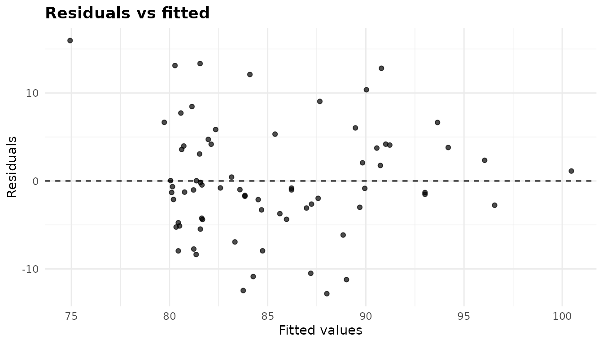
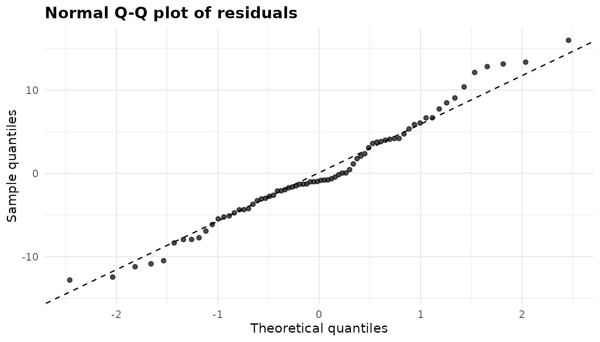
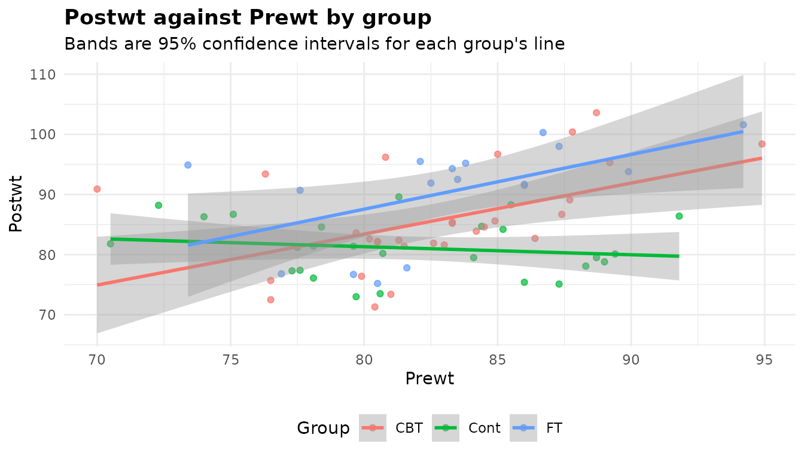

# ANCOVA: comparing groups at the same value of a covariate

``` r

library(anovakit)
```

[`anova_ancova()`](https://elkronos.github.io/anovakit/reference/anova_ancova.md)
compares the mean of a numeric response across groups while adjusting
for one or more numeric covariates. Use it when something you measured
before the groups could differ – a baseline score, a starting weight –
also predicts the outcome: adjusting for it removes that source of noise
and compares the groups at the same value of the covariate. With no
covariate, use
[`anova_welch()`](https://elkronos.github.io/anovakit/reference/anova_welch.md)
or
[`anova_glm()`](https://elkronos.github.io/anovakit/reference/anova_glm.md);
with several responses,
[`anova_manova()`](https://elkronos.github.io/anovakit/reference/anova_manova.md)
accepts covariates too. The [decision
guide](https://elkronos.github.io/anovakit/articles/choosing.md) covers
the choice in more detail.

## The data

[`MASS::anorexia`](https://rdrr.io/pkg/MASS/man/anorexia.html) records
the weight (in pounds) of 72 young women with anorexia before and after
a period of treatment: cognitive behavioural treatment (`CBT`), family
treatment (`FT`) or a control condition (`Cont`).

``` r

an <- MASS::anorexia
head(an)
#>   Treat Prewt Postwt
#> 1  Cont  80.7   80.2
#> 2  Cont  89.4   80.1
#> 3  Cont  91.8   86.4
#> 4  Cont  74.0   86.3
#> 5  Cont  78.1   76.1
#> 6  Cont  88.3   78.1
table(an$Treat)
#> 
#>  CBT Cont   FT 
#>   29   26   17
aggregate(cbind(Prewt, Postwt) ~ Treat, data = an, FUN = mean)
#>   Treat    Prewt   Postwt
#> 1   CBT 82.68966 85.69655
#> 2  Cont 81.55769 81.10769
#> 3    FT 83.22941 90.49412
```

The groups start at slightly different weights, and a patient’s weight
afterwards depends partly on where she started (the correlation between
the two is 0.33). The question an ANCOVA answers is: *for patients of
the same starting weight*, does the treatment make a difference to the
weight afterwards? `Postwt` is the response, `Treat` the grouping
variable and `Prewt` the covariate.

## Fitting the model

Columns are named as character strings: the response, then the grouping
variable(s), then the covariate(s).

``` r

fit <- anova_ancova(an, "Postwt", "Treat", "Prewt")
fit
#> Analysis of covariance (Type III) 
#> ---------------------------------
#> Call: anova_ancova(data = an, response = "Postwt", groups = "Treat", covariates = "Prewt")
#> Observations used: 72
#> 
#> Omnibus test (Type III, F)
#>          term sum_sq df statistic   p_value
#> 1       Prewt  503.4  1    11.680 0.0010866
#> 2       Treat  785.1  2     9.107 0.0003215
#> 3 Prewt:Treat  466.5  2     5.411 0.0066656
#> 4   Residuals 2845.0 66        NA        NA
#> 
#> Notes
#>   - Covariate(s) mean-centred before fitting (Prewt: 82.41), so the intercept and the Type III group row refer to the covariate mean rather than to covariate = 0. $emmeans are evaluated at the covariate mean either way.
#>   - Slopes differ across groups (p = 0.006666), so the covariate-by-group interaction was retained. The group row of the ANOVA table is then a comparison at the covariate mean, not a constant adjusted difference: read $simple_slopes and $emmeans instead.
#>   - The model was chosen by a test on these same data, and the p-values below do not allow for that choice: given that the test retained the slope terms, they can be noticeably too small, especially in small samples. Setting force_interaction = TRUE in advance avoids the selection step; the group row is then a valid comparison at the covariate mean whether or not the slopes differ.
#> 
#> Plots available: residuals, qq, covariate, emmeans
#>   (use plot(x, which = "residuals"))
```

Reading the printout from the top:

- The method line says the tests use Type III sums of squares (the
  default `type = "III"`, fitted under sum-to-zero contrasts).
- `Observations used` is the number of rows in `$data_used`. Rows with a
  missing value in any analysed column are dropped and counted in
  `$n_removed`; there are none here.
- The omnibus table has a `Prewt:Treat` row because the function fitted
  two candidate models and a homogeneity-of-slopes test chose the one
  with a separate slope for each group (see the next section).
- The notes say what the function decided and why. Read them on every
  fit; they are discussed [below](#what-the-notes-say).
- `Plots available` lists the ggplot2 objects in `$plots`.

`summary(fit)` prints all of this and then the assumption checks, effect
sizes, marginal means, pairwise comparisons, the slopes test and the
per-group slopes. The rest of this article takes those components one at
a time.

## The homogeneity-of-slopes test

Classical ANCOVA assumes that the covariate has the same slope in every
group, so that the groups differ by a constant amount whatever the
covariate value.
[`anova_ancova()`](https://elkronos.github.io/anovakit/reference/anova_ancova.md)
checks this before anything else. It fits two candidate models – the
covariate entered additively, and the same model plus the product of the
covariate with the grouping terms – and compares them with one nested F
test:

``` r

fit$slopes_test
#>                                   comparison df statistic     p_value
#> 1 additive vs covariate-by-group interaction  2  5.411231 0.006665591
#>   homogeneous
#> 1       FALSE
```

Here the test rejects (p = 0.00667), so `homogeneous` is `FALSE` and the
interaction model was fitted. Both candidates are kept, so the one not
chosen is still available, and the comparison can be reproduced from
them:

``` r

deparse(formula(fit$model_additive))
#> [1] "Postwt ~ Prewt + Treat"
deparse(formula(fit$model_interaction))
#> [1] "Postwt ~ Prewt + Treat + Prewt:Treat"
anova(fit$model_additive, fit$model_interaction)
#> Analysis of Variance Table
#> 
#> Model 1: Postwt ~ Prewt + Treat
#> Model 2: Postwt ~ Prewt + Treat + Prewt:Treat
#>   Res.Df    RSS Df Sum of Sq      F   Pr(>F)   
#> 1     68 3311.3                                
#> 2     66 2844.8  2    466.48 5.4112 0.006666 **
#> ---
#> Signif. codes:  0 '***' 0.001 '**' 0.01 '*' 0.05 '.' 0.1 ' ' 1
```

When the slopes differ, the thing to read is the slope in each group,
`$simple_slopes` (from
[`emmeans::emtrends()`](https://rvlenth.github.io/emmeans/reference/emtrends.html)):

``` r

print(fit$simple_slopes[, c("Treat", "slope", "se", "conf_low", "conf_high",
                            "p_value")], digits = 3)
#>   Treat  slope    se conf_low conf_high p_value
#> 1   CBT  0.848 0.256    0.337     1.359 0.00151
#> 2  Cont -0.134 0.230   -0.594     0.325 0.56173
#> 3    FT  0.909 0.327    0.256     1.562 0.00709
```

In both active treatments a heavier start goes with a heavier finish
(about 0.85 and 0.91 lb per lb), but in the control group there is
essentially no relation (-0.13, with an interval that spans zero). The
treatment effect is therefore not one number: it depends on the starting
weight. `$simple_slopes` is `NULL` whenever the additive model is used,
because there is then only one slope.

### Why `force_interaction` exists

Letting a test on the same data choose the model has a cost in both
directions, and the notes say so. When the test retains the interaction,
as here, the p-values that follow do not allow for that choice and can
be too small. When the slopes really differ but the test misses it, the
additive model’s adjusted comparisons are biased by the slope difference
times the difference in covariate means – which averages out when groups
are randomised, but not otherwise. The help page
([`?anova_ancova`](https://elkronos.github.io/anovakit/reference/anova_ancova.md))
reports simulations of how often that second case rejects a true null
hypothesis.

`force_interaction` removes the selection step. Decide in advance:

- `force_interaction = TRUE` always fits the separate-slopes model. With
  centred covariates and Type III tests, the group row is then a valid
  comparison of the groups at the covariate mean whether or not the
  slopes differ. This is the safer choice when the groups were not
  randomised.
- `force_interaction = FALSE` always fits the additive model.
- `NULL` (the default) lets the slopes test decide, at level
  `homogeneity_alpha` (0.05 by default).

``` r

fixed <- anova_ancova(an, "Postwt", "Treat", "Prewt", force_interaction = TRUE,
                      plots = FALSE)
all.equal(fixed$anova, fit$anova)
#> [1] TRUE
fixed$notes[2]
#> [1] "The covariate-by-group interaction was fitted because force_interaction = TRUE; the homogeneity-of-slopes test itself gave p = 0.006666. The group row of the ANOVA table is then a comparison at the covariate mean, not a constant adjusted difference: read $simple_slopes and $emmeans instead."
```

The model and the table are the same as before – the test happened to
choose the same model – but the notes now say the choice was yours, and
the warning about selection is gone.

## The omnibus test

``` r

fit$anova
#>          term    sum_sq df statistic      p_value
#> 1       Prewt  503.4196  1 11.679513 0.0010866494
#> 2       Treat  785.1051  2  9.107357 0.0003214744
#> 3 Prewt:Treat  466.4783  2  5.411231 0.0066655907
#> 4   Residuals 2844.7843 66        NA           NA
```

Each row is a term of the model:

- `sum_sq` is its Type III sum of squares: what the term adds when every
  other term is already in the model. `Residuals` is the error sum of
  squares.
- `df` is its degrees of freedom (a three-level factor has 2).
- `statistic` is the F ratio, the term’s mean square over the residual
  mean square, and `p_value` its upper-tail probability on `df` and the
  residual degrees of freedom.

The `Treat` row is the one most people want, and in this model it needs
care. Because the covariate is centred and the slopes are separate, it
compares the groups *at the mean starting weight* (82.4 lb). It is not a
constant treatment effect, since there is none when the slopes differ.
`Prewt` tests the covariate’s slope averaged over the groups, and
`Prewt:Treat` is the slope difference the homogeneity test found (with
the same F and p-value).

## Effect sizes

``` r

fit$effect_sizes
#>          term df   sum_sq partial_eta_sq partial_omega_sq
#> 1       Prewt  1 503.4196      0.1503551        0.1291676
#> 2       Treat  2 785.1051      0.2162890        0.1838096
#> 3 Prewt:Treat  2 466.4783      0.1408763        0.1091585
```

`partial_eta_sq` is the term’s sum of squares over itself plus the
residual sum of squares: the share of the variation not explained by the
other terms that this term explains. `partial_omega_sq` corrects that
for the bias of a sample estimate and is the better estimate of the
population value; it is floored at 0 (with a note) when a term explains
less than chance would. Both are *partial* measures, each with its own
denominator, and Type III sums of squares do not add up to the total, so
do not add the rows together. Neither comes with an interval.

## Covariate centring

Every covariate is mean-centred before fitting
(`center_covariates = TRUE`). The means subtracted are in
`$covariate_means`, and `$data_used` holds the centred values:

``` r

fit$covariate_means
#>    Prewt 
#> 82.40833
head(fit$data_used, 3)
#>   Postwt Treat     Prewt .cell
#> 1   80.2  Cont -1.708333  Cont
#> 2   80.1  Cont  6.991667  Cont
#> 3   86.4  Cont  9.391667  Cont
```

What centring changes depends on the model. It always moves the
intercept. When the covariate-by-group terms are in the model and
`type = "III"`, it also moves the group row, because that row then tests
the groups *at covariate = 0*. Without centring, zero pounds is a
starting weight none of these patients had:

``` r

unc <- anova_ancova(an, "Postwt", "Treat", "Prewt", center_covariates = FALSE,
                    plots = FALSE)
data.frame(term = fit$anova$term,
           p_centred = fit$anova$p_value,
           p_uncentred = unc$anova$p_value)
#>          term    p_centred p_uncentred
#> 1       Prewt 0.0010866494 0.001086649
#> 2       Treat 0.0003214744 0.012945287
#> 3 Prewt:Treat 0.0066655907 0.006665591
#> 4   Residuals           NA          NA
all.equal(fit$emmeans, unc$emmeans)
#> [1] TRUE
```

Only the `Treat` row changed. The covariate row, the interaction row and
the adjusted means are identical, because `$emmeans`, `$posthoc` and
`$simple_slopes` are always evaluated with every covariate at its mean.
In the additive model, and under Type II, centring does not change the
group row at all. Set `center_covariates = FALSE` only if the
covariate’s own zero is the point you want the intercept to describe;
the notes of `unc` explain what it did.

## Marginal means and comparisons

``` r

fit$emmeans
#>   Treat estimate       se df conf_low conf_high
#> 1   CBT 85.45800 1.221267 66 83.01966  87.89633
#> 2  Cont 80.99355 1.302345 66 78.39333  83.59377
#> 3    FT 89.74757 1.614813 66 86.52349  92.97165
```

These are covariate-adjusted means: the predicted post-treatment weight
in each group for a patient starting at the mean weight of 82.41 lb.
They differ from the raw means above because the groups did not start at
exactly that weight.

``` r

print(fit$posthoc[, c("contrast", "estimate", "conf_low", "conf_high",
                      "p_value", "p_adjusted", "adjustment")], digits = 3)
#>     contrast estimate conf_low conf_high  p_value p_adjusted adjustment
#> 1 CBT - Cont     4.46    0.184     8.745 1.49e-02   0.039034      tukey
#> 2   CBT - FT    -4.29   -9.144     0.565 3.79e-02   0.093792      tukey
#> 3  Cont - FT    -8.75  -13.728    -3.780 7.63e-05   0.000223      tukey
```

`p_value` is the unadjusted p-value of each comparison; `p_adjusted` is
adjusted for the three comparisons by the method in `adjustment` (Tukey
by default), and the intervals are adjusted to match. Report
`p_adjusted` when you are looking at all pairs. `adjust` takes any of
the methods listed on the help page, for example `adjust = "holm"`;
`"none"` makes the two columns equal.

``` r

holm <- anova_ancova(an, "Postwt", "Treat", "Prewt", adjust = "holm",
                     plots = FALSE)
print(holm$posthoc[, c("contrast", "p_value", "p_adjusted")], digits = 3)
#>     contrast  p_value p_adjusted
#> 1 CBT - Cont 1.49e-02   0.029782
#> 2   CBT - FT 3.79e-02   0.037884
#> 3  Cont - FT 7.63e-05   0.000229
```

The emmeans grid itself is in `$emmeans_object`, for any contrast the
wrapper does not compute (give `level =` when you summarise it; see
[Working with
results](https://elkronos.github.io/anovakit/articles/results.md)).

### What the adjustment buys

Compare this with two analyses that ignore the starting weight in
different ways.
[`anova_welch()`](https://elkronos.github.io/anovakit/reference/anova_welch.md)
compares the raw post-treatment weights; an ANOVA on the change scores
(`Postwt - Prewt`) assumes that each pound of starting weight carries
over one for one, a slope of exactly 1.

``` r

welch <- anova_welch(an, "Postwt", "Treat", plots = FALSE)
print(welch$posthoc[, c("group1", "group2", "difference", "p_adjusted")],
      digits = 3)
#>   group1 group2 difference p_adjusted
#> 1    CBT   Cont       4.59    0.02938
#> 2    CBT     FT      -4.80    0.07129
#> 3   Cont     FT      -9.39    0.00117

an$change <- an$Postwt - an$Prewt
chg <- anova_glm(an, "change", "Treat", plots = FALSE)
print(chg$posthoc[, c("contrast", "estimate", "p_adjusted")], digits = 3)
#>     contrast estimate p_adjusted
#> 1 CBT - Cont     3.46    0.21244
#> 2   CBT - FT    -4.26    0.16075
#> 3  Cont - FT    -7.71    0.00451
```

All three find that family treatment beats the control, but they answer
different questions. Welch’s test ignores the starting weight
altogether: its CBT-control difference of 4.59 lb makes no allowance for
the 1.13 lb by which the CBT group started heavier, and the variation
the starting weight explains stays in the error. The change-score
analysis imposes a slope of 1, which the simple slopes above show no
group has, and with it the CBT-control comparison weakens to adjusted p
= 0.21, against 0.039 in the ANCOVA. ANCOVA estimates the slope from the
data instead, which is why it is usually the better choice for a
pre-post design.

## Checking assumptions

``` r

names(fit$assumptions)
#> [1] "normality" "levene"    "slopes"
fit$assumptions$normality
#> 
#>  Shapiro-Wilk normality test
#> 
#> data:  x
#> W = 0.97938, p-value = 0.2846
fit$assumptions$levene
#>   df1 df2 statistic   p_value
#> 1   2  69   1.02573 0.3639361
```

- `normality` is a Shapiro-Wilk test on the model residuals. It tests
  the assumption that the errors are normal; a small p-value in a small
  sample deserves a look at the Q-Q plot, while in a large sample the
  test flags departures too small to matter. Here W = 0.979 and p =
  0.28.
- `levene` is Levene’s test (on absolute deviations from the medians) of
  the residuals across the groups (the cells, with several grouping
  variables). A rejection means the pooled residual variance is not a
  fair summary; the note it triggers suggests `vcov_type = "HC3"`, shown
  [below](#robust-tests-with-vcov_type). Here p = 0.36.
- `slopes` is the homogeneity-of-slopes test, the same table as
  `$slopes_test`.

A covariate that is constant, constant within every group, or an exact
linear combination of the groups and the other covariates is refused
with an error rather than fitted, since there is nothing to adjust for.
The [diagnostics
article](https://elkronos.github.io/anovakit/articles/diagnostics.md)
covers the checks across the package.

## Plots

Every plot is a ggplot2 object in `$plots`; `plot(fit, "name")` returns
one, and you can add layers or themes to it with `+` (see [Plots and
visual
customisation](https://elkronos.github.io/anovakit/articles/visuals.md)).

### Residuals against fitted values

``` r

plot(fit, "residuals")
```



What to look for: an even band around zero. A funnel (spread growing
with the fitted value) points to unequal variances; a curve points to a
covariate relation that is not linear. Here there is neither. The tight
column of points at fitted values of about 80 to 82 lb is the control
group: with a nearly flat slope, its fitted values hardly vary.

### Normal Q-Q plot

``` r

plot(fit, "qq")
```



What to look for: points close to the dashed line. Systematic bends at
the ends mean heavy or light tails; a single point far off it is an
outlier worth checking in the data. These residuals follow the line with
a mild S-shape, which is in keeping with the Shapiro-Wilk test above.

### The covariate plot

``` r

plot(fit, "covariate")
```



This is the plot to look at first in any ANCOVA. It shows the response
against the covariate *on its original scale*, with a separate
least-squares line and confidence band for each group (the bands use
`conf_level`). The lines are each group’s own fit, drawn whichever model
was chosen, so they show you directly whether parallel lines are a fair
description. Here they are not: the control group’s line is almost flat
while the two treatment lines rise. Look too at whether the groups cover
the same range of the covariate – adjusted means for a group observed
only at one end are extrapolations, and `$notes` names such a group.
With several covariates there is one plot per covariate, named
`covariate_<name>`.

### Adjusted means

``` r

plot(fit, "emmeans")
```


The covariate-adjusted means from `$emmeans` with their confidence
intervals. With a separate-slopes model, remember that these are the
group means at one starting weight; the covariate plot shows how the
gaps change away from it.

## Options worth knowing

### Robust tests with `vcov_type`

`vcov_type = "HC3"` (or `"HC0"` to `"HC4"`, which need the sandwich
package) replaces the model-based covariance with a
heteroscedasticity-consistent one.

``` r

rob <- anova_ancova(an, "Postwt", "Treat", "Prewt", force_interaction = TRUE,
                    vcov_type = "HC3", plots = FALSE)
rob$anova
#>          term df statistic     p_value
#> 1       Prewt  1  4.733147 0.033172900
#> 2       Treat  2  7.529746 0.001133501
#> 3 Prewt:Treat  2  3.211929 0.046650376
#> 4   Residuals 66        NA          NA
attr(rob$anova, "statistic")
#> [1] "Wald F with HC3 covariance"
data.frame(Treat = fit$emmeans$Treat, se_model = fit$emmeans$se,
           se_HC3 = rob$emmeans$se)
#>   Treat se_model   se_HC3
#> 1   CBT 1.221267 1.572187
#> 2  Cont 1.302345 0.983944
#> 3    FT 1.614813 2.317611
```

The F tests in `$anova` are now Wald F tests built from the robust
covariance (through `car::Anova(vcov. = )`), on the model’s residual
degrees of freedom, so the table has no sums of squares, and its
`statistic` attribute (which
[`print()`](https://rdrr.io/r/base/print.html) shows in the heading)
says so. The same covariance reaches `$emmeans`, `$posthoc` and
`$simple_slopes`: the control group’s standard error shrinks and the
family-treatment group’s grows, reflecting their different residual
spreads. Two things do not change: `$effect_sizes` still come from the
model-based sums of squares, and the homogeneity-of-slopes test stays
the model-based F test. The notes of `rob` say both.

### Several grouping variables: `interaction`

With two or more grouping variables, the default `interaction = TRUE`
fits their full factorial, which is what a factorial ANCOVA is.
[`MASS::birthwt`](https://rdrr.io/pkg/MASS/man/birthwt.html) has birth
weights (grams) by the mother’s race and smoking status, with the
mother’s weight (pounds) as a covariate.

``` r

bw <- MASS::birthwt
bw$race <- factor(bw$race, labels = c("white", "black", "other"))
bw$smoke <- factor(bw$smoke, labels = c("no", "yes"))

two <- anova_ancova(bw, "bwt", c("race", "smoke"), "lwt", plots = FALSE)
two$anova
#>         term   sum_sq  df statistic    p_value
#> 1        lwt  2001912   1  4.362005 0.03814039
#> 2       race  5997349   2  6.533870 0.00181811
#> 3      smoke  2993902   1  6.523471 0.01146521
#> 4 race:smoke  1634954   2  1.781216 0.17135671
#> 5  Residuals 83527636 182        NA         NA
two$slopes_test
#>                                   comparison df statistic   p_value homogeneous
#> 1 additive vs covariate-by-group interaction  5 0.6308707 0.6764194        TRUE
```

The slopes test now allows a separate slope in every cell (5 extra
degrees of freedom) and finds no evidence against a common one, so the
additive-covariate model is used. `$emmeans` and `$posthoc` compare the
six cells:

``` r

print(two$emmeans, digits = 4)
#>    race smoke estimate     se  df conf_low conf_high
#> 1 white    no     3397 103.29 182     3193      3600
#> 2 black    no     2784 172.65 182     2444      3125
#> 3 other    no     2854  93.15 182     2670      3038
#> 4 white   yes     2839  94.14 182     2654      3025
#> 5 black   yes     2458 215.34 182     2033      2883
#> 6 other   yes     2778 195.82 182     2392      3164
```

With `interaction = FALSE` the grouping variables enter additively, and
the means and comparisons are reported for each factor separately,
averaged over the other, with a `term` column; each factor is its own
multiplicity family.

``` r

add <- anova_ancova(bw, "bwt", c("race", "smoke"), "lwt", interaction = FALSE,
                    plots = FALSE)
print(add$posthoc[, c("term", "contrast", "estimate", "p_adjusted")],
      digits = 3)
#>    term      contrast estimate p_adjusted
#> 1  race white - black      504   0.003416
#> 2  race white - other      395   0.002788
#> 3  race black - other     -109   0.788885
#> 4 smoke      no - yes      400   0.000302
```

A whole number keeps interactions up to that order. The notes of both
fits carry one more message worth reading:

``` r

two$notes[3]
#> [1] "The covariate means differ between groups (largest difference: lwt 1.03 pooled within-group SDs). With the slopes assumed equal, any real difference in slopes biases the adjusted comparisons by the slope difference times the covariate-mean difference, and the homogeneity-of-slopes test often lacks the power to detect a difference large enough to matter, so the group row and $posthoc can reject far more often than their nominal level. force_interaction = TRUE does not assume equal slopes."
```

The mothers’ mean weights differ between the cells by up to 1.03 pooled
within-group SDs, so a slope difference the test missed would bias the
comparisons. Since smoking and race were not randomised, this is the
situation where `force_interaction = TRUE` is the safer choice.

### The rest

- `type = "II"` gives Type II sums of squares, where each term is
  adjusted for every other term that does not contain it. Under Type II
  the group row is the same whether or not the covariate is centred.
- `conf_level` sets the level of every interval: the marginal means, the
  comparisons, the simple slopes and the bands of the covariate plot.
- `homogeneity_alpha` is the level of the slopes test (default 0.05).
- `posthoc = FALSE` skips the pairwise comparisons, which is worth doing
  when there are many cells; a note records it.
- `plots = FALSE` skips building the plots, which saves time in a loop.

## What the notes say

``` r

fit$notes
#> [1] "Covariate(s) mean-centred before fitting (Prewt: 82.41), so the intercept and the Type III group row refer to the covariate mean rather than to covariate = 0. $emmeans are evaluated at the covariate mean either way."                                                                                                                                                                     
#> [2] "Slopes differ across groups (p = 0.006666), so the covariate-by-group interaction was retained. The group row of the ANOVA table is then a comparison at the covariate mean, not a constant adjusted difference: read $simple_slopes and $emmeans instead."                                                                                                                                  
#> [3] "The model was chosen by a test on these same data, and the p-values below do not allow for that choice: given that the test retained the slope terms, they can be noticeably too small, especially in small samples. Setting force_interaction = TRUE in advance avoids the selection step; the group row is then a valid comparison at the covariate mean whether or not the slopes differ."
```

1.  The covariate was centred at its mean, and so the Type III group row
    compares the groups at `Prewt` = 82.41 rather than at 0. The
    marginal means are at the mean either way.
2.  The slopes test rejected, so the interaction model was kept, and the
    group row is a comparison at one point on the covariate: read
    `$simple_slopes` and `$emmeans`.
3.  The model was chosen by a test on the same data, so the p-values do
    not account for that choice. `force_interaction = TRUE`, decided in
    advance, avoids it.

Other notes appear when they apply: an imbalance warning when the
additive model is used and the covariate means differ between groups by
more than half a pooled within-group SD (as in the birth-weight
example), an extrapolation warning when the covariate mean lies outside
a group’s observed range, a Levene rejection, dropped rows, and anything
[`lm()`](https://rdrr.io/r/stats/lm.html), car or emmeans said while the
model was being fitted.

## Reporting the result

> Post-treatment weight was analysed by ANCOVA with pre-treatment weight
> (centred at its mean, 82.4 lb) as the covariate. The slope of
> pre-treatment weight differed between treatments, F(2, 66) = 5.41, p =
> 0.0067: it was 0.85 for CBT, 0.91 for family treatment and -0.13 for
> the control group, so the model kept separate slopes. At the mean
> pre-treatment weight, post-treatment weight differed between
> treatments, F(2, 66) = 9.11, p \< 0.001, partial η² = 0.22. Adjusted
> means were 89.7 lb (family treatment), 85.5 lb (CBT) and 81.0 lb
> (control). Family treatment exceeded the control by 8.8 lb
> (Tukey-adjusted p \< 0.001) and CBT exceeded it by 4.5 lb (p = 0.039);
> the two treatments did not differ clearly (p = 0.094). Because the
> model was chosen by a test on the same data, these p-values may be
> somewhat too small.

## See also

- [`?anova_ancova`](https://elkronos.github.io/anovakit/reference/anova_ancova.md)
  for every argument and the simulations behind the selection caveat.
- [Working with
  results](https://elkronos.github.io/anovakit/articles/results.md) for
  the `anovakit_fit` object, the notes and `$emmeans_object`.
- [`anova_welch()`](https://elkronos.github.io/anovakit/reference/anova_welch.md)
  ([article](https://elkronos.github.io/anovakit/articles/welch.md)) and
  [`anova_glm()`](https://elkronos.github.io/anovakit/reference/anova_glm.md)
  ([article](https://elkronos.github.io/anovakit/articles/glm.md)) for
  comparisons without a covariate.
- [`anova_manova()`](https://elkronos.github.io/anovakit/reference/anova_manova.md)
  ([article](https://elkronos.github.io/anovakit/articles/manova.md))
  for several responses, with or without covariates.
- [`anova_rm()`](https://elkronos.github.io/anovakit/reference/anova_rm.md)
  ([article](https://elkronos.github.io/anovakit/articles/repeated-measures.md))
  when every subject is measured under several conditions.
- [Diagnostics](https://elkronos.github.io/anovakit/articles/diagnostics.md)
  and [Plots and visual
  customisation](https://elkronos.github.io/anovakit/articles/visuals.md).
