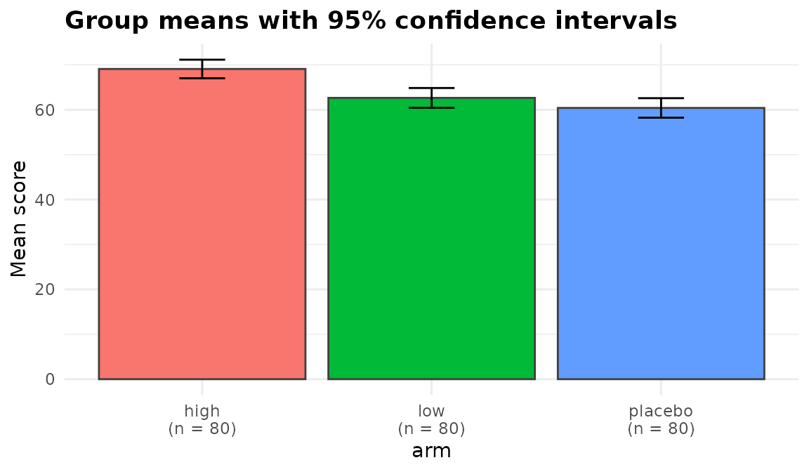

# Getting started with anovakit

One dataset, run through the whole package. Every function names its
columns as character strings and returns the same class, so once you
have read one section you have read them all. Six take
`data, response, groups`;
[`anova_manova()`](https://elkronos.github.io/anovakit/reference/anova_manova.md)
takes `responses` (plural) and
[`anova_rm()`](https://elkronos.github.io/anovakit/reference/anova_rm.md)
takes `subject`, `within` and `between`, because those designs need more
than a grouping variable to describe them.

``` r

set.seed(2024)
n <- 240

trial <- data.frame(
  arm      = factor(rep(c("placebo", "low", "high"), each = n / 3)),
  site     = factor(rep(c("north", "south"), times = n / 2)),
  baseline = rnorm(n, mean = 100, sd = 12)
)

effect <- c(placebo = 0, low = 3, high = 7)[as.character(trial$arm)]
trial$score    <- 0.6 * trial$baseline + effect + rnorm(n, 0, 6)
trial$improved <- rbinom(n, 1, plogis(-1.2 + 0.25 * effect))
trial$visits   <- rpois(n, exp(1.1 + 0.06 * effect))
trial$weeks    <- runif(n, 4, 12)

str(trial)
#> 'data.frame':    240 obs. of  7 variables:
#>  $ arm     : Factor w/ 3 levels "high","low","placebo": 3 3 3 3 3 3 3 3 3 3 ...
#>  $ site    : Factor w/ 2 levels "north","south": 1 2 1 2 1 2 1 2 1 2 ...
#>  $ baseline: num  111.8 105.6 98.7 97.4 113.9 ...
#>  $ score   : num  68.4 69.9 67.4 65.3 62.9 ...
#>  $ improved: int  0 1 0 1 0 0 0 0 0 0 ...
#>  $ visits  : int  0 1 5 4 4 5 3 4 3 6 ...
#>  $ weeks   : num  10.44 4.79 5.03 8.29 6.21 ...
```

## Comparing means

[`anova_welch()`](https://elkronos.github.io/anovakit/reference/anova_welch.md)
is the default choice for a one-way comparison. It does not assume equal
variances, which costs almost nothing when they are equal and matters a
great deal when they are not.

``` r

fit <- anova_welch(trial, "score", "arm")
fit
#> Welch's analysis of variance 
#> ----------------------------
#> Call: anova_welch(data = trial, response = "score", groups = "arm")
#> Observations used: 240
#> 
#> Omnibus test
#>   term statistic num_df den_df   p_value
#> 1  arm     17.98      2  157.9 9.223e-08
#> 
#> Plots available: means, box, qq
#>   (use plot(x, which = "means"))
```

[`print()`](https://rdrr.io/r/base/print.html) shows the omnibus test
and anything the function wants you to know.
[`summary()`](https://rdrr.io/r/base/summary.html) adds the rest.

``` r

fit$emmeans
#>     group  n     mean       sd       se conf_low conf_high
#> 1    high 80 69.08961 9.299895 1.039760 67.02002  71.15920
#> 2     low 80 62.65075 9.890433 1.105784 60.44974  64.85175
#> 3 placebo 80 60.41236 9.764209 1.091672 58.23944  62.58528
fit$posthoc[, c("group1", "group2", "difference", "conf_low", "conf_high",
                "p_adjusted")]
#>   group1  group2 difference   conf_low conf_high   p_adjusted
#> 1   high     low   6.438866  3.4408909  9.436840 7.533383e-05
#> 2   high placebo   8.677255  5.6995585 11.654952 1.313025e-07
#> 3    low placebo   2.238390 -0.8306466  5.307426 1.516972e-01
fit$effect_sizes
#>   group1  group2  hedges_g    conf_low conf_high magnitude
#> 1   high     low 0.6675339  0.35110788 0.9883439    medium
#> 2   high placebo 0.9057159  0.58299337 1.2344908     large
#> 3    low placebo 0.2266841 -0.08350246 0.5383214     small
#>              standardiser
#> 1 sqrt((s1^2 + s2^2) / 2)
#> 2 sqrt((s1^2 + s2^2) / 2)
#> 3 sqrt((s1^2 + s2^2) / 2)
```

Assumption checks are chosen to suit the method. Because Welch’s test
permits unequal variances, normality is assessed within each group
rather than on pooled residuals:

``` r

fit$assumptions$normality
#>     group  n statistic    p_value note
#> 1    high 80 0.9720104 0.07626062 <NA>
#> 2     low 80 0.9930800 0.94857572 <NA>
#> 3 placebo 80 0.9930686 0.94819393 <NA>
fit$assumptions$variance_ratio
#> [1] 1.131031
```

Plots are built and returned, never drawn:

``` r

plot(fit, "means")
```



## Adjusting for a covariate

Baseline score is a strong predictor here, so an ANCOVA is the better
analysis.

``` r

anc <- anova_ancova(trial, "score", "arm", "baseline", plots = FALSE)
anc$anova
#>        term    sum_sq  df statistic      p_value
#> 1  baseline 13927.697   1 402.58717 6.335418e-53
#> 2       arm  1867.370   2  26.98864 2.783996e-11
#> 3 Residuals  8164.534 236        NA           NA
anc$emmeans
#>       arm estimate        se  df conf_low conf_high
#> 1    high 67.79682 0.6607533 236 66.49509  69.09855
#> 2     low 63.31584 0.6584393 236 62.01867  64.61301
#> 3 placebo 61.04005 0.6583481 236 59.74306  62.33704
```

Note what `$notes` says:

``` r

anc$notes
#> [1] "Covariate(s) mean-centred before fitting (baseline: 100.3), so the intercept refers to the covariate mean rather than to covariate = 0. $emmeans are evaluated at the covariate mean either way."
#> [2] "Slopes are consistent with being equal across groups (p = 0.6908), so the additive model was used. A non-significant test is not proof of equal slopes, only an absence of evidence against it."
```

Covariates are mean-centred by default. That matters as soon as the
model contains a group-by-covariate term: under sum-to-zero contrasts
the Type III row for `arm` then tests the group difference *at covariate
= 0*, and `baseline` is distributed around 100, so an uncentred fit
would be comparing the arms at a point nowhere near the data.

``` r

p_of <- function(...) {
  f <- anova_ancova(trial, "score", "arm", "baseline", force_interaction = TRUE,
                    plots = FALSE, ...)
  f$anova$p_value[f$anova$term == "arm"]
}
c(centred = p_of(), uncentred = p_of(center_covariates = FALSE))
#>      centred    uncentred 
#> 6.526767e-11 9.960978e-01
```

The additive model fitted above is not affected — there the group row is
the same either way. `$emmeans` are evaluated at the covariate mean
whether or not it is centred; centring only moves the intercept there.
Use `force_interaction` to fix the model in advance rather than letting
a test on the same data choose it; for groups that were not randomised,
`force_interaction = TRUE` is the safer choice, because a slope
difference the test misses biases the adjusted comparisons when
covariate means differ between the groups.

## A binary outcome

``` r

bin <- anova_bin(trial, "improved", "arm", plots = FALSE)
bin$anova
#>   term df statistic      p_value
#> 1  arm  2  37.88557 5.932719e-09
bin$effect_sizes
#>         term factor      comparison odds_ratio  conf_low conf_high se_log_or
#> 1     armlow    arm     low vs high  0.4434783 0.2334472 0.8311080 0.3232402
#> 2 armplacebo    arm placebo vs high  0.1164179 0.0534224 0.2396148 0.3810273
#>   statistic      p_value ci_method
#> 1 -2.515487 1.188681e-02   profile
#> 2 -5.644134 1.660150e-08   profile
bin$emmeans
#>       arm estimate         se  df   conf_low conf_high
#> 1    high   0.6250 0.05412659 Inf 0.51454373 0.7238140
#> 2     low   0.4250 0.05526923 Inf 0.32179010 0.5351906
#> 3 placebo   0.1625 0.04124526 Inf 0.09676128 0.2600427
```

Odds-ratio intervals are profile-likelihood by default;
`ci_method = "wald"` switches them. Separation, which makes Wald
intervals meaningless while [`glm()`](https://rdrr.io/r/stats/glm.html)
still reports convergence, is detected and named in `$notes`.

``` r

sep <- trial
sep$improved[sep$arm == "high"] <- 1L
anova_bin(sep, "improved", "arm", plots = FALSE)$notes
#> [1] "Modelling P(improved = 1); the other level is the baseline."                                                                                                                                                                                                                                                                                                                                                                                                                                                                                                                                                 
#> [2] "Complete or quasi-complete separation detected: the fitted probability is numerically 0 or 1 in arm = high. The affected coefficient(s): armlow, armplacebo. An affected odds ratio is not identified: it will be enormous, its interval will be unbounded on one side, and its Wald p-value will be near 1 no matter how strong the association is; the same goes for that cell's marginal probability and the comparisons involving it. With events this sparse the likelihood-ratio omnibus test is also liberal. Consider a penalised fit such as logistf::logistf(), or collapsing the offending level."
#> [3] "Separation drives the odds ratio(s) for armlow, armplacebo to infinity or to zero, so the profile-likelihood interval is open on that side and is reported as conf_high = Inf (or conf_low = 0). Its finite end was found by profiling the likelihood directly, as stats::confint() cannot step from a diverged estimate; it is NA where the likelihood rules out no value on that side either."                                                                                                                                                                                                             
#> [4] "$assumptions$dispersion is NA: the Pearson dispersion of a 0/1 response carries no information about overdispersion (in a model saturated in the cells it equals N / (N - k) whatever the data)."
```

## A count outcome, with exposure

`weeks` is time at risk, so it belongs in the model as a log offset. It
enters the formula rather than
[`glm()`](https://rdrr.io/r/stats/glm.html)’s `offset` argument, which
is what lets **emmeans** see it: the marginal means below are rates per
week.

``` r

cnt <- anova_count(trial, "visits", "arm", offset = "weeks", plots = FALSE)
cnt$model_type
#> [1] "poisson"
cnt$dispersion        # Pearson dispersion of the Poisson fit
#> [1] 1.360784
cnt$model_dispersion  # ... and of the model actually returned
#> [1] 1.360784
cnt$emmeans
#>       arm  estimate         se  df  conf_low conf_high
#> 1    high 0.5963120 0.03095898 Inf 0.5386186 0.6601851
#> 2     low 0.4011702 0.02445978 Inf 0.3559836 0.4520925
#> 3 placebo 0.3650152 0.02396442 Inf 0.3209422 0.4151405
```

If the Pearson dispersion had exceeded the threshold, the function would
have moved to a negative binomial model and said so in `$notes`. Set
`model` to take that decision yourself.

## Two grouping variables

Every function accepts several grouping variables.
[`anova_welch()`](https://elkronos.github.io/anovakit/reference/anova_welch.md)
and
[`anova_kw()`](https://elkronos.github.io/anovakit/reference/anova_kw.md)
combine them into a single cell factor of the combinations that contain
data. The model-based functions fit them as factors: with
`interaction = TRUE` the marginal means and comparisons are for the
cells (a combination with no data is left out, or named in `$notes` when
the model estimates it by extrapolation), and in an additive model they
are reported for each factor on its own.

``` r

tw <- anova_glm(trial, "score", c("arm", "site"), interaction = TRUE,
                type = "III", plots = FALSE)
tw$anova
#>        term       sum_sq  df   statistic      p_value
#> 1       arm  3247.043622   2 17.22824780 1.047146e-07
#> 2      site    32.361210   1  0.34340589 5.584346e-01
#> 3  arm:site     8.636735   2  0.04582501 9.552177e-01
#> 4 Residuals 22051.232845 234          NA           NA
```

When you ask for `type = "III"` the model is *fitted* under sum-to-zero
contrasts. Setting `options(contrasts = )` after a model exists does not
change the contrasts stored on it, and the resulting table would be
simple effects at the reference level wearing a Type III label.

``` r

unlist(tw$model$contrasts)
#>         arm        site 
#> "contr.sum" "contr.sum"
```

## Several outcomes at once

``` r

mv <- anova_manova(trial, c("score", "visits"), "arm",
                   covariates = "baseline", plots = FALSE)
mv$multivariate
#>       term df statistic  approx_f num_df den_df      p_value
#> 1 baseline  1 0.6320296 201.81916      2    235 9.616440e-52
#> 2      arm  2 0.2758904  18.88225      4    472 2.051096e-14
mv$assumptions$mardia
#>              test  statistic df     p_value
#> 1 Mardia skewness 13.9293058  4 0.007524134
#> 2 Mardia kurtosis  0.5355893 NA 0.592242440
mv$assumptions$box_m
#>   statistic df   p_value
#> 1  7.294966  6 0.2944282
mv$canonical
#>   axis   eigenvalue canonical_r prop_variance
#> 1 Can1 0.3797103719  0.52460481    0.99821052
#> 2 Can2 0.0006807021  0.02608139    0.00178948
mv$canonical_term
#> [1] "arm"
```

Mardia’s tests, Box’s M and the canonical discriminant analysis are
computed directly, so none of them adds a dependency. With covariates
present they work in the space the multivariate test operates in:
Mardia’s tests on the residuals of the multivariate model, Box’s M on
the responses with the covariate effect removed, and the canonical
scores on the responses with every other model term removed. The
multivariate table is Type II or III, as `type` says, and with
covariates `$slopes_test` checks that their slopes are the same in every
group.

The follow-up univariate analyses are kept individually as well as
stacked, so each response has its own model and its own emmeans grid:

``` r

mv$univariate$score$anova
#>        term    sum_sq  df statistic      p_value
#> 1  baseline 13927.697   1 402.58717 6.335418e-53
#> 2       arm  1867.370   2  26.98864 2.783996e-11
#> 3 Residuals  8164.534 236        NA           NA
```

## When the data are not normal

``` r

kw <- anova_kw(trial, "score", "arm", plots = FALSE)
kw$anova
#>   term statistic df      p_value
#> 1  arm  34.25658  2 3.641488e-08
kw$posthoc
#>   group1  group2 mean_rank_diff        z      p_value   p_adjusted adjustment
#> 1   high     low         45.525 4.147214 3.365457e-05 5.048185e-05         BH
#> 2   high placebo         62.025 5.650323 1.601469e-08 4.804408e-08         BH
#> 3    low placebo         16.500 1.503109 1.328110e-01 1.328110e-01         BH
```

Dunn’s test is computed from the rank sums with the standard tie
correction, so any [`p.adjust()`](https://rdrr.io/r/stats/p.adjust.html)
method may be used and nothing is printed to the console. Kruskal-Wallis
assumes no distribution, so no assumption check runs unless you ask for
one with `diagnostics = TRUE`.

## Repeated measures

``` r

set.seed(11)
long <- expand.grid(id = factor(1:40), week = factor(c("w0", "w4", "w8")))
long$arm <- factor(rep(rep(c("placebo", "active"), each = 20), 3))
long$score <- 50 + 3 * as.numeric(long$week) +
  2 * (long$arm == "active") + rnorm(nrow(long), 0, 4)

rm_fit <- anova_rm(long, "score", subject = "id", within = "week",
                   between = "arm", plots = FALSE)
rm_fit$anova
#>       term   num_df   den_df      mse   statistic partial_eta_sq      p_value
#> 1      arm 1.000000 38.00000 16.48565  8.08181921    0.175379778 7.155944e-03
#> 2     week 1.999827 75.99341 12.55546 42.43795129    0.527586178 4.218864e-13
#> 3 arm:week 1.999827 75.99341 12.55546  0.07873979    0.002067815 9.243425e-01
rm_fit$sphericity
#>       term mauchly_w   p_value gg_epsilon hf_epsilon         p_gg         p_hf
#> 1     week 0.9999133 0.9983974  0.9999133          1 4.218864e-13 4.209773e-13
#> 2 arm:week 0.9999133 0.9983974  0.9999133          1 9.243425e-01 9.243557e-01
#>   hf_epsilon_raw
#> 1       1.055457
#> 2       1.055457
```

Sphericity comes from the fitted model, along with the
Greenhouse-Geisser and Huynh-Feldt corrections. Subjects missing a
within-subject cell are removed before fitting and listed in
`$subjects_dropped` — empty above, because that design is complete:

``` r

gappy <- long[!(long$id %in% c("1", "2") & long$week == "w4"), ]
gap_fit <- anova_rm(gappy, "score", subject = "id", within = "week",
                    between = "arm", plots = FALSE)
gap_fit$subjects_dropped
#> [1] "1" "2"
c(used = nrow(gap_fit$data_used), removed = gap_fit$n_removed,
  supplied = nrow(gappy))
#>     used  removed supplied 
#>      114        4      118
```

## Two arguments worth knowing about

`vcov_type` gives heteroskedasticity-consistent standard errors, and
they flow through to the marginal means and the comparisons rather than
stopping at the coefficient table:

``` r

anova_glm(trial, "score", "arm", vcov_type = "HC3", plots = FALSE)$emmeans$se
#> [1] 1.046320 1.112761 1.098559
anova_glm(trial, "score", "arm", plots = FALSE)$emmeans$se
#> [1] 1.079445 1.079445 1.079445
```

`weights` is a column name rather than a vector, so prior weights are
subsetted along with the data and cannot misalign when a row is dropped:

``` r

trial$wt <- runif(n, 0.5, 2)
anova_glm(trial, "score", "arm", weights = "wt", plots = FALSE)$anova
#>        term    sum_sq  df statistic      p_value
#> 1       arm  3982.405   2  16.83183 1.461266e-07
#> 2 Residuals 28037.056 237        NA           NA
```

## The habit worth forming

Read `$notes` on every fit. It is where the package records what it
decided on your behalf, what it could not compute, and what it thinks
you should know before you quote a number.

``` r

cnt$notes
#> [1] "Pearson dispersion is 1.36, at or below the threshold of 1.50, so a Poisson model was kept. A Poisson model assumes a dispersion of 1; at 1.36 (Pearson test of overdispersion: p = 0.00018) its likelihood-ratio and Wald statistics are inflated by about that factor and its standard errors are about 1.17 times too small, so its intervals are too narrow and a nominal 5% test on 1 degree of freedom rejects roughly 9% of true null hypotheses. Use model = \"quasipoisson\" or \"negbin\" when that matters."
#> [2] "Estimated marginal means are rates at weeks = 1 (one unit of exposure)."
```

## Where to go next

The package website, <https://elkronos.github.io/anovakit/>, has a
walkthrough for every function, guides to the diagnostics and the plots,
and a guide to choosing between the functions.

[`?anovakit_fit`](https://elkronos.github.io/anovakit/reference/anovakit_fit.md)
documents every component of the returned object, including the ones
each function adds for itself. `names(fit)` lists them for any fit you
have in hand.

``` r

names(mv)
#>  [1] "method"          "call"            "model"           "anova"          
#>  [5] "effect_sizes"    "emmeans"         "emmeans_object"  "posthoc"        
#>  [9] "assumptions"     "plots"           "data_used"       "n_removed"      
#> [13] "conf_level"      "notes"           "univariate"      "multivariate"   
#> [17] "canonical"       "canonical_term"  "slopes_test"     "covariate_means"
#> [21] "test"
```

Each function’s own help page covers the arguments this vignette did not
reach — `reference` and `success` on
[`anova_bin()`](https://elkronos.github.io/anovakit/reference/anova_bin.md),
`model` and `overdispersion_threshold` on
[`anova_count()`](https://elkronos.github.io/anovakit/reference/anova_count.md),
`correction` and `emm_specs` on
[`anova_rm()`](https://elkronos.github.io/anovakit/reference/anova_rm.md),
`test` and `assumptions` on
[`anova_manova()`](https://elkronos.github.io/anovakit/reference/anova_manova.md).
All of them are optional, and all of them have defaults the functions
record in `$notes` when they matter.
