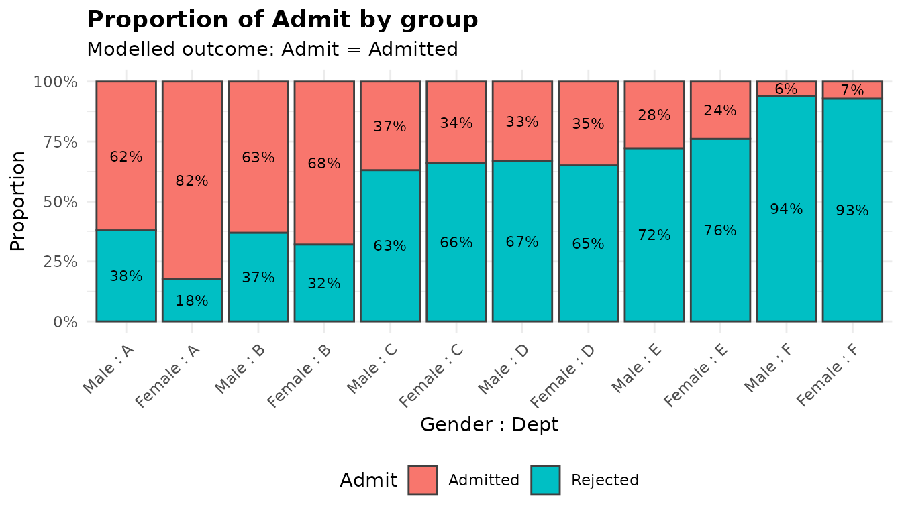
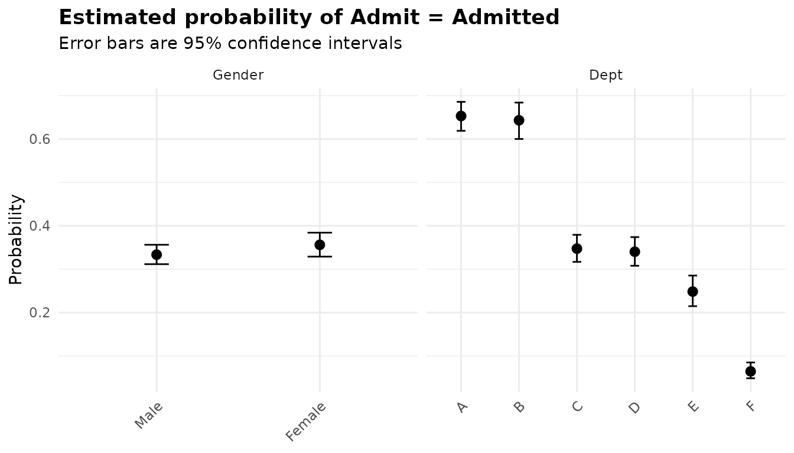
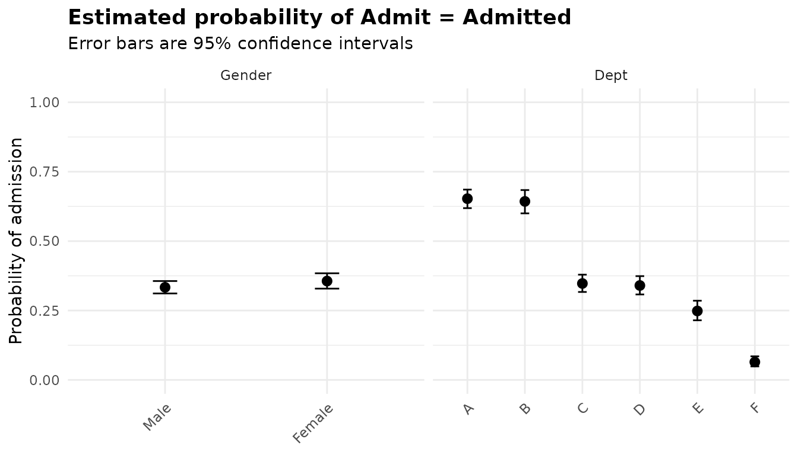
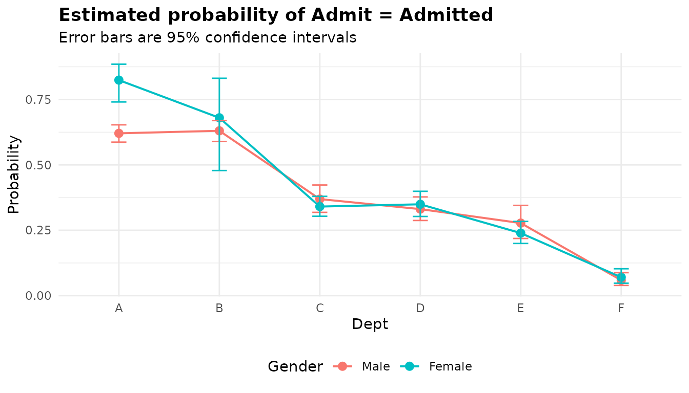

# Binary outcomes: logistic regression with anova_bin()

``` r

library(anovakit)
```

[`anova_bin()`](https://elkronos.github.io/anovakit/reference/anova_bin.md)
fits a logistic regression of a two-level outcome (admitted or not,
healed or not) on one or more grouping variables, and reports an
analysis of deviance table, odds ratios, marginal probabilities and
pairwise odds ratios. Use it when each observation is a yes/no outcome,
or when you have a table of such outcomes with a count in each row. For
counts of events use
[`anova_count()`](https://elkronos.github.io/anovakit/reference/anova_count.md)
([walkthrough](https://elkronos.github.io/anovakit/articles/counts.md));
for other response distributions use
[`anova_glm()`](https://elkronos.github.io/anovakit/reference/anova_glm.md)
([walkthrough](https://elkronos.github.io/anovakit/articles/glm.md)).
The [decision
guide](https://elkronos.github.io/anovakit/articles/choosing.md) covers
the choice in more detail.

## The data

`UCBAdmissions` is a three-way table of the 4,526 applications to the
six largest graduate departments at Berkeley in 1973, by outcome, gender
and department.
[`as.data.frame()`](https://rdrr.io/r/base/as.data.frame.html) turns it
into one row per combination, with the number of applicants in `Freq`.

``` r

ucb <- as.data.frame(UCBAdmissions)
head(ucb)
#>      Admit Gender Dept Freq
#> 1 Admitted   Male    A  512
#> 2 Rejected   Male    A  313
#> 3 Admitted Female    A   89
#> 4 Rejected Female    A   19
#> 5 Admitted   Male    B  353
#> 6 Rejected   Male    B  207
sum(ucb$Freq)
#> [1] 4526
```

The famous feature of these data is that the overall admission rates and
the department-level rates point in different directions:

``` r

# Overall admission rate by gender
round(prop.table(xtabs(Freq ~ Gender + Admit, data = ucb), 1), 3)
#>         Admit
#> Gender   Admitted Rejected
#>   Male      0.445    0.555
#>   Female    0.304    0.696

# Admission rate by department and gender, and where each gender applied
admitted <- xtabs(Freq ~ Dept + Gender, data = ucb[ucb$Admit == "Admitted", ])
applied  <- xtabs(Freq ~ Dept + Gender, data = ucb)
round(admitted / applied, 3)
#>     Gender
#> Dept  Male Female
#>    A 0.621  0.824
#>    B 0.630  0.680
#>    C 0.369  0.341
#>    D 0.331  0.349
#>    E 0.277  0.239
#>    F 0.059  0.070
applied
#>     Gender
#> Dept Male Female
#>    A  825    108
#>    B  560     25
#>    C  325    593
#>    D  417    375
#>    E  191    393
#>    F  373    341
```

Overall, 44.5% of men and 30.4% of women were admitted. Within
departments the gap mostly disappears, and in department A it reverses.
The explanation is in the last table: most women applied to departments
C to F, which admitted a third or fewer of their applicants, while just
over half of the men applied to A or B, which admitted most of theirs.
Department is associated with both gender and admission, so a comparison
of genders that ignores it is confounded. This is Simpson’s paradox, and
a model with both variables is the way to separate the two.

Each row of `ucb` stands for `Freq` identical applicants, so the counts
go in as frequency weights. For later comparison, here is the same data
with one row per applicant:

``` r

applicants <- ucb[rep(seq_len(nrow(ucb)), ucb$Freq),
                  c("Admit", "Gender", "Dept")]
nrow(applicants)
#> [1] 4526
```

## Fitting the model

### Which outcome is the success?

The response can be a factor with two observed levels, a logical, a
numeric 0/1 column, or a character column with two values. The function
models the probability of one level, the *success*, and by default that
is the second level of the factor, which is what
[`glm()`](https://rdrr.io/r/stats/glm.html) does. For `Admit` the second
level is `"Rejected"`:

``` r

levels(ucb$Admit)
#> [1] "Admitted" "Rejected"
default <- anova_bin(ucb, "Admit", "Gender", weights = "Freq", plots = FALSE)
default$notes[1]
#> [1] "Modelling P(Admit = Rejected); the other level is the baseline."
```

That model is not wrong, but every odds ratio would be an odds ratio of
*rejection*. Name the level you want with `success`. (A logical response
models `TRUE`, a 0/1 response models `1`, and a character response is
sorted in the C locale, so the default does not depend on your session.)

### The fit

Admission modelled on gender and department, additively:

``` r

fit <- anova_bin(ucb, "Admit", c("Gender", "Dept"), weights = "Freq",
                 success = "Admitted")
fit
#> Analysis of deviance for a binary response (logistic regression) 
#> ----------------------------------------------------------------
#> Call: anova_bin(data = ucb, response = "Admit", groups = c("Gender", "Dept"), success = "Admitted", weights = "Freq")
#> Observations used: 24
#> 
#> Omnibus test (Type II, likelihood-ratio chi-square)
#>     term df statistic p_value
#> 1 Gender  1     1.531  0.2159
#> 2   Dept  5   763.400  <2e-16
#> 
#> Notes
#>   - Modelling P(Admit = Admitted); the other level is the baseline.
#>   - The grouping factors enter the model additively, so $emmeans and $posthoc are reported for each factor separately, averaged over the others (column `term`), and each factor's comparisons are a separate multiplicity family. Set interaction = TRUE to compare cells instead.
#>   - $assumptions$dispersion is NA: the Pearson dispersion of a 0/1 response carries no information about overdispersion (in a model saturated in the cells it equals N / (N - k) whatever the data).
#> 
#> Plots available: proportions, emmeans
#>   (use plot(x, which = "proportions"))
```

Reading the printout from the top:

- The method and the call.
- `Observations used: 24`. This counts *rows* of `$data_used`, not
  applicants: each row carries its weight, and the weights add up to
  4,526.
- The omnibus table, with a heading that says what it holds: Type II
  tests, likelihood-ratio chi-square statistics.
- The notes: which level is modelled, how the marginal means are laid
  out for an additive model, and why there is no dispersion statistic.
  They are discussed [below](#what-the-notes-say).
- The plots that were built (they are not drawn until you ask).

`summary(fit)` prints all of this plus the assumption tables, the odds
ratios, the marginal probabilities and the pairwise comparisons. The
sections below take the components one at a time.

## The omnibus test

``` r

fit$anova
#>     term df  statistic       p_value
#> 1 Gender  1   1.531231  2.159277e-01
#> 2   Dept  5 763.402731 9.546809e-163
```

Each row is a likelihood-ratio test: `statistic` is the increase in
deviance when the term is dropped, referred to a chi-square distribution
on `df` degrees of freedom. Type II means each factor is tested after
the other, so the `Gender` row asks whether gender predicts admission
*among applicants to the same department*. It does not (p = 0.216).
Department matters a great deal.

Compare the model with gender alone:

``` r

alone <- anova_bin(ucb, "Admit", "Gender", weights = "Freq",
                   success = "Admitted", plots = FALSE)
alone$anova
#>     term df statistic      p_value
#> 1 Gender  1  93.44941 4.167175e-22
```

Without department the gender statistic is 93.4 on 1 degree of freedom.
The difference between the two tables is the paradox in numbers.

### The model as a whole

`$model_stats` holds statistics for the whole model:

``` r

fit$model_stats
#> $AIC
#> [1] 5201.488
#> 
#> $BIC
#> [1] 5209.735
#> 
#> $logLik
#> [1] -2593.744
#> 
#> $mcfadden_r2
#> [1] 0.1417611
#> 
#> $success_level
#> [1] "Admitted"
#> 
#> $lr_vs_null
#>   statistic df       p_value
#> 1  856.8521  6 7.973914e-182
```

`lr_vs_null` is the likelihood-ratio test of this model against one with
no predictors (the null deviance minus the deviance, on 6 degrees of
freedom). `mcfadden_r2` is McFadden’s pseudo R squared,
`1 - deviance / null deviance`: the model removes 14.2% of the deviance.
It is not a proportion of variance and runs lower than the R squared of
a linear model, so judge it against other logistic models rather than
against that. `success_level` repeats which level was modelled, so a
saved result says what its odds ratios are odds of. `AIC`, `BIC` and
`logLik` use the prior weights, and are there to compare models fitted
to the same data.

## Effect sizes

`$effect_sizes` holds odds ratios, one per coefficient, each a level
against its factor’s reference level:

``` r

es_cols <- c("factor", "comparison", "odds_ratio", "conf_low", "conf_high",
             "p_value", "ci_method")
print(fit$effect_sizes[, es_cols], digits = 3)
#>   factor     comparison odds_ratio conf_low conf_high  p_value ci_method
#> 1 Gender Female vs Male     1.1050    0.943    1.2954 2.17e-01   profile
#> 2   Dept         B vs A     0.9575    0.772    1.1881 6.93e-01   profile
#> 3   Dept         C vs A     0.2829    0.229    0.3483 2.41e-32   profile
#> 4   Dept         D vs A     0.2740    0.222    0.3368 2.05e-34   profile
#> 5   Dept         E vs A     0.1756    0.137    0.2244 2.86e-43   profile
#> 6   Dept         F vs A     0.0366    0.026    0.0506 2.80e-84   profile
```

`factor` names the grouping variable and `comparison` says what the
ratio compares. The first row is the odds of admission for women divided
by the odds for men, in the same department: 1.105, with an interval
that comfortably includes 1. The department rows compare each department
with A; in department F the odds of admission are 0.037 times those in
A, whatever the applicant’s gender. (`term`, `se_log_or` and
`statistic`, left out above, hold the coefficient’s name, its standard
error on the log-odds scale and its Wald z statistic.)

Put the adjusted odds ratio beside the one from the gender-only model:

``` r

rbind(alone = alone$effect_sizes[, es_cols],
      adjusted = fit$effect_sizes[1, es_cols])
#>          factor     comparison odds_ratio  conf_low conf_high      p_value
#> alone    Gender Female vs Male  0.5431594 0.4790421 0.6154014 1.259738e-21
#> adjusted Gender Female vs Male  1.1050274 0.9434907 1.2954013 2.167168e-01
#>          ci_method
#> alone      profile
#> adjusted   profile
```

Ignoring department, women’s odds of admission were about half of men’s;
comparing applicants to the same department, they were slightly higher.

The odds ratios always come from a reference-coded fit of the same
model, so each one is a level against the reference level whatever
`type`, the global `contrasts` option or the class of the factor.
`$anova` still comes from the Type II or Type III fit, which describes
the same fitted probabilities.

### Profile or Wald intervals

`ci_method = "profile"` (the default) gives profile-likelihood
intervals, which follow the shape of the likelihood rather than assuming
it is quadratic. With thousands of observations the two kinds agree
closely:

``` r

wald <- anova_bin(ucb, "Admit", c("Gender", "Dept"), weights = "Freq",
                  success = "Admitted", ci_method = "wald", plots = FALSE)
data.frame(comparison = fit$effect_sizes$comparison,
           profile_low = fit$effect_sizes$conf_low,
           profile_high = fit$effect_sizes$conf_high,
           wald_low = wald$effect_sizes$conf_low,
           wald_high = wald$effect_sizes$conf_high)
#>       comparison profile_low profile_high   wald_low  wald_high
#> 1 Female vs Male  0.94349074   1.29540128 0.94309706 1.29476116
#> 2         B vs A  0.77234827   1.18813231 0.77207142 1.18753812
#> 3         C vs A  0.22930959   0.34833301 0.22955913 0.34867975
#> 4         D vs A  0.22242464   0.33680469 0.22268066 0.33716044
#> 5         E vs A  0.13685898   0.22441389 0.13717694 0.22489361
#> 6         F vs A  0.02596498   0.05061965 0.02626184 0.05113317
```

They part company in small samples and, above all, under separation,
where only the profile interval means anything (see
[Separation](#separation)).

### Choosing the reference level

`reference` takes a named list, one level per factor:

``` r

flipped <- anova_bin(ucb, "Admit", c("Gender", "Dept"), weights = "Freq",
                     success = "Admitted",
                     reference = list(Gender = "Female", Dept = "F"),
                     plots = FALSE)
print(flipped$effect_sizes[, es_cols], digits = 3)
#>   factor     comparison odds_ratio conf_low conf_high  p_value ci_method
#> 1 Gender Male vs Female      0.905    0.772      1.06 2.17e-01   profile
#> 2   Dept         A vs F     27.289   19.755     38.51 2.80e-84   profile
#> 3   Dept         B vs F     26.130   18.578     37.49 2.01e-74   profile
#> 4   Dept         C vs F      7.721    5.611     10.85 4.20e-34   profile
#> 5   Dept         D vs F      7.477    5.411     10.55 2.43e-32   profile
#> 6   Dept         E vs F      4.793    3.392      6.89 3.77e-18   profile
all.equal(flipped$anova, fit$anova)
#> [1] TRUE
```

The ratios are now men against women and each department against F. The
omnibus table is unchanged: the reference level changes what the
coefficients compare, not the fitted model.

## Marginal means and comparisons

`$emmeans` holds estimated marginal probabilities of the success level,
with intervals built on the logit scale and back-transformed, so they
stay between 0 and 1:

``` r

print(fit$emmeans, digits = 3)
#>     term Gender Dept estimate     se  df conf_low conf_high
#> 1 Gender   Male <NA>   0.3335 0.0114 Inf   0.3116     0.356
#> 2 Gender Female <NA>   0.3561 0.0141 Inf   0.3289     0.384
#> 3   Dept   <NA>    A   0.6529 0.0170 Inf   0.6188     0.686
#> 4   Dept   <NA>    B   0.6430 0.0214 Inf   0.6000     0.684
#> 5   Dept   <NA>    C   0.3474 0.0159 Inf   0.3168     0.379
#> 6   Dept   <NA>    D   0.3402 0.0168 Inf   0.3079     0.374
#> 7   Dept   <NA>    E   0.2484 0.0180 Inf   0.2148     0.285
#> 8   Dept   <NA>    F   0.0645 0.0092 Inf   0.0486     0.085
```

Because the model is additive, each factor is reported on its own (the
`term` column says which), averaged over the levels of the other. The
averaging gives each department equal weight on the log-odds scale
before transforming back, so the gender rows are not the raw admission
rates of 0.445 and 0.304: they are the probabilities for a hypothetical
applicant spread evenly over the six departments. That is the comparison
the adjusted model makes.

`$posthoc` holds the pairwise comparisons, as odds ratios:

``` r

ph_cols <- c("term", "contrast", "ratio", "conf_low", "conf_high", "p_value",
             "p_adjusted")
print(fit$posthoc[, ph_cols], digits = 3)
#>      term      contrast  ratio conf_low conf_high  p_value p_adjusted
#> 1  Gender Male / Female  0.905    0.772      1.06 2.17e-01   2.17e-01
#> 2    Dept         A / B  1.044    0.764      1.43 6.93e-01   9.99e-01
#> 3    Dept         A / C  3.535    2.608      4.79 2.41e-32   0.00e+00
#> 4    Dept         A / D  3.650    2.699      4.93 2.05e-34   0.00e+00
#> 5    Dept         A / E  5.693    3.975      8.16 2.86e-43   0.00e+00
#> 6    Dept         A / F 27.289   16.812     44.30 2.80e-84   0.00e+00
#> 7    Dept         B / C  3.384    2.399      4.77 5.75e-24   6.29e-14
#> 8    Dept         B / D  3.495    2.487      4.91 1.06e-25   5.37e-14
#> 9    Dept         B / E  5.452    3.675      8.09 1.55e-34   0.00e+00
#> 10   Dept         B / F 26.130   15.699     43.49 2.01e-74   0.00e+00
#> 11   Dept         C / D  1.033    0.770      1.38 7.56e-01   1.00e+00
#> 12   Dept         C / E  1.611    1.151      2.25 5.23e-05   7.42e-04
#> 13   Dept         C / F  7.721    4.785     12.46 4.20e-34   0.00e+00
#> 14   Dept         D / E  1.560    1.100      2.21 2.82e-04   3.83e-03
#> 15   Dept         D / F  7.477    4.607     12.14 2.43e-32   0.00e+00
#> 16   Dept         E / F  4.793    2.866      8.02 3.77e-18   5.04e-14
```

Each `ratio` is the odds for the first group in `contrast` divided by
the odds for the second, so the gender row, `Male / Female`, is the
reciprocal of the `Female vs Male` odds ratio in `$effect_sizes`.
`p_value` is the unadjusted p-value and `p_adjusted` the Tukey-adjusted
one (the method is in the `adjustment` column). Each factor is its own
family: gender has one comparison, so its two p-values are equal;
department has 15, and the adjustment raises them. The adjusted p-values
printed as 0 are below the precision of the Tukey calculation (about
1e-10); `summary(fit)` prints them as `< 1e-10`. The intervals are
simultaneous for each family.

`adjust` changes the method: `"tukey"` (the default), `"sidak"`,
`"scheffe"`, `"dunnettx"`, `"bonferroni"`, `"holm"`, `"hochberg"`,
`"hommel"`, `"BH"`, `"BY"`, `"fdr"` or `"none"`. A step-down method such
as Holm adjusts p-values but cannot be turned into intervals, and
`$notes` says what the intervals use instead:

``` r

holm <- anova_bin(ucb, "Admit", c("Gender", "Dept"), weights = "Freq",
                  success = "Admitted", adjust = "holm", plots = FALSE)
grep("adjustment", holm$notes, value = TRUE)
#> [1] "The comparison intervals use the bonferroni adjustment while the p-values use holm: emmeans cannot turn holm into intervals."
```

The department intervals are Bonferroni intervals, while the p-values
are Holm’s. The gender family has a single comparison, which needs no
adjustment of either kind, so there is no note about it.

## Checking assumptions

A logistic regression makes few distributional assumptions that can be
checked from grouped data like these: the outcome is binary, the
observations are independent, and the log-odds are additive in the
factors (which the `interaction` option below tests). `$assumptions` has
two elements.

``` r

fit$assumptions$dispersion
#> [1] NA
```

`dispersion` is always `NA`, and a note says why. For a 0/1 response the
Pearson dispersion carries no information about overdispersion: in a
model saturated in the cells it equals N / (N - k) whatever the data,
and it changes when the same trials are grouped into weighted rows. You
can see the second point by computing it on the two versions of this
data set, which describe the same fit:

``` r

pearson <- function(m) sum(residuals(m, type = "pearson")^2) / df.residual(m)
one_row <- anova_bin(applicants, "Admit", c("Gender", "Dept"),
                     success = "Admitted", plots = FALSE)
c(weighted_table = pearson(fit$model),
  one_row_per_applicant = pearson(one_row$model))
#>        weighted_table one_row_per_applicant 
#>            266.207779              1.001446
```

`proportions` is the observed share of each response level in each cell.
With weights, `n` and `group_total` are weighted counts, and `rows` and
`group_rows` give the number of data rows behind them:

``` r

props <- fit$assumptions$proportions
props[props$Admit == "Admitted", ]
#>         .cell    Admit   n group_total proportion rows group_rows
#> 13   Male : A Admitted 512         825 0.62060606    1          2
#> 14 Female : A Admitted  89         108 0.82407407    1          2
#> 15   Male : B Admitted 353         560 0.63035714    1          2
#> 16 Female : B Admitted  17          25 0.68000000    1          2
#> 17   Male : C Admitted 120         325 0.36923077    1          2
#> 18 Female : C Admitted 202         593 0.34064081    1          2
#> 19   Male : D Admitted 138         417 0.33093525    1          2
#> 20 Female : D Admitted 131         375 0.34933333    1          2
#> 21   Male : E Admitted  53         191 0.27748691    1          2
#> 22 Female : E Admitted  94         393 0.23918575    1          2
#> 23   Male : F Admitted  22         373 0.05898123    1          2
#> 24 Female : F Admitted  24         341 0.07038123    1          2
```

This is the table to look at before trusting a model: it shows the raw
material, and it shows cells with few observations. Department B had
only 25 women applicants. When fewer than about 5 events or non-events
are expected in a cell, `$notes` warns that the likelihood-ratio test is
liberal; no cell here comes close, but the next example shows the note.

More on the checks across the package is in the [diagnostics
article](https://elkronos.github.io/anovakit/articles/diagnostics.md).

### Separation

When every observation in a group has the same outcome, the
maximum-likelihood odds ratio for that group is infinite.
[`glm()`](https://rdrr.io/r/stats/glm.html) still reports convergence,
with an enormous coefficient and an even larger standard error. Here is
a small constructed table in which every patient in the `high` arm
healed:

``` r

healing <- data.frame(
  arm    = factor(rep(c("control", "low", "high"), each = 2),
                  levels = c("control", "low", "high")),
  healed = rep(c("no", "yes"), times = 3),
  n      = c(9, 6, 5, 10, 0, 15)
)
healing
#>       arm healed  n
#> 1 control     no  9
#> 2 control    yes  6
#> 3     low     no  5
#> 4     low    yes 10
#> 5    high     no  0
#> 6    high    yes 15
sep_fit <- anova_bin(healing, "healed", "arm", weights = "n")
sep_fit
#> Analysis of deviance for a binary response (logistic regression) 
#> ----------------------------------------------------------------
#> Call: anova_bin(data = healing, response = "healed", groups = "arm", weights = "n")
#> Observations used: 5  (1 input row(s) not in $data_used; see $notes)
#> 
#> Omnibus test (Type II, likelihood-ratio chi-square)
#>   term df statistic   p_value
#> 1  arm  2     16.51 0.0002596
#> 
#> Notes
#>   - Dropped 1 row(s) whose weight in `n` is zero: they contribute nothing to the fit, and keeping them would make row counts, robust standard errors and information criteria disagree with it.
#>   - Modelling P(healed = yes); the other level is the baseline.
#>   - Complete or quasi-complete separation detected: the fitted probability is numerically 0 or 1 in arm = high. The affected coefficient(s): armhigh. An affected odds ratio is not identified: it will be enormous, its interval will be unbounded on one side, and its Wald p-value will be near 1 no matter how strong the association is; the same goes for that cell's marginal probability and the comparisons involving it. With events this sparse the likelihood-ratio omnibus test is also liberal. Consider a penalised fit such as logistf::logistf(), or collapsing the offending level.
#>   - Separation drives the odds ratio(s) for armhigh to infinity or to zero, so the profile-likelihood interval is open on that side and is reported as conf_high = Inf (or conf_low = 0). Its finite end was found by profiling the likelihood directly, as stats::confint() cannot step from a diverged estimate; it is NA where the likelihood rules out no value on that side either.
#>   - Sparse data: fewer than 5 events or non-events are expected under the null hypothesis in arm = control, arm = low, arm = high (smallest 4.67). With data this sparse the likelihood-ratio omnibus test is liberal, rejecting a true null more often than its nominal level. test_statistic = "Wald" is not a remedy: Wald tests are less reliable still here. An exact test (for one grouping variable, fisher.test() on the group-by-outcome table) or the score test, anova(fit$model, test = "Rao"), holds its level better.
#>   - $assumptions$dispersion is NA: the Pearson dispersion of a 0/1 response carries no information about overdispersion (in a model saturated in the cells it equals N / (N - k) whatever the data).
#> 
#> Plots available: proportions, emmeans
#>   (use plot(x, which = "proportions"))
```

The notes say what happened. The row with a count of zero was dropped (a
zero-weight row contributes nothing, and it is counted in `$n_removed`,
which is why the printout says 5 observations were used). Separation was
detected in `arm = high`, and the profile interval for that odds ratio
is open on one side. And the data are sparse: with 15 patients an arm,
fewer than 5 non-events are expected in each arm if the arms do not
differ, so the likelihood-ratio test in the table is liberal. The note
names two tests that hold their level better, and both are one line of
code:

``` r

anova(sep_fit$model, test = "Rao")
#> Analysis of Deviance Table
#> 
#> Model: binomial, link: logit
#> 
#> Response: healed
#> 
#> Terms added sequentially (first to last)
#> 
#> 
#>      Df Deviance Resid. Df Resid. Dev   Rao Pr(>Chi)   
#> NULL                     4     55.799                  
#> arm   2   16.513         2     39.286 12.65 0.001791 **
#> ---
#> Signif. codes:  0 '***' 0.001 '**' 0.01 '*' 0.05 '.' 0.1 ' ' 1
fisher.test(xtabs(n ~ arm + healed, data = healing))
#> 
#>  Fisher's Exact Test for Count Data
#> 
#> data:  xtabs(n ~ arm + healed, data = healing)
#> p-value = 0.0007911
#> alternative hypothesis: two.sided
```

Both p-values are larger than the likelihood-ratio test’s 0.00026,
though the conclusion stands.

``` r

print(sep_fit$effect_sizes[, es_cols], digits = 3)
#>   factor      comparison odds_ratio conf_low conf_high p_value ci_method
#> 1    arm  low vs control   3.00e+00    0.699      14.3   0.148   profile
#> 2    arm high vs control   4.35e+08    8.775       Inf   0.994   profile
sep_wald <- anova_bin(healing, "healed", "arm", weights = "n",
                      ci_method = "wald", plots = FALSE)
print(sep_wald$effect_sizes[, es_cols], digits = 3)
#>   factor      comparison odds_ratio conf_low conf_high p_value ci_method
#> 1    arm  low vs control   3.00e+00    0.676      13.3   0.148      wald
#> 2    arm high vs control   4.35e+08    0.000       Inf   0.994      wald
```

The point estimate for `high vs control` is meaningless, and so is its
Wald p-value of 0.99. The profile interval is still informative: it runs
from 8.8 to infinity, so the data rule out an odds ratio below about 9.
The Wald interval, from 0 to infinity, says nothing at all. This is why
`ci_method = "profile"` is the default.

The separation note also warns that the separated arm’s marginal
probability and the comparisons involving it are affected. They are
Wald-based, and as uninformative as the Wald odds ratio:

``` r

print(sep_fit$emmeans, digits = 3)
#>       arm estimate       se  df conf_low conf_high
#> 1 control    0.400 1.26e-01 Inf 1.92e-01     0.652
#> 2     low    0.667 1.22e-01 Inf 4.06e-01     0.854
#> 3    high    1.000 9.20e-06 Inf 2.22e-16     1.000
print(sep_fit$posthoc[, c("contrast", "ratio", "conf_low", "conf_high",
                          "p_adjusted")], digits = 3)
#>         contrast    ratio conf_low conf_high p_adjusted
#> 1  control / low 3.33e-01 5.61e-02      1.98      0.318
#> 2 control / high 2.30e-09 2.22e-16       Inf      1.000
#> 3     low / high 6.90e-09 2.22e-16       Inf      1.000
```

For a real analysis, follow the note: a penalised fit such as
`logistf::logistf()`, or collapsing the level with another, gives finite
estimates.

## Plots

`fit$plots` holds two **ggplot2** objects. Neither is drawn until you
ask for it, with `plot(fit, "name")` or `fit$plots$name`.

``` r

plot(fit, "proportions")
```



The `proportions` plot stacks the observed share of each outcome in each
cell (gender by department here), labelled with percentages. What to
look for: cells whose proportions differ from their neighbours, cells
near 0% or 100% (the warning sign of separation), and whether a pattern
in one factor holds across the levels of the other. Here the
within-department gender differences are small next to the differences
between departments, and department A is the one where women did clearly
better.

``` r

plot(fit, "emmeans")
```



The `emmeans` plot shows the estimated marginal probabilities with their
intervals, one panel per factor because the model is additive. What to
look for: intervals that do not overlap are clearly different;
overlapping ones need the comparisons in `$posthoc`. Each is a ggplot,
so it can be modified with `+`:

``` r

plot(fit, "emmeans") +
  ggplot2::coord_cartesian(ylim = c(0, 1)) +
  ggplot2::labs(y = "Probability of admission")
```



The [plots
article](https://elkronos.github.io/anovakit/articles/visuals.md) covers
customisation in more detail.

## Options worth knowing

### `interaction` and `type`

The model above is additive: it assumes the gender odds ratio is the
same in every department. `interaction = TRUE` fits the full factorial
and tests that assumption. The first grouping variable goes on the x
axis of the `emmeans` plot, so department comes first here:

``` r

fit_int <- anova_bin(ucb, "Admit", c("Dept", "Gender"), weights = "Freq",
                     success = "Admitted", interaction = TRUE)
fit_int$anova
#>          term df  statistic       p_value
#> 1        Dept  5 763.402731 9.546809e-163
#> 2      Gender  1   1.531231  2.159277e-01
#> 3 Dept:Gender  5  20.204275  1.144078e-03
```

The `Dept:Gender` row is a likelihood-ratio test of whether the gender
odds ratio differs between departments (p = 0.0011). With an
interaction, each lower-order odds ratio is taken at the reference level
of the factors it interacts with, and the interaction rows are ratios of
odds ratios; the `comparison` column says which:

``` r

print(fit_int$effect_sizes[, es_cols], digits = 3)
#>         factor                  comparison odds_ratio conf_low conf_high
#> 1         Dept     B vs A at Gender = Male     1.0425   0.8354    1.3021
#> 2         Dept     C vs A at Gender = Male     0.3579   0.2738    0.4659
#> 3         Dept     D vs A at Gender = Male     0.3024   0.2356    0.3867
#> 4         Dept     E vs A at Gender = Male     0.2348   0.1649    0.3301
#> 5         Dept     F vs A at Gender = Male     0.0383   0.0237    0.0589
#> 6       Gender  Female vs Male at Dept = A     2.8636   1.7490    4.9254
#> 7  Dept:Gender (B vs A) x (Female vs Male)     0.4352   0.1624    1.2247
#> 8  Dept:Gender (C vs A) x (Female vs Male)     0.3082   0.1678    0.5453
#> 9  Dept:Gender (D vs A) x (Female vs Male)     0.3790   0.2051    0.6748
#> 10 Dept:Gender (E vs A) x (Female vs Male)     0.2859   0.1472    0.5394
#> 11 Dept:Gender (F vs A) x (Female vs Male)     0.4218   0.1893    0.9229
#>     p_value ci_method
#> 1  7.13e-01   profile
#> 2  3.34e-14   profile
#> 3  3.02e-21   profile
#> 4  2.49e-16   profile
#> 5  3.36e-45   profile
#> 6  6.21e-05   profile
#> 7  1.03e-01   profile
#> 8  8.53e-05   profile
#> 9  1.35e-03   profile
#> 10 1.50e-04   profile
#> 11 3.21e-02   profile
```

The `Gender` row is the gender odds ratio in department A, and each
`Dept:Gender` row is the gender odds ratio in another department divided
by the one in A. All of them are below 1: department A is the odd one
out.

`$emmeans` now has one row per cell, and `$posthoc` compares every pair
of cells (66 comparisons, most of them not interesting). For the
comparison that matters here, women against men within each department,
pass `$emmeans_object` to **emmeans** directly:

``` r

emmeans::contrast(fit_int$emmeans_object, method = "revpairwise", by = "Dept")
#> Dept = A:
#>  contrast      odds.ratio    SE  df null z.ratio p.value
#>  Female / Male      2.864 0.752 Inf    1   4.005 <0.0001
#> 
#> Dept = B:
#>  contrast      odds.ratio    SE  df null z.ratio p.value
#>  Female / Male      1.246 0.545 Inf    1   0.503  0.6151
#> 
#> Dept = C:
#>  contrast      odds.ratio    SE  df null z.ratio p.value
#>  Female / Male      0.883 0.127 Inf    1  -0.868  0.3855
#> 
#> Dept = D:
#>  contrast      odds.ratio    SE  df null z.ratio p.value
#>  Female / Male      1.085 0.163 Inf    1   0.546  0.5852
#> 
#> Dept = E:
#>  contrast      odds.ratio    SE  df null z.ratio p.value
#>  Female / Male      0.819 0.164 Inf    1  -1.000  0.3174
#> 
#> Dept = F:
#>  contrast      odds.ratio    SE  df null z.ratio p.value
#>  Female / Male      1.208 0.369 Inf    1   0.619  0.5359
#> 
#> Tests are performed on the log odds ratio scale
```

The grid carries **emmeans**’ own default confidence level rather than
`conf_level`, so give `level =` when you summarise it.

``` r

plot(fit_int, "emmeans")
```



With department on the x axis and one line per gender, the interaction
is easy to see: the two lines lie almost on top of each other everywhere
except in department A.

With an interaction in the model, `type` matters. Type II tests each
main effect assuming the interaction is absent; Type III (fitted under
sum-to-zero contrasts) tests it averaged over the other factor’s levels:

``` r

fit_int3 <- anova_bin(ucb, "Admit", c("Dept", "Gender"), weights = "Freq",
                      success = "Admitted", interaction = TRUE, type = "III",
                      plots = FALSE)
fit_int3$anova
#>          term df  statistic       p_value
#> 1        Dept  5 592.061790 1.049504e-125
#> 2      Gender  1   3.487889  6.181938e-02
#> 3 Dept:Gender  5  20.204275  1.144078e-03
all.equal(fit_int3$effect_sizes, fit_int$effect_sizes)
#> [1] TRUE
```

Only the omnibus table changes: the odds ratios come from a
reference-coded fit whatever `type` is. With an interaction this clear,
neither main-effect row tells the whole story; report the interaction
and the within-department odds ratios.

### `test_statistic`

The omnibus table uses likelihood-ratio tests by default.
`test_statistic = "Wald"` gives Wald chi-square tests instead:

``` r

anova_bin(ucb, "Admit", c("Gender", "Dept"), weights = "Freq",
          success = "Admitted", test_statistic = "Wald", plots = FALSE)$anova
#>     term df statistic       p_value
#> 1 Gender  1   1.52598  2.167168e-01
#> 2   Dept  5 534.70763 2.565315e-113
```

The two agree closely for gender and differ for department, whose
effects are large. The likelihood-ratio test is the better default; the
Wald test is there mainly because it is the one that can use a robust
covariance (below).

### Frequency weights and `vcov_type`

Whole-number weights, some above 1, are frequency weights: a row with
weight `w` counts as `w` identical observations. The weighted table
therefore gives the same answers as one row per applicant. `one_row` was
fitted above on the 4,526-row version:

``` r

all.equal(fit$anova, one_row$anova)
#> [1] TRUE
data.frame(comparison = fit$effect_sizes$comparison,
           or_table = fit$effect_sizes$odds_ratio,
           or_applicants = one_row$effect_sizes$odds_ratio,
           se_table = fit$effect_sizes$se_log_or,
           se_applicants = one_row$effect_sizes$se_log_or)
#>       comparison   or_table or_applicants   se_table se_applicants
#> 1 Female vs Male 1.10502735    1.10502735 0.08084646    0.08084644
#> 2         B vs A 0.95753028    0.95753028 0.10983890    0.10983890
#> 3         C vs A 0.28291804    0.28291804 0.10663289    0.10663288
#> 4         D vs A 0.27400567    0.27400567 0.10582342    0.10582342
#> 5         E vs A 0.17564230    0.17564230 0.12611350    0.12611349
#> 6         F vs A 0.03664494    0.03664494 0.16998176    0.16998115
```

The standard errors agree to five or more significant figures (the rest
is [`glm()`](https://rdrr.io/r/stats/glm.html)’s convergence tolerance).
The one statistic that differs is BIC, because R bases it on the number
of rows:

``` r

c(table = fit$model_stats$BIC, applicants = one_row$model_stats$BIC)
#>      table applicants 
#>   5209.735   5246.412
```

`vcov_type` requests heteroskedasticity-consistent (sandwich) standard
errors, `"HC0"` to `"HC4"`, which need the **sandwich** package. With
frequency weights they are computed as they would be on the expanded
data. A sandwich computed row by row on the table would treat each row
as one unit, and overstate the standard errors badly:

``` r

hc_table <- anova_bin(ucb, "Admit", c("Gender", "Dept"), weights = "Freq",
                      success = "Admitted", vcov_type = "HC3", plots = FALSE)
hc_rows <- anova_bin(applicants, "Admit", c("Gender", "Dept"),
                     success = "Admitted", vcov_type = "HC3", plots = FALSE)
naive <- sqrt(diag(sandwich::vcovHC(fit$model, type = "HC3")))[-1]
data.frame(comparison = hc_table$effect_sizes$comparison,
           model_based = fit$effect_sizes$se_log_or,
           hc3_table = hc_table$effect_sizes$se_log_or,
           hc3_applicants = hc_rows$effect_sizes$se_log_or,
           hc3_row_by_row = unname(naive))
#>       comparison model_based  hc3_table hc3_applicants hc3_row_by_row
#> 1 Female vs Male  0.08084646 0.08045399     0.08045399       1.497407
#> 2         B vs A  0.10983890 0.11002565     0.11002565       3.751704
#> 3         C vs A  0.10663289 0.10631318     0.10631318       2.786957
#> 4         D vs A  0.10582342 0.10528448     0.10528448       2.821575
#> 5         E vs A  0.12611350 0.12648471     0.12648471       2.911143
#> 6         F vs A  0.16998176 0.16944692     0.16944691       2.843432
```

The HC3 standard errors from the table and from one row per applicant
are the same, and here both are close to the model-based ones. The last
column,
[`sandwich::vcovHC()`](https://zeileis.codeberg.page/sandwich/reference/vcovHC.html)
applied to the table directly, is wrong by a factor of 10 or more. The
notes record what the robust covariance was used for:

``` r

hc_table$notes
#> [1] "Modelling P(Admit = Admitted); the other level is the baseline."                                                                                                                                                                                                                             
#> [2] "The robust covariance (HC3) treats each of the 4,526 observations the frequency weights represent as a unit, as it would on the data expanded to one row per observation; computed row by row it would count each row as one unit with an inflated score, and overstate the standard errors."
#> [3] "The omnibus likelihood-ratio test compares deviances, so it rests on the model-based variance; the robust (HC3) covariance is used only by the coefficient table, the marginal means and the comparisons. For an omnibus test that uses it, set test_statistic = \"Wald\"."                  
#> [4] "Robust standard errors were requested, so the odds-ratio intervals are Wald intervals built from them; profile-likelihood intervals cannot use a sandwich covariance."                                                                                                                       
#> [5] "The grouping factors enter the model additively, so $emmeans and $posthoc are reported for each factor separately, averaged over the others (column `term`), and each factor's comparisons are a separate multiplicity family. Set interaction = TRUE to compare cells instead."             
#> [6] "$assumptions$dispersion is NA: the Pearson dispersion of a 0/1 response carries no information about overdispersion (in a model saturated in the cells it equals N / (N - k) whatever the data)."
```

Robust standard errors reach the odds ratios, the marginal means and the
comparisons, but not a likelihood-ratio omnibus test, which compares
deviances; set `test_statistic = "Wald"` for an omnibus test that uses
them. The odds-ratio intervals also become Wald intervals, since a
profile likelihood cannot use a sandwich covariance.

### `conf_level` and `posthoc`

`conf_level` sets the level of every interval in the result: odds
ratios, marginal probabilities and comparisons. `posthoc = FALSE` skips
the pairwise comparisons, which is worth doing when there are many
cells; `$notes` records how many were skipped, and `$effect_sizes` is
still computed.

``` r

narrow <- anova_bin(ucb, "Admit", c("Gender", "Dept"), weights = "Freq",
                    success = "Admitted", conf_level = 0.90, posthoc = FALSE,
                    plots = FALSE)
narrow$effect_sizes[1, c("comparison", "odds_ratio", "conf_low", "conf_high")]
#>       comparison odds_ratio  conf_low conf_high
#> 1 Female vs Male   1.105027 0.9677202  1.262627
narrow$emmeans[1:2, c("Gender", "estimate", "conf_low", "conf_high")]
#>   Gender  estimate  conf_low conf_high
#> 1   Male 0.3335113 0.3150276 0.3525213
#> 2 Female 0.3560668 0.3332262 0.3795818
grep("posthoc|still reports", narrow$notes, value = TRUE)
#> [1] "The grouping factors enter the model additively, so $emmeans and $posthoc are reported for each factor separately, averaged over the others (column `term`), and each factor's comparisons are a separate multiplicity family. Set interaction = TRUE to compare cells instead."
#> [2] "Pairwise comparisons were not computed (posthoc = FALSE); there would have been 16."                                                                                                                                                                                            
#> [3] "$effect_sizes still reports the odds ratios from the model."
```

## What the notes say

``` r

fit$notes
#> [1] "Modelling P(Admit = Admitted); the other level is the baseline."                                                                                                                                                                                                                
#> [2] "The grouping factors enter the model additively, so $emmeans and $posthoc are reported for each factor separately, averaged over the others (column `term`), and each factor's comparisons are a separate multiplicity family. Set interaction = TRUE to compare cells instead."
#> [3] "$assumptions$dispersion is NA: the Pearson dispersion of a 0/1 response carries no information about overdispersion (in a model saturated in the cells it equals N / (N - k) whatever the data)."
```

- The first note names the level being modelled. Check it on every fit:
  an odds ratio of admission and an odds ratio of rejection are
  reciprocals, and confusing them reverses every conclusion.
- The second says that, in an additive model, the marginal means and
  comparisons are reported for each factor separately, averaged over the
  other, with each factor’s comparisons adjusted as a separate family.
- The third explains why `$assumptions$dispersion` is `NA`.

Other fits in this article showed the notes you may meet elsewhere: a
zero-weight row dropped, separation detected and an open-ended profile
interval, and robust standard errors with frequency weights. The
[results
article](https://elkronos.github.io/anovakit/articles/results.md)
explains how the notes fit with the rest of the object.

## Reporting the result

A write-up of the adjusted analysis might read:

> Admission was modelled by logistic regression on gender and department
> for the 4,526 applicants. Department was strongly associated with
> admission (likelihood-ratio χ²(5) = 763.4, p \< 0.001), but gender was
> not once department was taken into account (χ²(1) = 1.53, p = 0.22;
> odds ratio for women against men 1.11, 95% profile-likelihood CI 0.94
> to 1.30). The unadjusted odds ratio of 0.54 is accounted for by the
> departments women applied to. The gender odds ratio varied between
> departments (χ²(5) = 20.2, p = 0.0011), being largest in department A.

## See also

- [`?anova_bin`](https://elkronos.github.io/anovakit/reference/anova_bin.md)
  for every argument, and
  [`?anovakit_fit`](https://elkronos.github.io/anovakit/reference/anovakit_fit.md)
  for the returned object.
- [Counts and rates with
  `anova_count()`](https://elkronos.github.io/anovakit/articles/counts.md),
  the companion function for count responses.
- [Generalised linear models with
  `anova_glm()`](https://elkronos.github.io/anovakit/articles/glm.md)
  for other families.
- [Working with
  results](https://elkronos.github.io/anovakit/articles/results.md) and
  [Diagnostics](https://elkronos.github.io/anovakit/articles/diagnostics.md).
- [Plots and visual
  customisation](https://elkronos.github.io/anovakit/articles/visuals.md).
