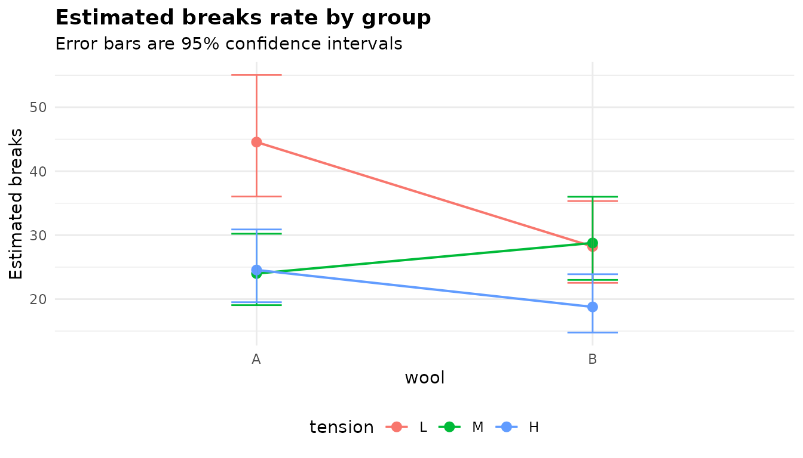
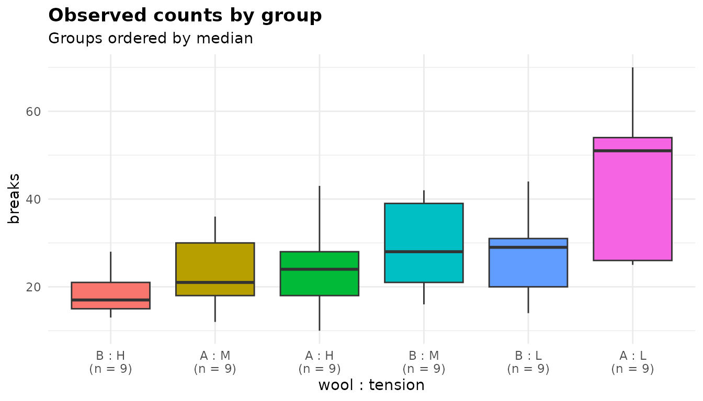
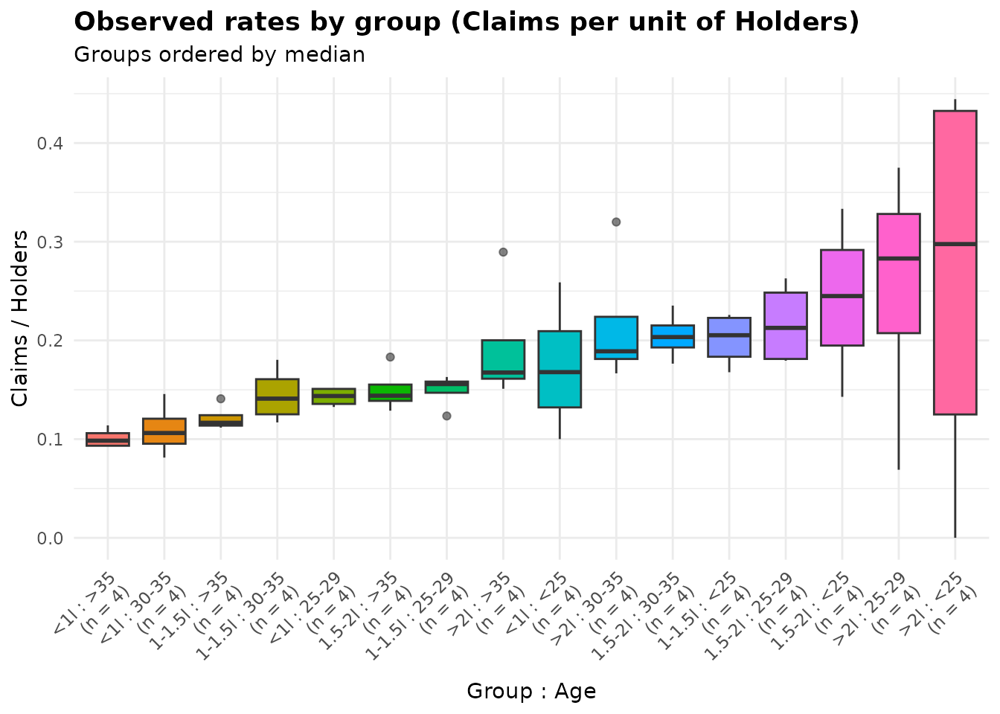
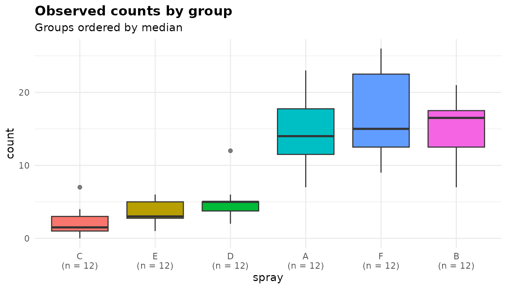

# Counts and rates: analysis of deviance with anova_count()

``` r

library(anovakit)
```

[`anova_count()`](https://elkronos.github.io/anovakit/reference/anova_count.md)
fits a regression for a count response (the number of breaks, claims,
visits or incidents) across one or more grouping variables. It starts
from a Poisson model, checks it for overdispersion, moves to a negative
binomial model when the counts are more variable than a Poisson allows,
and reports an analysis of deviance table, incidence rate ratios,
estimated marginal rates and pairwise rate ratios. With an exposure
column (time at risk, number of policies) it compares rates rather than
counts. For a yes/no outcome use
[`anova_bin()`](https://elkronos.github.io/anovakit/reference/anova_bin.md)
([walkthrough](https://elkronos.github.io/anovakit/articles/binary.md));
for other response distributions,
[`anova_glm()`](https://elkronos.github.io/anovakit/reference/anova_glm.md)
([walkthrough](https://elkronos.github.io/anovakit/articles/glm.md)).
The [decision
guide](https://elkronos.github.io/anovakit/articles/choosing.md) covers
the choice in more detail.

## The data

`warpbreaks` records the number of warp breaks on each of 54 looms,
where a loom corresponds to a fixed length of yarn, for two types of
wool (`A`, `B`) at three levels of tension (`L`, `M`, `H`): a 2 by 3
factorial experiment with 9 looms in each cell.

``` r

head(warpbreaks)
#>   breaks wool tension
#> 1     26    A       L
#> 2     30    A       L
#> 3     54    A       L
#> 4     25    A       L
#> 5     70    A       L
#> 6     52    A       L
table(warpbreaks$wool, warpbreaks$tension)
#>    
#>     L M H
#>   A 9 9 9
#>   B 9 9 9
aggregate(breaks ~ wool + tension, data = warpbreaks,
          FUN = function(x) round(c(mean = mean(x), variance = var(x)), 1))
#>   wool tension breaks.mean breaks.variance
#> 1    A       L        44.6           327.5
#> 2    B       L        28.2            97.2
#> 3    A       M        24.0            75.0
#> 4    B       M        28.8            88.9
#> 5    A       H        24.6           105.5
#> 6    B       H        18.8            23.9
```

The breaks are counts, so a Poisson model is the natural starting point.
A Poisson distribution has its variance equal to its mean, and here the
variance within each cell is between 1.3 and 7.4 times the mean. The
counts are *overdispersed*, and dealing with that is the first thing the
function does.

## Fitting the model

Columns are named as character strings: the response, then the grouping
variables. This is a designed factorial experiment, and whether the
effect of tension depends on the wool is part of the question, so the
model includes the interaction:

``` r

fit <- anova_count(warpbreaks, "breaks", c("wool", "tension"),
                   interaction = TRUE)
fit
#> Analysis of deviance for a count response (negbin regression) 
#> -------------------------------------------------------------
#> Call: anova_count(data = warpbreaks, response = "breaks", groups = c("wool", "tension"), interaction = TRUE)
#> Observations used: 54
#> 
#> Omnibus test (Type II, likelihood-ratio chi-square)
#>           term df statistic   p_value
#> 1         wool  1     3.905   0.04814
#> 2      tension  2    20.220 4.068e-05
#> 3 wool:tension  2     8.206   0.01652
#> 
#> Notes
#>   - Pearson dispersion is 3.76, above the threshold of 1.50, so a negative binomial model was fitted instead of Poisson. Set model = "poisson" to override.
#>   - Negative binomial dispersion parameter theta = 12.082 (SE 3.300), so the variance is about mu + mu^2/12.1. With 9 observations in the smallest group, the likelihood-ratio tests and Wald intervals are markedly anti-conservative: at 5-10 observations per group, nominal 5% tests reject roughly 10-15% of true null hypotheses (2-3 times too often) and 95% intervals, including the pairwise comparisons, cover only about 89-93%. Treating theta as known explains only part of this; the rest is small-sample asymptotics. model = "quasipoisson" (F tests) is better calibrated at this size.
#> 
#> Plots available: emmeans, observed
#>   (use plot(x, which = "emmeans"))
```

Reading the printout from the top:

- The method names the model actually fitted: a negative binomial
  regression, not the Poisson one you might have expected.
- `Observations used: 54`, all of them.
- The omnibus table, headed with what it holds: Type II tests,
  likelihood-ratio chi-square statistics.
- The notes: why the model is negative binomial, and a warning about
  what its tests are worth with 9 looms per cell. Both are discussed in
  the next section and [below](#what-the-notes-say).
- The plots that were built (they are not drawn until you ask).

`summary(fit)` prints this plus the assumption checks, the rate ratios,
the marginal means and the pairwise comparisons.

## Poisson, negative binomial or quasi-Poisson?

The `model` argument decides the model. Its default, `"auto"`, fits a
Poisson model first and computes its Pearson dispersion: the sum of
squared Pearson residuals divided by the residual degrees of freedom,
which is about 1 when the Poisson variance is right. Above
`overdispersion_threshold` (1.5 by default) the function fits a negative
binomial model instead, which needs the **MASS** package (without it, or
if that fit fails, it uses quasi-Poisson). `$model_type` records the
outcome:

``` r

fit$model_type
#> [1] "negbin"
fit$dispersion
#> [1] 3.763881
fit$model_dispersion
#> [1] 1.079551
```

`$dispersion` is the Pearson dispersion of the *Poisson* fit, the
statistic the decision was made on: 3.76, well above 1.5.
`$model_dispersion` is the same statistic for the model actually
returned. At 1.08 it says the negative binomial’s variance function,
`mu + mu^2 / theta`, has absorbed the extra variation. The second note
gives theta, 12.1, and goes on to say something important: with 9
observations per cell the negative binomial’s likelihood-ratio tests and
Wald intervals are markedly anti-conservative, and quasi-Poisson F tests
are better calibrated at this size.

Set `model` yourself to take the decision out of the function’s hands.
Here is the interaction test under each of the three models:

``` r

models <- c("poisson", "quasipoisson", "negbin")
fits <- lapply(models, function(m)
  anova_count(warpbreaks, "breaks", c("wool", "tension"), interaction = TRUE,
              model = m, plots = FALSE))
data.frame(model = vapply(fits, `[[`, "", "model_type"),
           test = vapply(fits, function(f) attr(f$anova, "statistic"), ""),
           statistic = vapply(fits, function(f) f$anova$statistic[3], 0),
           p_value = vapply(fits, function(f) f$anova$p_value[3], 0))
#>          model                        test statistic      p_value
#> 1      poisson likelihood-ratio chi-square 28.086757 7.962292e-07
#> 2 quasipoisson                           F  3.731090 3.117908e-02
#> 3       negbin likelihood-ratio chi-square  8.205982 1.652318e-02
```

The Poisson model, which ignores the overdispersion, puts the p-value
for the interaction below one in a million. Both models that allow for
it put it between 0.01 and 0.05. An explicit `model = "poisson"` is kept
even on data like these, but not silently:

``` r

fits[[1]]$notes[1]
#> [1] "Pearson dispersion is 3.76, above the threshold of 1.50: the counts are overdispersed relative to Poisson. model = \"poisson\" was requested, so the Poisson model was kept. A Poisson model assumes a dispersion of 1; at 3.76 (Pearson test of overdispersion: p < 2.2e-16) its likelihood-ratio and Wald statistics are inflated by about that factor and its standard errors are about 1.94 times too small, so its intervals are too narrow and a nominal 5% test on 1 degree of freedom rejects roughly 31% of true null hypotheses. Use model = \"quasipoisson\" or \"negbin\" when that matters."
```

The note puts a size on the problem: at a dispersion of 3.76, a nominal
5% test rejects roughly 31% of true null hypotheses, six times as often
as it should.

The quasi-Poisson model keeps the Poisson estimates and scales their
variance by the estimated dispersion. It has no likelihood, so its table
uses F tests:

``` r

fits[[2]]$anova
#>           term    sum_sq df statistic      p_value
#> 1         wool  16.03875  1  4.261227 0.0444186297
#> 2      tension  70.94157  2  9.423991 0.0003529152
#> 3 wool:tension  28.08676  2  3.731090 0.0311790844
#> 4    Residuals 180.66630 48        NA           NA
fits[[2]]$notes
#> [1] "A quasi-Poisson model has no likelihood, so the analysis of deviance uses an F test rather than a likelihood ratio test."
```

`overdispersion_threshold` moves the cut-off for `model = "auto"`. It is
a fixed cut-off, not a test, and a Poisson model kept below it still
gets the note on inflated statistics when the dispersion is beyond what
chance would produce:

``` r

lenient <- anova_count(warpbreaks, "breaks", c("wool", "tension"),
                       interaction = TRUE, overdispersion_threshold = 5,
                       plots = FALSE)
lenient$model_type
#> [1] "poisson"
lenient$notes
#> [1] "Pearson dispersion is 3.76, at or below the threshold of 5.00, so a Poisson model was kept. A Poisson model assumes a dispersion of 1; at 3.76 (Pearson test of overdispersion: p < 2.2e-16) its likelihood-ratio and Wald statistics are inflated by about that factor and its standard errors are about 1.94 times too small, so its intervals are too narrow and a nominal 5% test on 1 degree of freedom rejects roughly 31% of true null hypotheses. Use model = \"quasipoisson\" or \"negbin\" when that matters."
```

Which to use? The negative binomial is a full likelihood model, and with
more data per group it is usually the better choice. With groups as
small as these, the note’s advice to prefer quasi-Poisson is worth
taking for the tests; the rest of this article stays with the automatic
choice so that you can see what it reports.

## The omnibus test

``` r

fit$anova
#>           term df statistic      p_value
#> 1         wool  1  3.905167 4.813785e-02
#> 2      tension  2 20.219447 4.068205e-05
#> 3 wool:tension  2  8.205982 1.652318e-02
```

Each row is a likelihood-ratio test: `statistic` is the increase in
deviance when the term is dropped (with theta held at its estimate),
referred to a chi-square distribution on `df` degrees of freedom. Type
II means each main effect is tested after the other and without the
interaction, and the interaction after both. The `wool:tension` row says
the effect of tension depends on the wool (p = 0.017), so the main
effects cannot be read on their own; the rate ratios and marginal means
below show what the interaction looks like.

## Effect sizes: rate ratios

`$effect_sizes` holds incidence rate ratios (IRRs), each a level of a
factor against its reference (first) level:

``` r

print(fit$effect_sizes, digits = 3)
#>             term       factor            comparison   IRR conf_low conf_high
#> 1          woolB         wool B vs A at tension = L 0.633    0.465     0.863
#> 2       tensionM      tension    M vs L at wool = A 0.539    0.394     0.737
#> 3       tensionH      tension    H vs L at wool = A 0.551    0.403     0.753
#> 4 woolB:tensionM wool:tension   (B vs A) x (M vs L) 1.893    1.212     2.956
#> 5 woolB:tensionH wool:tension   (B vs A) x (H vs L) 1.207    0.767     1.901
#>    p_value
#> 1 0.003753
#> 2 0.000107
#> 3 0.000186
#> 4 0.005008
#> 5 0.416123
```

An IRR is the ratio of two expected counts (or two rates, with an
offset): 1 means no difference, 0.5 half as many, 2 twice as many.
`factor` names the grouping variable and `comparison` says what is
compared. In a model with an interaction, a main-effect ratio holds at
the reference level of the factor it interacts with:
`B vs A at tension = L` says wool B has 0.63 times the breaks of wool A
*at low tension*. The interaction rows are ratios of rate ratios:
`(B vs A) x (M vs L)` is 1.89, meaning the B-to-A ratio at medium
tension is 1.89 times the B-to-A ratio at low tension.

The intervals are Wald intervals on the log scale, exponentiated, and
`p_value` tests each ratio against 1. They are always computed under
treatment (reference) coding, whatever `type` or the global `contrasts`
option; `term` gives the name of the coefficient in that coding.

## Marginal means and comparisons

`$emmeans` holds the estimated marginal means on the count scale, here
the expected breaks per loom in each cell, with intervals built on the
log scale and back-transformed:

``` r

print(fit$emmeans, digits = 3)
#>   wool tension estimate   se  df conf_low conf_high
#> 1    A       L     44.6 4.82 Inf     36.0      55.1
#> 2    B       L     28.2 3.23 Inf     22.5      35.3
#> 3    A       M     24.0 2.82 Inf     19.1      30.2
#> 4    B       M     28.8 3.29 Inf     23.0      36.0
#> 5    A       H     24.6 2.88 Inf     19.5      30.9
#> 6    B       H     18.8 2.31 Inf     14.8      23.9
```

With the full interaction in the model these are the cell means of the
data; the model’s contribution is the intervals. `$posthoc` compares
every pair of cells, as rate ratios:

``` r

print(fit$posthoc[, c("contrast", "IRR", "conf_low", "conf_high", "p_value",
                      "p_adjusted", "adjustment")], digits = 3)
#>     contrast   IRR conf_low conf_high  p_value p_adjusted adjustment
#> 1  A L / B L 1.579    1.008      2.47 3.75e-03   4.35e-02      tukey
#> 2  A L / A M 1.856    1.178      2.93 1.07e-04   1.50e-03      tukey
#> 3  A L / B M 1.548    0.989      2.42 5.46e-03   6.09e-02      tukey
#> 4  A L / A H 1.814    1.152      2.86 1.86e-04   2.56e-03      tukey
#> 5  A L / B H 2.373    1.488      3.78 1.31e-07   1.95e-06      tukey
#> 6  B L / A M 1.176    0.737      1.88 3.24e-01   9.22e-01      tukey
#> 7  B L / B M 0.981    0.618      1.56 9.04e-01   1.00e+00      tukey
#> 8  B L / A H 1.149    0.720      1.83 3.96e-01   9.58e-01      tukey
#> 9  B L / B H 1.503    0.931      2.43 1.53e-02   1.48e-01      tukey
#> 10 A M / B M 0.834    0.523      1.33 2.68e-01   8.79e-01      tukey
#> 11 A M / A H 0.977    0.609      1.57 8.90e-01   1.00e+00      tukey
#> 12 A M / B H 1.278    0.787      2.08 1.49e-01   7.01e-01      tukey
#> 13 B M / A H 1.172    0.735      1.87 3.32e-01   9.28e-01      tukey
#> 14 B M / B H 1.533    0.950      2.47 1.10e-02   1.12e-01      tukey
#> 15 A H / B H 1.308    0.806      2.12 1.14e-01   6.12e-01      tukey
```

`IRR` is the rate of the first cell in `contrast` divided by the rate of
the second. `p_value` is unadjusted and `p_adjusted` is adjusted for all
15 comparisons by the method in `adjustment` (Tukey by default; `adjust`
changes it). The intervals are simultaneous.

Most of those comparisons (`A L / B M`, say) answer no question anyone
asked. For the comparisons of tensions within each wool, pass
`$emmeans_object` to **emmeans**:

``` r

emmeans::contrast(fit$emmeans_object, method = "pairwise", by = "wool")
#> wool = A:
#>  contrast ratio    SE  df null z.ratio p.value
#>  L / M    1.856 0.297 Inf    1   3.873  0.0003
#>  L / H    1.814 0.289 Inf    1   3.738  0.0005
#>  M / H    0.977 0.162 Inf    1  -0.138  0.9896
#> 
#> wool = B:
#>  contrast ratio    SE  df null z.ratio p.value
#>  L / M    0.981 0.159 Inf    1  -0.120  0.9920
#>  L / H    1.503 0.253 Inf    1   2.424  0.0406
#>  M / H    1.533 0.257 Inf    1   2.544  0.0295
#> 
#> P value adjustment: tukey method for comparing a family of 3 estimates 
#> Tests are performed on the log scale
```

With wool A, low tension gives clearly more breaks than medium or high,
which do not differ. With wool B, high tension gives fewer breaks than
the other two, less decisively.

## Rates: counts with an exposure

Counts are often collected over different amounts of exposure: more
policyholders, longer follow-up, larger areas.
[`MASS::Insurance`](https://rdrr.io/pkg/MASS/man/Insurance.html) gives
the number of car insurance claims in 64 groups of policyholders, by
district, car group (engine size) and driver age, together with the
number of policyholders in each group. `District` is left out below to
keep the example small.

``` r

ins <- MASS::Insurance
head(ins)
#>   District  Group   Age Holders Claims
#> 1        1    <1l   <25     197     38
#> 2        1    <1l 25-29     264     35
#> 3        1    <1l 30-35     246     20
#> 4        1    <1l   >35    1680    156
#> 5        1 1-1.5l   <25     284     63
#> 6        1 1-1.5l 25-29     536     84
```

A group with 1,000 policyholders will have more claims than one with
100, so the counts must be compared per policyholder. Name the exposure
column in `offset`. Give it on its natural scale: the function takes the
logarithm itself and enters it as `offset(log(Holders))` in the model
formula.

``` r

ins_fit <- anova_count(ins, "Claims", c("Group", "Age"), offset = "Holders")
ins_fit
#> Analysis of deviance for a count response (poisson regression) 
#> --------------------------------------------------------------
#> Call: anova_count(data = ins, response = "Claims", groups = c("Group", "Age"), offset = "Holders")
#> Observations used: 64
#> 
#> Omnibus test (Type II, likelihood-ratio chi-square)
#>    term df statistic   p_value
#> 1 Group  3     90.10 < 2.2e-16
#> 2   Age  3     82.62 < 2.2e-16
#> 
#> Notes
#>   - Pearson dispersion is 1.14, at or below the threshold of 1.50, so a Poisson model was kept.
#>   - The grouping factors enter the model additively, so $emmeans and $posthoc are reported for each factor separately, averaged over the others (column `term`), and each factor's comparisons are a separate multiplicity family. Set interaction = TRUE to compare cells instead.
#>   - Estimated marginal means are rates at Holders = 1 (one unit of exposure).
#> 
#> Plots available: emmeans, observed
#>   (use plot(x, which = "emmeans"))
print(formula(ins_fit$model), showEnv = FALSE)
#> Claims ~ Group + Age + offset(log(Holders))
```

Here the Poisson model was kept: the dispersion, 1.14, is below the
threshold and within what chance produces (a Pearson test of
overdispersion on its 57 residual degrees of freedom gives p = 0.22), so
there is no note on inflation. Both factors matter:

``` r

print(ins_fit$effect_sizes, digits = 3)
#>          term factor    comparison   IRR conf_low conf_high  p_value
#> 1 Group1-1.5l  Group 1-1.5l vs <1l 1.176    1.066     1.299 1.30e-03
#> 2 Group1.5-2l  Group 1.5-2l vs <1l 1.484    1.332     1.653 7.09e-13
#> 3    Group>2l  Group    >2l vs <1l 1.767    1.534     2.036 3.24e-15
#> 4    Age25-29    Age  25-29 vs <25 0.829    0.705     0.976 2.39e-02
#> 5    Age30-35    Age  30-35 vs <25 0.714    0.609     0.837 3.36e-05
#> 6      Age>35    Age    >35 vs <25 0.590    0.515     0.677 4.27e-14
```

The rate ratios are now ratios of claims *per policyholder*: drivers
aged over 35 make 0.59 times as many claims per policy as drivers under
25 with the same size of car, and cars over 2 litres 1.77 times as many
as cars under 1 litre. (`Group` and `Age` are ordered factors. The rate
ratios compare levels with the first level all the same, as they would
for unordered factors.)

The marginal means are rates at an exposure of 1, which a note records:
claims per policyholder. The unit of the exposure is the unit of the
rate, so to report claims per thousand policyholders, give the exposure
in thousands:

``` r

ins$thousands <- ins$Holders / 1000
per_1000 <- anova_count(ins, "Claims", c("Group", "Age"),
                        offset = "thousands", plots = FALSE)
print(per_1000$emmeans, digits = 3)
#>    term  Group   Age estimate    se  df conf_low conf_high
#> 1 Group    <1l  <NA>      128  5.85 Inf      117       140
#> 2 Group 1-1.5l  <NA>      150  4.71 Inf      141       160
#> 3 Group 1.5-2l  <NA>      189  7.16 Inf      176       204
#> 4 Group    >2l  <NA>      226 13.66 Inf      200       254
#> 5   Age   <NA>   <25      220 14.80 Inf      193       251
#> 6   Age   <NA> 25-29      183  9.29 Inf      165       202
#> 7   Age   <NA> 30-35      157  7.58 Inf      143       173
#> 8   Age   <NA>   >35      130  3.21 Inf      124       136
grep("exposure", per_1000$notes, value = TRUE)
#> [1] "Estimated marginal means are rates at thousands = 1 (one unit of exposure)."
all.equal(per_1000$effect_sizes, ins_fit$effect_sizes)
#> [1] TRUE
```

The rate ratios, and everything else except the scale of the marginal
means, are unchanged. The model is additive, so the marginal rates are
reported for each factor separately, averaged over the other (the `term`
column), and `$posthoc` compares levels within each factor:

``` r

print(per_1000$posthoc[, c("term", "contrast", "IRR", "conf_low", "conf_high",
                           "p_adjusted")], digits = 3)
#>     term            contrast   IRR conf_low conf_high p_adjusted
#> 1  Group      <1l / (1-1.5l) 0.850    0.747     0.968   7.11e-03
#> 2  Group      <1l / (1.5-2l) 0.674    0.585     0.776   4.28e-12
#> 3  Group           <1l / >2l 0.566    0.470     0.681   7.74e-14
#> 4  Group (1-1.5l) / (1.5-2l) 0.793    0.710     0.885   4.03e-07
#> 5  Group      (1-1.5l) / >2l 0.666    0.565     0.784   9.01e-10
#> 6  Group      (1.5-2l) / >2l 0.840    0.707     0.998   4.54e-02
#> 7    Age       <25 / (25-29) 1.206    0.975     1.492   1.08e-01
#> 8    Age       <25 / (30-35) 1.401    1.137     1.726   1.97e-04
#> 9    Age           <25 / >35 1.694    1.416     2.026   2.81e-13
#> 10   Age   (25-29) / (30-35) 1.162    0.975     1.385   1.25e-01
#> 11   Age       (25-29) / >35 1.405    1.221     1.615   2.54e-09
#> 12   Age       (30-35) / >35 1.209    1.058     1.381   1.47e-03
```

## Checking assumptions

`$assumptions` has three elements, each documented in
[`?anova_count`](https://elkronos.github.io/anovakit/reference/anova_count.md):

``` r

fit$assumptions
#> $poisson_dispersion
#> [1] 3.763881
#> 
#> $model_dispersion
#> [1] 1.079551
#> 
#> $cell_counts
#>    cell n
#> 1 A : L 9
#> 2 B : L 9
#> 3 A : M 9
#> 4 B : M 9
#> 5 A : H 9
#> 6 B : H 9
```

- `poisson_dispersion` is the Pearson dispersion of the Poisson fit (the
  same number as `$dispersion`). Near 1 the Poisson variance is
  adequate; well above it, the counts are overdispersed. Below 1 they
  are underdispersed, which is rarer and makes Poisson tests
  conservative.
- `model_dispersion` is the same statistic for the model returned (the
  same number as `$model_dispersion`). For a negative binomial fit, a
  value near 1 says the variance function fits; one well above 1 says it
  does not, and that a model for the source of the extra variation (a
  missing grouping variable, clustering) is needed.
- `cell_counts` is the number of observations in each cell of the design
  (with frequency weights it adds the number of table rows; see
  [below](#frequency-weights)). Small cells are where the asymptotic
  tests are least trustworthy, as the note on theta said.

The model also assumes independent counts and that the log rate is
additive in the terms included, which the interaction test checks for
the grouping factors. More on the checks across the package is in the
[diagnostics
article](https://elkronos.github.io/anovakit/articles/diagnostics.md).

### A group with no events

When a group has no events at all, its fitted rate is zero, the log of
it is minus infinity, and every rate ratio involving it is undefined.
[`glm()`](https://rdrr.io/r/stats/glm.html) still reports convergence,
with an enormous negative coefficient. To show what the function does,
here are simulated weekly incident counts at three sites; the true rate
at `east` is 0.05 a week, small but not zero, and in ten weeks it had no
incidents:

``` r

set.seed(1)
incidents <- data.frame(
  site = factor(rep(c("north", "south", "east"), each = 10),
                levels = c("north", "south", "east")),
  events = c(rpois(10, 2), rpois(10, 4), rpois(10, 0.05))
)
tapply(incidents$events, incidents$site, sum)
#> north south  east 
#>    21    44     0
zero_fit <- anova_count(incidents, "events", "site")
zero_fit
#> Analysis of deviance for a count response (poisson regression) 
#> --------------------------------------------------------------
#> Call: anova_count(data = incidents, response = "events", groups = "site")
#> Observations used: 30
#> 
#> Omnibus test (Type II, likelihood-ratio chi-square)
#>   term df statistic   p_value
#> 1 site  2     61.03 5.597e-14
#> 
#> Notes
#>   - 1 group combination(s) hold fewer than 5 events in total; their rates, and any rate ratio involving them, rest on very little information, so their Wald intervals and p-values are unreliable.
#>   - Pearson dispersion is 0.74, at or below the threshold of 1.50, so a Poisson model was kept.
#>   - No events were observed in site = east, so the fitted rate there is numerically zero. The affected coefficient(s): siteeast. A rate ratio involving such a cell is not identified: it will be near zero or enormous, its interval unbounded on one side, and its Wald p-value near 1 no matter how large the difference is; the same goes for that cell's marginal mean and the comparisons involving it. The likelihood-ratio omnibus test remains usable. Consider collapsing the level, or an exact or penalised method for the affected comparisons.
#>   - The rate ratio(s) for siteeast involve a cell with no events, so the interval is open on that side (0 or Inf). The finite end was found by profiling the likelihood directly, where a Wald interval would run from 0 to Inf.
#> 
#> Plots available: emmeans, observed
#>   (use plot(x, which = "emmeans"))
```

Two notes flag the problem. The first counts the groups with fewer than
5 events in total, whose rates rest on very little information. The
third names the group with no events, says that the rate ratios
involving it, its marginal mean and the comparisons involving it are
unreliable, and says what still works. The results bear it out:

``` r

print(zero_fit$effect_sizes, digits = 3)
#>        term factor     comparison      IRR conf_low conf_high p_value
#> 1 sitesouth   site south vs north 2.10e+00     1.25    3.5237 0.00529
#> 2  siteeast   site  east vs north 1.97e-09     0.00    0.0958 0.99463
print(zero_fit$posthoc[, c("contrast", "IRR", "conf_low", "conf_high",
                           "p_adjusted")], digits = 3)
#>        contrast      IRR conf_low conf_high p_adjusted
#> 1 north / south 4.77e-01 2.56e-01     0.889     0.0146
#> 2  north / east 5.07e+08 2.22e-16       Inf     1.0000
#> 3  south / east 1.06e+09 2.22e-16       Inf     1.0000
```

`east vs north` is estimated as practically zero, with an interval from
0 to infinity and a p-value of 0.99: the Wald machinery has nothing to
work with, however clear the difference. The likelihood-ratio test in
the omnibus table does work, and it is the number to report for the
overall comparison. For the rate ratios involving `east`, follow the
note’s advice: collapse the level with another, or use an exact method.
A robust covariance would fail here too, and `vcov_type` falls back to
the model-based one with a note saying so:

``` r

grep("Robust", anova_count(incidents, "events", "site", vcov_type = "HC3",
                           plots = FALSE)$notes, value = TRUE)
#> [1] "Robust standard errors (HC3) were not used: some fitted values are on the boundary (a group with no events, or all events), where the sandwich covariance collapses towards zero and reports spuriously small p-values. Model-based standard errors were used instead."
```

## Plots

`fit$plots` holds two **ggplot2** objects, returned rather than drawn.
Use `plot(fit, "name")` or `fit$plots$name` to get one.

``` r

plot(fit, "emmeans")
```



The `emmeans` plot shows the estimated marginal means with their
intervals. The first grouping variable goes on the x axis and the second
becomes the colour, one line per level. What to look for: lines that are
not parallel show an interaction. For wool A, low tension stands well
above medium and high; for wool B, low and medium are together and high
is lowest. The low-tension line falls steeply from A to B while the
medium one rises, so the lines are far from parallel.

``` r

plot(fit, "observed")
```



The `observed` plot is a box plot of the raw counts in each cell,
ordered by median and labelled with the cell’s number of observations.
What to look for: spread that grows with the median (expected for
counts, and what the negative binomial’s variance function allows for),
outlying looms, and whether the order of the medians agrees with the
marginal means.

With an offset, raw counts would mostly show where the exposure is, so
the plot shows observed rates instead: each row’s count divided by its
exposure, here claims per policyholder.

``` r

plot(ins_fit, "observed")
```



The title and the y axis name the rate. The order of the boxes follows
the rate ratios: the lowest median is for drivers over 35 with the
smallest cars (`<1l : >35`), the highest for drivers under 25 with the
largest (`>2l : <25`). What to look for is the same as before, plus one
thing: a rate computed from a small exposure is noisy. The widest box,
`>2l : <25`, comes from the four groups of young drivers of large cars,
which hold between 3 and 24 policyholders each.

The plot should tell the same story as the marginal rates. A quick check
is to pool the claims and policyholders by age band:

``` r

by_age <- aggregate(cbind(Claims, Holders) ~ Age, data = ins, FUN = sum)
by_age$rate <- by_age$Claims / by_age$Holders
by_age
#>     Age Claims Holders      rate
#> 1   <25    229    1138 0.2012302
#> 2 25-29    404    2336 0.1729452
#> 3 30-35    453    3007 0.1506485
#> 4   >35   2065   16878 0.1223486
ins_fit$emmeans[ins_fit$emmeans$term == "Age", c("Age", "estimate")]
#>     Age  estimate
#> 5   <25 0.2201177
#> 6 25-29 0.1825590
#> 7 30-35 0.1571197
#> 8   >35 0.1299627
```

The pooled rates fall with age, as the marginal rates do. They are not
the same numbers: the marginal rates are adjusted for car group and
average over the four car groups equally, while the pooled rates are
weighted by where the policyholders are. Each plot is a ggplot and can
be modified with `+`; the [plots
article](https://elkronos.github.io/anovakit/articles/visuals.md) has
more.

## Options worth knowing

### `interaction`

The model is additive by default. An additive model gives each factor’s
effect averaged over the other, which is what you want when the
interaction is absent and misleading when it is not. For comparison, the
additive fit of the same data reports marginal means for each factor
separately:

``` r

additive <- anova_count(warpbreaks, "breaks", c("wool", "tension"),
                        plots = FALSE)
additive$anova
#>      term df statistic      p_value
#> 1    wool  1  3.366537 0.0665334745
#> 2 tension  2 17.544863 0.0001549464
print(additive$emmeans, digits = 3)
#>      term wool tension estimate   se  df conf_low conf_high
#> 1    wool    A    <NA>     30.1 2.12 Inf     26.2      34.5
#> 2    wool    B    <NA>     25.0 1.80 Inf     21.7      28.8
#> 3 tension <NA>       L     35.9 3.03 Inf     30.4      42.3
#> 4 tension <NA>       M     26.6 2.33 Inf     22.4      31.6
#> 5 tension <NA>       H     21.5 1.95 Inf     18.0      25.7
```

The wool rows average over tensions, hiding the fact that the wool
difference runs in opposite directions at low and medium tension. Decide
on the interaction before looking at the answers, as the design here
justified.

### `test_statistic`

`"LR"` (the default) gives likelihood-ratio tests; `"Wald"` gives Wald
chi-square tests; `"F"` gives F tests, which is what a quasi-Poisson
model uses anyway. On a negative binomial (or Poisson) model, `"F"`
estimates a dispersion from the Pearson residuals and divides the
deviances by it, which makes the table a quasi-likelihood test while the
rate ratios still assume the model’s own dispersion. The note says so:

``` r

wald_fit <- anova_count(warpbreaks, "breaks", c("wool", "tension"),
                        interaction = TRUE, test_statistic = "Wald",
                        plots = FALSE)
wald_fit$anova
#>           term df statistic      p_value
#> 1         wool  1  3.911328 4.796169e-02
#> 2      tension  2 19.705948 5.259056e-05
#> 3 wool:tension  2  8.210214 1.648826e-02
f_fit <- anova_count(warpbreaks, "breaks", c("wool", "tension"),
                     interaction = TRUE, test_statistic = "F", plots = FALSE)
f_fit$anova
#>           term    sum_sq df statistic      p_value
#> 1         wool  3.905167  1  3.617398 0.0631884661
#> 2      tension 20.219447  2  9.364745 0.0003682666
#> 3 wool:tension  8.205982  2  3.800644 0.0293598000
#> 4    Residuals 51.818468 48        NA           NA
grep("test_statistic", f_fit$notes, value = TRUE)
#> [1] "test_statistic = \"F\" was requested for a negative binomial model, so car::Anova() estimated a dispersion from the Pearson residuals (1.08) and divided the deviance by it: the analysis of deviance is a quasi-likelihood F test. $effect_sizes and $posthoc still assume a dispersion of 1, so they can disagree with it. Use model = \"quasipoisson\" for quasi-likelihood inference throughout."
```

For quasi-likelihood inference throughout, use `model = "quasipoisson"`.

### `vcov_type`

`vcov_type` requests heteroskedasticity-consistent (sandwich) standard
errors, `"HC0"` to `"HC4"`, from the **sandwich** package. They reach
the rate ratios, the marginal means and the comparisons. A
likelihood-ratio test compares deviances and cannot use them, so the
omnibus table uses them only with `test_statistic = "Wald"`:

``` r

robust <- anova_count(warpbreaks, "breaks", c("wool", "tension"),
                      interaction = TRUE, vcov_type = "HC3",
                      test_statistic = "Wald", plots = FALSE)
robust$anova
#>           term df statistic      p_value
#> 1         wool  1  2.526565 0.1119436981
#> 2      tension  2 16.808766 0.0002238839
#> 3 wool:tension  2  6.765016 0.0339621730
data.frame(comparison = fit$effect_sizes$comparison,
           model_low = fit$effect_sizes$conf_low,
           model_high = fit$effect_sizes$conf_high,
           hc3_low = robust$effect_sizes$conf_low,
           hc3_high = robust$effect_sizes$conf_high)
#>              comparison model_low model_high   hc3_low  hc3_high
#> 1 B vs A at tension = L 0.4651349  0.8625808 0.4369807 0.9181560
#> 2    M vs L at wool = A 0.3938590  0.7366784 0.3696585 0.7849066
#> 3    H vs L at wool = A 0.4032354  0.7532465 0.3679333 0.8255184
#> 4   (B vs A) x (M vs L) 1.2122753  2.9560520 1.1459874 3.1270404
#> 5   (B vs A) x (H vs L) 0.7667100  1.9009866 0.7290004 1.9993205
grep("robust", robust$notes, value = TRUE)
#> [1] "The omnibus Wald test uses the robust (HC3) covariance, as the coefficient table, the marginal means and the comparisons do."
```

The robust intervals are wider here: with 9 looms a cell, the sandwich
estimate is noisy, and it is better used as a check on the model-based
standard errors than as a replacement for them.

### Frequency weights

A table of counts with a column saying how often each count occurred is
a frequency table. `weights` names that column, and whole-number weights
(some above 1) are read as frequencies: each row stands for that many
identical observations. `InsectSprays` has 12 insect counts for each of
six sprays; here it is as a frequency table:

``` r

spray_tab <- as.data.frame(table(spray = InsectSprays$spray,
                                 count = InsectSprays$count),
                           stringsAsFactors = FALSE)
spray_tab <- spray_tab[spray_tab$Freq > 0, ]
spray_tab$count <- as.numeric(spray_tab$count)
head(spray_tab)
#>    spray count Freq
#> 3      C     0    2
#> 9      C     1    4
#> 11     E     1    2
#> 15     C     2    2
#> 16     D     2    1
#> 17     E     2    1
c(rows = nrow(spray_tab), observations = sum(spray_tab$Freq))
#>         rows observations 
#>           43           72
```

The frequency table and the original 72 rows give the same analysis:

``` r

from_rows <- anova_count(InsectSprays, "count", "spray", plots = FALSE)
from_table <- anova_count(spray_tab, "count", "spray", weights = "Freq",
                          plots = FALSE)
c(rows = from_rows$dispersion, table = from_table$dispersion)
#>     rows    table 
#> 1.507713 1.507713
c(rows = from_rows$model_type, table = from_table$model_type)
#>     rows    table 
#> "negbin" "negbin"
all.equal(from_rows$anova, from_table$anova)
#> [1] TRUE
all.equal(from_rows$effect_sizes, from_table$effect_sizes)
#> [1] TRUE
all.equal(from_rows$emmeans, from_table$emmeans)
#> [1] TRUE
from_table$notes
#> [1] "Pearson dispersion is 1.51, above the threshold of 1.50, so a negative binomial model was fitted instead of Poisson. Set model = \"poisson\" to override."                                                                                                                                                                                                                                                                                                                                                             
#> [2] "The weights in `Freq` are whole numbers, so they are treated as frequency weights: each row stands for that many observations. The Pearson dispersion divides by the 72 observations they represent minus the 6 parameters, not by the 43 rows, which would inflate it."                                                                                                                                                                                                                                               
#> [3] "Negative binomial dispersion parameter theta = 28.100 (SE 17.700), so the variance is about mu + mu^2/28.1. Theta is poorly determined, but it is large: the data are only weakly overdispersed, and model = \"poisson\" would give a similar answer. With 12 observations in the smallest group, the likelihood-ratio tests and Wald intervals are moderately anti-conservative: at 10-30 observations per group, nominal 5% tests reject roughly 6-10% of true null hypotheses and 95% intervals cover about 91-95%."
```

The dispersion is the same in both, because with frequency weights it
divides by the number of observations the weights represent (minus the
number of parameters), not by the number of rows. Dividing by rows, as
[`glm()`](https://rdrr.io/r/stats/glm.html)’s own residual degrees of
freedom would, inflates it:

``` r

pois_table <- glm(count ~ spray, family = poisson, data = spray_tab,
                  weights = Freq)
sum(residuals(pois_table, type = "pearson")^2) / df.residual(pois_table)
#> [1] 2.689433
```

That inflation could switch a Poisson model to a negative binomial one
for no reason. (Here both values are above the threshold, so the choice
would be the same either way; the correct one, 1.508, is only just above
it, and the theta note says the negative binomial has only weakly
overdispersed data to work with.) With `vcov_type`, the sandwich is also
computed as it would be on the expanded data:

``` r

hc_rows <- anova_count(InsectSprays, "count", "spray", vcov_type = "HC3",
                       plots = FALSE)
hc_table <- anova_count(spray_tab, "count", "spray", weights = "Freq",
                        vcov_type = "HC3", plots = FALSE)
all.equal(hc_rows$effect_sizes, hc_table$effect_sizes)
#> [1] TRUE
```

With frequency weights, `$assumptions$cell_counts` gives both sizes: `n`
is the number of observations in each cell (the sum of the weights) and
`rows` the number of rows of the table behind them.

``` r

from_table$assumptions$cell_counts
#>   cell  n rows
#> 1    A 12    8
#> 2    B 12    8
#> 3    C 12    6
#> 4    D 12    6
#> 5    E 12    6
#> 6    F 12    9
```

The `observed` plot draws the observations too, expanding the table, so
it is the same plot the 72 original rows give, with 12 observations per
spray:

``` r

plot(anova_count(spray_tab, "count", "spray", weights = "Freq"), "observed")
```



A table that stands for more than 200,000 observations is not expanded;
the plot then shows one point per row, and a note says so:

``` r

big_tab <- transform(spray_tab, Freq = Freq * 5000)
big_fit <- anova_count(big_tab, "count", "spray", weights = "Freq")
grep("200,000", big_fit$notes, value = TRUE)
#> [1] "The plot of observed counts shows one point per row of the frequency table, not per observation: the table stands for more than 200,000 observations."
```

### `type`, `adjust`, `conf_level` and `posthoc`

`type = "III"` fits the model under sum-to-zero contrasts, which changes
the main-effect rows of `$anova` when there is an interaction; the rate
ratios are unchanged. `posthoc = FALSE` skips the pairwise comparisons,
with a note:

``` r

type3 <- anova_count(warpbreaks, "breaks", c("wool", "tension"),
                     interaction = TRUE, type = "III", posthoc = FALSE,
                     plots = FALSE)
type3$anova
#>           term df statistic      p_value
#> 1         wool  1  3.665426 5.555243e-02
#> 2      tension  2 19.383565 6.178918e-05
#> 3 wool:tension  2  8.205982 1.652318e-02
all.equal(type3$effect_sizes, fit$effect_sizes)
#> [1] TRUE
grep("posthoc|still reports", type3$notes, value = TRUE)
#> [1] "Pairwise comparisons were not computed (posthoc = FALSE); there would have been 15."
#> [2] "$effect_sizes still reports the incidence rate ratios from the model."
```

`adjust` sets the multiplicity adjustment for `$posthoc` and
`conf_level` the level of every interval, as in the other model-based
functions; the [binary-outcomes
walkthrough](https://elkronos.github.io/anovakit/articles/binary.md)
shows both.

## What the notes say

``` r

fit$notes
#> [1] "Pearson dispersion is 3.76, above the threshold of 1.50, so a negative binomial model was fitted instead of Poisson. Set model = \"poisson\" to override."                                                                                                                                                                                                                                                                                                                                                                                                                                               
#> [2] "Negative binomial dispersion parameter theta = 12.082 (SE 3.300), so the variance is about mu + mu^2/12.1. With 9 observations in the smallest group, the likelihood-ratio tests and Wald intervals are markedly anti-conservative: at 5-10 observations per group, nominal 5% tests reject roughly 10-15% of true null hypotheses (2-3 times too often) and 95% intervals, including the pairwise comparisons, cover only about 89-93%. Treating theta as known explains only part of this; the rest is small-sample asymptotics. model = \"quasipoisson\" (F tests) is better calibrated at this size."
```

- The first note records the model choice: the Poisson dispersion, the
  threshold, and the model fitted instead. It is also how to override
  it.
- The second gives the negative binomial’s theta, the variance function
  it implies, and how far to trust the tests and intervals given the
  size of the smallest group. With 9 looms per cell it recommends
  quasi-Poisson F tests, and in a write-up of these data that is the
  version of the interaction test worth reporting alongside (or instead
  of) this one.

There is no note on the layout of the marginal means, because with the
interaction in the model they are cells; an additive fit (the insurance
model, for one) adds a note explaining the per-factor layout. Other fits
in this article showed the notes on an explicit Poisson model with
overdispersion, on quasi-Poisson F tests, on exposure, on sparse and
empty groups, on robust standard errors, and on frequency weights
(including a table too large to plot one point per observation). The
[results
article](https://elkronos.github.io/anovakit/articles/results.md)
explains how `$notes` fits with the rest of the object.

## Reporting the result

A write-up might read:

> Warp breaks were analysed with a negative binomial regression on wool,
> tension and their interaction (Pearson dispersion of the Poisson model
> 3.76; theta = 12.1). The effect of tension depended on the wool
> (likelihood-ratio χ²(2) = 8.21, p = 0.017; quasi-Poisson F(2, 48) =
> 3.73, p = 0.031). At low tension wool B produced fewer breaks than
> wool A (rate ratio 0.63, 95% CI 0.47 to 0.86), and with wool A both
> medium and high tension reduced breaks by about half relative to low
> tension (rate ratios 0.54 and 0.55).

## See also

- [`?anova_count`](https://elkronos.github.io/anovakit/reference/anova_count.md)
  for every argument, and
  [`?anovakit_fit`](https://elkronos.github.io/anovakit/reference/anovakit_fit.md)
  for the returned object.
- [Binary outcomes with
  `anova_bin()`](https://elkronos.github.io/anovakit/articles/binary.md),
  the companion function for yes/no responses.
- [Generalised linear models with
  `anova_glm()`](https://elkronos.github.io/anovakit/articles/glm.md)
  for other families.
- [Working with
  results](https://elkronos.github.io/anovakit/articles/results.md) and
  [Diagnostics](https://elkronos.github.io/anovakit/articles/diagnostics.md).
- [Plots and visual
  customisation](https://elkronos.github.io/anovakit/articles/visuals.md).
