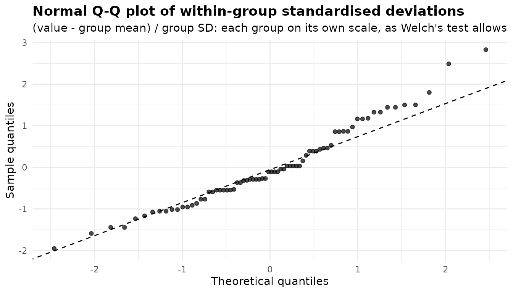
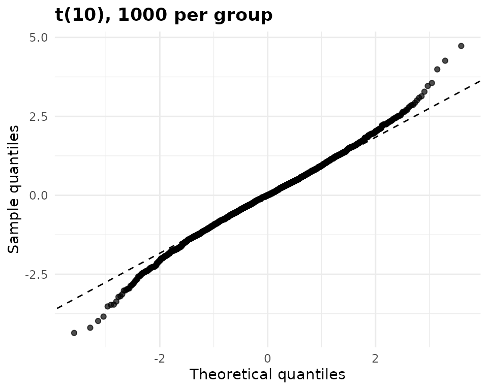
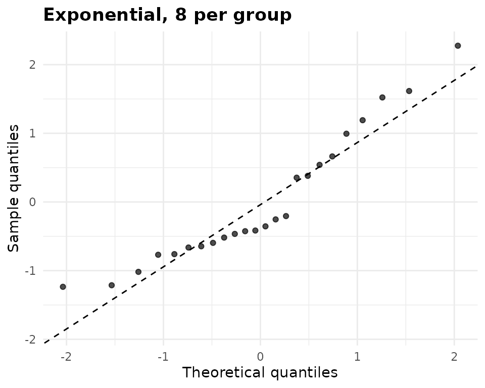
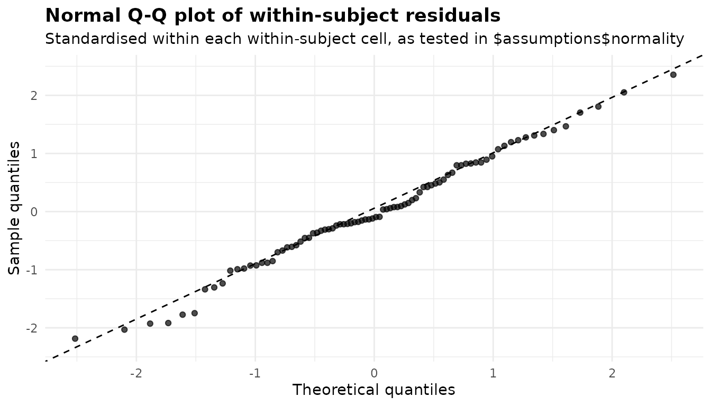

# Diagnostics: what anovakit checks and what to do about it

``` r

library(anovakit)
```

Every anovakit function checks the assumptions its method relies on, and
only those. The results go in `$assumptions`; anything that fails, could
not be computed, or changed what the function did is explained in
`$notes`. This article is organised by *what* is being checked rather
than by function, so that you can see, for example, every way the
package looks at normality in one place. The per-function walkthroughs
([Welch](https://elkronos.github.io/anovakit/articles/welch.md),
[Kruskal-Wallis](https://elkronos.github.io/anovakit/articles/kruskal-wallis.md),
[ANCOVA](https://elkronos.github.io/anovakit/articles/ancova.md),
[GLM](https://elkronos.github.io/anovakit/articles/glm.md), [repeated
measures](https://elkronos.github.io/anovakit/articles/repeated-measures.md),
[MANOVA](https://elkronos.github.io/anovakit/articles/manova.md),
[binary](https://elkronos.github.io/anovakit/articles/binary.md) and
[counts](https://elkronos.github.io/anovakit/articles/counts.md)) show
the same checks in the context of a single analysis.

## What each function stores

The components of `$assumptions` differ by method. Fitting each function
once and listing them is the quickest map:

``` r

map <- list(
  anova_welch  = anova_welch(chickwts, "weight", "feed", plots = FALSE),
  anova_kw     = anova_kw(chickwts, "weight", "feed", diagnostics = TRUE,
                          plots = FALSE),
  anova_ancova = anova_ancova(MASS::anorexia, "Postwt", "Treat", "Prewt",
                              plots = FALSE),
  anova_glm    = anova_glm(chickwts, "weight", "feed", plots = FALSE),
  anova_rm     = anova_rm(CO2, "uptake", subject = "Plant", within = "conc",
                          plots = FALSE),
  anova_manova = anova_manova(iris, names(iris)[1:4], "Species", plots = FALSE),
  anova_bin    = anova_bin(MASS::birthwt, "low", "race", plots = FALSE),
  anova_count  = anova_count(warpbreaks, "breaks", "tension", plots = FALSE)
)
#> Registered S3 method overwritten by 'lme4':
#>   method           from
#>   na.action.merMod car
data.frame(assumptions = vapply(map, function(f)
  paste(names(f$assumptions), collapse = ", "), character(1)))
#>                                                     assumptions
#> anova_welch                           normality, variance_ratio
#> anova_kw                                              normality
#> anova_ancova                          normality, levene, slopes
#> anova_glm                              dispersion, coefficients
#> anova_rm                                  sphericity, normality
#> anova_manova mardia, box_m, cell_counts, structure_coefficients
#> anova_bin                               dispersion, proportions
#> anova_count   poisson_dispersion, model_dispersion, cell_counts
```

[`anova_kw()`](https://elkronos.github.io/anovakit/reference/anova_kw.md)
stores nothing unless you ask for `diagnostics = TRUE`, because the
Kruskal-Wallis test assumes no distribution.
[`anova_glm()`](https://elkronos.github.io/anovakit/reference/anova_glm.md)
keeps its coefficient table there, since the intervals in it are where
separation shows up.
[`anova_rm()`](https://elkronos.github.io/anovakit/reference/anova_rm.md)
also returns `$sphericity` at the top level, and
[`anova_ancova()`](https://elkronos.github.io/anovakit/reference/anova_ancova.md)
and
[`anova_manova()`](https://elkronos.github.io/anovakit/reference/anova_manova.md)
return `$slopes_test`. `summary(fit)` prints every element of
`$assumptions` together.

Two habits make all of this easier to use. First, read the tests and the
plots together: a p-value says whether a departure is detectable, a plot
says whether it is large, and neither says whether it matters for your
inference. Second, read `$notes`: the package already says there which
check failed and what it did about it.

## Normality

### Within each group: `anova_welch()` and `anova_kw()`

Welch’s test allows each group its own variance, so pooling residuals
across groups would test the wrong thing: a mixture of normal
distributions with different spreads is not normal.
[`anova_welch()`](https://elkronos.github.io/anovakit/reference/anova_welch.md)
therefore runs Shapiro-Wilk separately in each group. `InsectSprays`
counts insects on plots treated with six sprays:

``` r

ins <- anova_welch(InsectSprays, "count", "spray")
ins$assumptions$normality
#>   group  n statistic     p_value note
#> 1     A 12 0.9575747 0.748729283 <NA>
#> 2     B 12 0.9503065 0.641470331 <NA>
#> 3     C 12 0.8590668 0.047589415 <NA>
#> 4     D 12 0.7506313 0.002713235 <NA>
#> 5     E 12 0.9212773 0.296669305 <NA>
#> 6     F 12 0.8847531 0.100863806 <NA>
```

Groups C and D reject normality (p = 0.048 and p = 0.003). The Q-Q plot
shows each observation’s deviation from its group mean in units of its
group’s standard deviation, so every group contributes on its own scale:

``` r

plot(ins, "qq")
```



The upper tail rises above the line, the mark of right skew, and the
short horizontal runs are tied values: several plots in a group hold the
same number of insects. That is what small counts look like, and it
points to the remedy. For a count response the better model is
[`anova_count()`](https://elkronos.github.io/anovakit/reference/anova_count.md)
(see the [counts
article](https://elkronos.github.io/anovakit/articles/counts.md)); for
any skewed or ordinal response the rank-based
[`anova_kw()`](https://elkronos.github.io/anovakit/reference/anova_kw.md)
makes no normality assumption:

``` r

anova_kw(InsectSprays, "count", "spray", plots = FALSE)$anova
#>    term statistic df      p_value
#> 1 spray  54.69134  5 1.510844e-10
```

`anova_kw(diagnostics = TRUE)` computes the same per-group table and Q-Q
plot, but only as context, and says so:

``` r

map$anova_kw$notes
#> [1] "The normality diagnostics are contextual only. Kruskal-Wallis does not assume normality and the test does not depend on them."
```

### Why a normality test is a weak guide

A Shapiro-Wilk test answers “is the departure from normality
detectable?”, and detectability depends on the sample size far more than
on the size of the departure. The simulation below, whose truth is
known, draws two data sets. The first has 1000 observations per group
from a t distribution with 10 degrees of freedom, whose tails are only
slightly heavier than normal; with groups this large the central limit
theorem makes the group means very nearly normal, and Welch’s test keeps
its error rate. The second has 8 observations per group from an
exponential distribution, which is strongly skewed, in samples too small
for the central limit theorem to help much.

``` r

set.seed(1)
big <- data.frame(g = rep(c("a", "b", "c"), each = 1000),
                  y = rt(3000, df = 10))
small <- data.frame(g = rep(c("a", "b", "c"), each = 8), y = rexp(24))
fit_big <- anova_welch(big, "y", "g")
fit_small <- anova_welch(small, "y", "g")
fit_big$assumptions$normality[, c("group", "n", "statistic", "p_value")]
#>   group    n statistic      p_value
#> 1     a 1000 0.9911908 1.084776e-05
#> 2     b 1000 0.9944450 9.519817e-04
#> 3     c 1000 0.9940685 5.430243e-04
fit_small$assumptions$normality[, c("group", "n", "statistic", "p_value")]
#>   group n statistic     p_value
#> 1     a 8 0.7290164 0.004774064
#> 2     b 8 0.9422127 0.632974916
#> 3     c 8 0.9143401 0.385640595
```

Every large group rejects, but only 1 of the three small, strongly
skewed groups does. The Q-Q plots tell the truer story. On the left the
points follow the line except in the far tails, beyond two standard
deviations; on the right they bow: the lowest values sit above the line,
the middle ones below it and the highest above it again, the shape of
right skew.

``` r

plot(fit_big, "qq") + ggplot2::labs(title = "t(10), 1000 per group",
                                    subtitle = NULL)
plot(fit_small, "qq") + ggplot2::labs(title = "Exponential, 8 per group",
                                      subtitle = NULL)
```



One draw could be luck, so here are the rejection rates over 500
repetitions of each:

``` r

set.seed(2)
reject_rate <- function(draw, reps = 500) {
  mean(replicate(reps, shapiro.test(draw())$p.value < 0.05))
}
rates <- c(t10_n1000 = reject_rate(function() rt(1000, df = 10)),
           exponential_n8 = reject_rate(function() rexp(8)))
rates
#>      t10_n1000 exponential_n8 
#>          0.898          0.342
```

The test flags the harmless departure 90% of the time and the serious
one 34% of the time. Use the p-value as a prompt to look at the plot,
not as a verdict, and decide by what the plot shows and how large the
groups are.

### On model residuals: `anova_ancova()` and `anova_glm()`

An ANCOVA assumes one residual variance for every group (Levene’s test
checks that, see below), so its residuals can be pooled.
[`anova_ancova()`](https://elkronos.github.io/anovakit/reference/anova_ancova.md)
runs Shapiro-Wilk on them and stores the `htest` object. On
[`MASS::anorexia`](https://rdrr.io/pkg/MASS/man/anorexia.html), weight
after treatment adjusted for weight before:

``` r

anx <- anova_ancova(MASS::anorexia, "Postwt", "Treat", "Prewt")
anx$assumptions$normality
#> 
#>  Shapiro-Wilk normality test
#> 
#> data:  x
#> W = 0.97938, p-value = 0.2846
```

``` r

plot(anx, "qq")
```


Here the test does not reject (p = 0.285) and the points stay close to
the line. Shapiro-Wilk is skipped, with a note, when there are fewer
than 3 or more than 5000 residuals; above 5000, the Q-Q plot is all
there is, and with that many observations it is also all you need.

[`anova_glm()`](https://elkronos.github.io/anovakit/reference/anova_glm.md)
runs no normality test. For a Gaussian family the residuals are
approximately normal if the model is right, but for other families they
are not expected to be, so a test would reject for the wrong reason. It
returns a Q-Q plot of deviance residuals (`plot(fit, "qq")`), which for
counts and proportions is a rough guide to outlying observations rather
than a check of an assumption. For a Gaussian fit you can run
`shapiro.test(residuals(fit$model))` yourself.

When residual normality fails badly, the remedies are a transformation
of the response (create the column first, since responses are named as
columns), a family that matches the response in
[`anova_glm()`](https://elkronos.github.io/anovakit/reference/anova_glm.md),
or, for a one-way design,
[`anova_kw()`](https://elkronos.github.io/anovakit/reference/anova_kw.md).

### Within each within-subject cell: `anova_rm()`

The within-subject F tests of a repeated measures ANOVA depend on the
within-subject errors: what is left of each value after its subject’s
mean and its cell’s mean are removed.
[`anova_rm()`](https://elkronos.github.io/anovakit/reference/anova_rm.md)
stores those in `$residuals` and runs Shapiro-Wilk on them separately in
each within-subject cell, for the same reason
[`anova_welch()`](https://elkronos.github.io/anovakit/reference/anova_welch.md)
tests each group. `CO2` measures carbon dioxide uptake by 12 plants at
seven ambient concentrations:

``` r

co2 <- anova_rm(CO2, "uptake", subject = "Plant", within = "conc",
                between = c("Type", "Treatment"))
co2$assumptions$normality
#>   cell  n statistic    p_value note
#> 1   95 12 0.9253046 0.33298428 <NA>
#> 2  175 12 0.9263038 0.34257481 <NA>
#> 3  250 12 0.9417440 0.52099093 <NA>
#> 4  350 12 0.9476625 0.60310240 <NA>
#> 5  500 12 0.8749378 0.07551536 <NA>
#> 6  675 12 0.8500726 0.03678882 <NA>
#> 7 1000 12 0.9292351 0.37207558 <NA>
```

``` r

plot(co2, "qq")
```



1 of the 7 cells rejects at the 5% level (the cell at 675, p = 0.037).
With seven tests, one rejection is about what chance alone produces, so
on its own it is weak evidence; the Q-Q plot, standardised within each
cell as the tests are, shows no systematic curvature.

With a single two-level within-subject factor the two cells’ residuals
are plus and minus half of each subject’s centred difference, so both
rows test the normality of the differences, which is exactly the
assumption of the equivalent paired t-test. The `sleep` data make that
visible:

``` r

sl <- anova_rm(sleep, "extra", subject = "ID", within = "group",
               plots = FALSE)
sl$assumptions$normality
#>   cell  n statistic    p_value note
#> 1    1 10 0.8298713 0.03334161 <NA>
#> 2    2 10 0.8298713 0.03334161 <NA>
with(sleep, extra[group == "2"] - extra[group == "1"])
#>  [1] 1.2 2.4 1.3 1.3 0.0 1.0 1.8 0.8 4.6 1.4
```

The two rows are identical, and both reject (p = 0.033). The differences
themselves show why: one subject’s is 4.6, far above the others. With
ten subjects, one unusual one is enough to fail the test; whether to
keep it is a question about that subject, not about the test. Normality
of the subject means, which the between-subject tests rely on, is not
tested.

### Multivariate normality: Mardia’s tests in `anova_manova()`

A MANOVA assumes the residual vectors are multivariate normal.
[`anova_manova()`](https://elkronos.github.io/anovakit/reference/anova_manova.md)
runs Mardia’s tests of multivariate skewness and kurtosis on the
residuals of the multivariate model. For the four flower measurements of
`iris`:

``` r

irm <- anova_manova(iris, names(iris)[1:4], "Species")
irm$assumptions$mardia
#>              test statistic df     p_value
#> 1 Mardia skewness 31.848063 20 0.044944433
#> 2 Mardia kurtosis  3.281965 NA 0.001030865
note_with(irm, "^Mardia")
#> [1] "Mardia's tests reject multivariate normality of the residuals. The multivariate table uses Pillai's trace, the most robust of the four statistics to this."
```

Both reject. The four multivariate statistics differ in how much they
suffer from non-normality, and Pillai’s trace (the default,
`test = "Pillai"`) is the most robust of them; the note says so, and
that it is the statistic in use. With another `test`, the note suggests
switching to it. Mardia’s kurtosis test in particular rejects too often
when the sample is small relative to the square of the number of
responses, and both tests are skipped, with a note, unless the residual
degrees of freedom exceed the number of responses by at least 10 (see
[Sparse cells](#sparse-cells-and-cell-counts)). The per-response Q-Q
plots in `$plots` (`qq_Sepal.Length` and so on) show which responses are
responsible; the [plots
article](https://elkronos.github.io/anovakit/articles/visuals.md)
combines them into one figure.

## Equal variances

### The variance ratio: `anova_welch()`

Welch’s test does not assume equal variances, so it does not test them
either. It reports the ratio of the largest group variance to the
smallest in `$assumptions$variance_ratio`, and adds a note when it
exceeds 4:

``` r

ins$assumptions$variance_ratio
#> [1] 12.86869
note_with(ins, "variance")
#> [1] "Largest group variance is 12.9 times the smallest. Welch's test handles this; the classical F test would not."
```

A ratio of 12.87 is nothing to act on here: it is the reason to use
Welch’s test. It matters when you fit the same comparison with a method
that pools the variance.
[`anova_glm()`](https://elkronos.github.io/anovakit/reference/anova_glm.md)
with its default Gaussian family does, and its model-based standard
errors for the six spray means are then identical. `vcov_type = "HC3"`
gives each mean a heteroskedasticity-consistent standard error, and
`test_statistic = "Wald"` makes the omnibus test use it too:

``` r

pooled <- anova_glm(InsectSprays, "count", "spray", plots = FALSE)
robust <- anova_glm(InsectSprays, "count", "spray", vcov_type = "HC3",
                    test_statistic = "Wald", plots = FALSE)
data.frame(spray = pooled$emmeans$spray,
           se_pooled = pooled$emmeans$se,
           se_HC3 = robust$emmeans$se)
#>   spray se_pooled    se_HC3
#> 1     A  1.132156 1.4229523
#> 2     B  1.132156 1.2877897
#> 3     C  1.132156 0.5955528
#> 4     D  1.132156 0.7546915
#> 5     E  1.132156 0.5222330
#> 6     F  1.132156 1.8734038
note_with(robust, "anova_welch")
#> [1] "Comparisons that use robust standard errors keep the residual degrees of freedom of the model; with very small groups of unequal variance they can be anti-conservative, and for a one-way design anova_welch() is better calibrated."
```

For a one-way design,
[`anova_welch()`](https://elkronos.github.io/anovakit/reference/anova_welch.md)
remains the better calibrated choice, as the note says.

### Levene’s test: `anova_ancova()`

[`anova_ancova()`](https://elkronos.github.io/anovakit/reference/anova_ancova.md)
pools the residual variance across groups, so it tests whether it may:
Levene’s test on the model residuals across the cells, stored in
`$assumptions$levene`.
[`MASS::cats`](https://rdrr.io/pkg/MASS/man/cats.html) records body and
heart weight for 144 cats:

``` r

cats <- anova_ancova(MASS::cats, "Hwt", "Sex", "Bwt", plots = FALSE)
cats$assumptions$levene
#>   df1 df2 statistic    p_value
#> 1   1 142  5.280841 0.02302199
note_with(cats, "^Levene")
#> [1] "Levene's test rejects equality of residual variances across groups (p = 0.023). The F tests in $anova and the intervals and tests in $emmeans, $posthoc and $simple_slopes all use the pooled residual variance; vcov_type = \"HC3\" bases them on a heteroscedasticity-consistent covariance instead (the homogeneity-of-slopes test stays model-based)."
tapply(residuals(cats$model), cats$data_used$Sex, sd)
#>        F        M 
#> 1.149553 1.548719
```

Levene’s test rejects (p = 0.023): the residual standard deviation of
male heart weights is about 1.35 times that of females. The note names
the remedy: with `vcov_type = "HC3"` the F tests in `$anova` become Wald
F tests built from a heteroskedasticity-consistent covariance, and the
marginal means, comparisons and covariate slopes use it too.

``` r

cats_hc3 <- anova_ancova(MASS::cats, "Hwt", "Sex", "Bwt", vcov_type = "HC3",
                         plots = FALSE)
attr(cats_hc3$anova, "statistic")
#> [1] "Wald F with HC3 covariance"
data.frame(sex = cats$simple_slopes$Sex,
           se_pooled = cats$simple_slopes$se,
           se_HC3 = cats_hc3$simple_slopes$se)
#>   sex se_pooled    se_HC3
#> 1   F 0.7759022 0.6394800
#> 2   M 0.3147854 0.4232078
```

The slopes test chose the interaction model here (see [Homogeneity of
regression slopes](#homogeneity-of-regression-slopes)), so each sex has
its own slope. With the pooled variance the female slope’s standard
error is overstated and the male one’s understated; the robust
covariance corrects both. The homogeneity-of-slopes test itself stays
the model-based F test, as the notes say.

### Box’s M: `anova_manova()`

A MANOVA assumes every group has the same covariance matrix. Box’s M
tests that:

``` r

irm$assumptions$box_m
#>   statistic df      p_value
#> 1   140.943 20 3.352034e-20
note_with(irm, "^Box")
#> [1] "Box's M rejects equality of the group covariance matrices. The test is very sensitive to non-normality, so inspect the group covariances before acting on it. With equal group sizes the multivariate tests are fairly robust to unequal covariances, Pillai's trace most of all (it is the statistic used here)."
```

It rejects decisively for `iris`. Box’s M is notoriously sensitive to
non-normality, which Mardia’s tests have already found, so treat the
p-value as a prompt to look at the group covariances. The standard
deviations are a good start:

``` r

sapply(split(iris[1:4], iris$Species), function(x) round(apply(x, 2, sd), 2))
#>              setosa versicolor virginica
#> Sepal.Length   0.35       0.52      0.64
#> Sepal.Width    0.38       0.31      0.32
#> Petal.Length   0.17       0.47      0.55
#> Petal.Width    0.11       0.20      0.27
```

The petal measurements of setosa vary far less than those of the other
two species. As the note says, with groups of equal size, as here, the
multivariate tests are fairly robust to unequal covariance matrices, and
Pillai’s trace most of all. With unequal groups as well that robustness
is weaker: use Pillai’s trace and treat a borderline result with
caution.

## Homogeneity of regression slopes

### `anova_ancova()`

An ANCOVA compares groups at a common value of the covariate. That
comparison is a single number only if the covariate’s slope is the same
in every group.
[`anova_ancova()`](https://elkronos.github.io/anovakit/reference/anova_ancova.md)
fits the model with and without the covariate-by-group terms and
compares them; the result is in `$slopes_test` (and
`$assumptions$slopes`). In the anorexia data the slopes differ:

``` r

anx$slopes_test
#>                                   comparison df statistic     p_value
#> 1 additive vs covariate-by-group interaction  2  5.411231 0.006665591
#>   homogeneous
#> 1       FALSE
anx$simple_slopes[, c("Treat", "slope", "conf_low", "conf_high")]
#>   Treat      slope   conf_low conf_high
#> 1   CBT  0.8479816  0.3367486 1.3592146
#> 2  Cont -0.1341845 -0.5935449 0.3251759
#> 3    FT  0.9092262  0.2560076 1.5624448
```

In the control group, weight after treatment barely depends on weight
before (slope -0.13); in both treatment groups it does. The covariate
plot shows the same thing:

``` r

plot(anx, "covariate")
```


Because the test rejected at `homogeneity_alpha = 0.05`, the interaction
model was used and the notes say what that means:

``` r

anx$notes
#> [1] "Covariate(s) mean-centred before fitting (Prewt: 82.41), so the intercept and the Type III group row refer to the covariate mean rather than to covariate = 0. $emmeans are evaluated at the covariate mean either way."                                                                                                                                                                     
#> [2] "Slopes differ across groups (p = 0.006666), so the covariate-by-group interaction was retained. The group row of the ANOVA table is then a comparison at the covariate mean, not a constant adjusted difference: read $simple_slopes and $emmeans instead."                                                                                                                                  
#> [3] "The model was chosen by a test on these same data, and the p-values below do not allow for that choice: given that the test retained the slope terms, they can be noticeably too small, especially in small samples. Setting force_interaction = TRUE in advance avoids the selection step; the group row is then a valid comparison at the covariate mean whether or not the slopes differ."
```

The group row of `$anova` and the comparisons in `$posthoc` now compare
the treatments at the mean pre-treatment weight, not by a constant
amount. Read `$simple_slopes` alongside them. Choosing the model with a
test on the same data has a cost in both directions (the last note), so
if you know the design in advance, set `force_interaction = TRUE` (or
`FALSE`) instead of letting the test decide. When the groups were not
randomised, `force_interaction = TRUE` is the safer choice.

Two related checks look at where the covariate lies rather than at its
slope. When the additive model is used and the covariate means differ
between groups by more than half a pooled within-group standard
deviation, a note warns that a slope difference the test missed would
bias the adjusted comparisons. And when the covariate mean lies outside
the range a group was observed over, that group’s adjusted mean is an
extrapolation, and a note names it. Cars with more cylinders are
heavier, so both fire in `mtcars`:

``` r

mt <- transform(mtcars, cyl = factor(cyl))
mt_anc <- anova_ancova(mt, "mpg", "cyl", "wt", plots = FALSE)
note_with(mt_anc, "covariate means differ|outside the range")
#> [1] "The covariate means differ between groups (largest difference: wt 2.72 pooled within-group SDs). With the slopes assumed equal, any real difference in slopes biases the adjusted comparisons by the slope difference times the covariate-mean difference, and the homogeneity-of-slopes test often lacks the power to detect a difference large enough to matter, so the group row and $posthoc can reject far more often than their nominal level. force_interaction = TRUE does not assume equal slopes."
#> [2] "$emmeans are evaluated at the covariate mean, but wt = 3.217 lies outside the range observed in 4 [1.513, 3.19]. The adjusted means there are extrapolations along the fitted slope to covariate values none of those observations have, so they and the comparisons that involve them rest on the model's linearity rather than on data."
```

No argument can repair covariates that barely overlap between groups;
the adjusted means there rest on the model’s straight line rather than
on data. Report them as such, or restrict the comparison to the range
the groups share.

### `anova_manova()` with covariates

With `covariates`,
[`anova_manova()`](https://elkronos.github.io/anovakit/reference/anova_manova.md)
tests the same assumption with the chosen multivariate statistic. In
`mtcars`, fuel economy and quarter-mile time depend on weight
differently for automatic and manual cars:

``` r

mt$am <- factor(mt$am, labels = c("automatic", "manual"))
mcv <- anova_manova(mt, c("mpg", "qsec"), "am", covariates = "wt",
                    plots = FALSE)
mcv$slopes_test
#>                                   comparison df statistic approx_f num_df
#> 1 common slopes vs covariate-by-group slopes  1 0.3469878 7.173428      2
#>   den_df    p_value homogeneous
#> 1     27 0.00317276       FALSE
note_with(mcv, "^Homogeneity")
#> [1] "Homogeneity of regression slopes is rejected (Pillai = 0.347, approximate F(2, 27) = 7.173, p = 0.00317): the covariate slopes differ across groups. The common-slope MANCOVA, its adjusted marginal means and their comparisons then describe groups at the covariate mean only, not constant adjusted differences, and rejections by Mardia's tests or Box's M may be artefacts of the misspecified slopes. Model the covariate-by-group interaction (e.g. with car::Manova on your own model), or analyse each response with anova_ancova()."
```

The common-slope adjusted means then describe the groups at the
covariate mean only, and rejections by Mardia’s tests or Box’s M may be
artefacts of the misspecified slopes.
[`anova_manova()`](https://elkronos.github.io/anovakit/reference/anova_manova.md)
does not fit the covariate-by-group model itself; analyse each response
with
[`anova_ancova()`](https://elkronos.github.io/anovakit/reference/anova_ancova.md),
which does:

``` r

anova_ancova(mt, "mpg", "am", "wt", force_interaction = TRUE,
             plots = FALSE)$simple_slopes[, c("am", "slope", "conf_low",
                                              "conf_high")]
#>          am     slope   conf_low conf_high
#> 1 automatic -3.785908  -5.395234 -2.176581
#> 2    manual -9.084268 -11.567757 -6.600779
```

## Sphericity

The univariate F tests of a repeated measures ANOVA assume sphericity:
that the differences between every pair of within-subject levels have
the same variance.
[`anova_rm()`](https://elkronos.github.io/anovakit/reference/anova_rm.md)
reads Mauchly’s test and the Greenhouse-Geisser and Huynh-Feldt epsilons
from the fitted model and stores them in `$sphericity` (and
`$assumptions$sphericity`), one row per within-subject term with more
than one degree of freedom:

``` r

co2$sphericity
#>                  term   mauchly_w    p_value gg_epsilon hf_epsilon         p_gg
#> 1                conc 0.001939255 0.02707454  0.4893429  0.8038704 4.582491e-16
#> 2           Type:conc 0.001939255 0.02707454  0.4893429  0.8038704 8.182472e-06
#> 3      Treatment:conc 0.001939255 0.02707454  0.4893429  0.8038704 1.555693e-02
#> 4 Type:Treatment:conc 0.001939255 0.02707454  0.4893429  0.8038704 1.030674e-02
#>           p_hf hf_epsilon_raw
#> 1 4.112231e-25      0.8038704
#> 2 2.270274e-08      0.8038704
#> 3 3.719693e-03      0.8038704
#> 4 1.967902e-03      0.8038704
```

Mauchly’s test rejects (p = 0.027). Epsilon measures how far the data
are from sphericity: 1 means none, and its lower bound is 1/(k - 1),
here 0.167 for seven concentrations. The Greenhouse-Geisser estimate of
0.49 is well below 1; the Huynh-Feldt estimate of 0.80 is less
conservative. The correction multiplies both degrees of freedom of each
affected F test by epsilon. `correction` chooses which one `$anova`
uses:

``` r

by_corr <- lapply(c(GG = "GG", HF = "HF", none = "none"), function(cr) {
  anova_rm(CO2, "uptake", subject = "Plant", within = "conc",
           between = c("Type", "Treatment"), correction = cr, plots = FALSE)
})
do.call(rbind, lapply(names(by_corr), function(cr) {
  row <- by_corr[[cr]]$anova
  row <- row[row$term == "Treatment:conc", ]
  data.frame(correction = cr, num_df = row$num_df, den_df = row$den_df,
             p_value = row$p_value)
}))
#>   correction   num_df   den_df     p_value
#> 1         GG 2.936058 23.48846 0.015556925
#> 2         HF 4.823222 38.58578 0.003719693
#> 3       none 6.000000 48.00000 0.001557098
note_with(by_corr$none, "^Mauchly")
#> [1] "Mauchly's test rejects sphericity for conc, Type:conc, Treatment:conc, Type:Treatment:conc; the reported table is uncorrected (correction = \"none\"), so its p-values for those terms may be too small."
```

The default, `"GG"`, is the safe choice when epsilon is well below 1;
`"HF"` is more powerful when it is close to 1; `"none"` is for when you
have reason to believe sphericity holds, and the note above warns when
Mauchly’s test disagrees. Mauchly’s test has little power in small
samples, so it is better to apply a correction routinely than to decide
by the test. The marginal means and comparisons do not need a
correction: they come from afex’s multivariate model, which gives each
within-subject cell its own variance.

With fewer subjects than contrasts, the error matrix is singular and
Mauchly’s test is undefined. The epsilons are still defined, and
[`anova_rm()`](https://elkronos.github.io/anovakit/reference/anova_rm.md)
computes them directly and says so. The six Quebec plants alone are too
few for seven concentrations:

``` r

quebec <- droplevels(subset(CO2, Type == "Quebec"))
qf <- anova_rm(quebec, "uptake", subject = "Plant", within = "conc",
               between = "Treatment", plots = FALSE)
qf$sphericity[, c("term", "mauchly_w", "gg_epsilon", "hf_epsilon")]
#>             term mauchly_w gg_epsilon hf_epsilon
#> 1           conc        NA  0.3880815    0.96145
#> 2 Treatment:conc        NA  0.3880815    0.96145
note_with(qf, "^car could not")
#> [1] "car could not estimate the sphericity corrections for conc, Treatment:conc: the error matrix of the within-subject contrasts is singular because there are fewer error degrees of freedom (4) than contrasts (6), so Mauchly's test is undefined and reported as NA. The Greenhouse-Geisser and Huynh-Feldt epsilons were computed directly from the covariance matrix of the orthonormal within-subject contrasts, and the Greenhouse-Geisser correction in $anova uses them wherever they are defined."
```

When every within-subject factor has two levels there is only one
difference, so sphericity holds automatically. The `sleep` fit above is
an example:

``` r

is.null(sl$sphericity)
#> [1] TRUE
attr(sl$anova, "correction")
#> [1] "none"
sl$notes
#> [1] "Sphericity is not an issue for this design: every within-subject factor has two levels, where the assumption holds automatically."
```

The table records that no correction was applied, whatever `correction`
asks for, and [`print()`](https://rdrr.io/r/base/print.html) labels it
that way.

## Dispersion

### Counts: `anova_count()`

A Poisson model assumes the variance equals the mean. The Pearson
dispersion statistic, the sum of squared Pearson residuals divided by
the residual degrees of freedom, is about 1 when that holds.
[`anova_count()`](https://elkronos.github.io/anovakit/reference/anova_count.md)
computes it from a Poisson fit and, by default (`model = "auto"`), moves
to a negative binomial model when it exceeds `overdispersion_threshold`
(1.5). `warpbreaks` counts the breaks in lengths of yarn woven under
three tensions:

``` r

wb <- anova_count(warpbreaks, "breaks", c("wool", "tension"), plots = FALSE)
c(poisson = wb$dispersion, fitted_model = wb$model_dispersion)
#>      poisson fitted_model 
#>     4.261522     1.073285
wb$model_type
#> [1] "negbin"
note_with(wb, "dispersion")
#> [1] "Pearson dispersion is 4.26, above the threshold of 1.50, so a negative binomial model was fitted instead of Poisson. Set model = \"poisson\" to override."                                                                                                                                                                                                                 
#> [2] "Negative binomial dispersion parameter theta = 9.944 (SE 2.561), so the variance is about mu + mu^2/9.94. With 18 observations in the smallest group, the likelihood-ratio tests and Wald intervals are moderately anti-conservative: at 10-30 observations per group, nominal 5% tests reject roughly 6-10% of true null hypotheses and 95% intervals cover about 91-95%."
```

The Poisson dispersion of 4.26 means the variance is about four times
the mean. The negative binomial model has a dispersion of 1.07, close to
1, as it should be. The note on theta also says how well the negative
binomial tests are calibrated at this sample size. `$dispersion` (the
statistic the choice was made on) and `$model_dispersion` (that of the
model returned) are also in `$assumptions`, as `poisson_dispersion` and
`model_dispersion`.

Forcing `model = "poisson"` keeps the Poisson model and says what that
costs:

``` r

note_with(anova_count(warpbreaks, "breaks", c("wool", "tension"),
                      model = "poisson", plots = FALSE), "^Pearson")
#> [1] "Pearson dispersion is 4.26, above the threshold of 1.50: the counts are overdispersed relative to Poisson. model = \"poisson\" was requested, so the Poisson model was kept. A Poisson model assumes a dispersion of 1; at 4.26 (Pearson test of overdispersion: p < 2.2e-16) its likelihood-ratio and Wald statistics are inflated by about that factor and its standard errors are about 2.06 times too small, so its intervals are too narrow and a nominal 5% test on 1 degree of freedom rejects roughly 34% of true null hypotheses. Use model = \"quasipoisson\" or \"negbin\" when that matters."
```

The threshold is a fixed cut-off, not a test, and a dispersion near it
is worth a second look whichever side it falls:

``` r

ins_nb <- anova_count(InsectSprays, "count", "spray", plots = FALSE)
ins_nb$dispersion
#> [1] 1.507713
note_with(ins_nb, "^Negative binomial")
#> [1] "Negative binomial dispersion parameter theta = 28.100 (SE 17.700), so the variance is about mu + mu^2/28.1. Theta is poorly determined, but it is large: the data are only weakly overdispersed, and model = \"poisson\" would give a similar answer. With 12 observations in the smallest group, the likelihood-ratio tests and Wald intervals are moderately anti-conservative: at 10-30 observations per group, nominal 5% tests reject roughly 6-10% of true null hypotheses and 95% intervals cover about 91-95%."
ins_p <- anova_count(InsectSprays, "count", "spray",
                     overdispersion_threshold = 2, plots = FALSE)
note_with(ins_p, "^Pearson")
#> [1] "Pearson dispersion is 1.51, at or below the threshold of 2.00, so a Poisson model was kept. A Poisson model assumes a dispersion of 1; at 1.51 (Pearson test of overdispersion: p = 0.0048) its likelihood-ratio and Wald statistics are inflated by about that factor and its standard errors are about 1.23 times too small, so its intervals are too narrow and a nominal 5% test on 1 degree of freedom rejects roughly 11% of true null hypotheses. Use model = \"quasipoisson\" or \"negbin\" when that matters."
```

A dispersion of 1.51 is just over the default threshold, so the default
moved to a negative binomial, and the theta note reports that theta is
poorly determined but large: the data are only weakly overdispersed.
With the threshold raised to 2 the Poisson model is kept, and the note
then gives the Pearson test of overdispersion and what a dispersion of
that size does to the Poisson tests. Set `model` yourself (`"poisson"`,
`"negbin"` or `"quasipoisson"`) to take the decision out of the
function’s hands.

### Other families: `anova_glm()`

[`anova_glm()`](https://elkronos.github.io/anovakit/reference/anova_glm.md)
fits the family you give it and does not switch. It reports the Pearson
dispersion in `$assumptions$dispersion` and, for the binomial and
Poisson families, whose dispersion is fixed at 1, adds a note when the
Pearson test finds it above 1 beyond chance:

``` r

gp <- anova_glm(warpbreaks, "breaks", c("wool", "tension"),
                family = "poisson", plots = FALSE)
note_with(gp, "^Pearson")
#> [1] "Pearson dispersion is 4.26 (Pearson test of overdispersion: p < 2.2e-16), where a poisson model assumes 1: its test statistics are inflated by about that factor, its standard errors are about 2.06 times too small, and a nominal 5% test on 1 degree of freedom rejects roughly 34% of true null hypotheses. Consider family = \"quasipoisson\", or anova_count(model = \"negbin\")."
```

The remedies are the ones the note names. `family = "quasipoisson"`
estimates the dispersion and scales every standard error and test by it
(the omnibus table becomes an F test); `anova_count(model = "negbin")`
models the extra variation explicitly.

The same check applies to binomial proportions with several trials per
row. `esoph` records oesophageal cancer cases and controls by age,
alcohol and tobacco group; modelled as proportions with the number of
subjects as weights:

``` r

es <- transform(esoph, n = ncases + ncontrols,
                prop = ncases / (ncases + ncontrols))
e2 <- anova_glm(es, "prop", c("agegp", "alcgp"), family = "binomial",
                weights = "n", plots = FALSE)
e2$assumptions$dispersion
#> [1] 1.487358
note_with(e2, "^Pearson")
#> [1] "Pearson dispersion is 1.49 (Pearson test of overdispersion: p = 0.0032), where a binomial model assumes 1: its test statistics are inflated by about that factor, its standard errors are about 1.22 times too small, and a nominal 5% test on 1 degree of freedom rejects roughly 11% of true null hypotheses. Consider family = \"quasibinomial\", or a beta-binomial model."
```

Overdispersion is often a sign of a missing predictor rather than of a
wrong distribution. Adding tobacco use removes it:

``` r

e3 <- anova_glm(es, "prop", c("agegp", "alcgp", "tobgp"), family = "binomial",
                weights = "n", plots = FALSE)
e3$assumptions$dispersion
#> [1] 1.138913
note_with(e3, "^Pearson")
#> character(0)
```

The dispersion falls to 1.14 and the note is gone. If no missing term
explains it, `family = "quasibinomial"` is the remedy the note suggests.

### Why it is `NA` for 0/1 data

For a 0/1 response,
[`anova_bin()`](https://elkronos.github.io/anovakit/reference/anova_bin.md)
(and
[`anova_glm()`](https://elkronos.github.io/anovakit/reference/anova_glm.md)
with a binomial family) reports the dispersion as `NA`. A single
Bernoulli trial cannot be overdispersed: its variance is fixed by its
mean. And the Pearson statistic carries no information: in a model with
one parameter per cell it equals N / (N - k) whatever the data.
[`MASS::birthwt`](https://rdrr.io/pkg/MASS/man/birthwt.html) shows it,
with a real outcome and with pure noise:

``` r

bw <- transform(MASS::birthwt,
                race = factor(race, labels = c("white", "black", "other")),
                smoke = factor(smoke, labels = c("no", "yes")))
set.seed(3)
bw$noise <- rbinom(nrow(bw), 1, 0.3)
pearson <- function(f) {
  sum(residuals(f$model, type = "pearson")^2) / df.residual(f$model)
}
real <- anova_bin(bw, "low", c("race", "smoke"), interaction = TRUE,
                  plots = FALSE)
fake <- anova_bin(bw, "noise", c("race", "smoke"), interaction = TRUE,
                  plots = FALSE)
c(low_birth_weight = pearson(real), noise = pearson(fake),
  N_over_N_minus_k = nrow(bw) / (nrow(bw) - 6))
#> low_birth_weight            noise N_over_N_minus_k 
#>         1.032787         1.032787         1.032787
real$assumptions$dispersion
#> [1] NA
```

All three numbers are the same. If your binary data come in clusters
(patients within clinics, say), the concern is correlation within
clusters, which no dispersion statistic of 0/1 data can reveal; it needs
a model for the clustering.

## Separation and zero-count cells

### Binary responses

When every observation in a group has the same outcome, the maximum
likelihood estimate of that group’s log-odds is infinite.
[`glm()`](https://rdrr.io/r/stats/glm.html) stops at a large number and
reports convergence anyway; the coefficient’s standard error is
enormous, its Wald p-value is near 1 however strong the effect, and its
Wald interval covers everything.
[`anova_bin()`](https://elkronos.github.io/anovakit/reference/anova_bin.md),
and
[`anova_glm()`](https://elkronos.github.io/anovakit/reference/anova_glm.md)
for binomial, Poisson and negative binomial families, check the fitted
linear predictor of every cell and name the cells that have run away.

Every child in first and second class on the Titanic survived:

``` r

kids <- subset(as.data.frame(Titanic), Age == "Child")
xtabs(Freq ~ Class + Survived, kids)
#>       Survived
#> Class  No Yes
#>   1st   0   6
#>   2nd   0  24
#>   3rd  52  27
#>   Crew  0   0
```

With third class as the reference, the odds ratios for first and second
class are infinite:

``` r

tk <- anova_bin(kids, "Survived", "Class", weights = "Freq",
                reference = list(Class = "3rd"), plots = FALSE)
tk$notes
#> [1] "Dropped 8 row(s) whose weight in `Freq` is zero: they contribute nothing to the fit, and keeping them would make row counts, robust standard errors and information criteria disagree with it."                                                                                                                                                                                                                                                                                                                                                                                                                            
#> [2] "Modelling P(Survived = Yes); the other level is the baseline."                                                                                                                                                                                                                                                                                                                                                                                                                                                                                                                                                             
#> [3] "Complete or quasi-complete separation detected: the fitted probability is numerically 0 or 1 in Class = 1st, Class = 2nd. The affected coefficient(s): Class1st, Class2nd. An affected odds ratio is not identified: it will be enormous, its interval will be unbounded on one side, and its Wald p-value will be near 1 no matter how strong the association is; the same goes for that cell's marginal probability and the comparisons involving it. With events this sparse the likelihood-ratio omnibus test is also liberal. Consider a penalised fit such as logistf::logistf(), or collapsing the offending level."
#> [4] "Separation drives the odds ratio(s) for Class1st, Class2nd to infinity or to zero, so the profile-likelihood interval is open on that side and is reported as conf_high = Inf (or conf_low = 0). Its finite end was found by profiling the likelihood directly, as stats::confint() cannot step from a diverged estimate; it is NA where the likelihood rules out no value on that side either."                                                                                                                                                                                                                           
#> [5] "Sparse data: fewer than 5 events or non-events are expected under the null hypothesis in Class = 1st (smallest 2.86). With data this sparse the likelihood-ratio omnibus test is liberal, rejecting a true null more often than its nominal level. test_statistic = \"Wald\" is not a remedy: Wald tests are less reliable still here. An exact test (for one grouping variable, fisher.test() on the group-by-outcome table) or the score test, anova(fit$model, test = \"Rao\"), holds its level better."                                                                                                                
#> [6] "$assumptions$dispersion is NA: the Pearson dispersion of a 0/1 response carries no information about overdispersion (in a model saturated in the cells it equals N / (N - k) whatever the data)."
```

The eight rows with a frequency of zero (the crew’s, and those for
first- and second-class children who died, of whom there were none) are
dropped first. The separation note names the cells and the coefficients.
The next note describes what
[`anova_bin()`](https://elkronos.github.io/anovakit/reference/anova_bin.md)
does about the odds ratios: their profile-likelihood intervals are open
on the side the estimate ran off to, and the finite end is found by
profiling the likelihood directly:

``` r

tk$effect_sizes[, c("comparison", "odds_ratio", "conf_low", "conf_high",
                    "p_value")]
#>   comparison odds_ratio  conf_low conf_high   p_value
#> 1 1st vs 3rd  155696313  4.879501       Inf 0.9932398
#> 2 2nd vs 3rd  454335709 21.981682       Inf 0.9916359
```

Read the estimates as “infinite” and the intervals as what the data
support: by the 95% profile intervals, the odds of survival for a
first-class child were at least 4.88 times those of a third-class child,
and for a second-class child at least 21.98 times. The Wald p-values
beside them are useless, as the note warns. The separation note also
warns that the same goes for the separated cells’ marginal probabilities
and the comparisons involving them: the intervals in `$emmeans` and
`$posthoc` are Wald intervals and get no profile treatment.

``` r

tk$emmeans[, c("Class", "estimate", "conf_low", "conf_high")]
#>   Class  estimate     conf_low conf_high
#> 1   3rd 0.3417722 2.459507e-01 0.4525217
#> 2   1st 1.0000000 2.220446e-16 1.0000000
#> 3   2nd 1.0000000 2.220446e-16 1.0000000
tk$posthoc[, c("contrast", "ratio", "conf_low", "conf_high", "p_adjusted")]
#>    contrast        ratio     conf_low conf_high p_adjusted
#> 1 3rd / 1st 6.422760e-09 2.220446e-16       Inf  0.9999604
#> 2 3rd / 2nd 2.201016e-09 2.220446e-16       Inf  0.9999394
#> 3 1st / 2nd 3.426900e-01 2.220446e-16       Inf  0.9999999
```

What to do:

- The likelihood-ratio omnibus test in `$anova` is still usable,
  although the sparse-data note warns that it is liberal with events
  this rare. For one grouping variable an exact test is better:
  `fisher.test(xtabs(Freq ~ Class + Survived, droplevels(subset(kids, Class != "Crew"))))`
  gives p = 3e-11.
- Report the one-sided profile intervals from `$effect_sizes`, not the
  Wald quantities.
- Collapse the offending level into a neighbour if that makes
  substantive sense, or use a penalised fit such as
  `logistf::logistf()`.
- Do not ask for robust standard errors as a fix. At the boundary the
  sandwich covariance collapses towards zero, so `vcov_type` falls back
  to model-based standard errors there, with a note:

``` r

note_with(anova_bin(kids, "Survived", "Class", weights = "Freq",
                    vcov_type = "HC3", plots = FALSE), "^Robust")
#> [1] "Robust standard errors (HC3) were not used: some fitted values are on the boundary (a group with no events, or all events), where the sandwich covariance collapses towards zero and reports spuriously small p-values. Model-based standard errors were used instead."
```

### Counts

The count version of separation is a group with no events: its log rate
is minus infinity. The simulation below, whose truth is known, has a
third site whose true rate is small but not zero, and whose ten traps
happened to catch nothing:

``` r

set.seed(10)
traps <- data.frame(site = factor(rep(c("A", "B", "C"), each = 10)))
traps$n <- rpois(30, c(A = 4, B = 2, C = 0.1)[as.character(traps$site)])
tapply(traps$n, traps$site, sum)
#>  A  B  C 
#> 31 14  0
tr <- anova_count(traps, "n", "site", plots = FALSE)
note_with(tr, "^No events|fewer than 5 events|profiling")
#> [1] "1 group combination(s) hold fewer than 5 events in total; their rates, and any rate ratio involving them, rest on very little information, so their Wald intervals and p-values are unreliable."                                                                                                                                                                                                                                                                                                                                                   
#> [2] "No events were observed in site = C, so the fitted rate there is numerically zero. The affected coefficient(s): siteC. A rate ratio involving such a cell is not identified: it will be near zero or enormous, its interval unbounded on one side, and its Wald p-value near 1 no matter how large the difference is; the same goes for that cell's marginal mean and the comparisons involving it. The likelihood-ratio omnibus test remains usable. Consider collapsing the level, or an exact or penalised method for the affected comparisons."
#> [3] "The rate ratio(s) for siteC involve a cell with no events, so the interval is open on that side (0 or Inf). The finite end was found by profiling the likelihood directly, where a Wald interval would run from 0 to Inf."
tr$effect_sizes[, c("comparison", "IRR", "conf_low", "conf_high", "p_value")]
#>   comparison          IRR conf_low  conf_high    p_value
#> 1     B vs A 4.516129e-01 0.240257 0.84890037 0.01356068
#> 2     C vs A 4.912897e-10 0.000000 0.06391874 0.99652033
```

The rate ratio for site C against A is numerically zero and its Wald
p-value is near 1, as the note warns. Its interval, though, is
one-sided: the lower end is 0, and the upper end was found by profiling
the likelihood directly, where a Wald interval would run from 0 to
infinity. So, by the 95% profile interval, site C’s rate is at most
0.064 times site A’s.
[`anova_glm()`](https://elkronos.github.io/anovakit/reference/anova_glm.md)
with a Poisson family profiles the diverged coefficient in its
coefficient table the same way and finds the same end:

``` r

trg <- anova_glm(traps, "n", "site", family = "poisson", plots = FALSE)
co <- trg$assumptions$coefficients
exp(co[co$term == "siteC", c("conf_low", "conf_high")])
#>   conf_low  conf_high
#> 3        0 0.06391874
```

The likelihood-ratio omnibus test remains usable. If a zero group is a
structural zero (a species that cannot occur there), drop it; if not,
report the one-sided interval, or collapse the level.

## Sparse cells and cell counts

Many checks are about how much information each cell holds. The package
reports it in several ways.

**Expected events in a binary model.** When fewer than about 5 events or
non-events are expected in a cell under the null hypothesis,
[`anova_bin()`](https://elkronos.github.io/anovakit/reference/anova_bin.md)
warns that the likelihood-ratio test is liberal. Low birth weight by
race and smoking, with the interaction, has three such cells:

``` r

note_with(real, "^Sparse")
#> [1] "Sparse data: fewer than 5 events or non-events are expected under the null hypothesis in race : smoke = black : no, race : smoke = black : yes, race : smoke = other : yes (smallest 3.12). With data this sparse the likelihood-ratio omnibus test is liberal, rejecting a true null more often than its nominal level. test_statistic = \"Wald\" is not a remedy: Wald tests are less reliable still here. An exact test (for one grouping variable, fisher.test() on the group-by-outcome table) or the score test, anova(fit$model, test = \"Rao\"), holds its level better."
```

The note gives the remedies: an exact test for one grouping variable, or
the score test, `anova(fit$model, test = "Rao")`. Fitting the grouping
variables additively (`interaction = FALSE`, the default) pools
information across cells and judges sparseness on each factor’s levels
instead.

**Events and empty combinations in a count model.**
[`anova_count()`](https://elkronos.github.io/anovakit/reference/anova_count.md)
notes cells with fewer than 5 events in total (the trap example above
has one), and combinations of levels with no observations. Its
`$assumptions$cell_counts` gives the number of rows in each populated
cell. In [`MASS::quine`](https://rdrr.io/pkg/MASS/man/quine.html), which
records days absent from school, no slow learner is in the oldest age
group:

``` r

qn <- anova_count(MASS::quine, "Days", c("Age", "Lrn"), interaction = TRUE,
                  plots = FALSE)
qn$assumptions$cell_counts
#>      cell  n
#> 1 F0 : AL 19
#> 2 F1 : AL 15
#> 3 F2 : AL 16
#> 4 F3 : AL 33
#> 5 F0 : SL  8
#> 6 F1 : SL 31
#> 7 F2 : SL 24
note_with(qn, "possible group|aliased|contain no data")
#> [1] "1 of the 8 possible group combination(s) contain no observations; contrasts involving them are not estimable."                                                                                                                                
#> [2] "1 coefficient(s) are aliased and could not be estimated: AgeF3:LrnSL. This happens when level combinations are empty or when predictors are collinear; the affected terms are tested with fewer degrees of freedom than their levels suggest."
#> [3] "1 level combination(s) contain no data and are not estimable under this model, so they are left out of $emmeans and $posthoc: F3 : SL."
```

With the interaction, the empty cell’s parameter cannot be estimated, it
is left out of `$emmeans` and `$posthoc`, and the interaction is tested
on 2 degrees of freedom instead of 3. The additive model estimates every
combination from the main effects, and the note it gives instead says
what that relies on:

``` r

note_with(anova_count(MASS::quine, "Days", c("Age", "Lrn"), plots = FALSE),
          "possible group")
#> [1] "1 of the 8 possible group combination(s) contain no observations; the additive model still estimates them from the main effects, so marginal means that average over them rely on there being no interaction."
```

**Small groups for normality tests.** Shapiro-Wilk needs at least 3
values, and at least 3 distinct ones to mean anything.
[`anova_welch()`](https://elkronos.github.io/anovakit/reference/anova_welch.md)
names any group it could not test, with the reason, both in the table’s
`note` column and in `$notes`. In `mtcars`, by cylinders and
transmission:

``` r

mw <- anova_welch(mtcars, "mpg", c("cyl", "am"), plots = FALSE)
mw$assumptions$normality[, c("group", "n", "p_value", "note")]
#>   group  n   p_value
#> 1 4 : 0  3 0.8860673
#> 2 6 : 0  4 0.3556396
#> 3 8 : 0 12 0.5041144
#> 4 4 : 1  8 0.6823368
#> 5 6 : 1  3        NA
#> 6 8 : 1  2        NA
#>                                                                                     note
#> 1                                                                                   <NA>
#> 2                                                                                   <NA>
#> 3                                                                                   <NA>
#> 4                                                                                   <NA>
#> 5 Shapiro-Wilk skipped: only 2 distinct value(s), too few for the test to mean anything.
#> 6                   Shapiro-Wilk skipped: 2 usable residual(s), at least 3 are required.
note_with(mw, "^Shapiro")
#> [1] "Shapiro-Wilk was not run for group \"6 : 1\": only 2 distinct value(s), too few for the test to mean anything."
#> [2] "Shapiro-Wilk was not run for group \"8 : 1\": 2 usable residual(s), at least 3 are required."
```

The group with two cars is skipped, and so is a group of three cars, two
of which have the same fuel economy. Run on those three values anyway,
the test shows why:

``` r

six_manual <- mtcars$mpg[mtcars$cyl == 6 & mtcars$am == 1]
six_manual
#> [1] 21.0 21.0 19.7
shapiro.test(six_manual)[c("statistic", "p.value")]
#> $statistic
#>    W 
#> 0.75 
#> 
#> $p.value
#> [1] 0
```

W takes its smallest possible value for three observations and the
p-value is exactly 0: a “rejection” produced by the tie, not by the
shape of any distribution.
[`anova_kw()`](https://elkronos.github.io/anovakit/reference/anova_kw.md)
with `diagnostics = TRUE` and
[`anova_rm()`](https://elkronos.github.io/anovakit/reference/anova_rm.md)
name the groups and within-subject cells they could not test in the same
way.

**Small groups for the multivariate checks.** Box’s M needs more
observations in every group than there are responses, and Mardia’s tests
need the residual degrees of freedom to exceed the number of responses
by at least 10.
[`anova_manova()`](https://elkronos.github.io/anovakit/reference/anova_manova.md)
stores `$assumptions$cell_counts` so you can see why. With four flowers
per species:

``` r

tiny <- iris[c(1:4, 51:54, 101:104), ]
ms <- anova_manova(tiny, names(iris)[1:4], "Species", plots = FALSE)
ms$assumptions$cell_counts
#>         cell n
#> 1     setosa 4
#> 2 versicolor 4
#> 3  virginica 4
note_with(ms, "^Mardia|^Box")
#> [1] "Mardia's tests were not computed: the residuals have 9 degree(s) of freedom for 4 responses, and at least 14 are needed. At 4 they would not depend on the data at all, and close to it they are dominated by the design."
#> [2] "Box's M not computed: every group needs more than 4 observations (smallest group has 4)."
```

Neither check can be computed; more data, or fewer responses, are the
only remedies.

## Leverage and robust standard errors

A heteroskedasticity-consistent covariance estimates each observation’s
contribution to the variance from its own residual. An observation that
is alone in its cell has leverage 1: the model fits it exactly, its
residual is zero by construction, and the sandwich would give that cell
a standard error of zero (HC0, HC1) or none at all (HC2 to HC4).
`vcov_type` then falls back to model-based standard errors, with a note.
In `mtcars`, by cylinders and gears with their interaction, two cells
hold one car each:

``` r

mt$gear <- factor(mt$gear)
lev <- anova_glm(mt, "mpg", c("cyl", "gear"), interaction = TRUE,
                 vcov_type = "HC3", plots = FALSE)
lev$data_used[hatvalues(lev$model) > 1 - 1e-8, c("cyl", "gear", "mpg")]
#>    cyl gear  mpg
#> 21   4    3 21.5
#> 30   6    5 19.7
note_with(lev, "^Robust")
#> [1] "Robust standard errors (HC3) were not used: 2 rows have leverage 1 (the model fits them exactly, as it does a group or cell with a single observation), so their residual is zero by construction and the sandwich would give the parameters they determine a standard error of zero (HC0, HC1) or none at all (HC2 to HC4). Model-based standard errors were used instead."
```

To get robust standard errors, give every cell more than one
observation: fit the grouping variables additively (the default for
[`anova_glm()`](https://elkronos.github.io/anovakit/reference/anova_glm.md)),
collapse sparse levels, or, for a one-way comparison, use
[`anova_welch()`](https://elkronos.github.io/anovakit/reference/anova_welch.md).
The additive fit uses the robust covariance without complaint:

``` r

lev_add <- anova_glm(mt, "mpg", c("cyl", "gear"), vcov_type = "HC3",
                     plots = FALSE)
any(grepl("were not used", lev_add$notes))
#> [1] FALSE
```

`vcov_type` also falls back at the boundary of the parameter space
(separation, or a group with no events, as above), when the sandwich
package is not installed, and when the robust covariance cannot be
computed. In every case `$notes` says which standard errors were used.

## Aliased coefficients and saturated models

### Aliased coefficients

An empty combination of levels in a model with interactions, or a
covariate that is a linear combination of others, leaves a coefficient
that cannot be estimated. The same `mtcars` fit has no eight-cylinder
car with four gears:

``` r

note_with(lev, "aliased|contain no data")
#> [1] "1 coefficient(s) are aliased and could not be estimated: cyl8:gear4. This happens when level combinations are empty or when predictors are collinear; the affected terms are tested with fewer degrees of freedom than their levels suggest."
#> [2] "1 level combination(s) contain no data and are not estimable under this model, so they are left out of $emmeans and $posthoc: 8 : 4."
lev$anova
#>        term     sum_sq df  statistic      p_value
#> 1       cyl 349.793257  2 15.5972023 4.568717e-05
#> 2      gear   8.251855  2  0.3679483 6.959900e-01
#> 3  cyl:gear  23.890743  3  0.7101885 5.554110e-01
#> 4 Residuals 269.120000 24         NA           NA
```

Under Type II (the default for
[`anova_glm()`](https://elkronos.github.io/anovakit/reference/anova_glm.md)),
the table is computed and the interaction is tested on 3 degrees of
freedom instead of 4. Type III tests are not defined when coefficients
are aliased, and
[`car::Anova()`](https://rdrr.io/pkg/car/man/Anova.html) refuses them.
Ask for them anyway and the function computes Type II tests instead,
says so, and labels the result accordingly:

``` r

lev3 <- anova_glm(mt, "mpg", c("cyl", "gear"), interaction = TRUE,
                  type = "III", plots = FALSE)
lev3$method
#> [1] "Analysis of deviance (gaussian family, identity link, Type II)"
attr(lev3$anova, "ss_type")
#> [1] "II"
note_with(lev3, "Type III tests are not defined")
#> [1] "The model has aliased coefficients (an empty cell of the design, or collinear predictors), and Type III tests are not defined for it: car refuses them. Type II tests were computed instead."
```

[`anova_bin()`](https://elkronos.github.io/anovakit/reference/anova_bin.md),
[`anova_count()`](https://elkronos.github.io/anovakit/reference/anova_count.md)
and
[`anova_ancova()`](https://elkronos.github.io/anovakit/reference/anova_ancova.md)
do the same, and so does
[`anova_manova()`](https://elkronos.github.io/anovakit/reference/anova_manova.md),
for its multivariate table and its univariate follow-ups. That matters
most for
[`anova_ancova()`](https://elkronos.github.io/anovakit/reference/anova_ancova.md),
which uses Type III by default: an ANCOVA with an empty cell gets Type
II tests without being asked.

``` r

anova_ancova(mt, "mpg", c("cyl", "gear"), "wt", plots = FALSE)$method
#> [1] "Analysis of covariance (Type II)"
# Days absent (no slow learner is in age group F3), and the Titanic (no
# child was crew): both ask for Type III and get Type II
c(anova_count = attr(anova_count(MASS::quine, "Days", c("Age", "Lrn"),
                                 interaction = TRUE, type = "III",
                                 plots = FALSE)$anova, "ss_type"),
  anova_bin = attr(anova_bin(as.data.frame(Titanic), "Survived",
                             c("Class", "Age"), interaction = TRUE,
                             type = "III", weights = "Freq",
                             plots = FALSE)$anova, "ss_type"))
#> anova_count   anova_bin 
#>        "II"        "II"
```

Under Type II a main effect is tested ignoring the interaction terms
that contain it, which is a different hypothesis from the Type III one,
so report which type you have. The other remedies are to drop the
interaction (`interaction = FALSE`) or to analyse only the combinations
that exist, for example by combining the grouping variables into one
factor of the populated cells.

### Saturated models

A model with as many parameters as observations fits the data exactly.
What that costs depends on the family. For a Gaussian model there is no
residual variance left to test against, so nothing can be tested. The
mean number of warp breaks for each wool and tension is one number per
cell:

``` r

cell_means <- aggregate(breaks ~ wool + tension, data = warpbreaks, FUN = mean)
sat <- anova_glm(cell_means, "breaks", c("wool", "tension"),
                 interaction = TRUE, plots = FALSE)
note_with(sat, "saturated")
#> [1] "The model has 6 parameters and no residual degrees of freedom: it is saturated, so there is nothing left to test against. Every p-value, interval and effect size below is undefined or degenerate (partial eta squared is exactly 1 by construction). Fewer groups, a simpler interaction structure, or more data are needed."
sat$anova
#>           term       sum_sq df statistic p_value
#> 1         wool 5.007407e+01  1         0     NaN
#> 2      tension 2.260288e+02  2         0     NaN
#> 3 wool:tension 1.114198e+02  2         0     NaN
#> 4    Residuals 4.266160e-27  0        NA      NA
```

Analyse the individual observations instead, or fit fewer terms.

For a family with a fixed dispersion (binomial, Poisson) the
likelihood-ratio tests remain valid: a saturated log-linear model is how
a G-test of independence is computed. Only goodness of fit and
overdispersion become uncheckable. Hair and eye colour of 592 students:

``` r

he <- as.data.frame(margin.table(HairEyeColor, c(1, 2)))
sat_pois <- anova_count(he, "Freq", c("Hair", "Eye"), interaction = TRUE,
                        plots = FALSE)
sat_pois$notes
#> [1] "The Pearson dispersion cannot be computed because the Poisson model has no residual degrees of freedom, so overdispersion could not be checked and a Poisson model was kept."                   
#> [2] "The model has 16 parameters and no residual degrees of freedom: it is saturated. Its likelihood-ratio and Wald tests are still valid, but goodness of fit and overdispersion cannot be checked."
sat_pois$anova
#>       term df statistic      p_value
#> 1     Hair  3  165.5924 1.137964e-35
#> 2      Eye  3  141.2717 2.010269e-30
#> 3 Hair:Eye  9  146.4436 4.805584e-27
sat_pois$dispersion
#> [1] NA
```

The `Hair:Eye` row is the test of independence. `$dispersion` is `NA`:
there are no residual degrees of freedom to compute it from.

## Summary

| Check | Function(s) | Component | When it fails |
|:---|:---|:---|:---|
| Normality within groups | [`anova_welch()`](https://elkronos.github.io/anovakit/reference/anova_welch.md); [`anova_kw()`](https://elkronos.github.io/anovakit/reference/anova_kw.md) with `diagnostics = TRUE` (context only) | `$assumptions$normality`, `$plots$qq` | Look at the Q-Q plot; [`anova_kw()`](https://elkronos.github.io/anovakit/reference/anova_kw.md); [`anova_count()`](https://elkronos.github.io/anovakit/reference/anova_count.md) for counts; transform the response |
| Normality of residuals | [`anova_ancova()`](https://elkronos.github.io/anovakit/reference/anova_ancova.md) (test); [`anova_glm()`](https://elkronos.github.io/anovakit/reference/anova_glm.md) (Q-Q plot only) | `$assumptions$normality`, `$plots$qq` | Transform the response; a better-matched `family` in [`anova_glm()`](https://elkronos.github.io/anovakit/reference/anova_glm.md) |
| Normality within each within-subject cell | [`anova_rm()`](https://elkronos.github.io/anovakit/reference/anova_rm.md) | `$assumptions$normality`, `$residuals`, `$plots$qq` | Transform the response; judge by the plot when only one cell of many rejects |
| Multivariate normality (Mardia) | [`anova_manova()`](https://elkronos.github.io/anovakit/reference/anova_manova.md) | `$assumptions$mardia` | `test = "Pillai"` (the default); inspect `$plots$qq_<response>` |
| Variance ratio | [`anova_welch()`](https://elkronos.github.io/anovakit/reference/anova_welch.md) | `$assumptions$variance_ratio` | Nothing for Welch; in pooled-variance models use `vcov_type = "HC3"` |
| Levene’s test | [`anova_ancova()`](https://elkronos.github.io/anovakit/reference/anova_ancova.md) | `$assumptions$levene` | `vcov_type = "HC3"` |
| Box’s M | [`anova_manova()`](https://elkronos.github.io/anovakit/reference/anova_manova.md) | `$assumptions$box_m` | Inspect group covariances; `test = "Pillai"`, especially with unequal groups |
| Homogeneity of regression slopes | [`anova_ancova()`](https://elkronos.github.io/anovakit/reference/anova_ancova.md), [`anova_manova()`](https://elkronos.github.io/anovakit/reference/anova_manova.md) with covariates | `$slopes_test` (`$assumptions$slopes` in ANCOVA), `$simple_slopes` | `force_interaction = TRUE`; read `$simple_slopes`; [`anova_ancova()`](https://elkronos.github.io/anovakit/reference/anova_ancova.md) per response after a MANCOVA |
| Covariate balance and extrapolation | [`anova_ancova()`](https://elkronos.github.io/anovakit/reference/anova_ancova.md) | `$notes`, `$covariate_means`, `$plots$covariate` | `force_interaction = TRUE`; restrict to the shared covariate range |
| Sphericity | [`anova_rm()`](https://elkronos.github.io/anovakit/reference/anova_rm.md) | `$sphericity`, `$assumptions$sphericity` | `correction = "GG"` (default) or `"HF"` |
| Overdispersion (counts) | [`anova_count()`](https://elkronos.github.io/anovakit/reference/anova_count.md) | `$dispersion`, `$model_dispersion`, `$assumptions$poisson_dispersion` | `model = "negbin"` or `"quasipoisson"`; `overdispersion_threshold` |
| Overdispersion (other families) | [`anova_glm()`](https://elkronos.github.io/anovakit/reference/anova_glm.md) | `$assumptions$dispersion` | `family = "quasipoisson"` or `"quasibinomial"`; `anova_count(model = "negbin")`; a missing predictor |
| Dispersion of 0/1 data | [`anova_bin()`](https://elkronos.github.io/anovakit/reference/anova_bin.md), [`anova_glm()`](https://elkronos.github.io/anovakit/reference/anova_glm.md) | `$assumptions$dispersion` (`NA`) | Nothing to check; model clustering if there is any |
| Separation | [`anova_bin()`](https://elkronos.github.io/anovakit/reference/anova_bin.md), [`anova_glm()`](https://elkronos.github.io/anovakit/reference/anova_glm.md) | `$notes`, `$effect_sizes` or `$assumptions$coefficients` (open intervals) | Exact test; one-sided profile intervals; collapse levels; `logistf::logistf()` |
| Zero-count cells | [`anova_count()`](https://elkronos.github.io/anovakit/reference/anova_count.md), [`anova_glm()`](https://elkronos.github.io/anovakit/reference/anova_glm.md) | `$notes`, `$effect_sizes`, `$assumptions$coefficients` (one-sided profile intervals) | Report the one-sided interval; collapse levels or drop structural zeros |
| Sparse cells | [`anova_bin()`](https://elkronos.github.io/anovakit/reference/anova_bin.md), [`anova_count()`](https://elkronos.github.io/anovakit/reference/anova_count.md), [`anova_manova()`](https://elkronos.github.io/anovakit/reference/anova_manova.md), [`anova_welch()`](https://elkronos.github.io/anovakit/reference/anova_welch.md), [`anova_kw()`](https://elkronos.github.io/anovakit/reference/anova_kw.md), [`anova_rm()`](https://elkronos.github.io/anovakit/reference/anova_rm.md) | `$notes`, `$assumptions$cell_counts`, `$assumptions$proportions` | `interaction = FALSE`; collapse levels; exact or score tests |
| Leverage 1 | [`anova_ancova()`](https://elkronos.github.io/anovakit/reference/anova_ancova.md), [`anova_glm()`](https://elkronos.github.io/anovakit/reference/anova_glm.md), [`anova_bin()`](https://elkronos.github.io/anovakit/reference/anova_bin.md), [`anova_count()`](https://elkronos.github.io/anovakit/reference/anova_count.md) (with `vcov_type`) | `$notes` | Additive model; collapse levels; [`anova_welch()`](https://elkronos.github.io/anovakit/reference/anova_welch.md) for one-way |
| Aliased coefficients | [`anova_glm()`](https://elkronos.github.io/anovakit/reference/anova_glm.md), [`anova_ancova()`](https://elkronos.github.io/anovakit/reference/anova_ancova.md), [`anova_bin()`](https://elkronos.github.io/anovakit/reference/anova_bin.md), [`anova_count()`](https://elkronos.github.io/anovakit/reference/anova_count.md), [`anova_manova()`](https://elkronos.github.io/anovakit/reference/anova_manova.md) | `$notes`, `attr(fit$anova, "ss_type")` | Type III falls back to Type II by itself; `interaction = FALSE`; analyse populated cells only |
| Saturated model | [`anova_glm()`](https://elkronos.github.io/anovakit/reference/anova_glm.md), [`anova_ancova()`](https://elkronos.github.io/anovakit/reference/anova_ancova.md), [`anova_bin()`](https://elkronos.github.io/anovakit/reference/anova_bin.md), [`anova_count()`](https://elkronos.github.io/anovakit/reference/anova_count.md), [`anova_manova()`](https://elkronos.github.io/anovakit/reference/anova_manova.md) | `$notes` | Fewer terms or more data (Gaussian); fine for tests with a fixed dispersion |

## See also

- [Which
  function?](https://elkronos.github.io/anovakit/articles/choosing.md)
  for choosing a method in the first place.
- [Working with
  results](https://elkronos.github.io/anovakit/articles/results.md) for
  `$notes` and the rest of the returned object.
- [Plots](https://elkronos.github.io/anovakit/articles/visuals.md) for
  every diagnostic plot and how to customise it.
- The per-function articles:
  [Welch](https://elkronos.github.io/anovakit/articles/welch.md),
  [Kruskal-Wallis](https://elkronos.github.io/anovakit/articles/kruskal-wallis.md),
  [ANCOVA](https://elkronos.github.io/anovakit/articles/ancova.md),
  [GLM](https://elkronos.github.io/anovakit/articles/glm.md), [repeated
  measures](https://elkronos.github.io/anovakit/articles/repeated-measures.md),
  [MANOVA](https://elkronos.github.io/anovakit/articles/manova.md),
  [binary](https://elkronos.github.io/anovakit/articles/binary.md),
  [counts](https://elkronos.github.io/anovakit/articles/counts.md).
