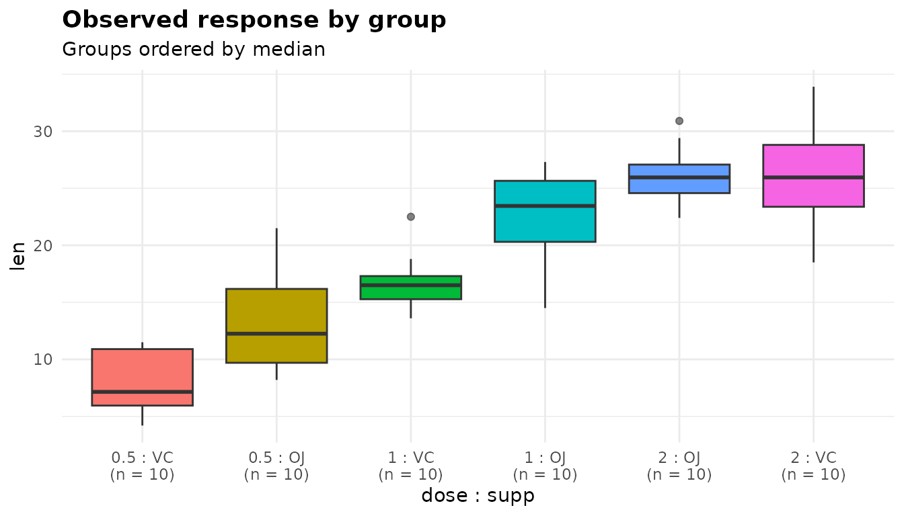
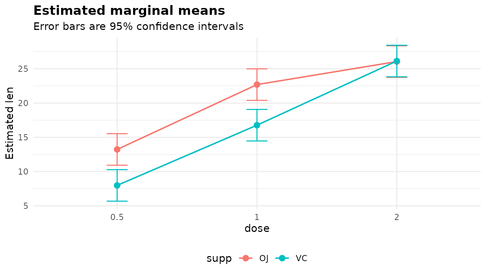
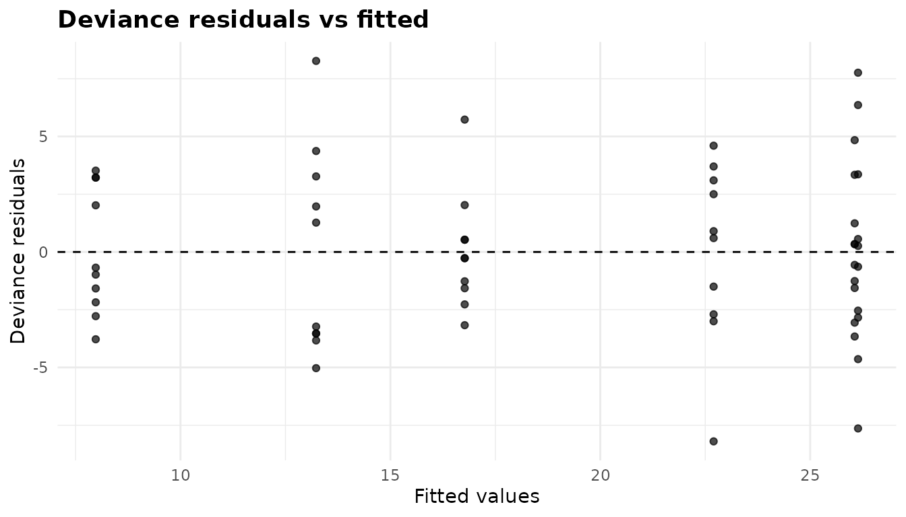
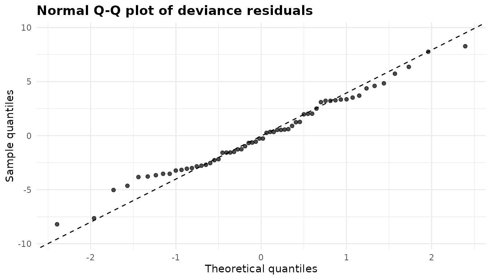
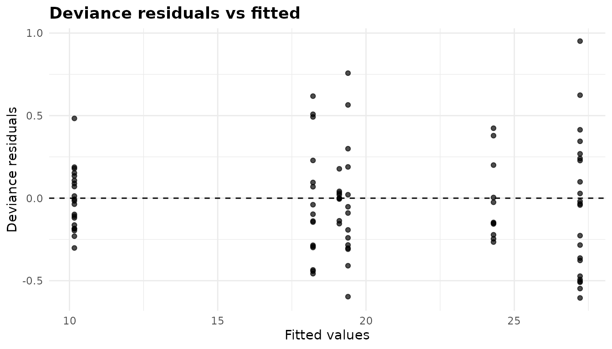
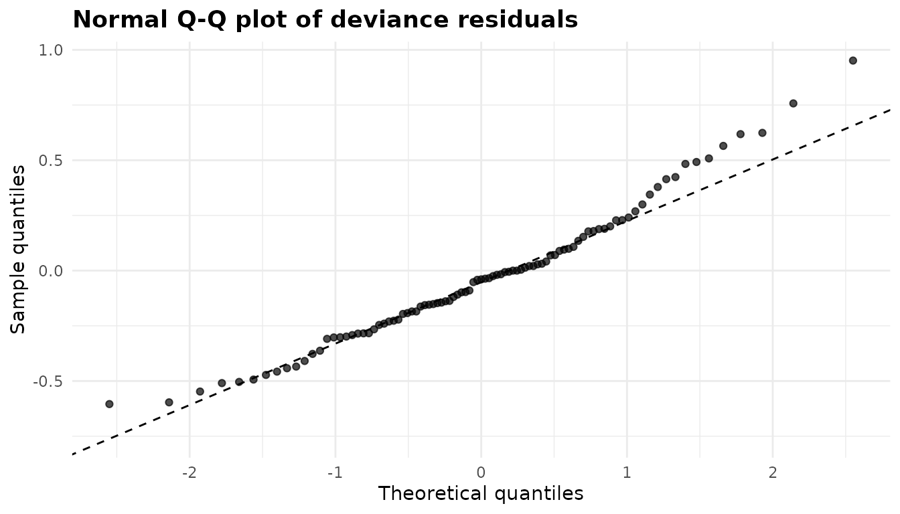
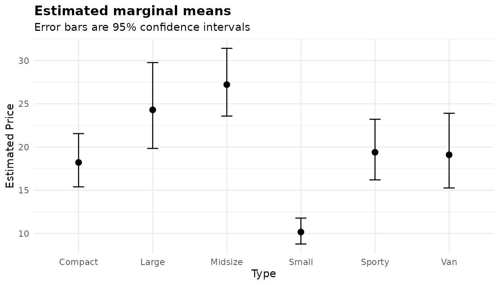

# Analysis of deviance: factorial designs and non-normal responses

``` r

library(anovakit)
```

[`anova_glm()`](https://elkronos.github.io/anovakit/reference/anova_glm.md)
fits a generalised linear model of a response on one or more grouping
factors, in any `family`, and reports an analysis-of-deviance table,
effect sizes, estimated marginal means and pairwise comparisons. With
the default Gaussian family it is an ordinary factorial analysis of
variance. Other families model responses whose spread changes with their
mean. It is the general tool. For a one-way comparison of means with
unequal variances,
[`anova_welch()`](https://elkronos.github.io/anovakit/reference/anova_welch.md)
is better calibrated
([walkthrough](https://elkronos.github.io/anovakit/articles/welch.md)).
For 0/1 outcomes use
[`anova_bin()`](https://elkronos.github.io/anovakit/reference/anova_bin.md)
([walkthrough](https://elkronos.github.io/anovakit/articles/binary.md)),
and for counts use
[`anova_count()`](https://elkronos.github.io/anovakit/reference/anova_count.md)
([walkthrough](https://elkronos.github.io/anovakit/articles/counts.md)):
both add diagnostics and effect sizes that this function does not. To
adjust for a numeric covariate use
[`anova_ancova()`](https://elkronos.github.io/anovakit/reference/anova_ancova.md)
([walkthrough](https://elkronos.github.io/anovakit/articles/ancova.md)).

## The data

`ToothGrowth` records the length of odontoblasts (the cells responsible
for tooth growth) in 60 guinea pigs. Each animal received vitamin C at
one of three doses (0.5, 1 or 2 mg/day) by one of two delivery methods:
orange juice (`OJ`) or ascorbic acid (`VC`). `dose` is stored as a
number, so make it a factor: it is a grouping variable here, with three
levels.

``` r

tg <- ToothGrowth
tg$dose <- factor(tg$dose)
head(tg)
#>    len supp dose
#> 1  4.2   VC  0.5
#> 2 11.5   VC  0.5
#> 3  7.3   VC  0.5
#> 4  5.8   VC  0.5
#> 5  6.4   VC  0.5
#> 6 10.0   VC  0.5
table(tg$supp, tg$dose)
#>     
#>      0.5  1  2
#>   OJ  10 10 10
#>   VC  10 10 10
round(tapply(tg$len, list(tg$supp, tg$dose), mean), 2)
#>      0.5     1     2
#> OJ 13.23 22.70 26.06
#> VC  7.98 16.77 26.14
```

This is a balanced 2 x 3 factorial design with ten animals per cell. The
interesting question is not just whether dose and supplement matter, but
whether the effect of the supplement depends on the dose. The cell means
suggest it does: orange juice is ahead at the two lower doses, but not
at 2 mg/day.

## Fitting the model

Columns are named as character strings. With `interaction = TRUE` the
model contains both factors and their interaction. Listing `dose` first
puts it on the x axis of the marginal-means plot.

``` r

fit <- anova_glm(tg, "len", c("dose", "supp"), interaction = TRUE)
fit
#> Analysis of deviance (gaussian family, identity link, Type II) 
#> --------------------------------------------------------------
#> Call: anova_glm(data = tg, response = "len", groups = c("dose", "supp"), interaction = TRUE)
#> Observations used: 60
#> 
#> Omnibus test (Type II, F)
#>        term sum_sq df statistic   p_value
#> 1      dose 2426.0  2    92.000 < 2.2e-16
#> 2      supp  205.4  1    15.570 0.0002312
#> 3 dose:supp  108.3  2     4.107 0.0218603
#> 4 Residuals  712.1 54        NA        NA
#> 
#> Plots available: box, residuals, qq, emmeans
#>   (use plot(x, which = "box"))
```

Reading the printout from the top:

- The first line names the family, the link and the type of sums of
  squares. A Gaussian family with the identity link is an ordinary
  linear model.
- `Call:` records how the fit was made, and `Observations used: 60` says
  no rows were dropped.
- The heading `Omnibus test (Type II, F)` names the type of sums of
  squares and the test statistic. Both change what the numbers mean, and
  neither can be read off the table itself.
- There is no `Notes` block, because nothing needed saying. See [What
  the notes say](#what-the-notes-say).
- `Plots available` lists the four plots in `$plots`.

`summary(fit)` adds the assumption checks (the dispersion and the
coefficient table), the effect sizes, the marginal means and the
pairwise comparisons.

## The omnibus test

``` r

fit$anova
#>        term   sum_sq df statistic      p_value
#> 1      dose 2426.434  2 91.999965 4.046291e-18
#> 2      supp  205.350  1 15.571979 2.311828e-04
#> 3 dose:supp  108.319  2  4.106991 2.186027e-02
#> 4 Residuals  712.106 54        NA           NA
```

- `term` names the effect. `dose:supp` is the interaction.
- `sum_sq` and `df` are the sum of squares and degrees of freedom of
  each term. The `Residuals` row holds the error sum of squares and its
  degrees of freedom.
- `statistic` is the F statistic, the term’s mean square divided by the
  residual mean square.
- `p_value` is its p-value.

The interaction is significant (F = 4.11, p = 0.022): the supplement
effect is not the same at every dose. When an interaction is present, a
main-effect row averages over a pattern that changes, so read the cell
means below rather than the main effects alone.

### Type II or Type III

With `type = "II"` (the default) each main effect is tested after the
other main effect, but not after the interaction. With `type = "III"`
every term is tested after every other, interaction included. In a
balanced design like this one the two coincide:

``` r

fit3 <- anova_glm(tg, "len", c("dose", "supp"), interaction = TRUE,
                  type = "III", plots = FALSE)
fit3$anova
#>        term   sum_sq df statistic      p_value
#> 1      dose 2426.434  2 91.999965 4.046291e-18
#> 2      supp  205.350  1 15.571979 2.311828e-04
#> 3 dose:supp  108.319  2  4.106991 2.186027e-02
#> 4 Residuals  712.106 54        NA           NA
```

They part company when the cells are unequal. Suppose four animals had
been lost from the `VC`, 2 mg cell and two from the `OJ`, 0.5 mg cell:

``` r

lost <- c(which(tg$supp == "VC" & tg$dose == "2")[1:4],
          which(tg$supp == "OJ" & tg$dose == "0.5")[1:2])
tg_u <- tg[-lost, ]
table(tg_u$supp, tg_u$dose)
#>     
#>      0.5  1  2
#>   OJ   8 10 10
#>   VC  10 10  6
anova_glm(tg_u, "len", c("dose", "supp"), interaction = TRUE,
          plots = FALSE)$anova
#>        term     sum_sq df statistic      p_value
#> 1      dose 2173.01135  2 104.36382 3.330016e-18
#> 2      supp  154.03314  1  14.79559 3.529409e-04
#> 3 dose:supp   93.14518  2   4.47351 1.653811e-02
#> 4 Residuals  499.71600 48        NA           NA
anova_glm(tg_u, "len", c("dose", "supp"), interaction = TRUE,
          type = "III", plots = FALSE)$anova
#>        term     sum_sq df statistic      p_value
#> 1      dose 2249.45726  2 108.03531 1.692417e-18
#> 2      supp  125.31484  1  12.03706 1.111881e-03
#> 3 dose:supp   93.14518  2   4.47351 1.653811e-02
#> 4 Residuals  499.71600 48        NA           NA
```

The interaction row is the same in both, because it is adjusted for
everything either way. The main-effect rows differ. Type II is the more
powerful test of a main effect when there is no interaction. Type III
tests each main effect averaged over the levels of the other factor,
weighting each cell equally. Some analysts prefer that when an
interaction is present, since it does not depend on the cell sizes.

**Why Type III is fitted under sum-to-zero contrasts.** A Type III test
of `supp` removes the columns that code `supp` while keeping the
interaction. What that tests depends on how the factors are coded. Under
R’s default treatment contrasts, the `supp` columns describe the
supplement effect at the reference dose only, and the “Type III” row for
`supp` becomes a test of the supplement at 0.5 mg/day. Under sum-to-zero
contrasts it is the supplement effect averaged over the doses, which is
what a main effect is supposed to be. So when you ask for
`type = "III"`,
[`anova_glm()`](https://elkronos.github.io/anovakit/reference/anova_glm.md)
fits the model under `contr.sum`. Setting `options(contrasts = )`
afterwards would not help, because the contrasts are stored on the
fitted model. Here is what you would get by fitting with the defaults
and asking [`car::Anova()`](https://rdrr.io/pkg/car/man/Anova.html) for
Type III:

``` r

naive <- glm(len ~ dose * supp, data = tg)    # treatment contrasts
naive_tab <- car::Anova(naive, type = 3, test.statistic = "F")
naive_tab
#> Analysis of Deviance Table (Type III tests)
#> 
#> Response: len
#> Error estimate based on Pearson residuals 
#> 
#>           Sum Sq Df F values    Pr(>F)    
#> dose      885.26  2   33.565 3.363e-10 ***
#> supp      137.81  1   10.450  0.002092 ** 
#> dose:supp 108.32  2    4.107  0.021860 *  
#> Residuals 712.11 54                       
#> ---
#> Signif. codes:  0 '***' 0.001 '**' 0.01 '*' 0.05 '.' 0.1 ' ' 1
unlist(fit3$model$contrasts)
#>        dose        supp 
#> "contr.sum" "contr.sum"
```

The `supp` row has F = 10.45, the test of the supplement at the
reference dose, not the F = 15.57 of the averaged main effect. The data
are the same, and the table carries the same label. The contrasts stored
on `fit3$model` show how
[`anova_glm()`](https://elkronos.github.io/anovakit/reference/anova_glm.md)
avoids this.

## Effect sizes

For a Gaussian model `$effect_sizes` holds partial eta squared and
partial omega squared for each term, computed from the sums of squares
of the table above:

``` r

fit$effect_sizes
#>        term df   sum_sq partial_eta_sq partial_omega_sq
#> 1      dose  2 2426.434      0.7731092       0.75206604
#> 2      supp  1  205.350      0.2238254       0.19540824
#> 3 dose:supp  2  108.319      0.1320279       0.09384698
```

- `partial_eta_sq` is the term’s sum of squares divided by itself plus
  the residual sum of squares: the share of the variance not explained
  by the other terms that this term explains. Dose accounts for 77% of
  it.
- `partial_omega_sq` is the same idea with a correction for the upward
  bias of eta squared in samples, so it is a little smaller. A negative
  value is floored at 0, with a note.

Both are *partial*: they do not add up to 1 across terms, and they
should not be read as a partition of the total variance.

## Marginal means and comparisons

Because the model contains the interaction, the estimated marginal means
are for the six cells. For a Gaussian model with the identity link they
are the cell means, with intervals that use the pooled residual
variance:

``` r

fit$emmeans
#>   dose supp estimate       se df  conf_low conf_high
#> 1  0.5   OJ    13.23 1.148353 54 10.927691  15.53231
#> 2    1   OJ    22.70 1.148353 54 20.397691  25.00231
#> 3    2   OJ    26.06 1.148353 54 23.757691  28.36231
#> 4  0.5   VC     7.98 1.148353 54  5.677691  10.28231
#> 5    1   VC    16.77 1.148353 54 14.467691  19.07231
#> 6    2   VC    26.14 1.148353 54 23.837691  28.44231
```

`$posthoc` compares every pair of cells, 15 in all, with a Tukey
adjustment by default. The three comparisons of the supplements at the
same dose are:

``` r

same_dose <- c("dose0.5 OJ - dose0.5 VC", "dose1 OJ - dose1 VC",
               "dose2 OJ - dose2 VC")
ph <- fit$posthoc
print(ph[ph$contrast %in% same_dose, ], digits = 3)
#>                   contrast estimate   se df conf_low conf_high statistic
#> 3  dose0.5 OJ - dose0.5 VC     5.25 1.62 54    0.452     10.05    3.2327
#> 8      dose1 OJ - dose1 VC     5.93 1.62 54    1.132     10.73    3.6514
#> 12     dose2 OJ - dose2 VC    -0.08 1.62 54   -4.878      4.72   -0.0493
#>    p_value p_adjusted adjustment
#> 3  0.00209    0.02425      tukey
#> 8  0.00059    0.00739      tukey
#> 12 0.96089    1.00000      tukey
```

`estimate` is the first cell minus the second. `conf_low` and
`conf_high` are Tukey-adjusted (simultaneous) intervals. `p_value` is
unadjusted, and `p_adjusted` is adjusted across all 15 comparisons.
Orange juice gives longer odontoblasts than ascorbic acid at 0.5 and 1
mg/day, and the two are indistinguishable at 2 mg/day.

If only those three comparisons interest you, adjusting for all 15 is
more conservative than it needs to be. `$emmeans_object` is the
**emmeans** grid, so you can ask for exactly the family you want. It
carries **emmeans**’ own default level, so give `level =` explicitly:

``` r

by_dose <- emmeans::contrast(fit$emmeans_object, method = "pairwise",
                             by = "dose")
summary(by_dose, infer = TRUE, level = 0.95)
#> dose = 0.5:
#>  contrast estimate   SE df lower.CL upper.CL t.ratio p.value
#>  OJ - VC      5.25 1.62 54     1.99     8.51   3.233  0.0021
#> 
#> dose = 1:
#>  contrast estimate   SE df lower.CL upper.CL t.ratio p.value
#>  OJ - VC      5.93 1.62 54     2.67     9.19   3.651  0.0006
#> 
#> dose = 2:
#>  contrast estimate   SE df lower.CL upper.CL t.ratio p.value
#>  OJ - VC     -0.08 1.62 54    -3.34     3.18  -0.049  0.9609
#> 
#> Degrees-of-freedom method: user-specified 
#> Confidence level used: 0.95
```

With one comparison per dose there is nothing to adjust within each
family. The [results
article](https://elkronos.github.io/anovakit/articles/results.md) covers
`$emmeans_object` further.

## Checking assumptions

A Gaussian model assumes independent observations, normally distributed
errors and the same error variance in every cell. `$assumptions` holds
two elements, and the residual plots in the next section do the rest.

``` r

fit$assumptions$dispersion
#> [1] 13.18715
sqrt(fit$assumptions$dispersion)
#> [1] 3.631411
```

`dispersion` is the Pearson dispersion: the sum of squared Pearson
residuals divided by the residual degrees of freedom. For a Gaussian
model that is the residual mean square, so its square root, 3.63, is the
residual standard deviation in the units of the response.

``` r

fit$assumptions$coefficients
#>           term estimate       se  statistic      p_value distribution
#> 1  (Intercept)    13.23 1.148353 11.5208468 3.602548e-16            t
#> 2        dose1     9.47 1.624017  5.8312215 3.175641e-07            t
#> 3        dose2    12.83 1.624017  7.9001660 1.429712e-10            t
#> 4       suppVC    -5.25 1.624017 -3.2327258 2.092470e-03            t
#> 5 dose1:suppVC    -0.68 2.296706 -0.2960762 7.683076e-01            t
#> 6 dose2:suppVC     5.33 2.296706  2.3207148 2.410826e-02            t
#>     conf_low conf_high ci_method
#> 1 10.9276907 15.532309   profile
#> 2  6.2140429 12.725957   profile
#> 3  9.5740429 16.085957   profile
#> 4 -8.5059571 -1.994043   profile
#> 5 -5.2846186  3.924619   profile
#> 6  0.7253814  9.934619   profile
```

`coefficients` is the coefficient table, with t statistics (the
dispersion is estimated) and profile-likelihood intervals by default,
which for a Gaussian model equal `confint(lm())`. Under the default
treatment contrasts the intercept is the mean of the reference cell (0.5
mg/day, orange juice), and the other coefficients are differences from
it. `fit3`, fitted under sum-to-zero contrasts, has different
coefficients describing the same fitted values. There the intercept is
the average of the six cell means, `dose1` is the average for 0.5 mg/day
minus that grand mean, and `supp1` is the average for orange juice minus
it:

``` r

fit3$assumptions$coefficients[, c("term", "estimate")]
#>          term   estimate
#> 1 (Intercept) 18.8133333
#> 2       dose1 -8.2083333
#> 3       dose2  0.9216667
#> 4       supp1  1.8500000
#> 5 dose1:supp1  0.7750000
#> 6 dose2:supp1  1.1150000
mean(fit$emmeans$estimate)
#> [1] 18.81333
```

There is no formal normality test. Read the Q-Q plot below. For equal
variances, compare the cell standard deviations:

``` r

cell_sd <- tapply(tg$len, list(tg$supp, tg$dose), sd)
round(cell_sd, 2)
#>     0.5    1    2
#> OJ 4.46 3.91 2.66
#> VC 2.75 2.52 4.80
```

They range from 2.52 to 4.80, so the largest cell variance is 3.64 times
the smallest. With equal cell sizes of ten, a balanced design tolerates
that well. If the variances differed badly, you could use
heteroskedasticity-consistent standard errors (`vcov_type`, below) or,
for a one-way design,
[`anova_welch()`](https://elkronos.github.io/anovakit/reference/anova_welch.md).
The [diagnostics
article](https://elkronos.github.io/anovakit/articles/diagnostics.md)
covers the checks across the package.

## Plots

``` r

plot(fit, "box")
```



The `box` plot shows the observed response in each cell, ordered by
median and labelled with its size. Use it to see the raw data behind the
means: spreads, skewness and outliers.

``` r

plot(fit, "emmeans")
```



The `emmeans` plot shows the estimated marginal means with their 95%
intervals. The first grouping factor is on the x axis and the second
sets the colour, one line per supplement. Lines that are not parallel
are the interaction: the gap between the supplements closes at 2 mg/day.

``` r

plot(fit, "residuals")
```



The `residuals` plot shows deviance residuals (for a Gaussian model,
ordinary residuals) against fitted values. The points fall in vertical
stripes, one per cell mean. The two 2 mg/day cells have almost the same
mean, so their stripes overlap at about 26. Look for stripes of clearly
different heights (unequal variances) or a funnel that widens with the
fitted value (a variance that grows with the mean, which suggests
another family). Here the heights vary somewhat, as the cell standard
deviations did, but there is no funnel.

``` r

plot(fit, "qq")
```



The `qq` plot compares the deviance residuals with a normal
distribution. Points close to the dashed line support the normal-errors
assumption, and systematic curvature at the ends suggests skewness or
heavy tails. Here the points follow the line well. The lower tail is a
little shorter than a normal one, a mild departure for a balanced design
with 60 observations.

All four are **ggplot2** objects that you can modify with `+`. See
[Plots and visual
customisation](https://elkronos.github.io/anovakit/articles/visuals.md).

## A non-Gaussian family: Gamma

### The data

[`MASS::Cars93`](https://rdrr.io/pkg/MASS/man/Cars93.html) lists 93 car
models on sale in the US in 1993. Their `Price` (in thousands of
dollars) is positive and right-skewed, and within each `Type` of car the
spread grows with the typical price:

``` r

cars <- MASS::Cars93[, c("Manufacturer", "Model", "Type", "Price")]
price <- split(cars$Price, cars$Type)
round(t(sapply(price, function(x) c(n = length(x), median = median(x),
                                     mean = mean(x), sd = sd(x),
                                     cv = sd(x) / mean(x)))), 2)
#>          n median  mean    sd   cv
#> Compact 16  16.15 18.21  6.69 0.37
#> Large   11  20.90 24.30  6.34 0.26
#> Midsize 22  26.20 27.22 12.26 0.45
#> Small   21  10.00 10.17  1.95 0.19
#> Sporty  14  16.80 19.39  7.97 0.41
#> Van      9  19.10 19.10  1.88 0.10
```

A Gaussian model assumes the same standard deviation in every group. It
is about 2 for small cars and about 12 for midsize ones. A Gamma family
assumes instead that the standard deviation is proportional to the mean:
a constant coefficient of variation (`cv`). The `cv` column shows that
fits better, though not perfectly (vans are unusually uniform). A log
link makes the group effects multiplicative, so comparisons come out as
ratios of means.

### Fitting and the omnibus test

``` r

gam <- anova_glm(cars, "Price", "Type", family = Gamma(link = "log"))
gam
#> Analysis of deviance (Gamma family, log link, Type II) 
#> ------------------------------------------------------
#> Call: anova_glm(data = cars, response = "Price", groups = "Type", family = Gamma(link = "log"))
#> Observations used: 93
#> 
#> Omnibus test (Type II, F)
#>        term sum_sq df statistic   p_value
#> 1      Type  10.65  5     18.56 1.663e-12
#> 2 Residuals   9.98 87        NA        NA
#> 
#> Notes
#>   - McFadden's pseudo R squared is not reported (NA): the log-likelihood of a Gamma family is a log density, which shifts with the units of the response, so the ratio has no unit-free meaning. The deviance explained does not depend on the units and is reported instead.
#> 
#> Plots available: box, residuals, qq, emmeans
#>   (use plot(x, which = "box"))
```

`family` accepts a family object, as here, a family function, or a name
such as `"Gamma"`. The name alone gives the Gamma family’s default
inverse link, which is rarely what you want for group comparisons (see
[below](#the-link-decides-what-a-comparison-is)).

**`test_statistic`.** By default the test is chosen after fitting. A
family that estimates its dispersion, like the Gaussian and the Gamma,
gets an F test, and a family whose dispersion is fixed at 1 (binomial,
Poisson) gets a likelihood-ratio test. In the F table of a non-Gaussian
family the `sum_sq` column holds deviances, as the
[`anova_glm()`](https://elkronos.github.io/anovakit/reference/anova_glm.md)
help page explains. The `Type` row is the drop in deviance when `Type`
is added. The `Residuals` row is the Pearson chi-squared statistic, and
dividing it by its degrees of freedom gives the dispersion. F is the
ratio of the two per degree of freedom:

``` r

a <- gam$anova
(a$sum_sq[1] / a$df[1]) / (a$sum_sq[2] / a$df[2])
#> [1] 18.56058
```

You can ask for the likelihood-ratio or Wald statistic instead. The
columns come in the same order whatever the statistic, and only an F
table has `sum_sq` and a `Residuals` row:

``` r

for (ts in c("LR", "Wald")) {
  g <- anova_glm(cars, "Price", "Type", family = Gamma(link = "log"),
                 test_statistic = ts, plots = FALSE)
  cat("\n", attr(g$anova, "statistic"), "\n", sep = "")
  print(g$anova)
}
#> 
#> likelihood-ratio chi-square
#>   term df statistic      p_value
#> 1 Type  5   92.8029 1.730729e-18
#> 
#> Wald chi-square
#>   term df statistic      p_value
#> 1 Type  5  101.7011 2.314394e-20
```

The likelihood-ratio statistic is the deviance drop divided by the
estimated dispersion, referred to a chi-squared distribution. That
ignores the uncertainty in the dispersion estimate, which the F test
allows for, so for a family that estimates its dispersion F is the
better default. The Wald test is built from the coefficients and their
covariance matrix. It is the only one of the three that can use a robust
covariance (see [`vcov_type`](#vcov_type-robust-standard-errors)). Here
all three agree that the car types differ.

### Effect sizes

``` r

gam$effect_sizes
#>              measure estimate
#> 1 deviance_explained 0.542735
#> 2        mcfadden_r2       NA
```

For a non-Gaussian family there are no sums of squares, so the effect
size is the `deviance_explained`: 1 minus the residual deviance over the
null deviance. Car type explains 54% of the deviance. McFadden’s pseudo
R squared is reported only for the binomial, Poisson and negative
binomial families. For a Gamma model it is `NA`, and the note in the
printout explains why.

### The coefficient table and `ci_method`

``` r

co <- gam$assumptions$coefficients
co
#>          term    estimate         se  statistic      p_value distribution
#> 1 (Intercept)  2.90210817 0.08467429 34.2737820 2.652780e-52            t
#> 2   TypeLarge  0.28836818 0.13265912  2.1737532 3.243991e-02            t
#> 3 TypeMidsize  0.40177703 0.11128382  3.6103814 5.103876e-04            t
#> 4   TypeSmall -0.58299378 0.11239391 -5.1870584 1.377488e-06            t
#> 5  TypeSporty  0.06279664 0.12395047  0.5066269 6.136982e-01            t
#> 6     TypeVan  0.04758016 0.14112382  0.3371519 7.368144e-01            t
#>     conf_low  conf_high ci_method
#> 1  2.7384042  3.0752703   profile
#> 2  0.0264585  0.5545836   profile
#> 3  0.1790690  0.6219030   profile
#> 4 -0.8077507 -0.3604911   profile
#> 5 -0.1832054  0.3101515   profile
#> 6 -0.2297083  0.3322378   profile
```

The coefficients are on the log scale. The intercept is the log of the
mean price of the reference type, `Compact`, and each other coefficient
is the log of a ratio to it: small cars cost exp(-0.583) = 0.56 times as
much as compact ones on average. The `distribution` column says the
tests use t, because the dispersion is estimated.

`ci_method = "profile"` (the default) gives profile-likelihood
intervals, cut at t quantiles so that they agree with the t tests beside
them. `ci_method = "wald"` gives estimate ± t × SE:

``` r

wald <- anova_glm(cars, "Price", "Type", family = Gamma(link = "log"),
                  ci_method = "wald", plots = FALSE)$assumptions$coefficients
cbind(co[, c("term", "estimate")],
      profile = co[, c("conf_low", "conf_high")],
      wald = wald[, c("conf_low", "conf_high")])
#>          term    estimate profile.conf_low profile.conf_high wald.conf_low
#> 1 (Intercept)  2.90210817        2.7384042         3.0752703    2.73380885
#> 2   TypeLarge  0.28836818        0.0264585         0.5545836    0.02469382
#> 3 TypeMidsize  0.40177703        0.1790690         0.6219030    0.18058839
#> 4   TypeSmall -0.58299378       -0.8077507        -0.3604911   -0.80638884
#> 5  TypeSporty  0.06279664       -0.1832054         0.3101515   -0.18356834
#> 6     TypeVan  0.04758016       -0.2297083         0.3322378   -0.23291870
#>   wald.conf_high
#> 1      3.0704075
#> 2      0.5520425
#> 3      0.6229657
#> 4     -0.3595987
#> 5      0.3091616
#> 6      0.3280790
```

The two differ in the third decimal place here. Profile intervals follow
the shape of the likelihood, which matters more in small samples or near
a boundary. Wald intervals are symmetric on the log scale. Exponentiate
either to get an interval for the ratio.

### Dispersion

``` r

gam$assumptions$dispersion
#> [1] 0.1147158
sqrt(gam$assumptions$dispersion)
#> [1] 0.3386972
```

For a Gamma family the dispersion is the squared coefficient of
variation. The model therefore puts the standard deviation of prices at
about 34% of the mean in every car type. The observed values above range
from 10% (vans) to 45% (midsize cars), so the constant-CV assumption is
only roughly true. The [`vcov_type`](#vcov_type-robust-standard-errors)
section shows how to make the comparisons robust to that.

### `$model_stats` and `$family`

``` r

str(gam$model_stats)
#> List of 5
#>  $ AIC              : num 595
#>  $ BIC              : num 613
#>  $ null_deviance    : num 19.6
#>  $ residual_deviance: num 8.97
#>  $ df_residual      : int 87
gam$family
#> 
#> Family: Gamma 
#> Link function: log
```

`$model_stats` holds the AIC, BIC, null and residual deviances and
residual degrees of freedom. `$family` is the family object actually
used. Because the Gaussian and Gamma fits are full likelihoods for the
same response, their AICs can be compared directly:

``` r

gau <- anova_glm(cars, "Price", "Type", plots = FALSE)
c(gaussian = gau$model_stats$AIC, gamma = gam$model_stats$AIC)
#> gaussian    gamma 
#> 651.4658 594.8847
```

The Gamma model is much better supported.

### Marginal means on the response scale

``` r

gam$emmeans
#>      Type estimate        se df  conf_low conf_high
#> 1 Compact 18.21250 1.5421305 87 15.391399  21.55068
#> 2   Large 24.30000 2.4815412 87 19.836025  29.76856
#> 3 Midsize 27.21818 1.9654379 87 23.579061  31.41895
#> 4   Small 10.16667 0.7514161 87  8.777667  11.77546
#> 5  Sporty 19.39286 1.7554535 87 16.199579  23.21560
#> 6     Van 19.10000 2.1563719 87 15.260827  23.90499
```

The marginal means are on the response scale, in thousands of dollars.
In a one-factor model they are the group means. Their intervals are
computed on the log scale and back-transformed, so they are not
symmetric about the estimate.

With a log link, a pairwise comparison is a **ratio** of means, in a
column called `ratio`, tested against a null value of 1:

``` r

gph <- gam$posthoc
print(gph[gph$p_adjusted < 0.05,
          c("contrast", "ratio", "conf_low", "conf_high", "p_adjusted")],
      digits = 3)
#>             contrast ratio conf_low conf_high p_adjusted
#> 2  Compact / Midsize 0.669    0.484     0.925   6.57e-03
#> 3    Compact / Small 1.791    1.291     2.486   2.00e-05
#> 7      Large / Small 2.390    1.655     3.451   1.16e-08
#> 10   Midsize / Small 2.677    1.981     3.618   3.09e-10
#> 11  Midsize / Sporty 1.404    1.002     1.967   4.83e-02
#> 13    Small / Sporty 0.524    0.373     0.737   4.94e-06
#> 14       Small / Van 0.532    0.359     0.789   1.53e-04
```

Those are the comparisons that survive Tukey’s adjustment. Midsize cars,
for example, average 2.68 times the price of small ones.

### The link decides what a comparison is

With the log link comparisons are ratios, and with the logit link they
are odds ratios. With any other non-identity link they are differences
between the means on the response scale, and `$notes` says so. The Gamma
family’s default link is the inverse:

``` r

inv <- anova_glm(cars, "Price", "Type", family = "Gamma", plots = FALSE)
inv$method
#> [1] "Analysis of deviance (Gamma family, inverse link, Type II)"
inv$notes[grepl("link", inv$notes)]
#> [1] "With the inverse link the pairwise comparisons are differences between the marginal means on the response scale; only log and logit links give ratios."
head(inv$posthoc[, c("contrast", "estimate", "conf_low", "conf_high")], 3)
#>            contrast  estimate   conf_low conf_high
#> 1   Compact - Large -6.087500 -14.601888  2.426888
#> 2 Compact - Midsize -9.005682 -16.286022 -1.725342
#> 3   Compact - Small  8.045833   3.046632 13.045035
```

### Plots for the Gamma fit

``` r

plot(gam, "residuals")
```



If the variance really is proportional to the mean squared, the deviance
residuals of a Gamma model have roughly the same spread at every fitted
value. Here the stripes differ in height. Two sit side by side at about
19: vans (19.1) on the left and sporty cars (19.4) on the right. The
vans’ stripe is by far the shortest, because their prices vary much less
than the model assumes. The midsize stripe, at about 27, is the tallest.

``` r

plot(gam, "qq")
```



The deviance residuals of a Gamma model are approximately normal when
the model fits. Here the middle follows the line and the upper tail
rises above it: a few cars are dearer than a Gamma distribution with
this dispersion would suggest. `gam$model` is an ordinary `glm`, so you
can find them directly:

``` r

res <- residuals(gam$model, type = "deviance")
head(cars[order(res, decreasing = TRUE), ], 3)
#>     Manufacturer    Model    Type Price
#> 59 Mercedes-Benz     300E Midsize  61.9
#> 19     Chevrolet Corvette  Sporty  38.0
#> 48      Infiniti      Q45 Midsize  47.9
```

``` r

plot(gam, "emmeans")
```



The `emmeans` plot shows the means on the response scale, with their
asymmetric intervals. `Type` has no natural order, so the points are not
joined by a line. Lines appear only across a second grouping factor, as
in the ToothGrowth plot, or along an ordered factor on the x axis.
`plot(gam, "box")` shows the raw prices by type, as for the Gaussian
fit.

## Options worth knowing

### `vcov_type`: robust standard errors

`vcov_type` takes an HC type (`"HC0"` to `"HC4"`) from the **sandwich**
package. The robust covariance does not rely on the family’s variance
function, so it protects the marginal means and comparisons when that
function is wrong, as the vans suggest it is here:

``` r

rob <- anova_glm(cars, "Price", "Type", family = Gamma(link = "log"),
                 vcov_type = "HC3", plots = FALSE)
cbind(rob$emmeans[, "Type", drop = FALSE],
      se_model = gam$emmeans$se, se_HC3 = rob$emmeans$se)
#>      Type  se_model    se_HC3
#> 1 Compact 1.5421305 1.7265476
#> 2   Large 2.4815412 2.0040958
#> 3 Midsize 1.9654379 2.6764077
#> 4   Small 0.7514161 0.4367684
#> 5  Sporty 1.7554535 2.2117883
#> 6     Van 2.1563719 0.6640312
rob$notes
#> [1] "The omnibus F test compares deviances, so it rests on the model-based variance; the robust (HC3) covariance is used only by the coefficient table, the marginal means and the comparisons. For an omnibus test that uses it, set test_statistic = \"Wald\"."              
#> [2] "McFadden's pseudo R squared is not reported (NA): the log-likelihood of a Gamma family is a log density, which shifts with the units of the response, so the ratio has no unit-free meaning. The deviance explained does not depend on the units and is reported instead."
#> [3] "Robust standard errors (HC3) were requested, so the coefficient intervals are Wald intervals built from them; profile-likelihood intervals cannot use a sandwich covariance."
```

The standard error for vans shrinks and the one for midsize cars grows:
each now reflects that type’s own spread. The notes spell out where the
robust covariance is used. It goes into the coefficient table (with Wald
intervals, since profile intervals cannot use it), the marginal means
and the comparisons. The omnibus F test compares deviances and cannot
use it. To make the omnibus test robust too, set
`test_statistic = "Wald"`:

``` r

anova_glm(cars, "Price", "Type", family = Gamma(link = "log"),
          vcov_type = "HC3", test_statistic = "Wald", plots = FALSE)$anova
#>   term df statistic      p_value
#> 1 Type  5  195.7549 2.298221e-40
```

### `weights`

`weights` names a column of prior weights. It is given as a column name,
not a vector, so the weights are subsetted with the data and cannot
misalign when a row is dropped. A natural use with the Gamma family is a
response that is itself an average. The mean of m prices has variance
φμ²/m, so its prior weight is m. Suppose you had only the average price
per manufacturer and type, with the number of models behind each
average:

``` r

agg <- aggregate(Price ~ Manufacturer + Type, data = cars, FUN = mean)
agg$n_models <- aggregate(Price ~ Manufacturer + Type, data = cars,
                          FUN = length)$Price
nrow(agg)
#> [1] 81
table(agg$n_models)
#> 
#>  1  2 
#> 69 12
```

Weighting each average by its count recovers the means of the full data
exactly. Ignoring the counts does not:

``` r

w_fit <- anova_glm(agg, "Price", "Type", family = Gamma(link = "log"),
                   weights = "n_models", plots = FALSE)
u_fit <- anova_glm(agg, "Price", "Type", family = Gamma(link = "log"),
                   plots = FALSE)
data.frame(Type = gam$emmeans$Type, full_data = gam$emmeans$estimate,
           weighted = w_fit$emmeans$estimate,
           unweighted = u_fit$emmeans$estimate)
#>      Type full_data weighted unweighted
#> 1 Compact  18.21250 18.21250   18.60000
#> 2   Large  24.30000 24.30000   24.50500
#> 3 Midsize  27.21818 27.21818   27.31000
#> 4   Small  10.16667 10.16667   10.36875
#> 5  Sporty  19.39286 19.39286   19.16667
#> 6     Van  19.10000 19.10000   19.43125
```

The standard errors differ slightly from the full-data fit, because the
dispersion is now estimated from 81 averages rather than 93 cars.

A row with a weight of zero contributes nothing to the fit, so it is
dropped before fitting, counted in `$n_removed` and named in `$notes`:

``` r

agg0 <- agg
agg0$n_models[1] <- 0
z_fit <- anova_glm(agg0, "Price", "Type", family = Gamma(link = "log"),
                   weights = "n_models", plots = FALSE)
z_fit$n_removed
#> [1] 1
z_fit$notes[1]
#> [1] "Dropped 1 row(s) whose weight in `n_models` is zero: they contribute nothing to the fit, and keeping them would make row counts, robust standard errors and information criteria disagree with it."
```

### `interaction`

The default, `interaction = FALSE`, fits the grouping factors
additively. The marginal means and comparisons are then reported for
each factor on its own, averaged over the others, with a `term` column
saying which, and each factor’s comparisons form their own multiplicity
family:

``` r

add <- anova_glm(tg, "len", c("dose", "supp"), plots = FALSE)
add$emmeans
#>   term dose supp estimate        se df  conf_low conf_high
#> 1 dose  0.5 <NA> 10.60500 0.8558752 56  8.890476  12.31952
#> 2 dose    1 <NA> 19.73500 0.8558752 56 18.020476  21.44952
#> 3 dose    2 <NA> 26.10000 0.8558752 56 24.385476  27.81452
#> 4 supp <NA>   OJ 20.66333 0.6988192 56 19.263430  22.06324
#> 5 supp <NA>   VC 16.96333 0.6988192 56 15.563430  18.36324
add$notes
#> [1] "The grouping factors enter the model additively, so $emmeans and $posthoc are reported for each factor separately, averaged over the others (column `term`), and each factor's comparisons are a separate multiplicity family. Set interaction = TRUE to compare cells instead."
```

`interaction = TRUE` fits the full factorial. With three or more factors
a whole number sets the highest order of interaction: `interaction = 2`
keeps the two-way interactions and drops the rest.

### `adjust` and `conf_level`

`adjust` is applied by **emmeans** and accepts `"tukey"` (the default),
`"sidak"`, `"scheffe"`, `"dunnettx"`, `"bonferroni"`, `"holm"`,
`"hochberg"`, `"hommel"`, `"BH"`, `"BY"`, `"fdr"` or `"none"`. A
step-down method such as Holm cannot be turned into intervals, so
**emmeans** uses Bonferroni intervals beside Holm p-values, and `$notes`
says so:

``` r

holm <- anova_glm(tg, "len", c("dose", "supp"), interaction = TRUE,
                  adjust = "holm", plots = FALSE)
holm$notes
#> [1] "The comparison intervals use the bonferroni adjustment while the p-values use holm: emmeans cannot turn holm into intervals."
```

`conf_level` sets the level of every interval: the coefficient table,
the marginal means and the comparisons.

## What the notes say

``` r

fit$notes
#> character(0)
gam$notes
#> [1] "McFadden's pseudo R squared is not reported (NA): the log-likelihood of a Gamma family is a log density, which shifts with the units of the response, so the ratio has no unit-free meaning. The deviance explained does not depend on the units and is reported instead."
```

The ToothGrowth fit has no notes. No rows were dropped, the model is far
from saturated, nothing failed to compute, and the Gaussian family has
partial eta squared to report. The Gamma fit has one, explaining why
McFadden’s pseudo R squared is `NA`. Other notes you have seen above:
the robust covariance and where it is used, the per-factor reporting of
an additive model, Bonferroni intervals beside Holm p-values, and
differences rather than ratios under the inverse link. Read `$notes` on
every fit.

## Reporting the result

Write-ups built from the fits with inline R, so the numbers cannot drift
from the analysis:

> A two-way analysis of variance (Type II) found that odontoblast length
> depended on the dose of vitamin C, F(2, 54) = 92.00, p \< 0.001,
> partial η² = 0.77, and on the supplement, F(1, 54) = 15.57, p \<
> 0.001, with an interaction between them, F(2, 54) = 4.11, p = 0.022.
> Orange juice produced longer odontoblasts than ascorbic acid at 0.5
> mg/day (difference 5.25, Tukey-adjusted p = 0.024) and 1 mg/day (5.93,
> adjusted p = 0.007), but not at 2 mg/day (-0.08, adjusted p = 1.000).

> In a Gamma model with a log link, car prices differed by type, F(5,
> 87) = 18.56, p \< 0.001, with type explaining 54% of the deviance.
> Midsize cars cost 2.68 times as much as small cars on average (95% CI
> 1.98 to 3.62, Tukey-adjusted).

For a model on a non-identity link, say which family and link you used,
and report comparisons in the form they take on it: ratios for a log
link.

## See also

- [`anova_bin()`](https://elkronos.github.io/anovakit/reference/anova_bin.md)
  ([walkthrough](https://elkronos.github.io/anovakit/articles/binary.md))
  and
  [`anova_count()`](https://elkronos.github.io/anovakit/reference/anova_count.md)
  ([walkthrough](https://elkronos.github.io/anovakit/articles/counts.md))
  for binary and count responses.
- [`anova_ancova()`](https://elkronos.github.io/anovakit/reference/anova_ancova.md)
  ([walkthrough](https://elkronos.github.io/anovakit/articles/ancova.md))
  to add a numeric covariate.
- [`anova_welch()`](https://elkronos.github.io/anovakit/reference/anova_welch.md)
  ([walkthrough](https://elkronos.github.io/anovakit/articles/welch.md))
  for a one-way comparison of means with unequal variances.
- [Working with
  results](https://elkronos.github.io/anovakit/articles/results.md) for
  the fit object, `$emmeans_object` and reporting.
- [Diagnostics across the
  package](https://elkronos.github.io/anovakit/articles/diagnostics.md)
  and [Plots and visual
  customisation](https://elkronos.github.io/anovakit/articles/visuals.md).
- The [Get Started
  vignette](https://elkronos.github.io/anovakit/articles/anovakit.md)
  for a tour of every function.
