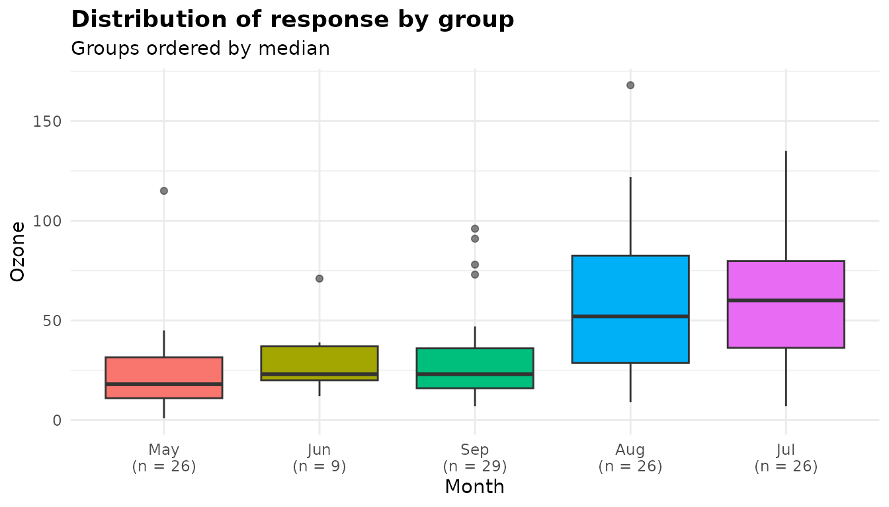
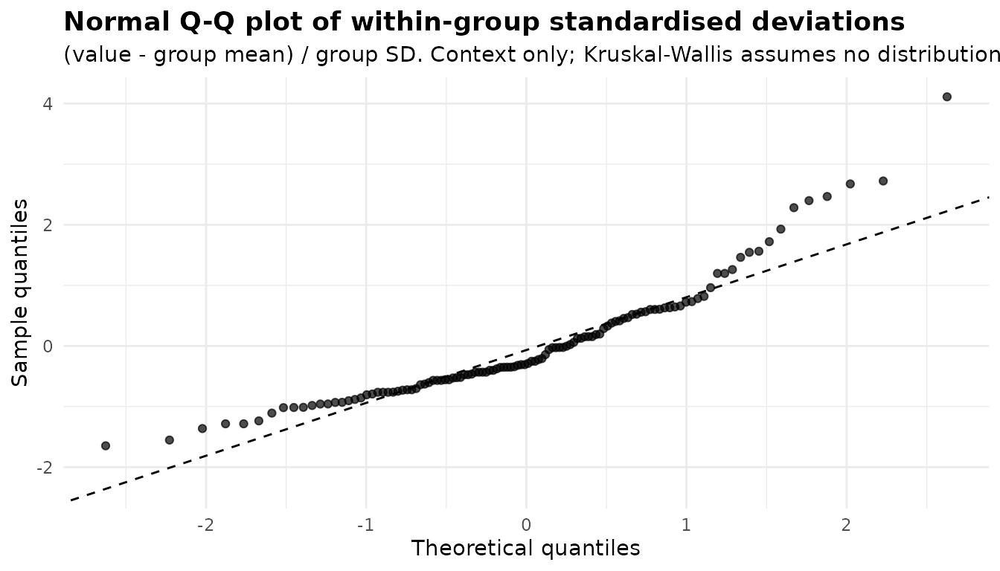
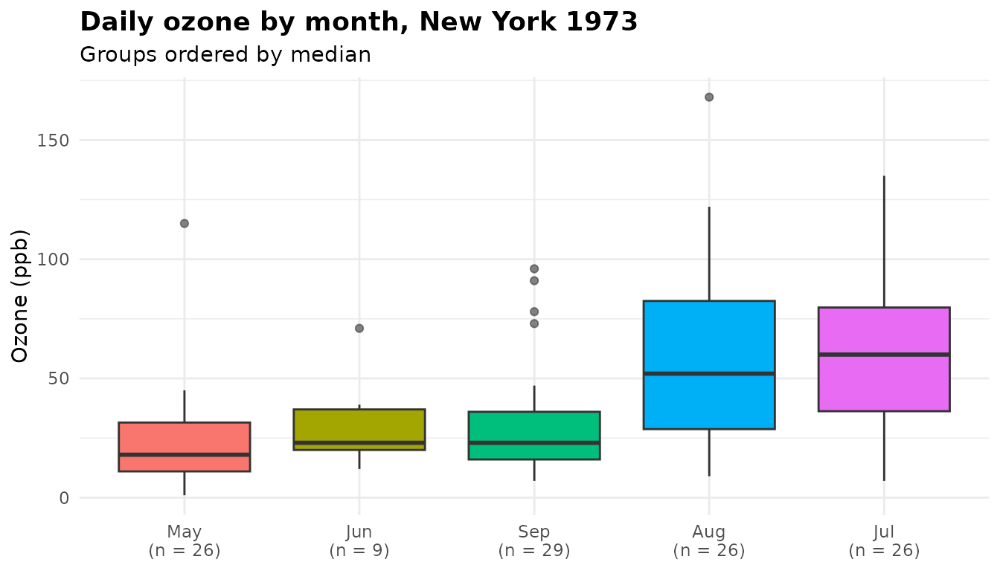
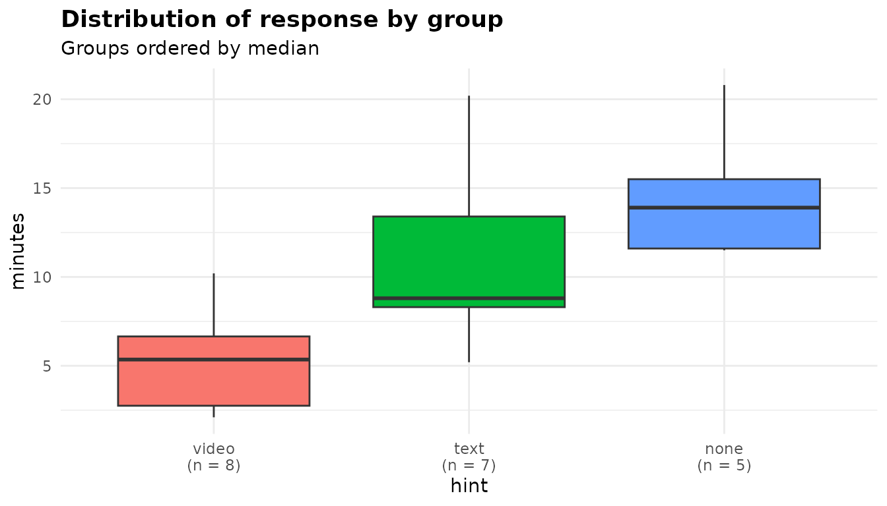

# Kruskal-Wallis: comparing groups by ranks

``` r

library(anovakit)
```

[`anova_kw()`](https://elkronos.github.io/anovakit/reference/anova_kw.md)
compares a numeric response across groups using ranks rather than the
values themselves: the Kruskal-Wallis test across all groups, then
Dunn’s pairwise comparisons. Because only the order of the values
matters, it suits responses that are skewed, have outliers, are measured
on a coarse or ordinal scale, or include values that are known only to
be “more extreme than everything else”. It asks whether values in some
groups tend to rank higher than in others. That is not a test of means,
and it is a test of medians only when the groups’ distributions have the
same shape. When the means are the question, use
[`anova_welch()`](https://elkronos.github.io/anovakit/reference/anova_welch.md)
([walkthrough](https://elkronos.github.io/anovakit/articles/welch.md)).
The [decision
guide](https://elkronos.github.io/anovakit/articles/choosing.md) covers
the choice in more detail.

## The data

`airquality` holds daily air-quality readings from New York between May
and September 1973. The response here is `Ozone`, the mean ozone
concentration in parts per billion. The month is stored as a number, so
give it readable labels first. A factor keeps its level order, so the
months stay in calendar order.

``` r

aq <- airquality
aq$Month <- factor(month.abb[aq$Month], levels = month.abb[5:9])
head(aq[, c("Ozone", "Month", "Day")])
#>   Ozone Month Day
#> 1    41   May   1
#> 2    36   May   2
#> 3    12   May   3
#> 4    18   May   4
#> 5    NA   May   5
#> 6    28   May   6

oz <- split(aq$Ozone, aq$Month)
round(t(sapply(oz, function(x) c(days = length(x), missing = sum(is.na(x)),
                                  median = median(x, na.rm = TRUE),
                                  mean = mean(x, na.rm = TRUE),
                                  max = max(x, na.rm = TRUE)))), 1)
#>     days missing median mean max
#> May   31       5     18 23.6 115
#> Jun   30      21     23 29.4  71
#> Jul   31       5     60 59.1 135
#> Aug   31       5     52 60.0 168
#> Sep   30       1     23 31.4  96
```

Two features make a rank analysis attractive. The readings are
right-skewed: in four of the five months the mean is above the median,
and in every month the largest reading is more than twice the median.
And 37 of the 153 days have no reading, 21 of them in June, so the
groups are unequal in size.

## Fitting the model

Columns are named as character strings: the response, then one or more
grouping columns.

``` r

kw <- anova_kw(aq, "Ozone", "Month")
kw
#> Kruskal-Wallis rank sum test 
#> ----------------------------
#> Call: anova_kw(data = aq, response = "Ozone", groups = "Month")
#> Observations used: 116  (37 input row(s) not in $data_used; see $notes)
#> 
#> Omnibus test
#>    term statistic df   p_value
#> 1 Month     29.27  4 6.901e-06
#> 
#> Notes
#>   - Dropped 37 row(s) with missing values in: Ozone, Month.
#> 
#> Plots available: box
#>   (use plot(x, which = "box"))
```

Reading the printout from the top:

- The first line names the method, and `Call:` records how the fit was
  made.
- `Observations used: 116` counts the rows analysed. The 37 rows with no
  ozone reading were dropped, and the printout points to `$notes` for
  the details.
- `Omnibus test` is the Kruskal-Wallis test, described in the next
  section.
- `Notes` says what was dropped and why.
- `Plots available` lists what is in `$plots`: only the box plot, unless
  you ask for the optional diagnostics.

Only the analysed columns count towards missingness. `Solar.R` also has
missing values, but it was not part of the analysis, so it removed
nothing:

``` r

kw$n_removed
#> [1] 37
nrow(kw$data_used) + kw$n_removed == nrow(aq)
#> [1] TRUE
```

`summary(kw)` prints the same header followed by the effect sizes, the
group summaries and Dunn’s comparisons. The sections below take them one
at a time.

## The omnibus test

``` r

kw$anova
#>    term statistic df      p_value
#> 1 Month  29.26658  4 6.900714e-06
```

- `term` is the grouping column (or a label for the combined cells when
  there are several; see [below](#several-grouping-columns)).
- `statistic` is the Kruskal-Wallis H. All 116 values are ranked
  together, and H measures how far each month’s mean rank lies from the
  overall mean rank, weighted by the month’s size. It includes the
  correction for tied values.
- `df` is the number of groups minus one. H is referred to a chi-squared
  distribution on these degrees of freedom.
- `p_value` is the probability of an H at least this large if all five
  months shared one distribution of ozone.

The test is
[`stats::kruskal.test()`](https://rdrr.io/r/stats/kruskal.test.html),
and its `htest` object is kept in `$model`. Here it agrees with calling
[`kruskal.test()`](https://rdrr.io/r/stats/kruskal.test.html) directly:

``` r

kruskal.test(Ozone ~ Month, data = aq)$statistic
#> Kruskal-Wallis chi-squared 
#>                   29.26658
```

([`anova_kw()`](https://elkronos.github.io/anovakit/reference/anova_kw.md)
passes [`kruskal.test()`](https://rdrr.io/r/stats/kruskal.test.html) the
ranks rather than the raw values, so that ties are counted exactly as
they were ranked. The two can differ slightly only when the data contain
values that differ by floating-point error alone; see
[below](#values-that-differ-only-by-rounding-error).)

The mean ranks differ between months far more than chance would produce
(p \< 0.001). The test does not say which months differ. That is what
Dunn’s comparisons are for.

## Effect sizes

``` r

kw$effect_sizes
#>           measure  estimate
#> 1 epsilon_squared 0.2544920
#> 2   eta_squared_H 0.2276268
```

With H the tie-corrected statistic, n observations and k groups:

- `epsilon_squared` is H / (n - 1). It is exactly the proportion of the
  variance of the ranks that lies between groups: the R² of a one-way
  analysis of variance on the ranks. You can check that:

  ``` r

  summary(lm(rank(Ozone) ~ Month, data = kw$data_used))$r.squared
  #> [1] 0.254492
  ```

- `eta_squared_H` is (H - k + 1) / (n - k), a bias-adjusted version that
  subtracts what k groups would produce by chance. A negative value is
  reported as 0, with a note.

Take care with the names, which follow Tomczak and Tomczak (2014) and
the **effectsize** package. Here epsilon squared is the unadjusted
measure and therefore never smaller than eta squared, which is the
reverse of what the same two names mean in a parametric analysis.
Whichever you report, name it.

About 25% of the variation in the ranks of the ozone readings lies
between months. No interval is reported for either measure.

## Group summaries and Dunn’s comparisons

No model is fitted, so `$emmeans` holds plain group summaries:

``` r

print(kw$emmeans, digits = 3)
#>   group  n median mean_rank mean   sd   se conf_low conf_high
#> 1   May 26     18      36.7 23.6 22.2 4.36     14.6      32.6
#> 2   Jun  9     23      48.7 29.4 18.2 6.07     15.4      43.4
#> 3   Jul 26     60      77.9 59.1 31.6 6.20     46.3      71.9
#> 4   Aug 26     52      75.2 60.0 39.7 7.78     43.9      76.0
#> 5   Sep 29     23      48.7 31.4 24.1 4.48     22.3      40.6
```

The `mean_rank` column is the quantity Dunn’s comparisons are built
from. The `median` is usually the more useful summary to report
alongside them. The `mean`, `sd` and the t interval for the mean
(`conf_low`, `conf_high`) are there for reference. They describe the raw
values, and play no part in the test.

`$posthoc` holds Dunn’s comparisons, one row per pair of months:

``` r

print(kw$posthoc, digits = 3)
#>    group1 group2 mean_rank_diff        z  p_value p_adjusted adjustment
#> 1     May    Jun       -12.0299 -0.92516 3.55e-01   4.44e-01         BH
#> 2     May    Jul       -41.2115 -4.41947 9.89e-06   9.89e-05         BH
#> 3     May    Aug       -38.5385 -4.13281 3.58e-05   1.79e-04         BH
#> 4     May    Sep       -11.9973 -1.32120 1.86e-01   2.66e-01         BH
#> 5     Jun    Jul       -29.1816 -2.24421 2.48e-02   4.96e-02         BH
#> 6     Jun    Aug       -26.5085 -2.03864 4.15e-02   6.91e-02         BH
#> 7     Jun    Sep         0.0326  0.00254 9.98e-01   9.98e-01         BH
#> 8     Jul    Aug         2.6731  0.28666 7.74e-01   8.60e-01         BH
#> 9     Jul    Sep        29.2142  3.21720 1.29e-03   4.31e-03         BH
#> 10    Aug    Sep        26.5411  2.92283 3.47e-03   8.67e-03         BH
```

- `mean_rank_diff` is the mean rank of `group1` minus that of `group2`.
- `z` is that difference divided by its standard error, so it has the
  same sign.
- `p_value` is the two-sided p-value from the normal distribution,
  unadjusted.
- `p_adjusted` is adjusted by the method in `adjustment`:
  Benjamini-Hochberg (`"BH"`) by default.

Dunn’s test uses the ranks from the single joint ranking of all 116
observations. It does not re-rank each pair, so it is not the same as
running a Wilcoxon rank-sum test on each pair: the comparisons use the
same ranking as the omnibus test. `rstatix::dunn_test()` reports the
same comparisons as `group2` minus `group1`, so its statistics have the
opposite sign.

### The tie correction

Ozone was recorded in whole parts per billion, so many days share a
value, and tied values share their average rank. Ties reduce the
variance of the ranks, and Dunn’s standard error allows for it. For
groups i and j,

``` math
\mathrm{SE}_{ij} = \sqrt{\left(\frac{N(N+1)}{12} -
  \frac{\sum_t (t^3 - t)}{12(N-1)}\right)\left(\frac{1}{n_i} +
  \frac{1}{n_j}\right)},
```

where the sum runs over the sets of tied values and t is the size of
each set. Reproducing the May against July comparison by hand:

``` r

d <- kw$data_used
N <- nrow(d)
r <- rank(d$Ozone)
t_sizes <- table(r)                     # one entry per distinct value
tie_term <- sum(t_sizes^3 - t_sizes) / (12 * (N - 1))
c(tied_values = sum(t_sizes > 1), untied = N * (N + 1) / 12,
  tie_term = tie_term)
#>  tied_values       untied     tie_term 
#>   27.0000000 1131.0000000    0.5782609

rbar <- tapply(r, d$Month, mean)
n <- table(d$Month)
se <- sqrt((N * (N + 1) / 12 - tie_term) * (1 / n[["May"]] + 1 / n[["Jul"]]))
(rbar[["May"]] - rbar[["Jul"]]) / se
#> [1] -4.419471
```

That matches the `z` for May against July in `$posthoc`. Here 27
distinct values are shared by two or more days, but the correction is
small against the untied variance, so it barely changes any comparison.
It matters more when a few values account for much of the data, as with
ratings on a five-point scale.

### Reading the comparisons

July and August both rank well above May (both adjusted p \< 0.001) and
above September (adjusted p = 0.004 and 0.009). July and August do not
differ from each other (adjusted p = 0.860), and neither do May, June
and September. June sits between: its difference from July is just
inside 5% after adjustment (0.0496), and from August just outside
(0.0691). With only 9 June readings, the June comparisons are the least
precise in the table.

### Choosing `adjust`

The default, Benjamini-Hochberg, controls the false discovery rate:
among the comparisons you call significant, the expected proportion of
false ones. That suits the usual follow-up question “which of these
pairs differ?” When you need control of the chance of even one false
positive (the family-wise error rate), use `"holm"`, which is uniformly
more powerful than `"bonferroni"`. Any
[`stats::p.adjust()`](https://rdrr.io/r/stats/p.adjust.html) method is
accepted, spelled out in full. `"tukey"` is not: Dunn’s test is a
comparison of ranks, not a linear contrast.

``` r

adj <- sapply(c("BH", "holm", "bonferroni", "none"), function(a)
  anova_kw(aq, "Ozone", "Month", adjust = a, plots = FALSE)$posthoc$p_adjusted)
cbind(ph[, c("group1", "group2")], signif(adj, 3))
#>    group1 group2       BH     holm bonferroni     none
#> 1     May    Jun 4.44e-01 1.00e+00   1.00e+00 3.55e-01
#> 2     May    Jul 9.89e-05 9.89e-05   9.89e-05 9.89e-06
#> 3     May    Aug 1.79e-04 3.23e-04   3.58e-04 3.58e-05
#> 4     May    Sep 2.66e-01 7.46e-01   1.00e+00 1.86e-01
#> 5     Jun    Jul 4.96e-02 1.49e-01   2.48e-01 2.48e-02
#> 6     Jun    Aug 6.91e-02 2.07e-01   4.15e-01 4.15e-02
#> 7     Jun    Sep 9.98e-01 1.00e+00   1.00e+00 9.98e-01
#> 8     Jul    Aug 8.60e-01 1.00e+00   1.00e+00 7.74e-01
#> 9     Jul    Sep 4.31e-03 1.04e-02   1.29e-02 1.29e-03
#> 10    Aug    Sep 8.67e-03 2.43e-02   3.47e-02 3.47e-03
```

Only `p_adjusted` changes. Under Holm, the June against July comparison
no longer passes at 5% (0.1489), while the comparisons of July and
August with May and September all still do.

## Checking assumptions

Kruskal-Wallis assumes no particular distribution, so `$assumptions` is
empty by default:

``` r

kw$assumptions
#> list()
```

The test does rest on two things no diagnostic in the fit checks. The
first is that the observations are independent. Daily readings are not:
a high-ozone day tends to be followed by another.

``` r

# Each day's reading against the next day's, within the same month
o <- aq$Ozone
same_month <- aq$Month[-1] == aq$Month[-nrow(aq)]
lag1 <- cor(o[-1][same_month], o[-nrow(aq)][same_month],
            use = "complete.obs")
lag1
#> [1] 0.5434821
```

With a day-to-day correlation of 0.54, the 116 readings carry less
independent information than their number suggests, so treat the
p-values here as somewhat optimistic. The second is that if you want to
read a difference as a shift in the median, the groups’ distributions
need similar shapes. The box plot below is the place to judge that.

With `diagnostics = TRUE` the function adds a per-group Shapiro-Wilk
table in `$assumptions$normality`, a Q-Q plot in `$plots$qq`, and a
note:

``` r

kwd <- anova_kw(aq, "Ozone", "Month", diagnostics = TRUE)
kwd$assumptions$normality
#>   group  n statistic      p_value note
#> 1   May 26 0.7140084 8.293832e-06 <NA>
#> 2   Jun  9 0.8432751 6.280014e-02 <NA>
#> 3   Jul 26 0.9796718 8.668861e-01 <NA>
#> 4   Aug 26 0.9327912 9.032475e-02 <NA>
#> 5   Sep 29 0.7837315 4.325436e-05 <NA>
kwd$notes
#> [1] "Dropped 37 row(s) with missing values in: Ozone, Month."                                                                      
#> [2] "The normality diagnostics are contextual only. Kruskal-Wallis does not assume normality and the test does not depend on them."
names(kwd$plots)
#> [1] "box" "qq"
```

As the note says, these are context only: nothing in the test depends on
them. They can help you explain why you chose a rank test. Here May and
September are clearly non-normal, which is the kind of evidence that
argues against comparing means with
[`anova_welch()`](https://elkronos.github.io/anovakit/reference/anova_welch.md).
The [diagnostics
article](https://elkronos.github.io/anovakit/articles/diagnostics.md)
covers the checks across the whole package.

## Plots

``` r

plot(kw, "box")
```



The `box` plot is always built. It shows the distribution of each group,
ordered by median and labelled with its size. What to look for:

- **Where the groups sit.** July and August sit clearly above the other
  three months, the pattern Dunn’s comparisons found (with the June
  comparisons the least certain).
- **Shape.** In most months the upper whisker is longer than the lower
  one, and May, June, September and August each have at least one high
  outlier. That long upper tail is what pulls the means above the
  medians.
- **Spread.** The spreads differ: the boxes for July and August are much
  taller than those for the other three months. So the groups differ in
  more than location, and the result is best read as “ozone tends to be
  higher in July and August” rather than as a statement about medians
  alone.

``` r

plot(kwd, "qq")
```



The `qq` plot appears only with `diagnostics = TRUE`. Each value is
expressed as its deviation from its own group’s mean, divided by its own
group’s standard deviation, and the points are compared with a normal
distribution. Here the upper tail curves well above the dashed line and
the lowest points also sit above it, the pattern of right skew: a long
upper tail and a short lower one. Like the Shapiro-Wilk table, it is
context only.

Both are ordinary **ggplot2** objects that you can modify with `+`:

``` r

plot(kw, "box") +
  ggplot2::labs(title = "Daily ozone by month, New York 1973",
                x = NULL, y = "Ozone (ppb)")
```



See [Plots and visual
customisation](https://elkronos.github.io/anovakit/articles/visuals.md)
for more.

## Infinite values

Missing values are dropped and counted in `$n_removed`, as above.
Infinite values are not. In a rank analysis `Inf` is simply larger than
everything else, which is how you might record, say, a participant who
never completed a task. The small constructed example below records the
minutes taken to solve a puzzle, with three kinds of hint. Anyone who
gave up is recorded as `Inf`:

``` r

puzzle <- data.frame(
  hint = factor(rep(c("none", "text", "video"), each = 8),
                levels = c("none", "text", "video")),
  minutes = c(20.8, Inf, 13.9, 15.5, Inf, 11.5, Inf, 11.6,
              20.2, 8.8, 15.2, Inf, 5.2, 8.1, 8.5, 11.6,
              5.4, 2.1, 2.3, 10.2, 5.3, 2.9, 5.6, 9.8)
)
pz <- anova_kw(puzzle, "minutes", "hint")
pz
#> Kruskal-Wallis rank sum test 
#> ----------------------------
#> Call: anova_kw(data = puzzle, response = "minutes", groups = "hint")
#> Observations used: 24
#> 
#> Omnibus test
#>   term statistic df p_value
#> 1 hint     13.13  2 0.00141
#> 
#> Notes
#>   - 4 infinite value(s) of `minutes` were kept and ranked as the most extreme observations. Group means and standard deviations that involve them are reported as Inf, -Inf or NA; the mean ranks are exact. The box plot does not draw them.
#> 
#> Plots available: box
#>   (use plot(x, which = "box"))
pz$emmeans
#>   group n median mean_rank mean       sd       se conf_low conf_high
#> 1  none 8  18.15    18.625  Inf       NA       NA       NA        NA
#> 2  text 8  10.20    13.000  Inf       NA       NA       NA        NA
#> 3 video 8   5.35     5.875 5.45 3.143701 1.111466   2.8218    8.0782
```

All 24 rows are used. The four people who gave up rank above everyone
who finished, and take a tied rank among themselves. The mean ranks and
medians are exact. A group containing `Inf` has an infinite mean and no
standard deviation, so those columns are reported as `Inf` and `NA`. The
note records that the infinite values were kept and ranked, and that the
box plot does not draw them. A box plot has nowhere to put an infinite
value, so it shows only the finite ones, and its labels count what is
drawn:

``` r

plot(pz, "box")
```



Here the labels read 5 for `none` and 7 for `text`, not 8: the people
who gave up are missing from the picture, although they hold the highest
ranks in the test. The boxes’ medians are those of the finishers only,
so the `none` box sits at 13.9 minutes against a true median of 18.15 in
`$emmeans`. For data like these, read the medians and mean ranks in
`$emmeans` alongside the plot.

A comparison of means has no use for an infinite value.
[`anova_welch()`](https://elkronos.github.io/anovakit/reference/anova_welch.md)
drops those rows, as it does missing ones:

``` r

anova_welch(puzzle, "minutes", "hint", plots = FALSE)$n_removed
#> [1] 4
```

## Options worth knowing

### `conf_level`

`conf_level` affects only the t intervals for the group means in
`$emmeans`. Nothing in the test or in Dunn’s comparisons depends on it:

``` r

k90 <- anova_kw(aq, "Ozone", "Month", conf_level = 0.90, plots = FALSE)
k90$emmeans[, c("group", "mean", "conf_low", "conf_high")]
#>   group     mean conf_low conf_high
#> 1   May 23.61538 16.17033  31.06044
#> 2   Jun 29.44444 18.15829  40.73060
#> 3   Jul 59.11538 48.51757  69.71320
#> 4   Aug 59.96154 46.66857  73.25450
#> 5   Sep 31.44828 23.82207  39.07449
```

### `posthoc`

There are `choose(k, 2)` comparisons, so with many groups you may want
only the omnibus test. The effect sizes come from H, so they are still
reported:

``` r

anova_kw(aq, "Ozone", "Month", posthoc = FALSE, plots = FALSE)$notes
#> [1] "Dropped 37 row(s) with missing values in: Ozone, Month."                                                                                                                           
#> [2] "Pairwise comparisons were not computed (posthoc = FALSE); there would have been 10. $effect_sizes still reports epsilon squared and eta squared, which come from the omnibus test."
```

### Several grouping columns

Given several grouping columns,
[`anova_kw()`](https://elkronos.github.io/anovakit/reference/anova_kw.md)
combines them into one factor of the level combinations that contain
data, and runs one test across those cells. `warpbreaks` has two wools
at three tensions:

``` r

wk <- anova_kw(warpbreaks, "breaks", c("wool", "tension"), plots = FALSE)
wk$anova
#>                   term statistic df     p_value
#> 1 wool x tension cells  15.77799  5 0.007507339
wk$notes
#> [1] "The 2 grouping variables were combined into 6 cells and tested with a single omnibus Kruskal-Wallis test. This cannot separate main effects or test an interaction; for that, use a Scheirer-Ray-Hare or aligned-rank-transform analysis."
```

The test compares the six cells. As the note says, it cannot separate a
wool effect from a tension effect or test their interaction.

### Values that differ only by rounding error

Values are ranked exactly as stored. Two numbers that should be equal
but were computed differently, such as `0.1 + 0.2` and `0.3`, are
therefore ranked as distinct values, not as a tie. The function looks
for such near-ties and says when it finds them:

``` r

nt <- data.frame(g = rep(c("a", "b"), each = 3),
                 y = c(0.1 + 0.2, 0.2, 0.25, 0.3, 0.9, 1.1))
nt_fit <- anova_kw(nt, "y", "g", plots = FALSE)
nt_fit$notes
#> [1] "Some values of `y` differ only in their last few significant digits (as 0.1 + 0.2 and 0.3 do) and were ranked as distinct values, not as ties. If they are meant to be equal, round the response before the analysis."
c(anova_kw = nt_fit$anova$statistic,
  kruskal.test = unname(kruskal.test(y ~ g, data = nt)$statistic))
#>     anova_kw kruskal.test 
#>     2.333333     2.401961
```

[`kruskal.test()`](https://rdrr.io/r/stats/kruskal.test.html) on the raw
values ranks the two numbers as distinct but counts them as a tie when
it corrects for ties, because it counts ties on the printed values. That
is why its statistic differs slightly from the one
[`anova_kw()`](https://elkronos.github.io/anovakit/reference/anova_kw.md)
reports, which counts ties on the ranks it actually used. If such values
are meant to be equal, round the response before the analysis. They then
become a genuine tie, the note goes away, and the two statistics agree:

``` r

nt$y <- round(nt$y, 10)
nt_round <- anova_kw(nt, "y", "g", plots = FALSE)
nt_round$notes
#> character(0)
c(anova_kw = nt_round$anova$statistic,
  kruskal.test = unname(kruskal.test(y ~ g, data = nt)$statistic))
#>     anova_kw kruskal.test 
#>     3.137255     3.137255
```

## What the notes say

``` r

kw$notes
#> [1] "Dropped 37 row(s) with missing values in: Ozone, Month."
```

For the ozone fit the only note records the 37 rows dropped for missing
values, and names the columns that were checked. Other notes you have
seen above: infinite values kept, the contextual status of the
diagnostics, `posthoc = FALSE`, combined cells, and near-ties. The
function also writes a note when `eta_squared_H` is negative (and
floored at 0) or undefined. Read `$notes` on every fit.

## Reporting the result

A write-up built from the fit with inline R, so the numbers cannot drift
from the analysis:

> Daily ozone concentrations differed between months (Kruskal-Wallis
> H(4) = 29.27, p \< 0.001, ε² = 0.25; n = 116 days with a reading).
> Median ozone was 60 ppb in July and 52 ppb in August, against 18 ppb
> in May and 23 ppb in September. In Dunn’s comparisons with
> Benjamini-Hochberg adjustment, July and August each ranked higher than
> May (both adjusted p \< 0.001) and than September (adjusted p = 0.004
> and 0.009 respectively).

Say which effect size you report (epsilon squared as defined here) and
which adjustment you used. Also say that readings were missing on 37
days, mostly in June.

## See also

- [`anova_welch()`](https://elkronos.github.io/anovakit/reference/anova_welch.md)
  and the [Welch
  walkthrough](https://elkronos.github.io/anovakit/articles/welch.md)
  for comparing means.
- [`anova_glm()`](https://elkronos.github.io/anovakit/reference/anova_glm.md)
  and the [analysis-of-deviance
  walkthrough](https://elkronos.github.io/anovakit/articles/glm.md) for
  a model of a skewed response, with a Gamma family for example.
- [Working with
  results](https://elkronos.github.io/anovakit/articles/results.md) for
  the structure of the returned object and more on reporting.
- [Diagnostics across the
  package](https://elkronos.github.io/anovakit/articles/diagnostics.md)
  and [Plots and visual
  customisation](https://elkronos.github.io/anovakit/articles/visuals.md).
- The [Get Started
  vignette](https://elkronos.github.io/anovakit/articles/anovakit.md)
  for a tour of every function.
