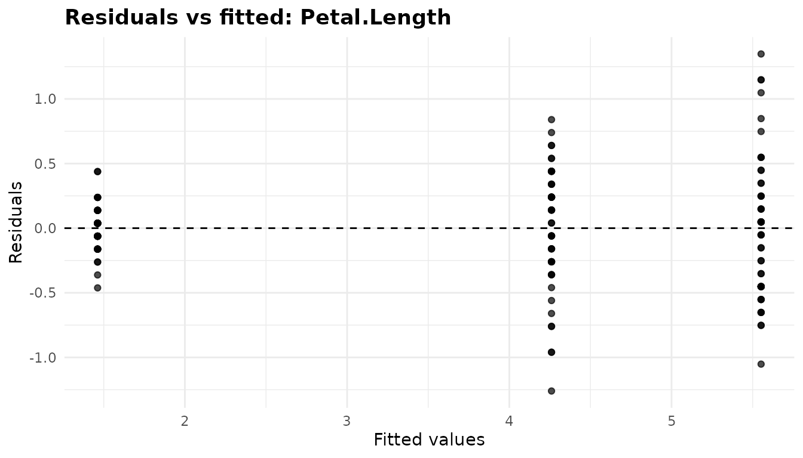
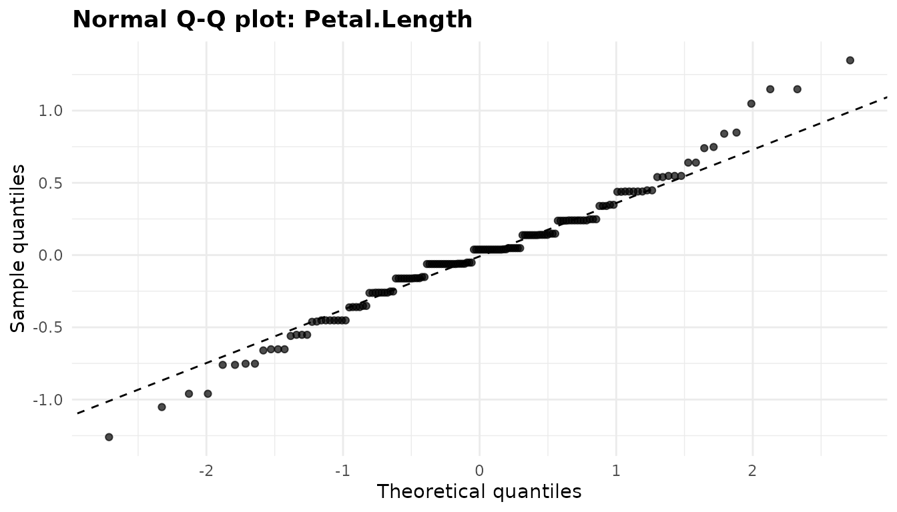
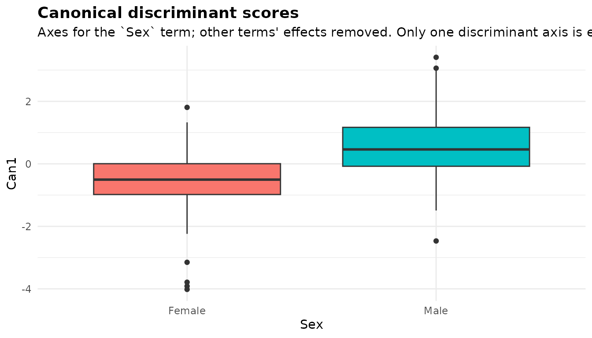
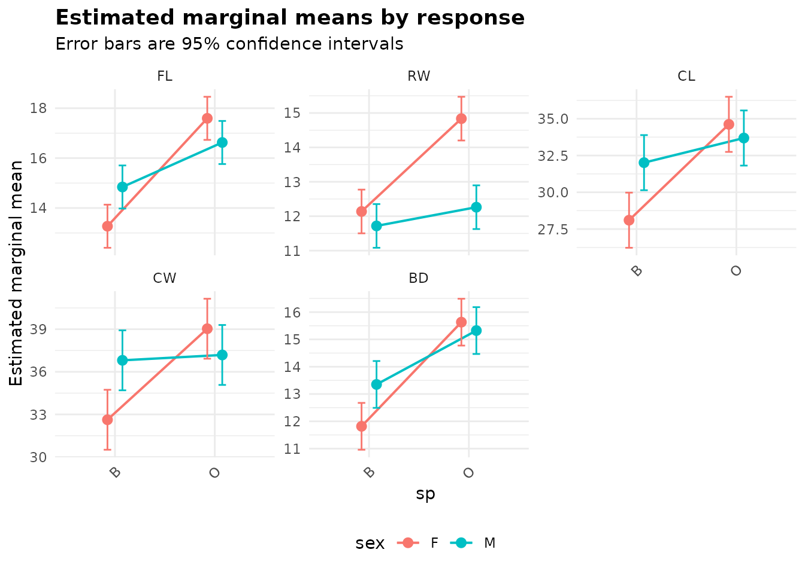
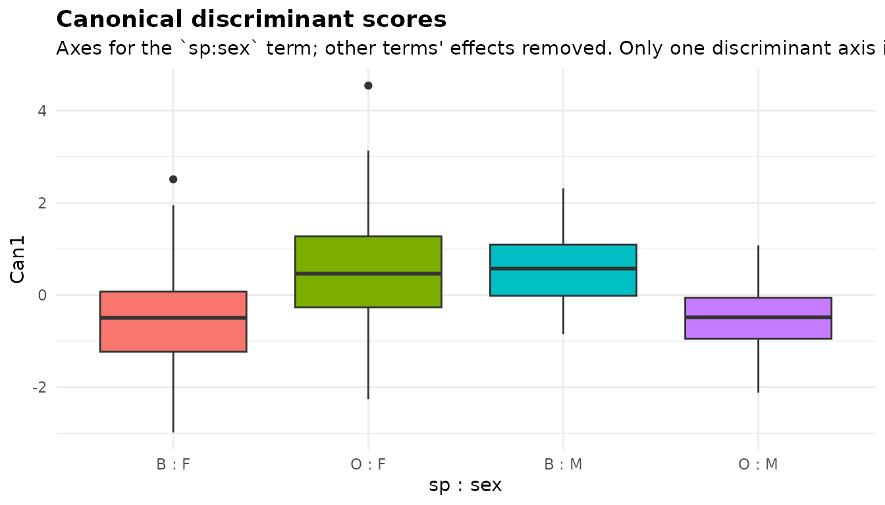

# MANOVA: comparing groups on several responses at once

``` r

library(anovakit)
```

[`anova_manova()`](https://elkronos.github.io/anovakit/reference/anova_manova.md)
compares two or more numeric responses *jointly* across groups. It
reports a multivariate test of each term, follows it up with one ANOVA
per response, and describes how the groups separate with a canonical
discriminant analysis; with covariates it becomes a MANCOVA. Use it when
you have several related measurements on each unit and want one test of
“do the groups differ on these measurements taken together”, or want to
know which combination of them separates the groups. For a single
response use
[`anova_glm()`](https://elkronos.github.io/anovakit/reference/anova_glm.md),
[`anova_welch()`](https://elkronos.github.io/anovakit/reference/anova_welch.md)
or, with a covariate,
[`anova_ancova()`](https://elkronos.github.io/anovakit/reference/anova_ancova.md);
for the same response measured repeatedly on each subject,
[`anova_rm()`](https://elkronos.github.io/anovakit/reference/anova_rm.md).
The [decision
guide](https://elkronos.github.io/anovakit/articles/choosing.md) has
more.

## The data

[`datasets::iris`](https://rdrr.io/r/datasets/iris.html) gives four
measurements, in centimetres, of 50 flowers from each of three species
of iris.

``` r

resp <- c("Sepal.Length", "Sepal.Width", "Petal.Length", "Petal.Width")
head(iris)
#>   Sepal.Length Sepal.Width Petal.Length Petal.Width Species
#> 1          5.1         3.5          1.4         0.2  setosa
#> 2          4.9         3.0          1.4         0.2  setosa
#> 3          4.7         3.2          1.3         0.2  setosa
#> 4          4.6         3.1          1.5         0.2  setosa
#> 5          5.0         3.6          1.4         0.2  setosa
#> 6          5.4         3.9          1.7         0.4  setosa
table(iris$Species)
#> 
#>     setosa versicolor  virginica 
#>         50         50         50
aggregate(. ~ Species, data = iris, FUN = mean)
#>      Species Sepal.Length Sepal.Width Petal.Length Petal.Width
#> 1     setosa        5.006       3.428        1.462       0.246
#> 2 versicolor        5.936       2.770        4.260       1.326
#> 3  virginica        6.588       2.974        5.552       2.026
```

The four measurements are strongly correlated with each other (bigger
flowers are bigger in every direction), so four separate ANOVAs would
test largely the same thing four times. A MANOVA tests them together,
taking the correlations into account.

## Fitting the model

Responses are named as a character vector, then the grouping
variable(s).

``` r

fit <- anova_manova(iris, resp, "Species")
fit
#> Multivariate analysis of variance (Pillai test, Type II) 
#> --------------------------------------------------------
#> Call: anova_manova(data = iris, responses = resp, groups = "Species")
#> Observations used: 150
#> 
#> Omnibus test (Type II, Pillai's trace, approximate F)
#>      term df statistic approx_f num_df den_df   p_value
#> 1 Species  2     1.192    53.47      8    290 < 2.2e-16
#> 
#> Notes
#>   - Mardia's tests reject multivariate normality of the residuals. The multivariate table uses Pillai's trace, the most robust of the four statistics to this.
#>   - Box's M rejects equality of the group covariance matrices. The test is very sensitive to non-normality, so inspect the group covariances before acting on it. With equal group sizes the multivariate tests are fairly robust to unequal covariances, Pillai's trace most of all (it is the statistic used here).
#> 
#> Plots available: residuals_Sepal.Length, qq_Sepal.Length, residuals_Sepal.Width, qq_Sepal.Width, residuals_Petal.Length, qq_Petal.Length, residuals_Petal.Width, qq_Petal.Width, emmeans, canonical
#>   (use plot(x, which = "residuals_Sepal.Length"))
```

Reading the printout:

- The method line names the multivariate statistic (Pillai’s trace, the
  default `test`) and the type of test (Type II, the default `type`).
- `Observations used: 150`: no rows were dropped.
- The table is the multivariate test, one row per term.
- The notes say that Mardia’s tests reject multivariate normality and
  that Box’s M rejects equal covariance matrices. Both are discussed
  [below](#checking-assumptions).
- There are two plots per response (residuals and Q-Q), a marginal-means
  plot and a canonical plot.

`summary(fit)` adds the assumption checks, the effect sizes, marginal
means and comparisons for every response, the canonical axes and each
response’s univariate ANOVA table.

## The multivariate test

``` r

fit$multivariate
#>      term df statistic approx_f num_df den_df      p_value
#> 1 Species  2  1.191899 53.46649      8    290 9.742163e-53
attr(fit$multivariate, "statistic")
#> [1] "Pillai's trace, approximate F"
```

`$multivariate` (the same table as `$anova`) has one row per term:

- `df` is the term’s hypothesis degrees of freedom (a three-level factor
  has 2).
- `statistic` is the multivariate statistic, here Pillai’s trace, which
  lies between 0 and the smaller of the number of responses and `df`.
- `approx_f`, `num_df` and `den_df` are its F approximation, and
  `p_value` the p-value from it.

The tests are computed by
[`car::Manova()`](https://rdrr.io/pkg/car/man/Anova.html) on the
multivariate linear model `lm(cbind(<responses>) ~ <groups>)`, kept in
`$model`. They are Type II by default: each term is adjusted for every
other term that does not contain it, so the result does not depend on
the order of `groups`. `type = "III"` fits under sum-to-zero contrasts
and adjusts each term for all others. With one grouping variable the two
agree, and both agree with `summary(stats::manova())`, which is
sequential and so order-dependent once there are several terms.

Here the species differ overwhelmingly on the four measurements taken
together (Pillai’s trace = 1.192, p far below any threshold).

### Which statistic: `test`

There are four standard multivariate statistics, and `test` chooses one:
`"Pillai"` (the default), `"Wilks"`, `"Hotelling-Lawley"` or `"Roy"`.
They are all functions of the same eigenvalues and usually agree, as
here:

``` r

tests <- c("Pillai", "Wilks", "Hotelling-Lawley", "Roy")
do.call(rbind, lapply(tests, function(t) {
  f <- anova_manova(iris, resp, "Species", test = t, plots = FALSE)
  data.frame(test = t, f$multivariate[, c("statistic", "approx_f", "num_df",
                                          "den_df", "p_value")])
}))
#>               test   statistic   approx_f num_df den_df       p_value
#> 1           Pillai  1.19189883   53.46649      8    290  9.742163e-53
#> 2            Wilks  0.02343863  199.14534      8    288 1.365006e-112
#> 3 Hotelling-Lawley 32.47732024  580.53210      8    286 6.436176e-172
#> 4              Roy 32.19192920 1166.95743      4    145 3.787298e-109
```

They differ in how they behave when the assumptions fail and in which
alternatives they detect best. Pillai’s trace is the most robust to
unequal covariance matrices and non-normality, which is why it is the
default. Roy’s largest root uses only the first eigenvalue: it is the
most powerful when the groups differ along a single direction, but with
more than one hypothesis degree of freedom its F statistic is only an
upper bound, so its p-value is a lower bound, and a note says so:

``` r

roy <- anova_manova(iris, resp, "Species", test = "Roy", plots = FALSE)
roy$notes
#> [1] "For `Species`, Roy's largest root has only an upper bound for its F statistic (the hypothesis has more than one degree of freedom and there are 4 responses), so the reported p-value is a lower bound: it is anti-conservative. Pillai's trace or Wilks' lambda give calibrated p-values."                    
#> [2] "Mardia's tests reject multivariate normality of the residuals. Pillai's trace is the most robust of the four multivariate statistics to this; consider test = \"Pillai\"."                                                                                                                                     
#> [3] "Box's M rejects equality of the group covariance matrices. The test is very sensitive to non-normality, so inspect the group covariances before acting on it. With equal group sizes the multivariate tests are fairly robust to unequal covariances, Pillai's trace most of all (consider test = \"Pillai\")."
roy$test
#> [1] "Roy"
```

## Univariate follow-ups

A significant multivariate test says the groups differ *somewhere* in
the four measurements. The follow-ups say where. One ANOVA (of the same
type as the multivariate test) is fitted per response and kept under
`$univariate`, each with its own model, table, effect sizes, marginal
means, emmeans grid and comparisons:

``` r

names(fit$univariate)
#> [1] "Sepal.Length" "Sepal.Width"  "Petal.Length" "Petal.Width"
names(fit$univariate$Sepal.Width)
#> [1] "model"          "anova"          "effect_sizes"   "emmeans"       
#> [5] "emmeans_object" "posthoc"
fit$univariate$Sepal.Width$anova
#>        term   sum_sq  df statistic      p_value
#> 1   Species 11.34493   2  49.16004 4.492017e-17
#> 2 Residuals 16.96200 147        NA           NA
```

The univariate p-values are *not* adjusted across responses, and they
are reported whether or not the multivariate test is significant. When a
term’s multivariate test is not significant at the 0.05 level, a note
says that its follow-ups are not protected by it. Treat a small
univariate p-value there as a lead, not a finding.

## Effect sizes

`$effect_sizes` stacks the partial eta squared and partial omega squared
of every term in every response’s ANOVA, with a `response` column:

``` r

fit$effect_sizes
#>       response    term df    sum_sq partial_eta_sq partial_omega_sq
#> 1 Sepal.Length Species  2  63.21213      0.6187057        0.6119308
#> 2  Sepal.Width Species  2  11.34493      0.4007828        0.3910362
#> 3 Petal.Length Species  2 437.10280      0.9413717        0.9401991
#> 4  Petal.Width Species  2  80.41333      0.9288829        0.9274667
```

Species accounts for 94% of the variation in petal length but only 40%
of the variation in sepal width. No multivariate effect size is
reported; a common one is Pillai’s trace divided by the smaller of the
number of responses and `df`, here 1.192 / 2 = 0.60.

## Marginal means and comparisons

The marginal means and comparisons of every response are stacked in one
table each, with a `response` column:

``` r

print(fit$emmeans, digits = 3)
#>        response    Species estimate     se  df conf_low conf_high
#> 1  Sepal.Length     setosa    5.006 0.0728 147    4.862     5.150
#> 2  Sepal.Length versicolor    5.936 0.0728 147    5.792     6.080
#> 3  Sepal.Length  virginica    6.588 0.0728 147    6.444     6.732
#> 4   Sepal.Width     setosa    3.428 0.0480 147    3.333     3.523
#> 5   Sepal.Width versicolor    2.770 0.0480 147    2.675     2.865
#> 6   Sepal.Width  virginica    2.974 0.0480 147    2.879     3.069
#> 7  Petal.Length     setosa    1.462 0.0609 147    1.342     1.582
#> 8  Petal.Length versicolor    4.260 0.0609 147    4.140     4.380
#> 9  Petal.Length  virginica    5.552 0.0609 147    5.432     5.672
#> 10  Petal.Width     setosa    0.246 0.0289 147    0.189     0.303
#> 11  Petal.Width versicolor    1.326 0.0289 147    1.269     1.383
#> 12  Petal.Width  virginica    2.026 0.0289 147    1.969     2.083
```

``` r

print(fit$posthoc[, c("response", "contrast", "estimate", "conf_low",
                      "conf_high", "p_value", "p_adjusted")], digits = 3)
#>        response               contrast estimate conf_low conf_high  p_value
#> 1  Sepal.Length    setosa - versicolor   -0.930   -1.174   -0.6862 8.77e-16
#> 2  Sepal.Length     setosa - virginica   -1.582   -1.826   -1.3382 2.21e-32
#> 3  Sepal.Length versicolor - virginica   -0.652   -0.896   -0.4082 2.77e-09
#> 4   Sepal.Width    setosa - versicolor    0.658    0.497    0.8189 1.83e-17
#> 5   Sepal.Width     setosa - virginica    0.454    0.293    0.6149 4.54e-10
#> 6   Sepal.Width versicolor - virginica   -0.204   -0.365   -0.0431 3.15e-03
#> 7  Petal.Length    setosa - versicolor   -2.798   -3.002   -2.5942 5.25e-69
#> 8  Petal.Length     setosa - virginica   -4.090   -4.294   -3.8862 4.11e-91
#> 9  Petal.Length versicolor - virginica   -1.292   -1.496   -1.0882 1.81e-31
#> 10  Petal.Width    setosa - versicolor   -1.080   -1.177   -0.9831 1.25e-57
#> 11  Petal.Width     setosa - virginica   -1.780   -1.877   -1.6831 7.95e-86
#> 12  Petal.Width versicolor - virginica   -0.700   -0.797   -0.6031 8.82e-37
#>    p_adjusted
#> 1    3.39e-14
#> 2    3.00e-15
#> 3    8.29e-09
#> 4    3.10e-14
#> 5    1.36e-09
#> 6    8.78e-03
#> 7    3.00e-15
#> 8    3.00e-15
#> 9    3.00e-15
#> 10   3.00e-15
#> 11   3.00e-15
#> 12   3.00e-15
```

`p_value` is unadjusted and `p_adjusted` is adjusted by the method in
the `adjustment` column (Tukey by default). The `adjust` argument
controls the adjustment *within* each response only: here each
response’s three comparisons are one family, and nothing is adjusted
across the four responses. If you report comparisons for all responses,
say so, or adjust the `p_value` column across the whole table yourself
with [`p.adjust()`](https://rdrr.io/r/stats/p.adjust.html). The many
identical `p_adjusted` values of about 3e-15 are not a coincidence:
Tukey p-values come from
[`ptukey()`](https://rdrr.io/r/stats/Tukey.html), whose upper tail has
an absolute error of about 1e-14, so digits below about 1e-10 are noise,
and `summary(fit)` prints such values as `< 1e-10`.

Without covariates the marginal means are the raw group means, since
there is nothing to adjust for. `$emmeans_object` is `NULL` because
there is one emmeans grid per response; take the one you need from
`$univariate`:

``` r

is.null(fit$emmeans_object)
#> [1] TRUE
class(fit$univariate$Petal.Width$emmeans_object)
#> [1] "emmGrid"
#> attr(,"package")
#> [1] "emmeans"
```

## Canonical discriminant analysis

The multivariate test says the species differ; the canonical
discriminant analysis says *how*. It finds the weighted combinations of
the responses (the canonical axes) that separate the groups best
relative to the variation within groups:

``` r

fit$canonical
#>   axis eigenvalue canonical_r prop_variance
#> 1 Can1  32.191929   0.9848209   0.991212605
#> 2 Can2   0.285391   0.4711970   0.008787395
fit$canonical_term
#> [1] "Species"
```

- `eigenvalue` is the ratio of between-group to within-group variation
  along the axis.
- `canonical_r` is the correlation between the axis and the group
  membership.
- `prop_variance` is the axis’s share of the term’s between-group
  variation.

There are at most min(number of responses, `df`) axes, here two. The
first carries 99.1% of the separation: the three species lie almost
along a single line. To see what the axes mean, read the structure
coefficients, the pooled within-group correlations between each response
and each axis:

``` r

fit$assumptions$structure_coefficients
#>       response       Can1      Can2
#> 1 Sepal.Length  0.2225959 0.3108117
#> 2  Sepal.Width -0.1190115 0.8636809
#> 3 Petal.Length  0.7060654 0.1677014
#> 4  Petal.Width  0.6331779 0.7372421
```

`Can1` is mainly petal length and petal width; `Can2` is mainly sepal
width, with petal width. The sign of an axis is arbitrary; the function
makes each axis’s largest structure coefficient positive so the
orientation is reproducible.

`$canonical_term` names the term the analysis describes, spelled as in
`$multivariate$term`. With one grouping variable that is the grouping
term. With several, it is their full interaction when the model contains
it, and otherwise the first grouping variable; see
[below](#several-grouping-variables).

## Checking assumptions

MANOVA assumes that the residuals are multivariate normal and that every
group has the same covariance matrix. Iris is the textbook example where
the second assumption fails.

``` r

names(fit$assumptions)
#> [1] "mardia"                 "box_m"                  "cell_counts"           
#> [4] "structure_coefficients"
fit$assumptions$mardia
#>              test statistic df     p_value
#> 1 Mardia skewness 31.848063 20 0.044944433
#> 2 Mardia kurtosis  3.281965 NA 0.001030865
fit$assumptions$box_m
#>   statistic df      p_value
#> 1   140.943 20 3.352034e-20
fit$assumptions$cell_counts
#>         cell  n
#> 1     setosa 50
#> 2 versicolor 50
#> 3  virginica 50
```

- `mardia` holds Mardia’s tests of multivariate skewness and kurtosis,
  on the residuals of the multivariate model. Both reject here (skewness
  p = 0.045, kurtosis p = 0.001). They are asymptotic, and the kurtosis
  test rejects too often when the sample is small relative to the square
  of the number of responses. The tests are skipped, with a note, unless
  the residual degrees of freedom exceed the number of responses by at
  least 10.
- `box_m` is Box’s M test of equal covariance matrices across the cells
  of the grouping variables. It rejects decisively (statistic 140.9 on
  20 df).
- `cell_counts` gives the number of observations in each cell.
- `structure_coefficients` belongs to the canonical analysis above.

The variances of each measurement within each species show what Box’s M
is reacting to:

``` r

vars <- sapply(split(iris[resp], iris$Species), function(d) diag(var(d)))
round(vars, 3)
#>              setosa versicolor virginica
#> Sepal.Length  0.124      0.266     0.404
#> Sepal.Width   0.144      0.098     0.104
#> Petal.Length  0.030      0.221     0.305
#> Petal.Width   0.011      0.039     0.075
```

Setosa’s petals vary far less than the other two species’: the variance
of its petal length is 0.030 cm², against 0.221 and 0.305. So what
should you do? Box’s M is notoriously sensitive to non-normality, and it
will reject for differences that do not matter in large samples, so
treat it as a prompt to look at the group covariances, as above, rather
than as a verdict. What matters for the multivariate test is how the
covariance difference combines with the group sizes. With equal group
sizes, as here, Pillai’s trace is robust to unequal covariance matrices;
with unequal sizes and unequal covariances, the test is liberal when the
smaller groups have the larger covariances, and Pillai’s trace is still
the safest choice. The Box’s M note makes the same distinction: it
checks whether the group sizes are equal and says whether Pillai’s trace
is the statistic in use (see [What the notes say](#what-the-notes-say)).
With a separation this strong, no reasonable violation would change the
conclusion.

The [diagnostics
article](https://elkronos.github.io/anovakit/articles/diagnostics.md)
covers the checks across the package. The checks cost time on a large
data set; `assumptions = FALSE` skips Mardia’s tests and Box’s M,
leaving only the cell counts and the structure coefficients:

``` r

quick <- anova_manova(iris, resp, "Species", assumptions = FALSE,
                      plots = FALSE)
names(quick$assumptions)
#> [1] "cell_counts"            "structure_coefficients"
quick$notes
#> character(0)
```

## Plots

Each plot is a ggplot2 object in `$plots`, returned by
`plot(fit, "name")` and modifiable with `+` (see [Plots and visual
customisation](https://elkronos.github.io/anovakit/articles/visuals.md)).

``` r

names(fit$plots)
#>  [1] "residuals_Sepal.Length" "qq_Sepal.Length"        "residuals_Sepal.Width" 
#>  [4] "qq_Sepal.Width"         "residuals_Petal.Length" "qq_Petal.Length"       
#>  [7] "residuals_Petal.Width"  "qq_Petal.Width"         "emmeans"               
#> [10] "canonical"
```

### Residuals and Q-Q plots, per response

Each response’s univariate model has its own residuals-against-fitted
plot, `residuals_<response>`, and normal Q-Q plot, `qq_<response>`. The
two for petal length:

``` r

plot(fit, "residuals_Petal.Length")
```



The fitted values of a one-way model are the group means, so the points
fall in three vertical strips, one per species. What to look for:
similar spread in each strip. Here the setosa strip (fitted value near
1.5 cm) is far narrower than the other two, the unequal variances seen
above.

``` r

plot(fit, "qq_Petal.Length")
```



What to look for: points along the dashed line. These residuals follow
it closely in the middle, and both tails are a little longer than a
normal distribution’s (points above the line at the top, below it at the
bottom). The `residuals_Sepal.Length`, `qq_Sepal.Length` and so on are
read the same way.

### Marginal means

``` r

plot(fit, "emmeans")
```


One panel per response, each on its own scale, with the marginal means
and their confidence intervals. The panels show at a glance that setosa
is the odd one out, and that sepal width is the only measurement on
which it is the largest.

### Canonical plot

``` r

plot(fit, "canonical")
```


Every flower’s scores on the first two canonical axes, with crosses at
the species centroids. The axes are scaled to unit pooled within-group
variance, so the distance between centroids is in within-group standard
deviations. What to look for: how far apart the groups are along each
axis. Here the species are spread along `Can1` with setosa well clear of
the other two, while `Can2` separates them far less, as its eigenvalue
says. With only one estimable axis the plot becomes a box plot of `Can1`
by group, subtitled “Only one discriminant axis is estimable”, as in the
examples below.

## MANCOVA: adding covariates

`covariates` turns the analysis into a MANCOVA.
[`MASS::survey`](https://rdrr.io/pkg/MASS/man/survey.html) records the
span of the writing hand (`Wr.Hnd`) and the other hand (`NW.Hnd`), in
centimetres, and the height of 237 students. Men have larger hands, but
they are also taller; adjusting for height asks whether the hands differ
between men and women *of the same height*.

``` r

sv <- MASS::survey
mc <- anova_manova(sv, c("Wr.Hnd", "NW.Hnd"), "Sex", covariates = "Height")
mc$multivariate
#>     term df statistic approx_f num_df den_df      p_value
#> 1 Height  1 0.1108827 12.65816      2    203 6.596988e-06
#> 2    Sex  1 0.1540809 18.48784      2    203 4.206061e-08
mc$n_removed
#> [1] 30
```

30 rows with a missing value in one of the four columns were dropped
(the notes say which columns). The multivariate table now has a row for
the covariate as well as for `Sex`.

### Centring and adjusted means

Covariates are mean-centred before fitting. Centring changes no test
here; it keeps a covariate with a large offset and a small spread from
being mistaken for a constant, and it means the adjusted means are read
at the covariate means, which are kept in `$covariate_means`:

``` r

mc$covariate_means
#>   Height 
#> 172.3845
print(mc$emmeans, digits = 4)
#>   response    Sex estimate     se  df conf_low conf_high
#> 1   Wr.Hnd Female    18.01 0.1684 204    17.68     18.34
#> 2   Wr.Hnd   Male    19.45 0.1652 204    19.13     19.78
#> 3   NW.Hnd Female    17.82 0.1753 204    17.47     18.16
#> 4   NW.Hnd   Male    19.50 0.1721 204    19.16     19.84
aggregate(cbind(Wr.Hnd, NW.Hnd) ~ Sex, data = mc$data_used, FUN = mean)
#>      Sex   Wr.Hnd   NW.Hnd
#> 1 Female 17.56078 17.41275
#> 2   Male 19.89048 19.89333
```

The raw difference in writing-hand span between the sexes, on these same
rows, is 2.33 cm; at the mean height of 172.4 cm it is 1.45 cm. About
38% of the raw difference goes with height, and a clear difference
remains.

### Homogeneity of regression slopes

A MANCOVA assumes each covariate has the same slope in every group. The
function tests this by comparing the model with one in which the
covariate interacts with every grouping term, using the chosen
multivariate statistic:

``` r

mc$slopes_test
#>                                   comparison df   statistic  approx_f num_df
#> 1 common slopes vs covariate-by-group slopes  1 0.004582515 0.4649647      2
#>   den_df   p_value homogeneous
#> 1    202 0.6288279        TRUE
```

The slopes are consistent with being equal here (p = 0.63). When the
test rejects at the 0.05 level a note says so: the common-slope adjusted
means then describe the groups at the covariate mean only, and the
advice is to model the interaction yourself or analyse each response
with
[`anova_ancova()`](https://elkronos.github.io/anovakit/reference/anova_ancova.md),
which chooses between the two models and reports per-group slopes.

With covariates, the assumption checks and the canonical analysis work
in the space the multivariate test operates in: Mardia’s tests use the
residuals of the multivariate model, Box’s M compares the covariance
matrices of the responses with the covariate effects removed, and the
canonical scores have the covariate effects removed. A note records
this:

``` r

mc$notes
#> [1] "Dropped 30 row(s) with missing values in: Wr.Hnd, NW.Hnd, Sex, Height."                                                                                                                                                             
#> [2] "Covariate(s) mean-centred before fitting (Height: 172.385), so $emmeans are adjusted means at the covariate mean(s). Centring changes no test."                                                                                     
#> [3] "Box's M compares the cell covariance matrices of the responses with the covariate effects removed (as estimated in the full model), and Mardia's tests use the model residuals: the conditional distribution the MANCOVA assumes."  
#> [4] "Mardia's tests reject multivariate normality of the residuals. The multivariate table uses Pillai's trace, the most robust of the four statistics to this."                                                                         
#> [5] "The canonical discriminant analysis describes the `Sex` term only: it is the grouping term. The model has 2 terms (Height, Sex); the canonical scores have the fitted effects of the other terms removed, so they show `Sex` alone."
```

`Sex` has one degree of freedom, so there is one canonical axis, and the
canonical plot shows it as a box plot by group, subtitled “Only one
discriminant axis is estimable”. Because the model has two terms, the
subtitle also names the term the axis describes and says that the other
terms’ effects (here, height’s) were removed:

``` r

plot(mc, "canonical")
```



Men score higher on the axis, but the boxes overlap: at the same height,
hand span separates the sexes only partly (canonical r = 0.39).

## Several grouping variables

[`MASS::crabs`](https://rdrr.io/pkg/MASS/man/crabs.html) has five body
measurements (in millimetres) of 200 crabs, 50 of each sex (`sex`) in
each of two colour forms (`sp`, blue or orange).

``` r

crabs <- MASS::crabs
crab_resp <- c("FL", "RW", "CL", "CW", "BD")
cr <- anova_manova(crabs, crab_resp, c("sp", "sex"), interaction = TRUE)
cr$multivariate
#>     term df statistic  approx_f num_df den_df      p_value
#> 1     sp  1 0.8796085 280.55931      5    192 3.256551e-86
#> 2    sex  1 0.7702723 128.75442      5    192 2.326195e-59
#> 3 sp:sex  1 0.2284959  11.37291      5    192 1.268967e-09
cr$assumptions$cell_counts
#>    cell  n
#> 1 B : F 50
#> 2 O : F 50
#> 3 B : M 50
#> 4 O : M 50
```

`interaction` is `FALSE` by default in
[`anova_manova()`](https://elkronos.github.io/anovakit/reference/anova_manova.md),
so the grouping variables enter additively unless you ask; `TRUE` fits
the full factorial and a whole number keeps interactions up to that
order. Here the colour-by-sex interaction is clear: the difference
between the sexes in these measurements is not the same in the two
colour forms.

With the full factorial, `$emmeans` and `$posthoc` compare the cells,
and the marginal-means plot puts the first grouping variable on the x
axis with one line per level of the others:

``` r

plot(cr, "emmeans")
```



The canonical analysis describes a single term, which `$canonical_term`
names. With the full interaction in the model it is that interaction,
and the scores have the fitted effects of the main effects removed, so
the plot shows the interaction alone:

``` r

cr$canonical_term
#> [1] "sp:sex"
cr$canonical
#>   axis eigenvalue canonical_r prop_variance
#> 1 Can1  0.2961694   0.4780125             1
plot(cr, "canonical")
```



`sp:sex` has one degree of freedom, so there is one axis, and the
subtitle says so. With the main effects removed, the scores show the
interaction contrast itself: blue females and orange males on one side,
orange females and blue males on the other. Without the interaction, the
analysis describes the main effect of the first grouping variable; list
another variable first in `groups` to describe it instead. In an
additive model, `$emmeans` and `$posthoc` are reported for each factor
separately, averaged over the others, with a `term` column:

``` r

cr_add <- anova_manova(crabs, crab_resp, c("sex", "sp"), plots = FALSE)
cr_add$canonical_term
#> [1] "sex"
head(cr_add$emmeans[, c("response", "term", "sex", "sp", "estimate")], 4)
#>   response term  sex   sp estimate
#> 1       FL  sex    F <NA>   15.432
#> 2       FL  sex    M <NA>   15.734
#> 3       FL   sp <NA>    B   14.056
#> 4       FL   sp <NA>    O   17.110
```

## Options worth knowing

- `test` chooses the multivariate statistic
  ([above](#which-statistic-test)).
- `type = "III"` gives Type III tests, for the multivariate table and
  the univariate follow-ups alike. If the model has aliased coefficients
  (an empty cell, collinear covariates), Type III is not defined, and
  Type II is used with a note.
- `interaction` chooses how several grouping variables combine
  ([above](#several-grouping-variables)).
- `adjust` sets the adjustment of the comparisons within each response
  (default `"tukey"`); `posthoc = FALSE` skips them.
- `conf_level` sets the level of every interval.
- `assumptions = FALSE` skips Mardia’s tests and Box’s M
  ([above](#checking-assumptions)); the slopes test is always computed
  when there are covariates.
- `plots = FALSE` skips building the plots, which saves time: there are
  two per response.
- A single response is accepted, and falls back to a univariate analysis
  with a note; there is then no multivariate test and no canonical
  analysis.

## What the notes say

``` r

fit$notes
#> [1] "Mardia's tests reject multivariate normality of the residuals. The multivariate table uses Pillai's trace, the most robust of the four statistics to this."                                                                                                                                                       
#> [2] "Box's M rejects equality of the group covariance matrices. The test is very sensitive to non-normality, so inspect the group covariances before acting on it. With equal group sizes the multivariate tests are fairly robust to unequal covariances, Pillai's trace most of all (it is the statistic used here)."
```

1.  Mardia’s tests reject multivariate normality, and the note says that
    the table already uses Pillai’s trace, the most robust of the four
    statistics to this.
2.  Box’s M rejects equal covariance matrices. The note reminds you that
    the test is very sensitive to non-normality and asks you to inspect
    the group covariances. Because the group sizes are equal, it adds
    that the multivariate tests are then fairly robust to unequal
    covariances, Pillai’s trace most of all, and that Pillai’s trace is
    the statistic used here.

With another `test`, both notes recommend `test = "Pillai"` instead, as
the `roy` fit [above](#which-statistic-test) shows.

Other notes you may see: dropped rows, centred covariates, a rejected
slopes test, the Roy bound, which term the canonical analysis describes,
a term whose multivariate test is not significant (so its follow-ups are
unprotected), aliased coefficients, skipped checks, and anything car or
emmeans said while the models were being fitted.

## Reporting the result

> A one-way MANOVA compared the three iris species on sepal length,
> sepal width, petal length and petal width. Box’s M test rejected
> equality of the covariance matrices (χ²(20) = 140.9, p \< 0.001), so
> Pillai’s trace, which is robust to this with equal group sizes, was
> used. The species differed on the measurements jointly, Pillai’s trace
> = 1.19, F(8, 290) = 53.5, p \< 0.001. The first canonical axis
> accounted for 99.1% of the separation (canonical r = 0.98) and was
> defined mainly by the petal measurements. Univariate follow-up ANOVAs
> showed species differences on every measurement, from F(2, 147) = 49.2
> for sepal width (partial η² = 0.40) to F(2, 147) = 1180 for petal
> length (partial η² = 0.94), all p \< 0.001.

## See also

- [`?anova_manova`](https://elkronos.github.io/anovakit/reference/anova_manova.md)
  for every argument and the details of each computation.
- [Working with
  results](https://elkronos.github.io/anovakit/articles/results.md) for
  the `anovakit_fit` object and the emmeans grids.
- [`anova_ancova()`](https://elkronos.github.io/anovakit/reference/anova_ancova.md)
  ([article](https://elkronos.github.io/anovakit/articles/ancova.md))
  for one response with covariates, including the choice between common
  and separate slopes.
- [`anova_glm()`](https://elkronos.github.io/anovakit/reference/anova_glm.md)
  ([article](https://elkronos.github.io/anovakit/articles/glm.md)) for
  one response in any family.
- [`anova_rm()`](https://elkronos.github.io/anovakit/reference/anova_rm.md)
  ([article](https://elkronos.github.io/anovakit/articles/repeated-measures.md))
  when the “responses” are the same measurement taken repeatedly.
- [Diagnostics](https://elkronos.github.io/anovakit/articles/diagnostics.md)
  and [Plots and visual
  customisation](https://elkronos.github.io/anovakit/articles/visuals.md).

Box, G. E. P. (1949). A general distribution theory for a class of
likelihood criteria. *Biometrika*, 36(3/4), 317-346.

Mardia, K. V. (1970). Measures of multivariate skewness and kurtosis
with applications. *Biometrika*, 57(3), 519-530.
