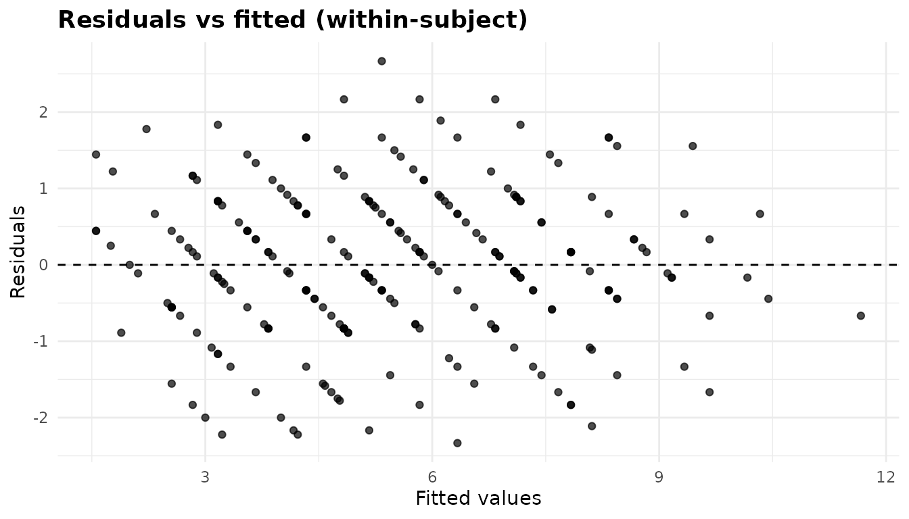
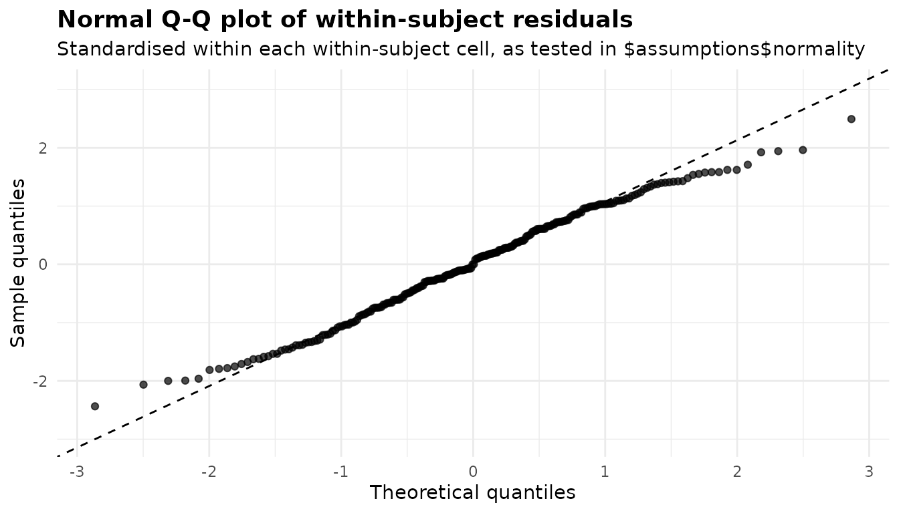
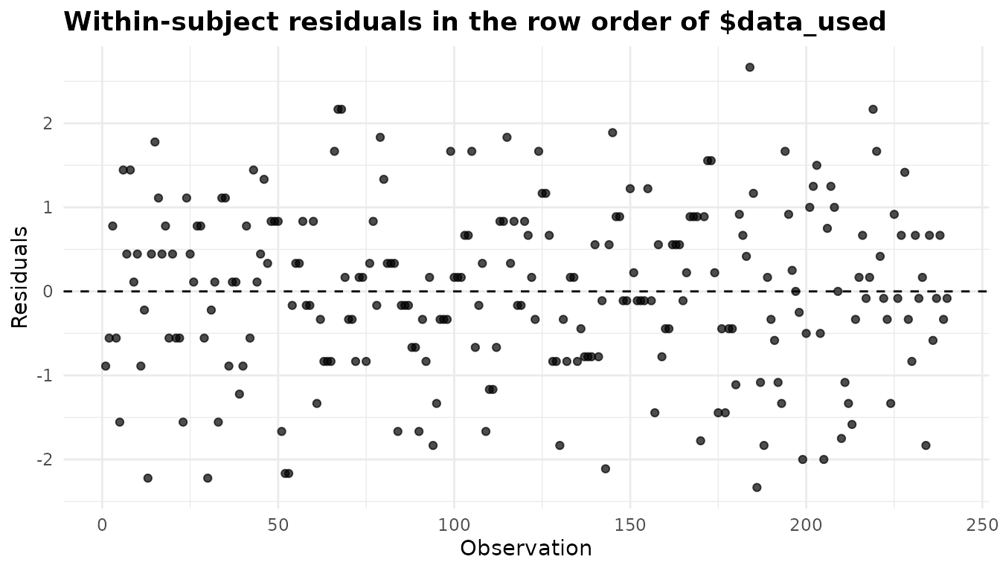
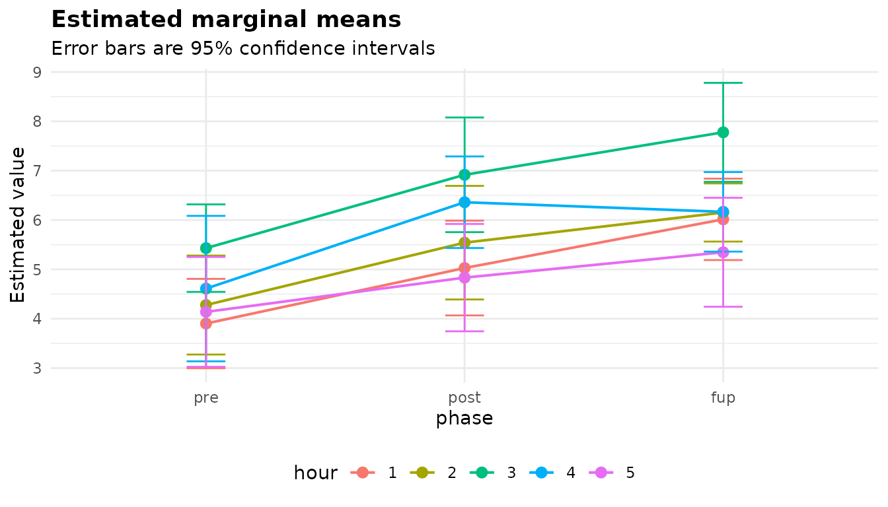
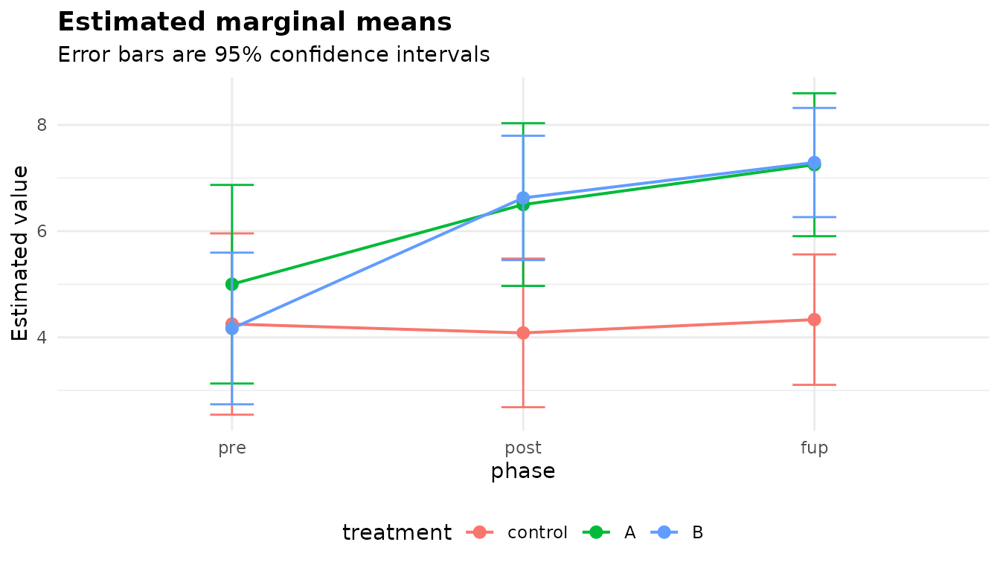

# Repeated measures ANOVA: the same subjects under several conditions

``` r

library(anovakit)
```

[`anova_rm()`](https://elkronos.github.io/anovakit/reference/anova_rm.md)
fits a repeated measures ANOVA, in which every subject is measured in
every cell of one or more *within-subject* factors, optionally with
*between-subject* factors that split the subjects into groups. It takes
data in long format (one row per subject per cell), fits the model with
[`afex::aov_ez()`](https://rdrr.io/pkg/afex/man/aov_car.html) and so
needs the afex package. If each subject contributes a single
observation, the groups are independent and
[`anova_welch()`](https://elkronos.github.io/anovakit/reference/anova_welch.md)
or
[`anova_glm()`](https://elkronos.github.io/anovakit/reference/anova_glm.md)
is the right tool; for a before-and-after design where the question is
about the “after”,
[`anova_ancova()`](https://elkronos.github.io/anovakit/reference/anova_ancova.md)
with the baseline as a covariate is often better. The [decision
guide](https://elkronos.github.io/anovakit/articles/choosing.md) has
more.

## The data

[`afex::obk.long`](https://rdrr.io/pkg/afex/man/obk.long.html) is the
long form of a contrived data set from O’Brien and Kaiser (1985): 16
subjects in three treatments (`control`, `A`, `B`), of both genders,
each measured at a pre-test, a post-test and a follow-up (`phase`), five
times an hour apart within each session (`hour`). So there are two
between-subject factors and two within-subject factors, 3 x 5 = 15 cells
per subject and 16 x 15 = 240 rows. The phases are stored in
alphabetical order; putting them in time order makes every table easier
to read.

``` r

obk <- afex::obk.long
#> Registered S3 method overwritten by 'lme4':
#>   method           from
#>   na.action.merMod car
obk$phase <- factor(obk$phase, levels = c("pre", "post", "fup"))
head(obk)
#>   id treatment gender   age phase hour value
#> 1  1   control      M -4.75   pre    1     1
#> 2  1   control      M -4.75   pre    2     2
#> 3  1   control      M -4.75   pre    3     4
#> 4  1   control      M -4.75   pre    4     2
#> 5  1   control      M -4.75   pre    5     1
#> 6  1   control      M -4.75  post    1     3
nrow(obk)
#> [1] 240
# subjects in each between-subject cell
with(obk[!duplicated(obk$id), ], table(treatment, gender))
#>          gender
#> treatment F M
#>   control 2 3
#>   A       2 2
#>   B       4 3
```

``` r

round(with(obk, tapply(value, list(treatment, phase), mean)), 2)
#>          pre post  fup
#> control 4.20 4.00 4.40
#> A       5.00 6.50 7.25
#> B       4.14 6.57 7.29
```

The control group barely changes across the phases, while both
treatments rise after the pre-test. A repeated measures ANOVA tests
effects like that against the variation *within* subjects, which is
usually much smaller than the variation between them.

## Fitting the model

Every column is named as a string. `subject` identifies the subject,
`within` lists the within-subject factors, and `between` the
between-subject factors, each of which must take one value per subject
(the function checks).

``` r

fit <- anova_rm(obk, "value", subject = "id", within = c("phase", "hour"),
                between = c("treatment", "gender"))
fit
#> Repeated measures analysis of variance 
#> --------------------------------------
#> Call: anova_rm(data = obk, response = "value", subject = "id", within = c("phase", "hour"), between = c("treatment", "gender"))
#> Observations used: 240
#> 
#> Omnibus test (Type III, F, GG-corrected degrees of freedom)
#>                           term num_df den_df    mse statistic partial_eta_sq
#> 1                    treatment  2.000  10.00 22.810   3.94000        0.44070
#> 2                       gender  1.000  10.00 22.810   3.65900        0.26790
#> 3             treatment:gender  2.000  10.00 22.810   2.85500        0.36350
#> 4                        phase  1.599  15.99  5.020  16.13000        0.61730
#> 5              treatment:phase  3.198  15.99  5.020   4.85100        0.49240
#> 6                 gender:phase  1.599  15.99  5.020   0.28280        0.02750
#> 7       treatment:gender:phase  3.198  15.99  5.020   0.63660        0.11290
#> 8                         hour  1.841  18.41  3.395  16.69000        0.62530
#> 9               treatment:hour  3.682  18.41  3.395   0.09333        0.01832
#> 10                 gender:hour  1.841  18.41  3.395   0.45030        0.04309
#> 11       treatment:gender:hour  3.682  18.41  3.395   0.62040        0.11040
#> 12                  phase:hour  3.596  35.96  2.674   1.18000        0.10550
#> 13        treatment:phase:hour  7.192  35.96  2.674   0.34530        0.06460
#> 14           gender:phase:hour  3.596  35.96  2.674   0.93130        0.08520
#> 15 treatment:gender:phase:hour  7.192  35.96  2.674   0.73590        0.12830
#>      p_value
#> 1  0.0547069
#> 2  0.0848003
#> 3  0.1044692
#> 4  0.0002814
#> 5  0.0126909
#> 6  0.7089599
#> 7  0.6116209
#> 8  9.763e-05
#> 9  0.9786227
#> 10 0.6284344
#> 11 0.6413625
#> 12 0.3345212
#> 13 0.9303725
#> 14 0.4490777
#> 15 0.6463449
#> 
#> Notes
#>   - Mauchly's test rejects sphericity for hour, treatment:hour, gender:hour, treatment:gender:hour; the reported table uses the Greenhouse-Geisser correction.
#>   - The marginal means in $emmeans and the comparisons in $posthoc are averaged over the levels of: treatment, gender. The ANOVA table shows a significant interaction with a factor averaged over (treatment:phase, p = 0.0127), so these averages can hide or reverse the differences within its levels; set emm_specs = c("phase", "hour", "treatment", "gender") to compare the cells.
#> 
#> Plots available: residuals, qq, index, emmeans
#>   (use plot(x, which = "residuals"))
```

Reading the printout:

- The heading of the table says the sums of squares are Type III, the
  statistic is F, and the degrees of freedom are Greenhouse-Geisser
  corrected (the default `correction = "GG"`).
- `Observations used: 240`: every subject has every cell, so nothing was
  removed. An incomplete subject would be dropped and named in the notes
  ([below](#incomplete-designs)).
- The table has a row for every term of the full factorial model, 15 in
  all.
- Two notes: which terms failed Mauchly’s test, and a warning that the
  default marginal means average over a factor that interacts with a
  factor they show.
- Four plots are available.

`summary(fit)` adds the assumption checks, effect sizes, marginal means,
comparisons and the sphericity table.

## The omnibus test

``` r

print(fit$anova, digits = 3)
#>                           term num_df den_df   mse statistic partial_eta_sq
#> 1                    treatment   2.00   10.0 22.81    3.9405         0.4407
#> 2                       gender   1.00   10.0 22.81    3.6591         0.2679
#> 3             treatment:gender   2.00   10.0 22.81    2.8555         0.3635
#> 4                        phase   1.60   16.0  5.02   16.1329         0.6173
#> 5              treatment:phase   3.20   16.0  5.02    4.8510         0.4924
#> 6                 gender:phase   1.60   16.0  5.02    0.2828         0.0275
#> 7       treatment:gender:phase   3.20   16.0  5.02    0.6366         0.1129
#> 8                         hour   1.84   18.4  3.39   16.6857         0.6253
#> 9               treatment:hour   3.68   18.4  3.39    0.0933         0.0183
#> 10                 gender:hour   1.84   18.4  3.39    0.4503         0.0431
#> 11       treatment:gender:hour   3.68   18.4  3.39    0.6204         0.1104
#> 12                  phase:hour   3.60   36.0  2.67    1.1799         0.1055
#> 13        treatment:phase:hour   7.19   36.0  2.67    0.3453         0.0646
#> 14           gender:phase:hour   3.60   36.0  2.67    0.9313         0.0852
#> 15 treatment:gender:phase:hour   7.19   36.0  2.67    0.7359         0.1283
#>     p_value
#> 1  5.47e-02
#> 2  8.48e-02
#> 3  1.04e-01
#> 4  2.81e-04
#> 5  1.27e-02
#> 6  7.09e-01
#> 7  6.12e-01
#> 8  9.76e-05
#> 9  9.79e-01
#> 10 6.28e-01
#> 11 6.41e-01
#> 12 3.35e-01
#> 13 9.30e-01
#> 14 4.49e-01
#> 15 6.46e-01
```

- `num_df` and `den_df` are the numerator and denominator degrees of
  freedom. For a term that involves a within-subject factor they have
  been multiplied by the Greenhouse-Geisser epsilon, which is why they
  are not whole numbers. The between-subject terms (`treatment`,
  `gender` and their interaction) need no correction.
- `mse` is the mean square of the error term the effect is tested
  against: between-subject terms against the variation between subjects,
  within-subject terms against their own subject-by-term interaction.
- `statistic` is F, `partial_eta_sq` is the partial eta squared, and
  `p_value` is computed on the corrected degrees of freedom.

`phase` (p \< 0.001) and `hour` (p \< 0.001) are clear, and so is the
`treatment:phase` interaction (p = 0.013): the treatments differ in how
the scores change across the phases, as the table of means suggested.
The type and correction are stored as attributes of the table:

``` r

attr(fit$anova, "ss_type")
#> [1] "III"
attr(fit$anova, "correction")
#> [1] "GG"
```

## Sphericity

A within-subject F test assumes *sphericity*: that the differences
between every pair of levels of a within-subject factor have the same
variance. When the assumption fails the F test rejects too often. The
usual remedy is to shrink both degrees of freedom by an estimate of
epsilon, which is 1 under sphericity and as low as 1/(k - 1) for a
factor with k levels.

``` r

print(fit$sphericity, digits = 3)
#>                           term mauchly_w p_value gg_epsilon hf_epsilon     p_gg
#> 1                        phase   0.74927  0.2728       0.80      0.928 2.81e-04
#> 2              treatment:phase   0.74927  0.2728       0.80      0.928 1.27e-02
#> 3                 gender:phase   0.74927  0.2728       0.80      0.928 7.09e-01
#> 4       treatment:gender:phase   0.74927  0.2728       0.80      0.928 6.12e-01
#> 5                         hour   0.06607  0.0076       0.46      0.559 9.76e-05
#> 6               treatment:hour   0.06607  0.0076       0.46      0.559 9.79e-01
#> 7                  gender:hour   0.06607  0.0076       0.46      0.559 6.28e-01
#> 8        treatment:gender:hour   0.06607  0.0076       0.46      0.559 6.41e-01
#> 9                   phase:hour   0.00478  0.4494       0.45      0.733 3.35e-01
#> 10        treatment:phase:hour   0.00478  0.4494       0.45      0.733 9.30e-01
#> 11           gender:phase:hour   0.00478  0.4494       0.45      0.733 4.49e-01
#> 12 treatment:gender:phase:hour   0.00478  0.4494       0.45      0.733 6.46e-01
#>        p_hf hf_epsilon_raw
#> 1  0.000112          0.928
#> 2  0.008439          0.928
#> 3  0.740857          0.928
#> 4  0.631998          0.928
#> 5  0.000023          0.559
#> 6  0.988662          0.559
#> 7  0.664554          0.559
#> 8  0.669298          0.559
#> 9  0.329659          0.733
#> 10 0.975225          0.733
#> 11 0.478034          0.733
#> 12 0.708012          0.733
```

There is one row per within-subject term with more than one degree of
freedom (a two-level factor has nothing to test; see
[below](#a-within-only-design)). Terms that share the same
within-subject factors share the same error matrix, so `treatment:hour`,
`gender:hour` and `hour` have the same Mauchly’s test and the same
epsilons.

- `mauchly_w` and `p_value` are Mauchly’s test. It rejects for `hour` (p
  = 0.0076) and its interactions, and not for `phase` (p = 0.27).
- `gg_epsilon` is the Greenhouse-Geisser estimate (0.46 for `hour`), and
  `hf_epsilon` the Huynh-Feldt estimate with Lecoutre’s correction
  (0.559), capped at 1. `hf_epsilon_raw` is the uncapped value; the two
  differ only when the estimate exceeds 1, and a note then says so.
- `p_gg` and `p_hf` are each term’s p-value under each correction, so
  you can see both whichever one `$anova` uses.

The `correction` argument chooses what `$anova` reports: `"GG"` (the
default), `"HF"` or `"none"`.

``` r

hf <- anova_rm(obk, "value", subject = "id", within = c("phase", "hour"),
               between = c("treatment", "gender"), correction = "HF",
               plots = FALSE)
none <- anova_rm(obk, "value", subject = "id", within = c("phase", "hour"),
                 between = c("treatment", "gender"), correction = "none",
                 plots = FALSE)
rows <- fit$anova$term %in% c("phase", "hour")
data.frame(term = fit$anova$term[rows],
           df_GG = fit$anova$num_df[rows], p_GG = fit$anova$p_value[rows],
           df_HF = hf$anova$num_df[rows], p_HF = hf$anova$p_value[rows],
           df_none = none$anova$num_df[rows], p_none = none$anova$p_value[rows])
#>    term    df_GG         p_GG    df_HF         p_HF df_none       p_none
#> 1 phase 1.599070 2.813681e-04 1.855719 1.124743e-04       2 6.731637e-05
#> 2  hour 1.841126 9.762881e-05 2.237121 2.300914e-05       4 4.026643e-08
none$notes[1]
#> [1] "Mauchly's test rejects sphericity for hour, treatment:hour, gender:hour, treatment:gender:hour; the reported table is uncorrected (correction = \"none\"), so its p-values for those terms may be too small."
```

Greenhouse-Geisser is the conservative choice and Huynh-Feldt the less
conservative one; with no correction the p-values for `hour` are the
smallest of the three, and the note warns that they may be too small. A
common rule is to use Huynh-Feldt when the Greenhouse-Geisser epsilon is
above about 0.75 and Greenhouse-Geisser otherwise, but deciding in
advance, rather than after seeing the p-values, matters more than which
you pick. Mauchly’s test has little power in small samples, so a
non-significant result is weak reassurance; correcting by default costs
little.

The same table is in `fit$assumptions$sphericity`. When there are fewer
subjects than a term has contrasts, Mauchly’s test is undefined; the
epsilons are then computed directly and a note says so.

## Effect sizes

``` r

print(fit$effect_sizes, digits = 3)
#>                           term partial_eta_sq generalised_eta_sq
#> 1                    treatment         0.4407            0.27791
#> 2                       gender         0.2679            0.15160
#> 3             treatment:gender         0.3635            0.21807
#> 4                        phase         0.6173            0.21711
#> 5              treatment:phase         0.4924            0.14294
#> 6                 gender:phase         0.0275            0.00484
#> 7       treatment:gender:phase         0.1129            0.02142
#> 8                         hour         0.6253            0.18255
#> 9               treatment:hour         0.0183            0.00249
#> 10                 gender:hour         0.0431            0.00599
#> 11       treatment:gender:hour         0.1104            0.01634
#> 12                  phase:hour         0.1055            0.02372
#> 13        treatment:phase:hour         0.0646            0.01402
#> 14           gender:phase:hour         0.0852            0.01882
#> 15 treatment:gender:phase:hour         0.1283            0.02942
```

`partial_eta_sq` is the effect’s sum of squares over itself plus its own
error sum of squares. In a repeated measures design each within-subject
term has its own, relatively small, error term, so partial eta squared
for those terms is large and not comparable with the same effect
measured in a between-subjects design. `generalised_eta_sq` (Olejnik and
Algina, 2003) puts the subject variation back into the denominator, so
it is comparable across designs, and it is the measure to report when
you want to compare with other studies. Neither has an interval.

Generalised eta squared depends on which factors were *manipulated* and
which were merely *observed*. By default every factor is treated as
manipulated. Gender was not assigned by the experimenter, so it belongs
in `observed` (passed on to afex):

``` r

obs <- anova_rm(obk, "value", subject = "id", within = c("phase", "hour"),
                between = c("treatment", "gender"), observed = "gender",
                plots = FALSE)
data.frame(term = fit$effect_sizes$term,
           ges_default = fit$effect_sizes$generalised_eta_sq,
           ges_observed = obs$effect_sizes$generalised_eta_sq)[1:8, ]
#>                     term ges_default ges_observed
#> 1              treatment 0.277906143  0.198248507
#> 2                 gender 0.151600576  0.114806411
#> 3       treatment:gender 0.218071465  0.179183259
#> 4                  phase 0.217114834  0.151232706
#> 5        treatment:phase 0.142938795  0.096782387
#> 6           gender:phase 0.004837544  0.003123177
#> 7 treatment:gender:phase 0.021417761  0.014061848
#> 8                   hour 0.182545245  0.125471836
attr(obs$effect_sizes, "observed")
#> [1] "gender"
```

Every generalised eta squared shrinks, because the variation gender
accounts for now counts as part of the individual differences in the
denominator. Partial eta squared, the F tests and the p-values do not
change.

## Marginal means and comparisons

By default `$emmeans` holds the marginal means of the within-subject
cells, here the 15 combinations of phase and hour, averaged over the
between-subject factors:

``` r

head(fit$emmeans)
#>   phase hour estimate        se df conf_low conf_high
#> 1   pre    1 3.902778 0.4062352 10 2.997629  4.807926
#> 2  post    1 5.027778 0.4309586 10 4.067542  5.988013
#> 3   fup    1 6.013889 0.3702112 10 5.189007  6.838771
#> 4   pre    2 4.277778 0.4500086 10 3.275096  5.280459
#> 5  post    2 5.541667 0.5165659 10 4.390686  6.692647
#> 6   fup    2 6.152778 0.2644366 10 5.563576  6.741979
nrow(fit$posthoc)
#> [1] 105
attr(fit$emmeans, "emmeans_model")
#> [1] "multivariate"
```

They come from afex’s *multivariate* model, so each cell’s standard
error and degrees of freedom come from that cell’s own variance, not
from a pooled error term (`df` is the number of subjects minus the
number of between-subject cells, 10). The `emmeans_model` attribute
records this.

The second note of the fit warns that averaging over `treatment` is
risky here, because `treatment:phase` is significant: the average change
across phases hides the fact that the control group does not change.
`emm_specs` chooses the factors the means are computed over. Asking for
phase by treatment, averaged over hour and gender:

``` r

tp <- anova_rm(obk, "value", subject = "id", within = c("phase", "hour"),
               between = c("treatment", "gender"),
               emm_specs = c("phase", "treatment"))
print(tp$emmeans, digits = 3)
#>   phase treatment estimate    se df conf_low conf_high
#> 1   pre   control     4.25 0.766 10     2.54      5.96
#> 2  post   control     4.08 0.628 10     2.68      5.48
#> 3   fup   control     4.33 0.551 10     3.11      5.56
#> 4   pre         A     5.00 0.839 10     3.13      6.87
#> 5  post         A     6.50 0.688 10     4.97      8.03
#> 6   fup         A     7.25 0.604 10     5.90      8.60
#> 7   pre         B     4.17 0.641 10     2.74      5.59
#> 8  post         B     6.62 0.525 10     5.45      7.80
#> 9   fup         B     7.29 0.461 10     6.26      8.32
```

The comparisons now cover all 36 pairs of the nine cells. Those within a
treatment across phases are usually the ones of interest:

``` r

ph <- tp$posthoc
within_trt <- c("pre control - fup control", "pre A - fup A", "pre B - fup B")
print(ph[ph$contrast %in% within_trt,
         c("contrast", "estimate", "conf_low", "conf_high", "p_value",
           "p_adjusted")], digits = 3)
#>                     contrast estimate conf_low conf_high  p_value p_adjusted
#> 2  pre control - fup control  -0.0833    -2.05    1.8805 8.73e-01   1.000000
#> 23             pre A - fup A  -2.2500    -4.40   -0.0988 2.37e-03   0.038655
#> 35             pre B - fup B  -3.1250    -4.77   -1.4820 2.47e-05   0.000511
tp$notes[2]
#> [1] "The marginal means in $emmeans and the comparisons in $posthoc are averaged over the levels of: hour, gender."
```

`p_value` is unadjusted and `p_adjusted` is adjusted by the method in
the `adjustment` column (Tukey by default, across all 36 comparisons,
which is conservative when you only care about three of them). `adjust`
chooses another method for the whole family. If you planned only a few
comparisons, take their unadjusted `p_value`s and adjust them among
themselves with [`p.adjust()`](https://rdrr.io/r/stats/p.adjust.html).
The note confirms which factors were averaged over.

When you need a contrast the wrapper does not compute – say, the change
from pre to follow-up compared between treatments – `$emmeans_object` is
the emmeans grid with your factor names and labels, ready for
[`emmeans::contrast()`](https://rvlenth.github.io/emmeans/reference/contrast.html).

## Checking assumptions

Two assumptions matter: sphericity, covered above, and normality of the
within-subject errors.

``` r

print(fit$assumptions$normality, digits = 3)
#>        cell  n statistic p_value note
#> 1   pre : 1 16     0.979  0.9514 <NA>
#> 2   pre : 2 16     0.962  0.7067 <NA>
#> 3   pre : 3 16     0.954  0.5594 <NA>
#> 4   pre : 4 16     0.953  0.5427 <NA>
#> 5   pre : 5 16     0.888  0.0511 <NA>
#> 6  post : 1 16     0.962  0.6984 <NA>
#> 7  post : 2 16     0.988  0.9969 <NA>
#> 8  post : 3 16     0.939  0.3429 <NA>
#> 9  post : 4 16     0.979  0.9552 <NA>
#> 10 post : 5 16     0.952  0.5272 <NA>
#> 11  fup : 1 16     0.945  0.4163 <NA>
#> 12  fup : 2 16     0.953  0.5399 <NA>
#> 13  fup : 3 16     0.950  0.4942 <NA>
#> 14  fup : 4 16     0.957  0.6016 <NA>
#> 15  fup : 5 16     0.937  0.3194 <NA>
```

The within-subject F tests depend on what is left of each value once its
subject’s mean and its cell’s mean (within its between-subject group)
are removed. Those residuals are `fit$residuals`, one per row of
`$data_used` and in the same order, and Shapiro-Wilk is run on them
separately for each within-subject cell. Pooling them would mix cells of
different spread, which can fail a normality test even when every cell
is normal. Here no cell rejects at the 5% level; the smallest p-value is
0.051, in the pre : 5 cell. With 15 tests, one or two small p-values are
expected by chance, so look for a pattern rather than a single cell. A
cell that cannot be tested (fewer than three subjects, or no variation)
gets an `NA` p-value and the reason in the `note` column.

``` r

head(cbind(fit$data_used, residual = round(fit$residuals, 3)))
#>   value id phase hour treatment gender residual
#> 1     1  1   pre    1   control      M   -0.889
#> 2     2  1   pre    2   control      M   -0.556
#> 3     4  1   pre    3   control      M    0.778
#> 4     2  1   pre    4   control      M   -0.556
#> 5     1  1   pre    5   control      M   -1.556
#> 6     3  1  post    1   control      M    1.444
```

The normality of the subject means, which the between-subject tests rely
on, is not tested. The [diagnostics
article](https://elkronos.github.io/anovakit/articles/diagnostics.md)
covers the checks across the package.

## Plots

Each plot is a ggplot2 object; `plot(fit, "name")` returns it for you to
print or modify (see [Plots and visual
customisation](https://elkronos.github.io/anovakit/articles/visuals.md)).

### Residuals against fitted values

``` r

plot(fit, "residuals")
```



The residuals and fitted values are the within-subject ones described
above (a fitted value is the observed value minus its residual). What to
look for: the same even band as in any residual plot, with no funnel.
The values in this data set are whole numbers on a short scale, which is
why the points line up along diagonal stripes.

### Normal Q-Q plot

``` r

plot(fit, "qq")
```



The residuals here are standardised within each within-subject cell, as
they are tested in `$assumptions$normality`, so cells with different
spreads are put on the same footing. What to look for: points along the
dashed line, with no systematic curve at the ends. Here both ends bend
in towards the middle: the residuals have lighter tails than a normal
distribution, which is common for whole-number scores on a short scale
and is generally harmless for the F tests. Heavy tails, bending away
from the line, would be the worrying pattern.

### Residuals in row order

``` r

plot(fit, "index")
```



The residuals in the row order of `$data_used`, which is the order the
rows came in (here, 15 consecutive rows per subject). What to look for:
no trends, and no runs of residuals on the same side of zero. A drift
within each block of rows would suggest practice or fatigue effects that
the model does not capture; if your data are sorted by time of testing,
this is where a drift over the course of the study would show. Nothing
of the kind is visible here.

### Marginal means

``` r

plot(fit, "emmeans")
```



``` r

plot(tp, "emmeans")
```



The first factor in `emm_specs` goes on the x axis and any others are
mapped to colour, with one line per level. In the first plot (the
default, phase by hour) the pre-test is the lowest phase at every hour
and the third hour is the highest in every phase. The second, phase by
treatment, shows the control group staying flat while `A` and `B` rise,
which is the `treatment:phase` interaction.

## Incomplete designs

A repeated measures ANOVA needs every subject in every within-subject
cell.
[`datasets::ChickWeight`](https://rdrr.io/r/datasets/ChickWeight.html)
records the weights of 50 chicks on four diets, every two days from
birth to day 20 and on day 21. Some chicks died or were not weighed on
every day:

``` r

cw <- as.data.frame(datasets::ChickWeight)
table(table(cw$Chick))   # rows per chick: most have all 12
#> 
#>  2  7  8 10 11 12 
#>  1  1  1  1  1 45
```

`Time` is numeric; like every within-subject column it is turned into a
factor, so each day is a level.

``` r

chick <- anova_rm(cw, "weight", subject = "Chick", within = "Time",
                  between = "Diet", plots = FALSE)
chick$subjects_dropped
#> [1] "18" "16" "15" "8"  "44"
c(n_removed = chick$n_removed,
  missing = chick$n_removed_missing,
  unbalanced = chick$n_removed_unbalanced,
  aggregated = chick$n_removed_aggregated)
#>  n_removed    missing unbalanced aggregated 
#>         38          0         38          0
chick$notes[1]
#> [1] "5 subject(s) were removed because they are missing at least one within-subject cell: 18, 16, 15, 8, 44. A repeated measures ANOVA requires a complete design."
```

Five chicks without a full set of weighings were removed before fitting,
and they are listed in `$subjects_dropped` in the order of the subject
column’s levels (`Chick` is an ordered factor, which is why they are not
in numeric order). `$n_removed` counts every input row that is not in
`$data_used`, and three components break it down by cause: rows with a
missing value, rows belonging to incomplete subjects, and rows combined
by aggregation (next section). Here all 38 removed rows belong to
incomplete subjects.

A missing value costs more than its own row. Setting one weight to `NA`:

``` r

cw_na <- cw
cw_na$weight[cw_na$Chick == "1" & cw_na$Time == 10] <- NA
chick_na <- anova_rm(cw_na, "weight", subject = "Chick", within = "Time",
                     between = "Diet", plots = FALSE)
c(n_removed = chick_na$n_removed,
  missing = chick_na$n_removed_missing,
  unbalanced = chick_na$n_removed_unbalanced)
#>  n_removed    missing unbalanced 
#>         50          1         49
chick_na$subjects_dropped
#> [1] "18" "16" "15" "8"  "1"  "44"
```

The row with the missing weight is dropped, which leaves chick 1 without
a day-10 weighing, so its other 11 rows go too.
`nrow(data_used) + n_removed` is always the number of rows supplied. If
losing whole subjects is too costly, a mixed model (for example with
lme4 or afex’s `mixed()`) can use incomplete subjects;
[`anova_rm()`](https://elkronos.github.io/anovakit/reference/anova_rm.md)
cannot.

These growth data also show how badly sphericity can fail: weights
spread out as chicks grow, so the variance of the differences grows with
the gap between days.

``` r

print(chick$sphericity[, c("term", "mauchly_w", "p_value", "gg_epsilon",
                           "hf_epsilon")], digits = 3)
#>        term mauchly_w   p_value gg_epsilon hf_epsilon
#> 1      Time  2.68e-17 1.03e-251      0.114      0.116
#> 2 Diet:Time  2.68e-17 1.03e-251      0.114      0.116
```

A Greenhouse-Geisser epsilon of 0.11 is close to its minimum of 1/11 for
a 12-level factor: the corrected test has barely more degrees of freedom
than a single comparison.

### Internal names

afex builds a model formula from column names and names its wide-format
columns after the within-subject levels, so a column called `subject id`
or levels such as `0, 2, 4` would be mangled.
[`anova_rm()`](https://elkronos.github.io/anovakit/reference/anova_rm.md)
therefore gives afex internal names and labels, and maps every table and
plot back to yours. `$model` is the afex fit itself and keeps the
internal names; `$internal_names` gives the correspondence:

``` r

chick$internal_names
#>       role   name internal
#> 1 response weight        Y
#> 2  subject  Chick       ID
#> 3   within   Time       W1
#> 4  between   Diet       B1
head(chick$model$data$long, 3)
#>    ID B1  W1  Y
#> 1 S01 L1 L01 41
#> 2 S01 L1 L02 48
#> 3 S01 L1 L03 53
```

The day levels 0, 2, 4, … are `L01`, `L02`, `L03`, … in `$model`, in
level order. You only need this table if you work with `$model`
directly.

## Repeated rows: `fun_aggregate`

Sometimes a subject has several rows in the same cell: several trials
per condition, or, if you leave a factor out of the analysis, the rows
it used to distinguish. Analysing `obk` by phase alone leaves five rows
(the hours) per subject and phase. They are combined into one value
before fitting, with the mean by default:

``` r

by_phase <- anova_rm(obk, "value", subject = "id", within = "phase",
                     between = "treatment", plots = FALSE)
by_phase$notes[1]
#> [1] "48 subject-by-cell combination(s) have more than one row (192 extra row(s)); each was aggregated into one value with the mean (the default; pass fun_aggregate to choose another function) before fitting. $data_used holds the aggregated rows, and the 192 row(s) aggregated away are included in $n_removed."
c(used = nrow(by_phase$data_used), removed = by_phase$n_removed,
  aggregated = by_phase$n_removed_aggregated)
#>       used    removed aggregated 
#>         48        192        192
head(by_phase$data_used, 3)
#>   value id phase treatment
#> 1     2  1   pre   control
#> 2     3  1  post   control
#> 3     3  1   fup   control
```

`$data_used` holds the aggregated rows (one per subject and phase), and
the 192 rows combined away are counted in `$n_removed` and
`$n_removed_aggregated`. Pass `fun_aggregate` to use another function,
for example the median for skewed trial-level data:

``` r

by_phase_md <- anova_rm(obk, "value", subject = "id", within = "phase",
                        between = "treatment", fun_aggregate = median,
                        plots = FALSE)
by_phase_md$notes[1]
#> [1] "48 subject-by-cell combination(s) have more than one row (192 extra row(s)); each was aggregated into one value with `median` before fitting. $data_used holds the aggregated rows, and the 192 row(s) aggregated away are included in $n_removed."
all.equal(by_phase_md$data_used$value, by_phase$data_used$value)
#> [1] TRUE
```

In these contrived data the median and the mean of each subject’s five
hourly values happen to coincide, so the result is the same; the note
records the function either way. Aggregation is a convenience: if the
repeated rows are a design factor, like `hour`, it is usually better to
keep it in `within`.

## A within-only design

`between` is optional.
[`datasets::sleep`](https://rdrr.io/r/datasets/sleep.html) gives the
extra hours of sleep of ten patients under two drugs (`group`), each
patient taking both, so `group` is a within-subject factor and `ID` the
subject:

``` r

sl <- anova_rm(datasets::sleep, "extra", subject = "ID", within = "group")
sl
#> Repeated measures analysis of variance 
#> --------------------------------------
#> Call: anova_rm(data = datasets::sleep, response = "extra", subject = "ID", within = "group")
#> Observations used: 20
#> 
#> Omnibus test (Type III, F, no sphericity correction)
#>    term num_df den_df    mse statistic partial_eta_sq  p_value
#> 1 group      1      9 0.7564      16.5         0.6471 0.002833
#> 
#> Notes
#>   - Sphericity is not an issue for this design: every within-subject factor has two levels, where the assumption holds automatically.
#> 
#> Plots available: residuals, qq, index, emmeans
#>   (use plot(x, which = "residuals"))
```

With a two-level factor there is only one difference per subject, so
sphericity holds automatically: `$sphericity` is `NULL` and the note
says why. The heading of the table says “no sphericity correction”, and
`attr(sl$anova, "correction")` is “none”, even though `correction` was
left at its default: there is nothing to correct, and the degrees of
freedom are the uncorrected 1 and 9. The ANOVA is then the paired t-test
in another form, with F = t²:

``` r

d <- with(datasets::sleep, extra[group == "2"] - extra[group == "1"])
tt <- t.test(d)
c(t_squared = unname(tt$statistic)^2, F = sl$anova$statistic,
  p_t = tt$p.value, p_F = sl$anova$p_value)
#>   t_squared           F         p_t         p_F 
#> 16.50088132 16.50088132  0.00283289  0.00283289
```

The same equivalence holds for the normality check. With one two-level
within-subject factor, the residuals are plus and minus half of each
subject’s centred difference, so both rows of `$assumptions$normality`
test the normality of the differences, which is exactly the assumption
of the paired t-test:

``` r

sl$assumptions$normality
#>   cell  n statistic    p_value note
#> 1    1 10 0.8298713 0.03334161 <NA>
#> 2    2 10 0.8298713 0.03334161 <NA>
shapiro.test(d)$p.value
#> [1] 0.03334161
```

Both rows give p = 0.033: the differences are not convincingly normal,
because one patient’s difference (4.6 hours) is far larger than the
others (without that patient, Shapiro-Wilk gives p = 0.77). Ten subjects
is too few to lean on the test, but it is a reason to check the result
with a nonparametric paired test.

## Options worth knowing

- `correction` (`"GG"`, `"HF"`, `"none"`), shown [above](#sphericity).
- `emm_specs`, shown [above](#marginal-means-and-comparisons). When it
  leaves out a factor of the model, the means are averaged over it and a
  note says so.
- `adjust` sets the multiplicity adjustment for `$posthoc`: `"tukey"`
  (the default), `"holm"`, `"bonferroni"`, `"BH"` and others;
  `posthoc = FALSE` skips the comparisons.
- `conf_level` sets the level of every interval.
- A few arguments of
  [`afex::aov_ez()`](https://rdrr.io/pkg/afex/man/aov_car.html) pass
  through `...`: `observed` (above), `fun_aggregate` (above), `type = 2`
  for Type II sums of squares, and
  `anova_table = list(p_adjust_method = "holm")` to adjust the p-values
  of `$anova` across its terms. Anything else is an error rather than
  silently ignored. `covariate` is refused:
  [`anova_rm()`](https://elkronos.github.io/anovakit/reference/anova_rm.md)
  does not fit covariates.

``` r

t2 <- anova_rm(obk, "value", subject = "id", within = c("phase", "hour"),
               between = c("treatment", "gender"), type = 2, plots = FALSE)
attr(t2$anova, "ss_type")
#> [1] "II"
print(t2$anova[1:3, c("term", "statistic", "p_value")], digits = 3)
#>               term statistic p_value
#> 1        treatment      4.63  0.0377
#> 2           gender      2.56  0.1410
#> 3 treatment:gender      2.86  0.1045
```

The design here is unbalanced between subjects (two to four subjects per
treatment-by-gender cell), so Type II and Type III tests differ for most
terms. Only the terms that contain both between-subject factors, such as
`treatment:gender`, are the same under both.

- `factorize = TRUE` (the default) converts a response stored as a
  factor or as text to numbers *through its labels*, so a factor with
  levels 11, 17, 21 becomes 11, 17, 21 rather than 1, 2, 3; a note
  records the conversion.

## What the notes say

``` r

fit$notes
#> [1] "Mauchly's test rejects sphericity for hour, treatment:hour, gender:hour, treatment:gender:hour; the reported table uses the Greenhouse-Geisser correction."                                                                                                                                                                                                                                    
#> [2] "The marginal means in $emmeans and the comparisons in $posthoc are averaged over the levels of: treatment, gender. The ANOVA table shows a significant interaction with a factor averaged over (treatment:phase, p = 0.0127), so these averages can hide or reverse the differences within its levels; set emm_specs = c(\"phase\", \"hour\", \"treatment\", \"gender\") to compare the cells."
```

1.  Mauchly’s test rejects sphericity for `hour` and the terms involving
    it, and the table uses the Greenhouse-Geisser correction. The
    corrected p-values are the ones to report.
2.  The default marginal means average over `treatment` and `gender`,
    but `treatment:phase` is significant, so those averages can hide the
    difference between treatments. The note suggests the full cell grid;
    a smaller `emm_specs` such as `c("phase", "treatment")`, used above,
    is often enough.

Other notes you may see: subjects removed for incomplete cells, rows
aggregated, a response converted from a factor, epsilons computed
directly because the error matrix is singular, a Huynh-Feldt estimate
above 1, a design with no error degrees of freedom, and anything afex or
emmeans said while the model was being fitted.

## Reporting the result

> A 3 (treatment) x 2 (gender) x 3 (phase) x 5 (hour) mixed ANOVA was
> run on the scores, with Type III sums of squares and
> Greenhouse-Geisser corrected degrees of freedom (Mauchly’s test
> rejected sphericity for hour, W = 0.07, p = 0.0076; epsilon = 0.46).
> Scores changed across phases, F(1.60, 15.99) = 16.13, p \< 0.001,
> generalised η² = 0.22, and across hours, F(1.84, 18.41) = 16.69, p \<
> 0.001, generalised η² = 0.18. The change across phases depended on
> treatment, F(3.20, 15.99) = 4.85, p = 0.013, generalised η² = 0.14:
> averaged over hour and gender, the control group scored 4.25 at
> pre-test and 4.33 at follow-up, against 5.00 to 7.25 for treatment A
> and 4.17 to 7.29 for treatment B.

## See also

- [`?anova_rm`](https://elkronos.github.io/anovakit/reference/anova_rm.md)
  for every argument, including the details of the sphericity
  computation and the residuals.
- [Working with
  results](https://elkronos.github.io/anovakit/articles/results.md) for
  the `anovakit_fit` object and `$emmeans_object`.
- [`anova_ancova()`](https://elkronos.github.io/anovakit/reference/anova_ancova.md)
  ([article](https://elkronos.github.io/anovakit/articles/ancova.md))
  for a pre-post design analysed with the baseline as a covariate.
- [`anova_welch()`](https://elkronos.github.io/anovakit/reference/anova_welch.md)
  ([article](https://elkronos.github.io/anovakit/articles/welch.md)) and
  [`anova_kw()`](https://elkronos.github.io/anovakit/reference/anova_kw.md)
  ([article](https://elkronos.github.io/anovakit/articles/kruskal-wallis.md))
  for independent groups.
- [Diagnostics](https://elkronos.github.io/anovakit/articles/diagnostics.md)
  and [Plots and visual
  customisation](https://elkronos.github.io/anovakit/articles/visuals.md).

O’Brien, R. G., & Kaiser, M. K. (1985). MANOVA method for analyzing
repeated measures designs: An extensive primer. *Psychological
Bulletin*, 97, 316-333.

Olejnik, S., & Algina, J. (2003). Generalized eta and omega squared
statistics: measures of effect size for some common research designs.
*Psychological Methods*, 8(4), 434-447.
