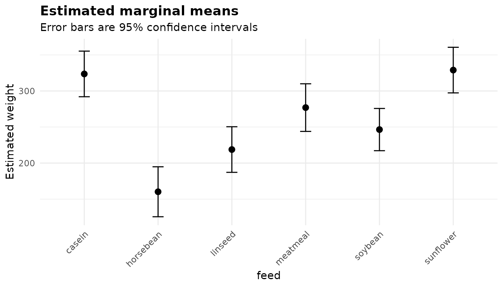

# Working with results: the anovakit_fit object

``` r

library(anovakit)
```

Every anovakit function returns an object of class `anovakit_fit`. It is
a plain named list: every table is a data frame, every figure a
**ggplot2** object, and nothing is hidden behind accessor functions.
This article shows what is in it and how to use it. The examples use
`chickwts`, the weights of 71 chicks raised on six feed supplements.

``` r

table(chickwts$feed)
#> 
#>    casein horsebean   linseed  meatmeal   soybean sunflower 
#>        12        10        12        11        14        12
```

``` r

fit <- anova_glm(chickwts, "weight", "feed")
```

[`anova_glm()`](https://elkronos.github.io/anovakit/reference/anova_glm.md)
with its default Gaussian family is a classical one-way ANOVA, which is
a convenient model-based example. Everything below applies to all eight
functions; where one differs, it says so.

## What is in a fit

``` r

class(fit)
#> [1] "anovakit_fit"
names(fit)
#>  [1] "method"         "call"           "model"          "anova"         
#>  [5] "effect_sizes"   "emmeans"        "emmeans_object" "posthoc"       
#>  [9] "assumptions"    "plots"          "data_used"      "n_removed"     
#> [13] "conf_level"     "notes"          "family"         "model_stats"
```

The first fourteen components are the same for every function:

| Component | What it holds |
|----|----|
| `method` | The analysis that was run, as printed. |
| `call` | The call that made the fit. |
| `model` | The fitted model (`lm`, `glm`, `mlm`, `afex_aov`), or the `htest` for [`anova_welch()`](https://elkronos.github.io/anovakit/reference/anova_welch.md) and [`anova_kw()`](https://elkronos.github.io/anovakit/reference/anova_kw.md). |
| `anova` | The omnibus test table. |
| `effect_sizes` | The method’s effect sizes, with intervals where they exist. |
| `emmeans` | Estimated marginal means (group summaries for Welch and Kruskal-Wallis). |
| `emmeans_object` | The **emmeans** grid behind `$emmeans`, for further contrasts. |
| `posthoc` | Pairwise comparisons. |
| `assumptions` | The assumption checks this method needs. |
| `plots` | Named list of ggplot2 figures. |
| `data_used` | The rows and columns the analysis actually used. |
| `n_removed` | How many input rows are not in `data_used`. |
| `conf_level` | The level of every interval in the fit. |
| `notes` | Everything the function decided or could not compute. |

After those come the components a function adds for itself: here
`family` and `model_stats`.
[`anova_ancova()`](https://elkronos.github.io/anovakit/reference/anova_ancova.md)
adds the slopes test and the simple slopes,
[`anova_rm()`](https://elkronos.github.io/anovakit/reference/anova_rm.md)
the sphericity table and the subjects it dropped, and so on. Each
walkthrough describes its own, and
[`?anovakit_fit`](https://elkronos.github.io/anovakit/reference/anovakit_fit.md)
lists them all.

## Printing

[`print()`](https://rdrr.io/r/base/print.html) shows the omnibus table,
any notes, and the names of the plots:

``` r

fit
#> Analysis of deviance (gaussian family, identity link, Type II) 
#> --------------------------------------------------------------
#> Call: anova_glm(data = chickwts, response = "weight", groups = "feed")
#> Observations used: 71
#> 
#> Omnibus test (Type II, F)
#>        term sum_sq df statistic   p_value
#> 1      feed 231100  5     15.36 5.936e-10
#> 2 Residuals 195600 65        NA        NA
#> 
#> Plots available: box, residuals, qq, emmeans
#>   (use plot(x, which = "box"))
```

[`summary()`](https://rdrr.io/r/base/summary.html) shows the rest:
effect sizes, marginal means, comparisons and the assumption checks. It
returns an object, so you can keep it and print it later with different
`digits`.

``` r

s <- summary(fit, digits = 3)
class(s)
#> [1] "summary.anovakit_fit"
s
#> Analysis of deviance (gaussian family, identity link, Type II) 
#> --------------------------------------------------------------
#> Call: anova_glm(data = chickwts, response = "weight", groups = "feed")
#> Observations used: 71
#> 
#> Omnibus test (Type II, F)
#>        term sum_sq df statistic  p_value
#> 1      feed 231000  5      15.4 5.94e-10
#> 2 Residuals 196000 65        NA       NA
#> 
#> Plots available: box, residuals, qq, emmeans
#>   (use plot(x, which = "box"))
#> 
#> Assumption checks
#> 
#>   dispersion
#>     3010
#> 
#>   coefficients
#>           term estimate   se statistic  p_value distribution conf_low conf_high
#>    (Intercept)   324.00 15.8    20.400  < 2e-16            t    292.0   355.000
#>  feedhorsebean  -163.00 23.5    -6.960 2.07e-09            t   -210.0  -116.000
#>    feedlinseed  -105.00 22.4    -4.680 1.49e-05            t   -150.0   -60.100
#>   feedmeatmeal   -46.70 22.9    -2.040 0.045567            t    -92.4    -0.948
#>    feedsoybean   -77.20 21.6    -3.580 0.000665            t   -120.0   -34.100
#>  feedsunflower     5.33 22.4     0.238 0.812495            t    -39.4    50.100
#>  ci_method
#>    profile
#>    profile
#>    profile
#>    profile
#>    profile
#>    profile
#> 
#> Effect sizes
#>  term df sum_sq partial_eta_sq partial_omega_sq
#>  feed  5 231000          0.542            0.503
#> 
#> Estimated marginal means (95% intervals)
#>       feed estimate   se df conf_low conf_high
#>     casein      324 15.8 65      292       355
#>  horsebean      160 17.3 65      126       195
#>    linseed      219 15.8 65      187       250
#>   meatmeal      277 16.5 65      244       310
#>    soybean      246 14.7 65      217       276
#>  sunflower      329 15.8 65      297       361
#> 
#> Pairwise comparisons
#>               contrast estimate   se df conf_low conf_high statistic  p_value
#>     casein - horsebean   163.00 23.5 65     94.4    232.00     6.960 2.07e-09
#>       casein - linseed   105.00 22.4 65     39.1    171.00     4.680 1.49e-05
#>      casein - meatmeal    46.70 22.9 65    -20.6    114.00     2.040 0.045567
#>       casein - soybean    77.20 21.6 65     13.8    141.00     3.580 0.000665
#>     casein - sunflower    -5.33 22.4 65    -71.1     60.40    -0.238 0.812495
#>    horsebean - linseed   -58.60 23.5 65   -128.0     10.40    -2.490 0.015222
#>   horsebean - meatmeal  -117.00 24.0 65   -187.0    -46.30    -4.870 7.48e-06
#>    horsebean - soybean   -86.20 22.7 65   -153.0    -19.50    -3.800 0.000325
#>  horsebean - sunflower  -169.00 23.5 65   -238.0    -99.80    -7.180 8.20e-10
#>     linseed - meatmeal   -58.20 22.9 65   -125.0      9.07    -2.540 0.013479
#>      linseed - soybean   -27.70 21.6 65    -91.0     35.70    -1.280 0.204145
#>    linseed - sunflower  -110.00 22.4 65   -176.0    -44.40    -4.920 6.21e-06
#>     meatmeal - soybean    30.50 22.1 65    -34.4     95.40     1.380 0.172554
#>   meatmeal - sunflower   -52.00 22.9 65   -119.0     15.20    -2.270 0.026435
#>    soybean - sunflower   -82.50 21.6 65   -146.0    -19.10    -3.820 0.000298
#>  p_adjusted adjustment
#>    3.07e-08      tukey
#>    0.000210      tukey
#>    0.332458      tukey
#>    0.008365      tukey
#>    0.999890      tukey
#>    0.141333      tukey
#>    0.000106      tukey
#>    0.004217      tukey
#>    1.22e-08      tukey
#>    0.127696      tukey
#>    0.793285      tukey
#>    8.84e-05      tukey
#>    0.739136      tukey
#>    0.220696      tukey
#>    0.003885      tukey
```

Both use `digits` for display only; the numbers stored in the fit are
never rounded.

## The tables are ordinary data frames

Every table is a data frame with a documented column layout, so base R,
dplyr or data.table all work on it without conversion.

``` r

fit$anova
#>        term   sum_sq df statistic     p_value
#> 1      feed 231129.2  5   15.3648 5.93642e-10
#> 2 Residuals 195556.0 65        NA          NA
```

The model-based functions attach the test details to the omnibus table
as attributes, which is how
[`print()`](https://rdrr.io/r/base/print.html) knows what heading to
write:

``` r

attributes(fit$anova)[c("ss_type", "statistic")]
#> $ss_type
#> [1] "II"
#> 
#> $statistic
#> [1] "F"
```

The pairwise comparisons have one row per pair. `p_value` is the
*unadjusted* p-value, `p_adjusted` the adjusted one, and `adjustment`
names the method, so nothing about the adjustment has to be remembered
from the call:

``` r

names(fit$posthoc)
#>  [1] "contrast"   "estimate"   "se"         "df"         "conf_low"  
#>  [6] "conf_high"  "statistic"  "p_value"    "p_adjusted" "adjustment"
unique(fit$posthoc$adjustment)
#> [1] "tukey"
```

Selecting and sorting is plain subsetting. Here are the comparisons that
survive the Tukey adjustment, largest difference first:

``` r

ph <- fit$posthoc
sig <- ph[ph$p_adjusted < 0.05, c("contrast", "estimate", "conf_low",
                                  "conf_high", "p_adjusted")]
sig[order(-abs(sig$estimate)), ]
#>                 contrast   estimate   conf_low conf_high   p_adjusted
#> 9  horsebean - sunflower -168.71667 -237.68021 -99.75312 1.219887e-08
#> 1     casein - horsebean  163.38333   94.41979 232.34688 3.070197e-08
#> 7   horsebean - meatmeal -116.70909 -187.08308 -46.33510 1.062092e-04
#> 12   linseed - sunflower -110.16667 -175.92082 -44.41251 8.843233e-05
#> 2       casein - linseed  104.83333   39.07918 170.58749 2.100151e-04
#> 8    horsebean - soybean  -86.22857 -152.91546 -19.54168 4.216654e-03
#> 15   soybean - sunflower  -82.48810 -145.85039 -19.12580 3.884521e-03
#> 4       casein - soybean   77.15476   13.79247 140.51705 8.365309e-03
```

The intervals in `$posthoc` from the model-based functions are
simultaneous. With a single-step method such as Tukey’s they use the
same adjustment as `p_adjusted`, so an interval that excludes zero
agrees with an adjusted p-value below `1 - conf_level`. Step-down
methods such as Holm’s cannot be turned into intervals; **emmeans** then
uses Bonferroni intervals, and `$notes` says so.

Writing a table out is one line:

``` r

write.csv(fit$posthoc, "comparisons.csv", row.names = FALSE)
```

## Read the notes

`$notes` is a character vector. It records every decision the function
made on your behalf (which model it chose, which rows it dropped, which
correction it applied), everything it could not compute and why, and
anything **car**, **emmeans**, **stats** or **afex** said while fitting.
None of it is printed to the console as a warning, so this is the one
place to look.

This simple fit needed no decisions, so its notes are empty:

``` r

fit$notes
#> character(0)
```

Ask for heteroscedasticity-consistent standard errors and there is more
to say: which parts of the output use them, and what they cannot do.

``` r

robust <- anova_glm(chickwts, "weight", "feed", vcov_type = "HC3",
                    plots = FALSE)
writeLines(robust$notes)
#> Comparisons that use robust standard errors keep the residual degrees of freedom of the model; with very small groups of unequal variance they can be anti-conservative, and for a one-way design anova_welch() is better calibrated.
#> The omnibus F test compares deviances, so it rests on the model-based variance; the robust (HC3) covariance is used only by the coefficient table, the marginal means and the comparisons. For an omnibus test that uses it, set test_statistic = "Wald".
#> Robust standard errors (HC3) were requested, so the coefficient intervals are Wald intervals built from them; profile-likelihood intervals cannot use a sandwich covariance.
```

Treat the notes as a checklist to read before you quote a number. They
are plain text, so you can also search them, for example to flag which
fits in a batch used robust standard errors:

``` r

fits <- list(
  welch  = anova_welch(chickwts, "weight", "feed", plots = FALSE),
  glm    = fit,
  robust = robust
)
vapply(fits, function(f) length(f$notes), integer(1))
#>  welch    glm robust 
#>      0      0      3
vapply(fits, function(f) any(grepl("robust", f$notes, ignore.case = TRUE)),
       logical(1))
#>  welch    glm robust 
#>  FALSE  FALSE   TRUE
```

## Which rows were used

Every function drops rows it cannot analyse (missing or infinite values
in the analysed columns, zero weights, and in
[`anova_rm()`](https://elkronos.github.io/anovakit/reference/anova_rm.md)
subjects with an incomplete design) and counts them.
`nrow(fit$data_used) + fit$n_removed` is always the number of rows you
supplied:

``` r

gappy <- chickwts
gappy$weight[c(3, 17, 40)] <- NA
g <- anova_glm(gappy, "weight", "feed", plots = FALSE)
c(supplied = nrow(gappy), used = nrow(g$data_used), removed = g$n_removed)
#> supplied     used  removed 
#>       71       68        3
```

`$data_used` holds only the analysed columns, in the form the model saw
them: grouping columns as factors, and covariates mean-centred when
[`anova_ancova()`](https://elkronos.github.io/anovakit/reference/anova_ancova.md)
or
[`anova_manova()`](https://elkronos.github.io/anovakit/reference/anova_manova.md)
centred them.

``` r

str(g$data_used)
#> 'data.frame':    68 obs. of  2 variables:
#>  $ weight: num  179 160 227 217 168 108 124 143 140 309 ...
#>  $ feed  : Factor w/ 6 levels "casein","horsebean",..: 2 2 2 2 2 2 2 2 2 3 ...
```

## Going further with emmeans

`$emmeans` and `$posthoc` cover the usual questions: the mean of each
group, and every pairwise difference. For anything else,
`$emmeans_object` is the **emmeans** reference grid the tables were
built from.

``` r

grid <- fit$emmeans_object
class(grid)
#> [1] "emmGrid"
#> attr(,"package")
#> [1] "emmeans"
```

For example, comparing every feed with `horsebean` (Dunnett-style
comparisons with a control) instead of all 15 pairs:

``` r

ct <- emmeans::contrast(grid, "trt.vs.ctrl", ref = "horsebean")
confint(ct, level = fit$conf_level)
#>  contrast              estimate   SE df lower.CL upper.CL
#>  casein - horsebean       163.4 23.5 65    102.5      224
#>  linseed - horsebean       58.5 23.5 65     -2.3      119
#>  meatmeal - horsebean     116.7 24.0 65     54.6      179
#>  soybean - horsebean       86.2 22.7 65     27.4      145
#>  sunflower - horsebean    168.7 23.5 65    107.9      230
#> 
#> Degrees-of-freedom method: user-specified 
#> Confidence level used: 0.95 
#> Conf-level adjustment: dunnettx method for 5 estimates
```

Or a custom contrast: the four plant-based feeds against the two
animal-based ones. The coefficients follow the order of the factor
levels.

``` r

levels(chickwts$feed)
#> [1] "casein"    "horsebean" "linseed"   "meatmeal"  "soybean"   "sunflower"
plant_vs_animal <- list(
  "plant - animal" = c(casein = -1/2, horsebean = 1/4, linseed = 1/4,
                       meatmeal = -1/2, soybean = 1/4, sunflower = 1/4)
)
confint(emmeans::contrast(grid, plant_vs_animal), level = fit$conf_level)
#>  contrast       estimate SE df lower.CL upper.CL
#>  plant - animal    -61.7 14 65    -89.5    -33.8
#> 
#> Degrees-of-freedom method: user-specified 
#> Confidence level used: 0.95
```

Two things to keep in mind:

- The grid carries **emmeans**’ default confidence level, not the fit’s
  `conf_level`. Pass `level = fit$conf_level` (as above) when you want
  the two to agree.
- When grouping factors enter a model additively, the means are reported
  per factor and `$emmeans_object` is a named list with one grid per
  factor. In
  [`anova_manova()`](https://elkronos.github.io/anovakit/reference/anova_manova.md)
  there is one grid per response, under
  `fit$univariate[[response]]$emmeans_object`.
  [`anova_welch()`](https://elkronos.github.io/anovakit/reference/anova_welch.md)
  and
  [`anova_kw()`](https://elkronos.github.io/anovakit/reference/anova_kw.md)
  fit no model **emmeans** can use, so theirs is `NULL`.

## Going further with the model

`$model` is the fitted model itself: an `lm`, `glm`, `negbin`,
multivariate `mlm` or `afex_aov`. Its call refers to the analysed rows
through an environment the fit carries, so the usual model functions
work on it directly, from anywhere:

``` r

class(fit$model)
#> [1] "glm" "lm"
null <- update(fit$model, . ~ 1)
anova(null, fit$model, test = "F")
#> Analysis of Deviance Table
#> 
#> Model 1: weight ~ 1
#> Model 2: weight ~ feed
#>   Resid. Df Resid. Dev Df Deviance      F    Pr(>F)    
#> 1        70     426685                                 
#> 2        65     195556  5   231129 15.365 5.936e-10 ***
#> ---
#> Signif. codes:  0 '***' 0.001 '**' 0.01 '*' 0.05 '.' 0.1 ' ' 1
AIC(null, fit$model)
#>           df      AIC
#> null       2 823.2689
#> fit$model  7 777.8748
```

[`anova_welch()`](https://elkronos.github.io/anovakit/reference/anova_welch.md)
and
[`anova_kw()`](https://elkronos.github.io/anovakit/reference/anova_kw.md)
fit no model; for them `$model` is the `htest` returned by
[`oneway.test()`](https://rdrr.io/r/stats/oneway.test.html) or
[`kruskal.test()`](https://rdrr.io/r/stats/kruskal.test.html).

``` r

fits$welch$model
#> 
#>  One-way analysis of means (not assuming equal variances)
#> 
#> data:  weight and feed
#> F = 19.662, num df = 5.000, denom df = 29.952, p-value = 1.177e-08
```

## Plots

`$plots` is a named list of ggplot2 objects, built but never drawn.
`plot(fit, "name")` returns one, and `plot(fit)` returns the first:

``` r

names(fit$plots)
#> [1] "box"       "residuals" "qq"        "emmeans"
plot(fit, "emmeans")
```



They are ordinary ggplot2 objects, so `+` adds to them. The [plots
guide](https://elkronos.github.io/anovakit/articles/visuals.md) shows
every figure the package makes and how to customise it. When you are
fitting many models and do not need the figures, `plots = FALSE` skips
building them and keeps the objects small.

## Many analyses at once

Because every function has the same signature and returns the same
structure, running one analysis over several outcomes or subsets is a
loop. Here the built-in `ToothGrowth` data compare the two vitamin C
supplements separately at each dose:

``` r

tg <- ToothGrowth
by_dose <- lapply(split(tg, tg$dose), function(d) {
  anova_welch(d, "len", "supp", plots = FALSE)
})
data.frame(
  dose      = names(by_dose),
  statistic = vapply(by_dose, function(f) f$anova$statistic, numeric(1)),
  df        = vapply(by_dose, function(f) f$anova$den_df, numeric(1)),
  p_value   = vapply(by_dose, function(f) f$anova$p_value, numeric(1)),
  row.names = NULL
)
#>   dose   statistic       df     p_value
#> 1  0.5 10.04720592 14.96875 0.006358607
#> 2    1 16.26323092 15.35767 0.001038376
#> 3    2  0.00212854 14.03982 0.963851589
```

If you then need to adjust across those tests,
[`p.adjust()`](https://rdrr.io/r/stats/p.adjust.html) on the `p_value`
column does it.

## Reporting a result

Everything a write-up needs is in the tables. A small helper keeps the
formatting in one place:

``` r

fmt_p <- function(p) {
  if (p < 0.001) "p < .001" else sprintf("p = %s", sub("^0", "", sprintf("%.3f", p)))
}
a <- fit$anova[fit$anova$term == "feed", ]
res_df <- fit$anova$df[fit$anova$term == "Residuals"]
es <- fit$effect_sizes[fit$effect_sizes$term == "feed", ]
```

``` r

es
#>   term df   sum_sq partial_eta_sq partial_omega_sq
#> 1 feed  5 231129.2      0.5416855        0.5028847
```

> Chick weight differed between feed supplements, F(5, 65) = 15.36, p \<
> .001, partial η² = 0.54, partial ω² = 0.50. Of the 15 pairwise
> comparisons, 8 were significant after Tukey’s adjustment.

Because the numbers come from the fit rather than being typed, they
cannot drift from the analysis when the data change.

## Saving and reproducing

A fit is an ordinary R object, so
[`saveRDS()`](https://rdrr.io/r/base/readRDS.html) stores it whole,
figures included. `$call` records how it was made:

``` r

fit$call
#> anova_glm(data = chickwts, response = "weight", groups = "feed")
```

Fits made with `plots = FALSE` are much smaller, which matters when you
store many of them.
