# Plots: every figure anovakit returns, and how to customise them

``` r

library(anovakit)
```

Every anovakit function builds its figures with **ggplot2** and returns
them in `$plots`. Nothing is drawn as a side effect: a plot appears only
when you print it, and until then it is an ordinary ggplot object that
you can change with `+`, save, or throw away. This article shows every
plot each function returns, grouped by what it shows, and then how to
customise them. For the statistics behind the diagnostic plots, see the
[diagnostics
article](https://elkronos.github.io/anovakit/articles/diagnostics.md).

## The plots each function returns

One fit per function, on data used throughout this article:

``` r

bw <- transform(MASS::birthwt,
                race = factor(race, labels = c("white", "black", "other")),
                smoke = factor(smoke, labels = c("no", "yes")))
tg <- transform(ToothGrowth, dose = factor(dose))

fits <- list(
  welch  = anova_welch(chickwts, "weight", "feed"),
  kw     = anova_kw(InsectSprays, "count", "spray", diagnostics = TRUE),
  ancova = anova_ancova(MASS::anorexia, "Postwt", "Treat", "Prewt"),
  rm     = anova_rm(CO2, "uptake", subject = "Plant", within = "conc",
                    between = c("Type", "Treatment"),
                    emm_specs = c("conc", "Type")),
  manova = anova_manova(iris, names(iris)[1:4], "Species"),
  bin    = anova_bin(bw, "low", c("race", "smoke")),
  count  = anova_count(warpbreaks, "breaks", c("tension", "wool"),
                       interaction = TRUE),
  glm    = anova_glm(tg, "len", c("dose", "supp"), interaction = TRUE)
)
#> Registered S3 method overwritten by 'lme4':
#>   method           from
#>   na.action.merMod car
lapply(fits, function(f) names(f$plots))
#> $welch
#> [1] "means" "box"   "qq"   
#> 
#> $kw
#> [1] "box" "qq" 
#> 
#> $ancova
#> [1] "residuals" "qq"        "covariate" "emmeans"  
#> 
#> $rm
#> [1] "residuals" "qq"        "index"     "emmeans"  
#> 
#> $manova
#>  [1] "residuals_Sepal.Length" "qq_Sepal.Length"        "residuals_Sepal.Width" 
#>  [4] "qq_Sepal.Width"         "residuals_Petal.Length" "qq_Petal.Length"       
#>  [7] "residuals_Petal.Width"  "qq_Petal.Width"         "emmeans"               
#> [10] "canonical"             
#> 
#> $bin
#> [1] "proportions" "emmeans"    
#> 
#> $count
#> [1] "emmeans"  "observed"
#> 
#> $glm
#> [1] "box"       "residuals" "qq"        "emmeans"
```

[`anova_kw()`](https://elkronos.github.io/anovakit/reference/anova_kw.md)
returns its Q-Q plot only with `diagnostics = TRUE`.
[`anova_manova()`](https://elkronos.github.io/anovakit/reference/anova_manova.md)
returns a residual plot and a Q-Q plot for each response, named after
it.
[`anova_ancova()`](https://elkronos.github.io/anovakit/reference/anova_ancova.md)
names its covariate plot `covariate` when there is one covariate and
`covariate_<name>` for each of several. `print(fit)` lists the plots a
fit holds, and `plot(fit, "name")` returns one.

## Group summaries

These plots describe the data as observed, before any model.

### Group means: `anova_welch()`

``` r

plot(fits$welch, "means")
```

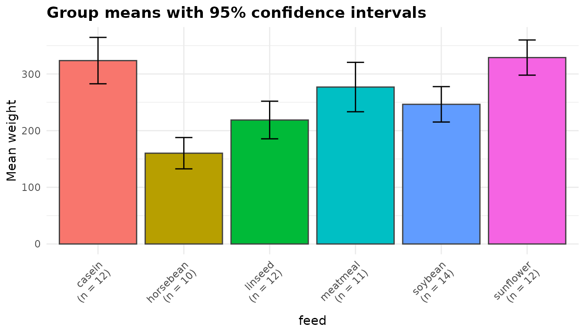

Each bar is a group mean and each error bar its t interval at
`conf_level`, computed from that group alone, so a small or variable
group gets a wide interval. The axis labels carry each group’s size.
These intervals describe the means one at a time; whether two groups
differ is a question for `$posthoc`, whose intervals are for the
differences.

### Box plots: `anova_welch()`, `anova_kw()`, `anova_glm()` and `anova_count()`

Four functions draw the response by group as box plots, with the groups
ordered by their medians and each label showing the number of
observations in that cell.
[`anova_welch()`](https://elkronos.github.io/anovakit/reference/anova_welch.md)
and
[`anova_kw()`](https://elkronos.github.io/anovakit/reference/anova_kw.md)
call it `box`:

``` r

plot(fits$welch, "box")
plot(fits$kw, "box")
```

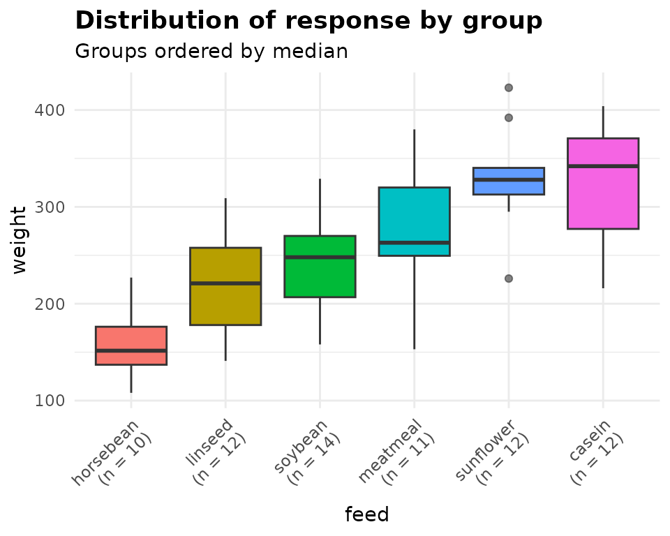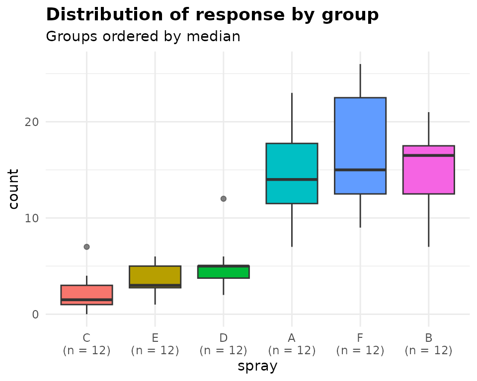

[`anova_glm()`](https://elkronos.github.io/anovakit/reference/anova_glm.md)
calls it `box` too (for a numeric response), and
[`anova_count()`](https://elkronos.github.io/anovakit/reference/anova_count.md)
calls it `observed`. With several grouping variables the boxes are the
cells of their combinations:

``` r

plot(fits$glm, "box")
plot(fits$count, "observed")
```

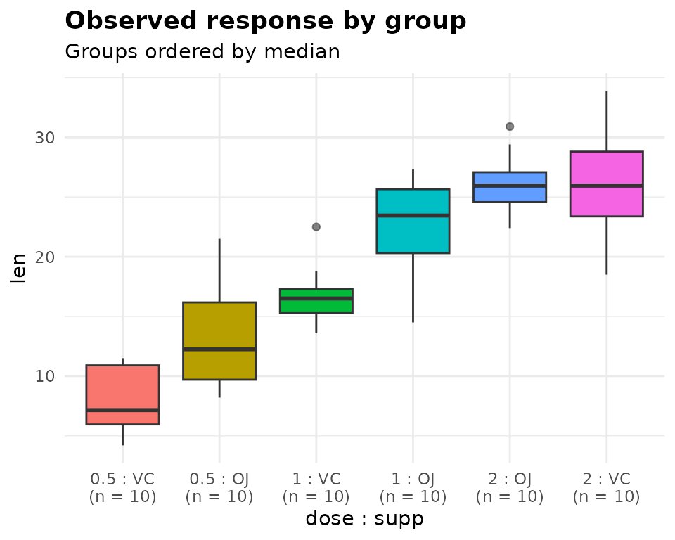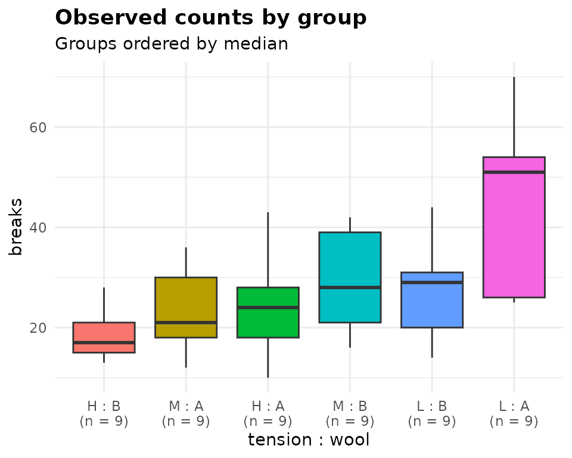

What to look for: boxes of very different heights (unequal spread, which
[`anova_welch()`](https://elkronos.github.io/anovakit/reference/anova_welch.md)
and robust standard errors allow for and a pooled-variance model does
not), a median off-centre in its box or a long whisker on one side
(skew), and points beyond the whiskers. In the insect counts on the
right of the first pair, the sprays with low counts also have the
smallest spread, as counts usually do: a hint that a count model suits
them better than a comparison of means.

When
[`anova_count()`](https://elkronos.github.io/anovakit/reference/anova_count.md)
has an exposure `offset`, counts from units observed for different
lengths of time are not comparable, so its `observed` plot shows rates
instead, count divided by exposure.
[`MASS::Insurance`](https://rdrr.io/pkg/MASS/man/Insurance.html) records
claims against the number of policy holders:

``` r

ins <- anova_count(MASS::Insurance, "Claims", "Age", offset = "Holders")
plot(ins, "observed")$labels[c("title", "y")]
#> $title
#> [1] "Observed rates by group (Claims per unit of Holders)"
#> 
#> $y
#> [1] "Claims / Holders"
```

### Observed proportions: `anova_bin()`

``` r

plot(fits$bin, "proportions")
```

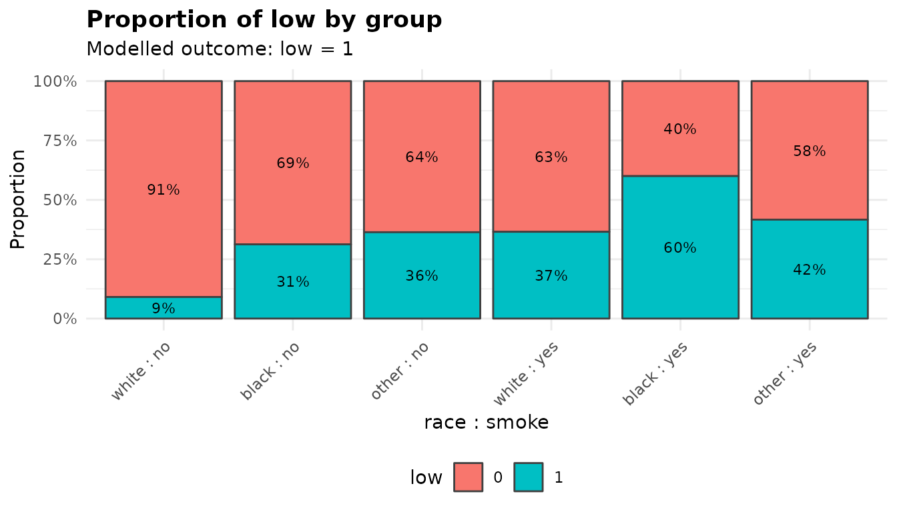

Each bar is one cell of the grouping variables, split into the
proportions of the two outcomes and labelled with the percentages; the
subtitle names the level being modelled. The cells are the combinations
of every grouping variable, even when the model is additive, so this is
the place to see an interaction the model does not include.

## Marginal means with intervals

Every model-based function plots its estimated marginal means
(`$emmeans`) with error bars at `conf_level`; the subtitle says which
level. The first grouping variable goes on the x axis and any others are
mapped to colour, with a line joining the means of each of their levels.
With a single (unordered) grouping variable there is no line to draw:
the groups have no order for it to follow, so the means are points with
error bars. As with the group means, the error bars are intervals for
each mean, not for the differences between them: two bars can overlap
while `$posthoc` finds a clear difference.

[`anova_ancova()`](https://elkronos.github.io/anovakit/reference/anova_ancova.md)
plots means adjusted to the covariate mean, which is why the title says
“covariate-adjusted”. Its single grouping variable gives points and
error bars only:

``` r

plot(fits$ancova, "emmeans")
```

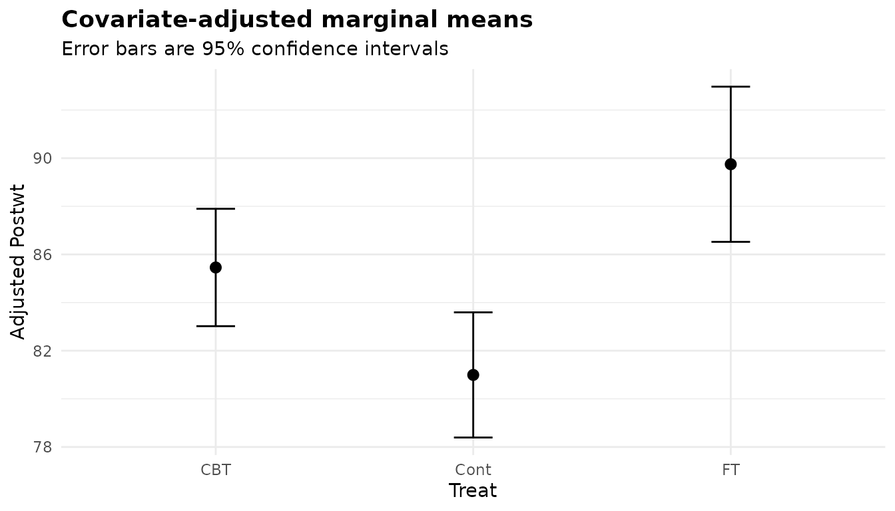

[`anova_glm()`](https://elkronos.github.io/anovakit/reference/anova_glm.md)
with an interaction plots one line per level of the second factor, so
lines that are not parallel are the interaction. In the tooth growth
data the advantage of orange juice over vitamin C at the two lower doses
has gone at the highest:

``` r

plot(fits$glm, "emmeans")
```


[`anova_count()`](https://elkronos.github.io/anovakit/reference/anova_count.md)
plots the estimated mean count in each cell, on the count scale (a rate
per unit of exposure when there is an `offset`). Here wool A breaks far
more often than wool B at low tension and no more often at the other
two:

``` r

plot(fits$count, "emmeans")
```

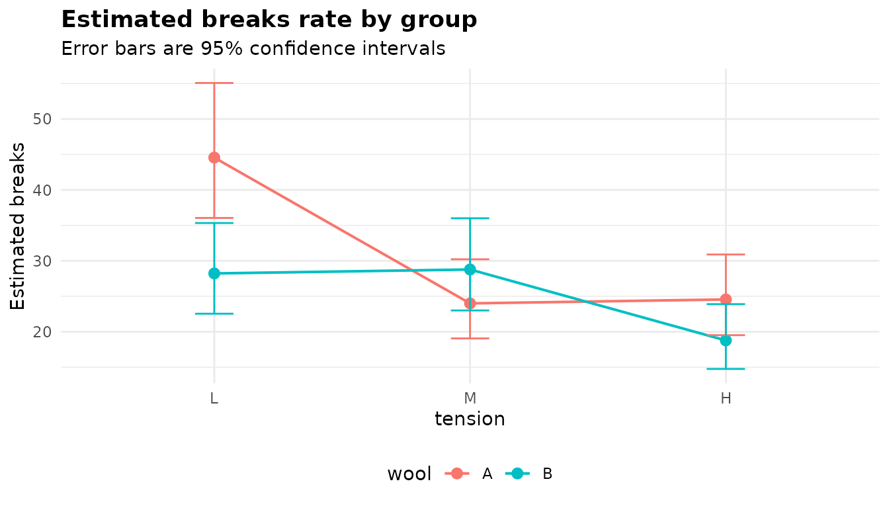

[`anova_rm()`](https://elkronos.github.io/anovakit/reference/anova_rm.md)
plots the factors named in `emm_specs` (by default the within-subject
factors). Here the plant’s origin was added, so the lines compare the
two types across concentrations, and the gap between them widens as the
concentration rises:

``` r

plot(fits$rm, "emmeans")
```

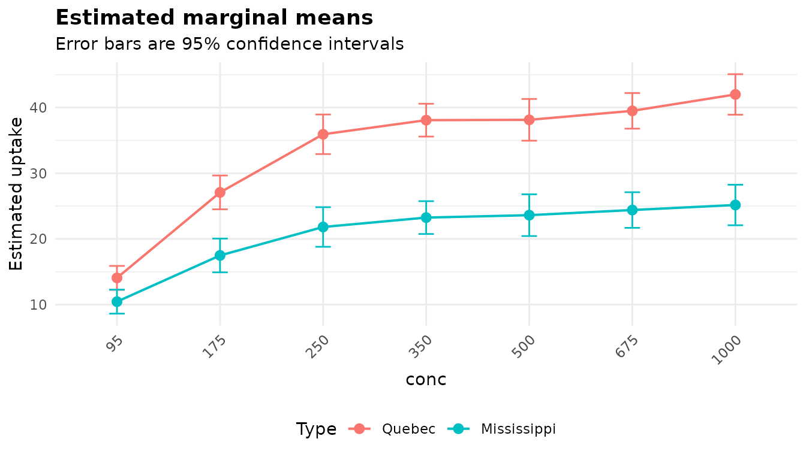

[`anova_manova()`](https://elkronos.github.io/anovakit/reference/anova_manova.md)
plots one panel per response, each with its own y axis. As in the other
functions’ plots, the means of a single unordered grouping variable are
points with error bars, not joined by a line:

``` r

plot(fits$manova, "emmeans")
```

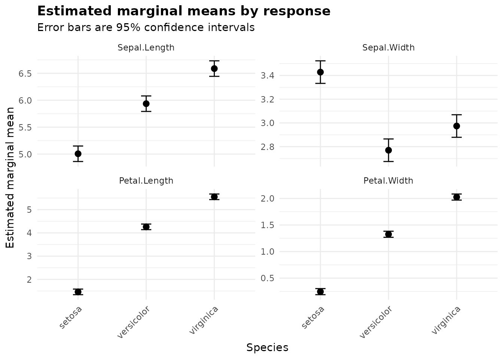

When the grouping variables enter a model additively (the default for
[`anova_bin()`](https://elkronos.github.io/anovakit/reference/anova_bin.md),
[`anova_count()`](https://elkronos.github.io/anovakit/reference/anova_count.md),
[`anova_glm()`](https://elkronos.github.io/anovakit/reference/anova_glm.md)
and
[`anova_manova()`](https://elkronos.github.io/anovakit/reference/anova_manova.md)
with more than one), the marginal means are reported for each factor
separately, averaged over the others, and the plot has one panel per
factor:

``` r

plot(fits$bin, "emmeans")
```

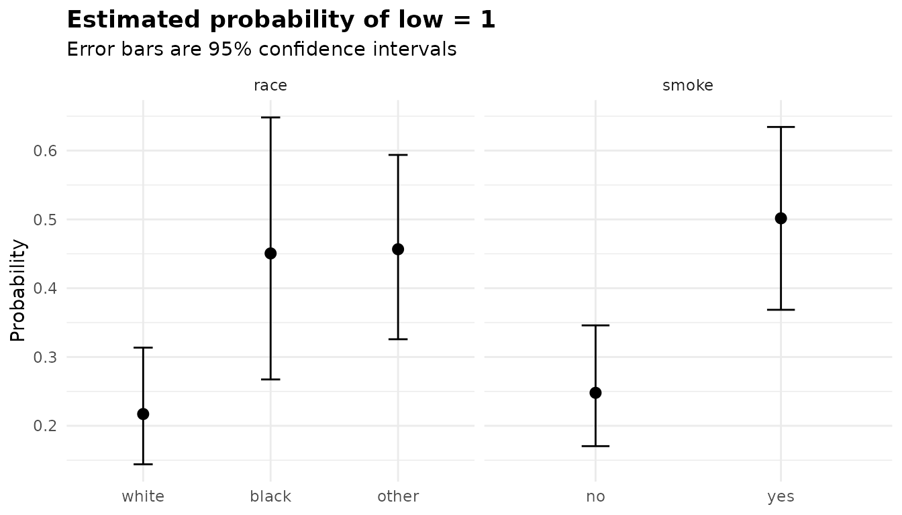

## Residual diagnostics

### Q-Q plots

A Q-Q plot puts the sorted residuals against the quantiles a normal
distribution would give them. Points on the dashed line are consistent
with normality; an S shape (both tails beyond the line) means heavy
tails, a bow means skew, and horizontal steps mean tied or discrete
values. What goes into the plot differs by function.
[`anova_welch()`](https://elkronos.github.io/anovakit/reference/anova_welch.md)
standardises each value within its own group, as Welch’s test allows
each group its own variance;
[`anova_kw()`](https://elkronos.github.io/anovakit/reference/anova_kw.md)
does the same, as context only. The chick weights follow the line
closely:

``` r

plot(fits$welch, "qq")
```

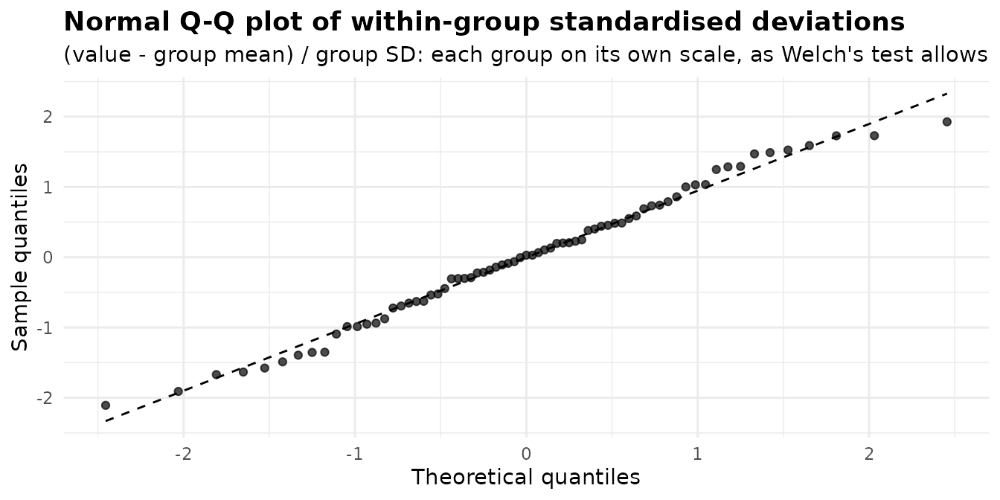

The insect counts rise above the line in the upper tail, the mark of
right skew, and show short steps where counts are tied:

``` r

plot(fits$kw, "qq")
```

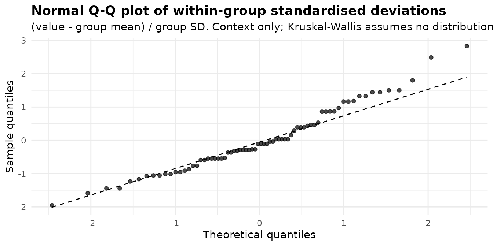

### Residuals against fitted values

The model-based functions pair a Q-Q plot with a plot of residuals
against fitted values. In a model with only grouping variables the
fitted values take one value per cell, so the points line up in vertical
strips; compare the strips’ spread.
[`anova_glm()`](https://elkronos.github.io/anovakit/reference/anova_glm.md)
plots deviance residuals, which for a Gaussian model are the ordinary
residuals:

``` r

plot(fits$glm, "residuals")
plot(fits$glm, "qq")
```

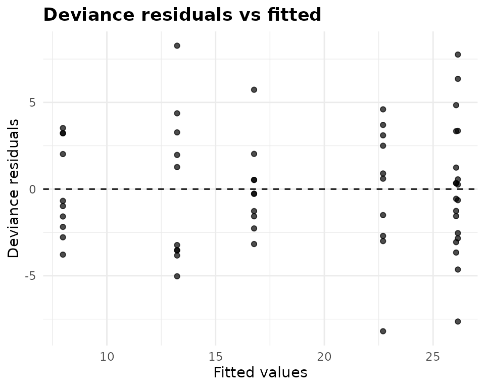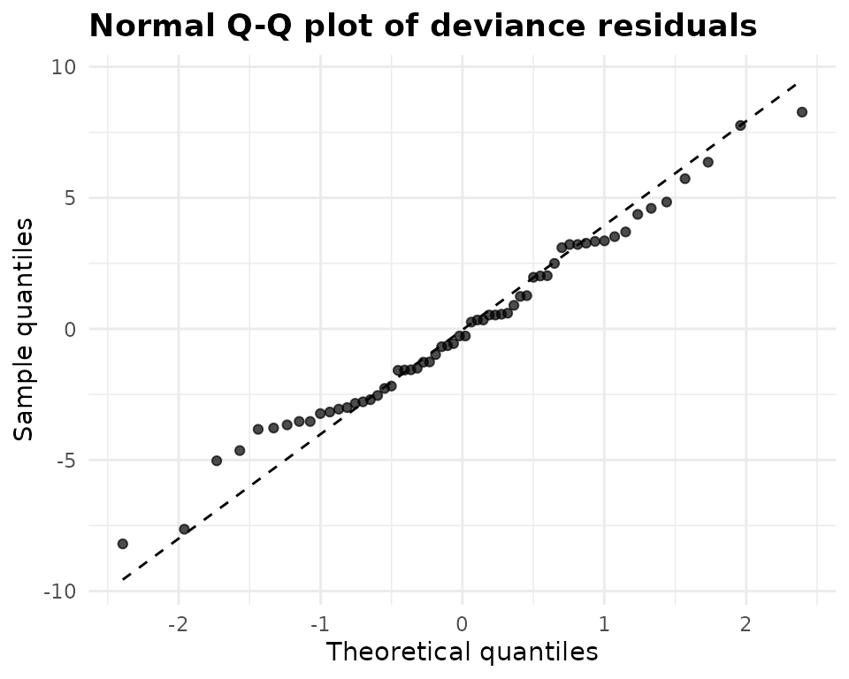

What to look for: a funnel, with the spread growing with the fitted
value, means the variance depends on the mean (use `vcov_type = "HC3"`,
or a family or transformation that expects it); a curve means the model
misses something systematic. The tooth-growth strips have similar
spreads. With a covariate in the model the fitted values spread out
continuously, as in
[`anova_ancova()`](https://elkronos.github.io/anovakit/reference/anova_ancova.md):

``` r

plot(fits$ancova, "residuals")
plot(fits$ancova, "qq")
```

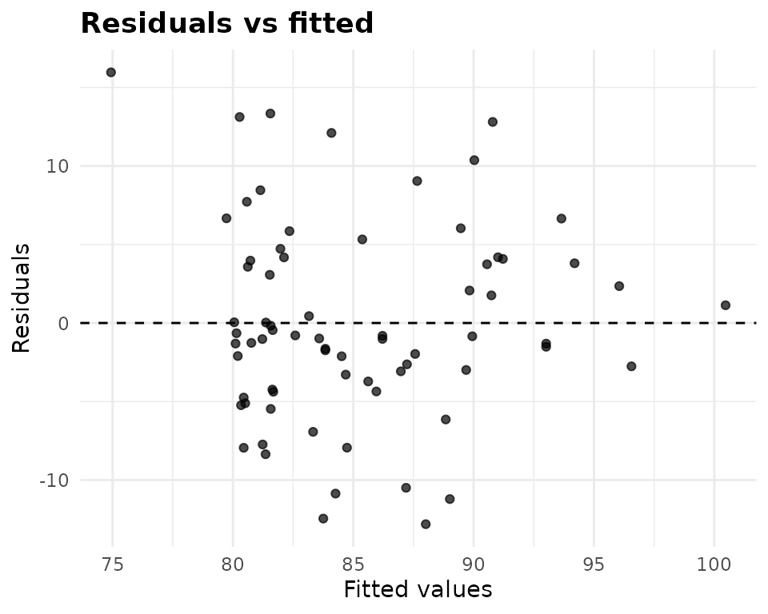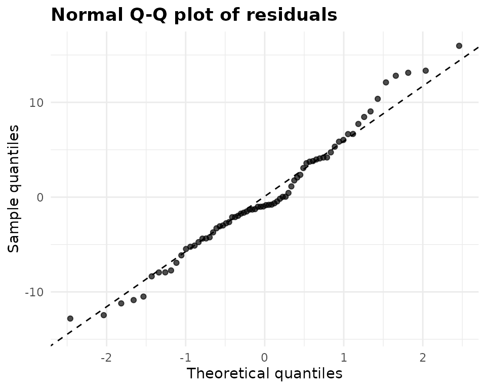

[`anova_manova()`](https://elkronos.github.io/anovakit/reference/anova_manova.md)
gives both plots for each response, from that response’s univariate
model:

``` r

plot(fits$manova, "residuals_Petal.Width")
plot(fits$manova, "qq_Petal.Width")
```

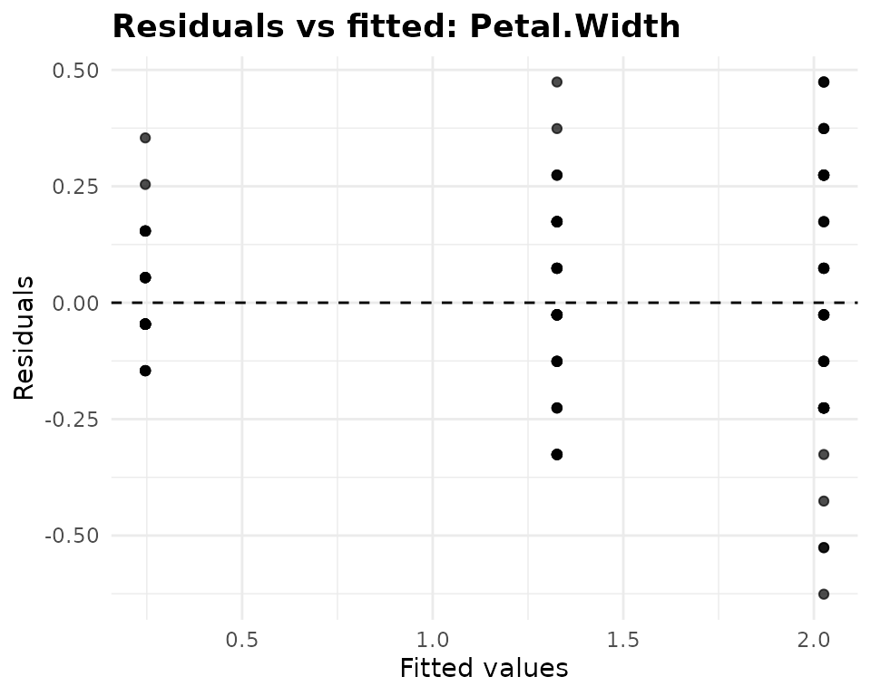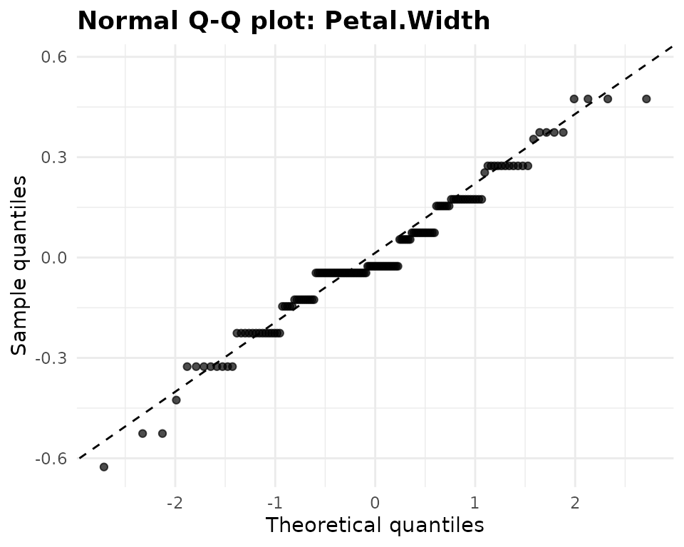

Petal width shows both patterns worth knowing. The strips widen from
left to right, a funnel: the species with wider petals vary more
(residual standard deviations of 0.11, 0.20, 0.27 for setosa, versicolor
and virginica), which is part of what Box’s M detects. And the Q-Q plot
moves in steps, because petal width is recorded to the nearest 0.1 cm,
so many residuals are tied.

### Repeated measures: residuals, Q-Q and index

[`anova_rm()`](https://elkronos.github.io/anovakit/reference/anova_rm.md)
plots the within-subject residuals, what is left of each value after its
subject’s mean and its cell’s mean are removed, against the fitted
values:

``` r

plot(fits$rm, "residuals")
```

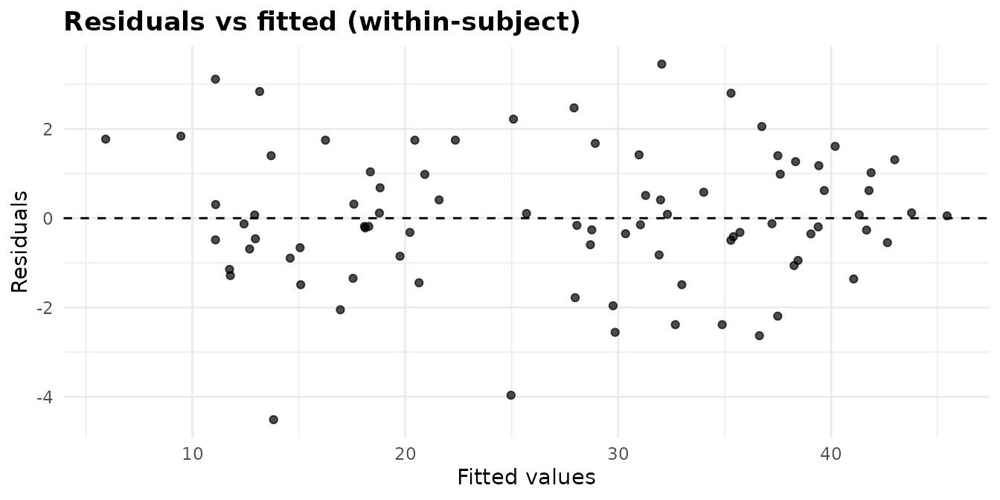

Its Q-Q plot standardises them within each within-subject cell, as the
normality tests in `$assumptions$normality` do:

``` r

plot(fits$rm, "qq")
```

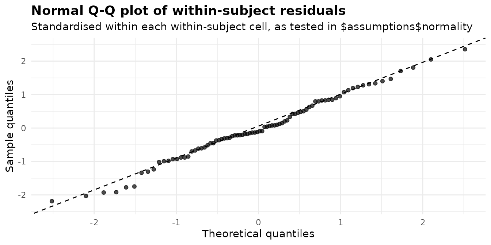

The third plot shows the same residuals in the row order of
`$data_used`:

``` r

plot(fits$rm, "index")
```

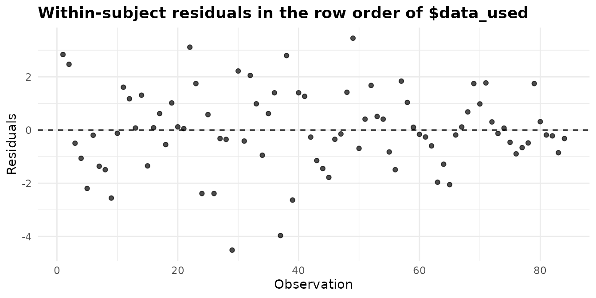

It is only as informative as that order. `CO2` is sorted by plant and,
within plant, by concentration, so a run of residuals of one sign would
point to a plant whose response curve has a different shape from the
others’. In data stored in the order they were collected, a trend here
would point to drift over time.

## Special plots

### The covariate plot: `anova_ancova()`

``` r

plot(fits$ancova, "covariate")
```


The response against the covariate, one colour and one fitted line per
group, with a confidence band at `conf_level` for each line. It shows
the two things an ANCOVA rests on. The slopes: an ANCOVA with common
slopes assumes parallel lines, and here the control group’s line is flat
while both treatment lines rise, which is why the homogeneity-of-slopes
test rejected and the fit kept the interaction (see `$slopes_test` and
`$simple_slopes`). And the overlap: the adjusted means are read at the
covariate mean, and a group whose points do not reach that value is
being extrapolated along its line. The covariate is shown on its
original scale even though the model is fitted on the centred covariate.

### The canonical plot: `anova_manova()`

``` r

plot(fits$manova, "canonical")
```

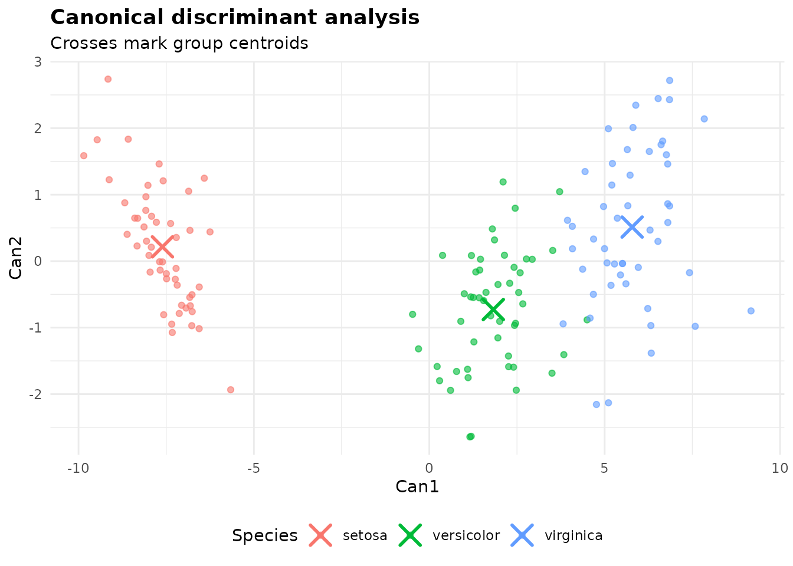

The canonical discriminant analysis finds the combinations of the
responses that separate the groups best. Each point is one observation’s
score on the first two axes, and the crosses are the group centroids.
The axes are scaled to unit pooled within-group variance, so a distance
of 1 is one within-group standard deviation: centroids several units
apart are well separated, as the three species are along `Can1`.
`$canonical` gives each axis’s share of the between-group variation, and
`$assumptions$structure_coefficients` says which responses each axis is
made of:

``` r

fits$manova$canonical
#>   axis eigenvalue canonical_r prop_variance
#> 1 Can1  32.191929   0.9848209   0.991212605
#> 2 Can2   0.285391   0.4711970   0.008787395
fits$manova$assumptions$structure_coefficients
#>       response       Can1      Can2
#> 1 Sepal.Length  0.2225959 0.3108117
#> 2  Sepal.Width -0.1190115 0.8636809
#> 3 Petal.Length  0.7060654 0.1677014
#> 4  Petal.Width  0.6331779 0.7372421
```

`Can1` carries 99.1% of the separation and is dominated by the petal
measurements. With only one estimable axis (two groups, or a
single-degree-of-freedom term) the plot is a box plot of `Can1` by group
instead.

## Customising

### Getting a plot

`plot(fit, "name")` returns the stored object, the same as
`fit$plots$name`; `plot(fit, 2)` takes the second by position, and
`plot(fit)` the first. Asking for a name that does not exist lists the
ones that do:

``` r

p <- plot(fits$welch, "means")
identical(p, fits$welch$plots$means)
#> [1] TRUE
try(plot(fits$welch, "residuals"))
#> Error : No plot called "residuals". Available: means, box, qq.
```

### Skipping them: `plots = FALSE`

Building the plots takes time, and each plot carries its own copy of the
data it draws. When you only want the numbers, in a simulation or a loop
over many responses, turn them off:

``` r

quick <- anova_manova(iris, names(iris)[1:4], "Species", plots = FALSE)
length(quick$plots)
#> [1] 0
identical(quick$multivariate, fits$manova$multivariate)
#> [1] TRUE
c(with_plots = length(serialize(fits$manova, NULL)),
  without = length(serialize(quick, NULL)))
#> with_plots    without 
#>   24572810     144302
plot(quick)
#> This fit holds no plots (it was called with plots = FALSE).
```

The tables are unchanged, the time spent building the plots is saved,
and without its ten plots the MANOVA fit is 170 times smaller when
saved. [`plot()`](https://rdrr.io/r/graphics/plot.default.html) on such
a fit says why it has nothing to return.

### Changing a plot with `+`

The rest of this article attaches ggplot2:

``` r

library(ggplot2)
```

Anything you can add to a ggplot you can add to these: labels, scales,
themes, coordinates, facets, extra layers. The package’s plots use
[`theme_minimal()`](https://ggplot2.tidyverse.org/reference/ggtheme.html)
with a few adjustments: a bold title, the legend at the bottom, and x
labels rotated by 45 degrees when there are more than six groups or any
label is longer than eight characters. Adding a *complete* theme such as
[`theme_bw()`](https://ggplot2.tidyverse.org/reference/ggtheme.html)
replaces all of that; adding
[`theme()`](https://ggplot2.tidyverse.org/reference/theme.html) changes
only the elements you name.

A horizontal layout often suits long group names.
[`coord_flip()`](https://ggplot2.tidyverse.org/reference/coord_flip.html)
moves the group labels to the vertical axis but leaves the rotation on
the horizontal one, which is now the numeric axis, so undo it there.
Note too that
[`labs()`](https://ggplot2.tidyverse.org/reference/labs.html) names
aesthetics, not positions: after the flip, `x` is still the groups.

``` r

plot(fits$welch, "box") +
  coord_flip() +
  scale_y_continuous(breaks = seq(100, 450, by = 50)) +
  labs(title = "Chick weight by feed supplement", subtitle = NULL,
       x = NULL, y = "Weight at six weeks (g)") +
  theme(axis.text.x = element_text(angle = 0, hjust = 0.5),
        plot.title = element_text(size = 15))
```

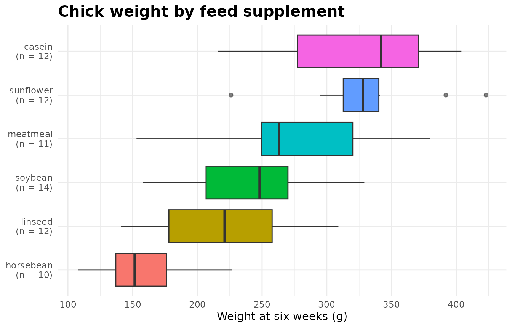

### Colour-blind-safe palettes

The default ggplot2 palette separates groups by hue at equal lightness,
which readers with red-green colour blindness cannot always tell apart.
Two alternatives need nothing beyond R and ggplot2: the Okabe-Ito
palette, which ships with R as
[`palette.colors()`](https://rdrr.io/r/grDevices/palette.html), and the
viridis scales built into ggplot2. Mapping a second channel, such as
point shape, helps too, and survives greyscale printing:

``` r

okabe_ito <- unname(palette.colors(palette = "Okabe-Ito"))[-1]  # drop black
plot(fits$glm, "emmeans") +
  aes(shape = .series) +
  scale_colour_manual(values = okabe_ito) +
  labs(colour = "Delivery", shape = "Delivery", x = "Dose (mg/day)",
       y = "Tooth length")
```

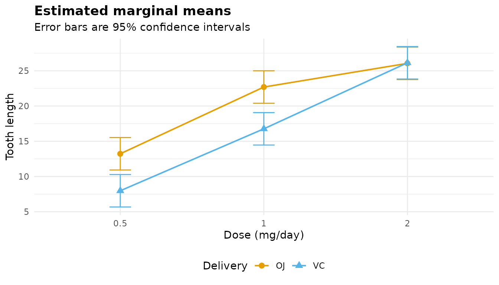

Giving the colour and the shape the same legend title merges their
legends. For the filled plots (bars, boxes and the proportions plot) the
equivalents are `scale_fill_manual(values = okabe_ito)` and
[`scale_fill_viridis_d()`](https://ggplot2.tidyverse.org/reference/scale_viridis.html).

To map something, you need the plot’s own column names. They are in
`names(p$data)`; the line grouping of an emmeans plot with several
factors is `.series`, which is what the shape was mapped to above.

### Facets, and the per-factor plot of an additive model

A plot can be split by any column of its data. The covariate plot’s
group column is called `.cell`:

``` r

p <- plot(fits$ancova, "covariate")
names(p$data)
#> [1] "Postwt" "Prewt"  ".cell"
p + facet_wrap(~ .cell) + theme(legend.position = "none")
```

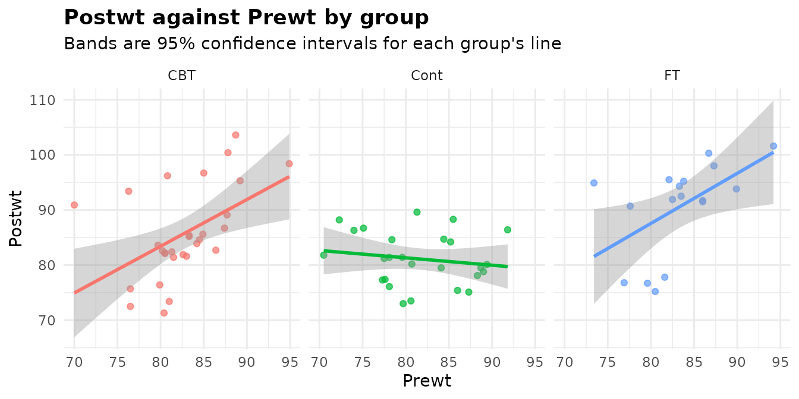

With one panel per group the three slopes, and the range of the
covariate each group was observed over, are easier to compare.

The marginal means of an additive model are already faceted, one panel
per factor, by a column called `.term`. Adding a new
[`facet_wrap()`](https://ggplot2.tidyverse.org/reference/facet_wrap.html)
replaces that faceting, which is how to change its layout or its strip
labels:

``` r

plot(fits$bin, "emmeans") +
  facet_wrap(~ .term, scales = "free_x",
             labeller = as_labeller(c(race = "Mother's race",
                                      smoke = "Smoked during pregnancy"))) +
  scale_y_continuous(labels = function(x) paste0(100 * x, "%")) +
  labs(y = "Probability of low birth weight")
```

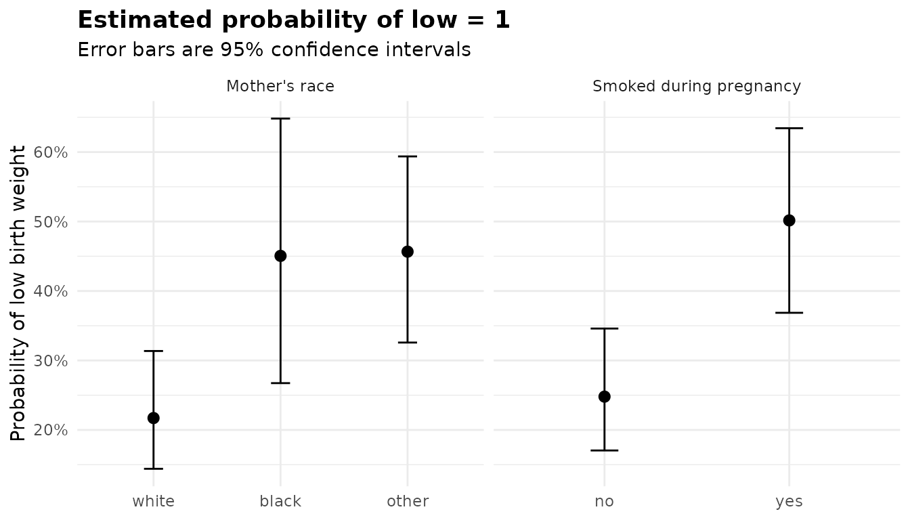

### Building your own figures from `$emmeans` and `$posthoc`

The tables behind the plots are ordinary data frames, so a figure the
package does not draw is a few lines away. A forest plot of every
pairwise difference makes the comparisons, rather than the means, the
thing you see. For the chick weights, from a Gaussian model, whose
`$posthoc` intervals are Tukey-adjusted:

``` r

cw <- anova_glm(chickwts, "weight", "feed", plots = FALSE)
ph <- cw$posthoc
ph$contrast <- factor(ph$contrast, levels = rev(ph$contrast))
ggplot(ph, aes(x = estimate, y = contrast)) +
  geom_vline(xintercept = 0, linetype = "dashed") +
  geom_pointrange(aes(xmin = conf_low, xmax = conf_high)) +
  labs(title = "Pairwise differences in chick weight",
       subtitle = sprintf("%s%% simultaneous intervals (adjust = \"%s\")",
                          100 * cw$conf_level, ph$adjustment[1]),
       x = "Difference in mean weight (g)", y = NULL) +
  theme_minimal()
```

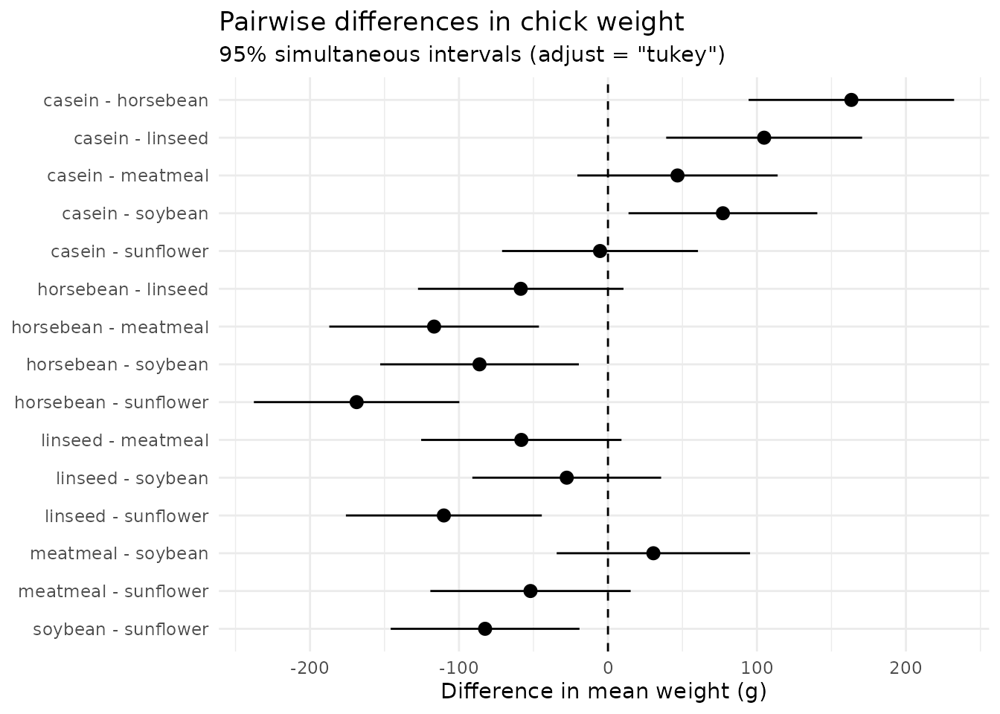

An interval that crosses the dashed line is a difference the data cannot
distinguish from zero at the adjusted level. The intervals in `$posthoc`
from the model-based functions are adjusted by `adjust`; those from
[`anova_welch()`](https://elkronos.github.io/anovakit/reference/anova_welch.md)
are per-comparison intervals, so label them accordingly. `$emmeans`
works the same way: its `estimate`, `conf_low` and `conf_high` columns
are what the marginal-means plots draw.

Ratios belong on a log scale, where an odds ratio of 2 and one of 0.5
are the same distance from 1. `$effect_sizes` of
[`anova_bin()`](https://elkronos.github.io/anovakit/reference/anova_bin.md)
holds each level’s odds ratio against the reference level, with
profile-likelihood intervals:

``` r

or <- fits$bin$effect_sizes
ggplot(or, aes(x = odds_ratio, y = comparison)) +
  geom_vline(xintercept = 1, linetype = "dashed") +
  geom_pointrange(aes(xmin = conf_low, xmax = conf_high)) +
  scale_x_log10(breaks = c(1, 2, 4, 8)) +
  facet_grid(factor ~ ., scales = "free_y", space = "free_y") +
  labs(title = "Odds of low birth weight",
       x = "Odds ratio (log scale)", y = NULL) +
  theme_minimal()
```

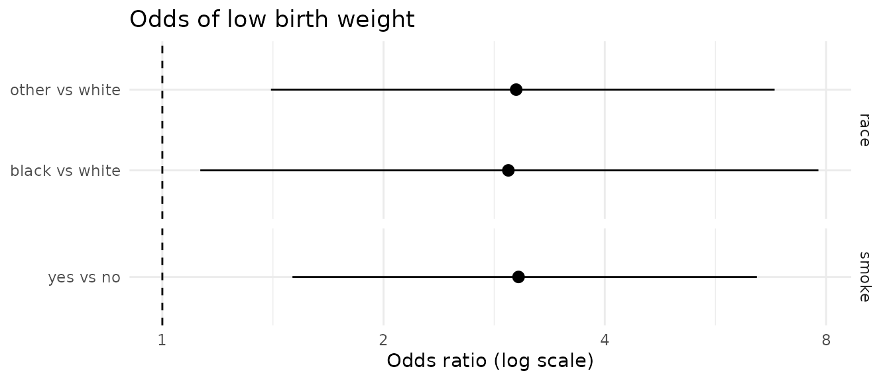

The same pattern works for incidence rate ratios (`IRR` in the
`$effect_sizes` of
[`anova_count()`](https://elkronos.github.io/anovakit/reference/anova_count.md))
and for the `ratio` column of a `$posthoc` on the log or logit scale. If
you summarise `$emmeans_object` yourself with **emmeans**, pass
`level = fit$conf_level`: the grid carries emmeans’ own default level,
not the fit’s.

### Combining plots

Because each plot keeps its data, several plots of one kind can be
combined into one faceted figure without any extra package. The four Q-Q
plots of the MANOVA:

``` r

responses <- names(iris)[1:4]
qq_data <- do.call(rbind, lapply(responses, function(r) {
  data.frame(response = r,
             value = fits$manova$plots[[paste0("qq_", r)]]$data$value)
}))
ggplot(qq_data, aes(sample = value)) +
  stat_qq(alpha = 0.6) +
  stat_qq_line(linetype = "dashed") +
  facet_wrap(~ response, scales = "free_y") +
  labs(title = "Normal Q-Q plots of residuals, by response",
       x = "Theoretical quantiles", y = "Sample quantiles") +
  theme_minimal()
```

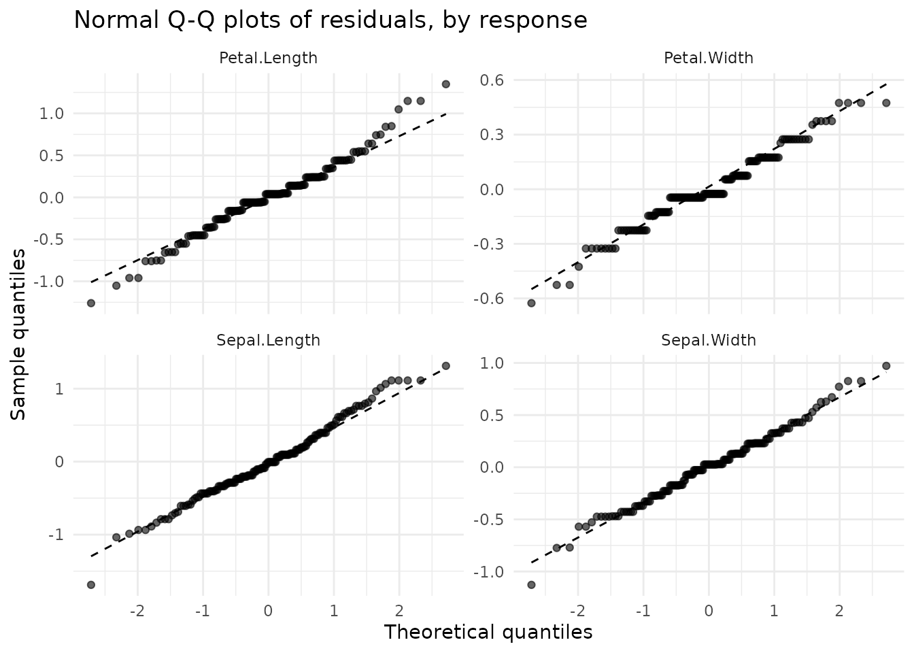

Placing *different* plots side by side is a job for a layout package.
**patchwork** is the usual choice; it is not an anovakit dependency, so
the chunk below is not run here:

``` r

library(patchwork)
plot(fits$ancova, "residuals") + plot(fits$ancova, "qq")
```

In a report built with knitr, a chunk with `fig.show = "hold"` and
`out.width = "50%"` puts consecutive plots side by side without any
package, which is how the pairs in this article were drawn.

### Saving

[`ggsave()`](https://ggplot2.tidyverse.org/reference/ggsave.html) saves
a ggplot to a file, with the format taken from the extension. Give the
size in inches and, for raster formats, the resolution:

``` r

out <- file.path(tempdir(), "anorexia-covariate.png")
ggsave(out, plot(fits$ancova, "covariate"), width = 7, height = 4.5,
       dpi = 300)
file.exists(out)
#> [1] TRUE
```

A loop saves every plot of a fit, named after it:

``` r

dir <- file.path(tempdir(), "manova-plots")
dir.create(dir, showWarnings = FALSE)
for (nm in names(fits$manova$plots)) {
  ggsave(file.path(dir, paste0(nm, ".pdf")), fits$manova$plots[[nm]],
         width = 6, height = 4)
}
list.files(dir)
#>  [1] "canonical.pdf"              "emmeans.pdf"               
#>  [3] "qq_Petal.Length.pdf"        "qq_Petal.Width.pdf"        
#>  [5] "qq_Sepal.Length.pdf"        "qq_Sepal.Width.pdf"        
#>  [7] "residuals_Petal.Length.pdf" "residuals_Petal.Width.pdf" 
#>  [9] "residuals_Sepal.Length.pdf" "residuals_Sepal.Width.pdf"
```

PDF keeps lines and text sharp at any size, which suits print (so does
SVG, for which
[`ggsave()`](https://ggplot2.tidyverse.org/reference/ggsave.html) needs
the svglite package); PNG at 300 dpi suits slides and documents.

### `conf_level` sets every error bar

Every interval a function returns, and so every error bar and band in
its plots, uses `conf_level`. The titles and subtitles follow it:

``` r

w99 <- anova_welch(chickwts, "weight", "feed", conf_level = 0.99)
plot(w99, "means")$labels$title
#> [1] "Group means with 99% confidence intervals"
a99 <- anova_ancova(MASS::anorexia, "Postwt", "Treat", "Prewt",
                    conf_level = 0.99)
plot(a99, "emmeans")$labels$subtitle
#> [1] "Error bars are 99% confidence intervals"
plot(a99, "covariate")$labels$subtitle
#> [1] "Bands are 99% confidence intervals for each group's line"
```

The bars and bands are then wider by exactly the change in the critical
value: for the casein group, the 99% interval for the mean is 1.41 times
as wide as the 95% one. To show a different level, refit with
`conf_level` rather than editing the plot: the intervals in the tables
and the figures then agree.

## See also

- [Diagnostics](https://elkronos.github.io/anovakit/articles/diagnostics.md)
  for what the residual plots and the tests beside them check, and what
  to do when they fail.
- [Working with
  results](https://elkronos.github.io/anovakit/articles/results.md) for
  `$emmeans`, `$posthoc` and the rest of the returned object.
- The per-function articles, each with its own plots in context:
  [Welch](https://elkronos.github.io/anovakit/articles/welch.md),
  [Kruskal-Wallis](https://elkronos.github.io/anovakit/articles/kruskal-wallis.md),
  [ANCOVA](https://elkronos.github.io/anovakit/articles/ancova.md),
  [GLM](https://elkronos.github.io/anovakit/articles/glm.md), [repeated
  measures](https://elkronos.github.io/anovakit/articles/repeated-measures.md),
  [MANOVA](https://elkronos.github.io/anovakit/articles/manova.md),
  [binary](https://elkronos.github.io/anovakit/articles/binary.md),
  [counts](https://elkronos.github.io/anovakit/articles/counts.md).
