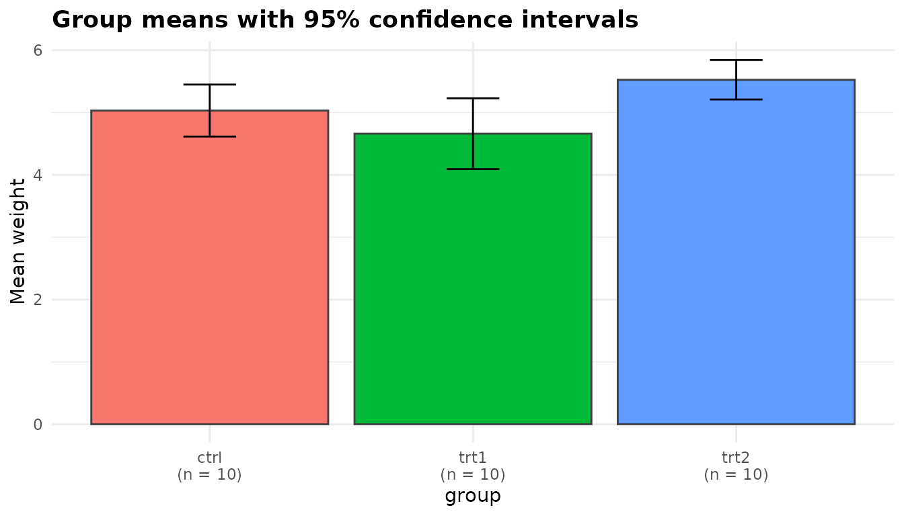
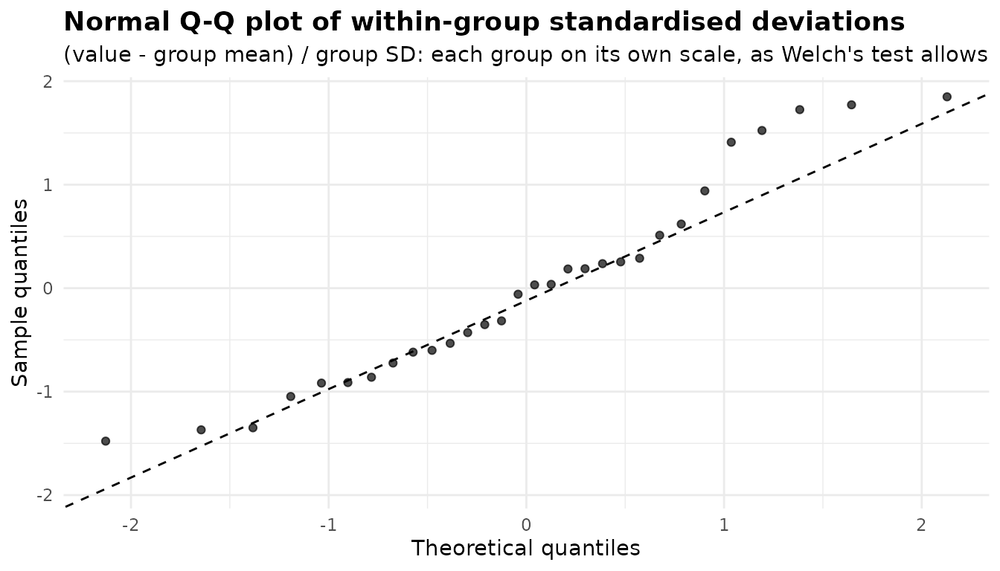
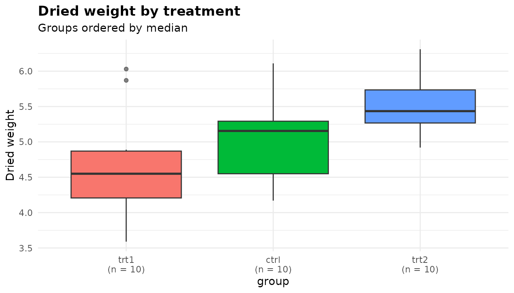

# Welch's ANOVA: comparing means when variances differ

``` r

library(anovakit)
```

[`anova_welch()`](https://elkronos.github.io/anovakit/reference/anova_welch.md)
compares the mean of a numeric response across two or more groups
without assuming that the groups share a variance. It is the package’s
default choice for a one-way comparison of means: when the variances are
equal it gives up almost nothing to the classical F test, and when they
are not it keeps its stated error rate where the classical test does
not. If the response is heavily skewed, ordinal, or has values that are
only “more extreme” rather than measured, compare ranks with
[`anova_kw()`](https://elkronos.github.io/anovakit/reference/anova_kw.md)
([walkthrough](https://elkronos.github.io/anovakit/articles/kruskal-wallis.md)).
To adjust for a covariate use
[`anova_ancova()`](https://elkronos.github.io/anovakit/reference/anova_ancova.md),
and to separate the main effects and interaction of two or more factors
use
[`anova_glm()`](https://elkronos.github.io/anovakit/reference/anova_glm.md)
([walkthrough](https://elkronos.github.io/anovakit/articles/glm.md)).
The [decision
guide](https://elkronos.github.io/anovakit/articles/choosing.md) covers
the choice in more detail.

## The data

`PlantGrowth` records the dried weight of 30 plants, ten grown under
control conditions and ten under each of two treatments.

``` r

head(PlantGrowth)
#>   weight group
#> 1   4.17  ctrl
#> 2   5.58  ctrl
#> 3   5.18  ctrl
#> 4   6.11  ctrl
#> 5   4.50  ctrl
#> 6   4.61  ctrl
table(PlantGrowth$group)
#> 
#> ctrl trt1 trt2 
#>   10   10   10
sds <- tapply(PlantGrowth$weight, PlantGrowth$group, sd)
round(cbind(mean = tapply(PlantGrowth$weight, PlantGrowth$group, mean),
            sd = sds), 3)
#>       mean    sd
#> ctrl 5.032 0.583
#> trt1 4.661 0.794
#> trt2 5.526 0.443
```

The question is whether the treatments change the mean weight. The
standard deviations are not the same: `trt1` varies about 1.79 times as
much as `trt2`, so its variance is about 3.22 times as large. With
groups this small you cannot tell whether that is a real difference in
spread or sampling noise, and that uncertainty is exactly the case for a
test that does not need to know.

## Fitting the model

Columns are named as character strings: the response, then one or more
grouping columns.

``` r

fit <- anova_welch(PlantGrowth, "weight", "group")
fit
#> Welch's analysis of variance 
#> ----------------------------
#> Call: anova_welch(data = PlantGrowth, response = "weight", groups = "group")
#> Observations used: 30
#> 
#> Omnibus test
#>    term statistic num_df den_df p_value
#> 1 group     5.181      2  17.13 0.01739
#> 
#> Plots available: means, box, qq
#>   (use plot(x, which = "means"))
```

Reading the printout from the top:

- The first line names the method, and `Call:` records how the fit was
  made.
- `Observations used: 30` is the number of rows analysed. Had any rows
  been dropped for a missing or infinite value, the count would appear
  here with a pointer to `$notes`.
- `Omnibus test` is the Welch test itself, described in the next
  section.
- There is no `Notes` block, because the function had nothing to report
  for these data. [What the notes say](#what-the-notes-say) below
  explains when it does.
- `Plots available` lists the three plots stored in `$plots`.

`summary(fit)` prints the same header followed by every table the fit
holds: the assumption checks, effect sizes, group summaries and pairwise
comparisons. The sections below take those one at a time.

## The omnibus test

``` r

fit$anova
#>    term statistic num_df   den_df    p_value
#> 1 group  5.180972      2 17.12842 0.01739282
```

- `term` is the grouping column (or a label for the combined cells when
  there are several; see [below](#several-grouping-columns)).
- `statistic` is Welch’s F. It is built from each group’s own variance,
  with each group’s mean weighted by its precision (its size over its
  variance), so a noisy group counts for less.
- `num_df` is the number of groups minus one.
- `den_df` is Welch’s approximate denominator degrees of freedom,
  estimated from the group sizes and variances. It is not on the same
  footing as the classical test’s 30 - 3 = 27. With three groups of ten
  it would be 18 even if the three sample variances were identical, and
  it falls as they diverge: here it is 17.13.
- `p_value` is the probability of an F at least this large if all the
  group means were equal.

The test is
[`stats::oneway.test()`](https://rdrr.io/r/stats/oneway.test.html) with
`var.equal = FALSE`, and the `htest` object it returns is kept in
`$model`. There is no fitted model, so `$emmeans_object` is `NULL`.

``` r

fit$model
#> 
#>  One-way analysis of means (not assuming equal variances)
#> 
#> data:  weight and group
#> F = 5.181, num df = 2.000, denom df = 17.128, p-value = 0.01739
oneway.test(weight ~ group, data = PlantGrowth, var.equal = TRUE)
#> 
#>  One-way analysis of means
#> 
#> data:  weight and group
#> F = 4.8461, num df = 2, denom df = 27, p-value = 0.01591
```

The classical F test, shown second, happens to reach a similar
conclusion here (p = 0.016 against 0.017). That will not always be so.

## Why not the classical F test?

`InsectSprays` counts the insects left on plots treated with six sprays,
twelve plots per spray. The spreads differ a great deal:

``` r

round(tapply(InsectSprays$count, InsectSprays$spray, sd), 2)
#>    A    B    C    D    E    F 
#> 4.72 4.27 1.98 2.50 1.73 6.21
ins <- anova_welch(InsectSprays, "count", "spray")
ins$anova
#>    term statistic num_df   den_df      p_value
#> 1 spray  36.06544      5 30.04256 7.999379e-12
ins$notes
#> [1] "Largest group variance is 12.9 times the smallest. Welch's test handles this; the classical F test would not."
```

The note fires whenever the largest group variance is more than four
times the smallest. Here it is 12.87 times. The difference between the
sprays is so large that both tests reject overwhelmingly, so these data
cannot show what goes wrong. For that you need a case where the truth is
known.

The simulation below draws data in which every group has the **same**
mean, so any rejection is a false positive, and in which the smallest
group is the noisiest. It also includes two equal-variance settings, one
with no difference and one with a real one, to show what Welch’s test
costs when its protection is not needed.
[`anova_welch()`](https://elkronos.github.io/anovakit/reference/anova_welch.md)’s
omnibus test is
[`oneway.test()`](https://rdrr.io/r/stats/oneway.test.html), so the
simulation calls that directly.

``` r

set.seed(2024)
reject_rate <- function(n, sd, mu = rep(0, length(n)), reps = 2000) {
  g <- factor(rep(seq_along(n), n))
  p <- replicate(reps, {
    y <- rnorm(sum(n), mean = rep(mu, n), sd = rep(sd, n))
    c(classical = oneway.test(y ~ g, var.equal = TRUE)$p.value,
      welch     = oneway.test(y ~ g)$p.value)
  })
  rowMeans(p < 0.05)
}
sim <- rbind(
  "equal SDs, no difference"   = reject_rate(c(10, 10, 10), c(1, 1, 1)),
  "equal SDs, means 0, 0.5, 1" = reject_rate(c(10, 10, 10), c(1, 1, 1),
                                             mu = c(0, 0.5, 1)),
  "SDs 4/2/1, n 10/20/30, no difference" =
    reject_rate(c(10, 20, 30), c(4, 2, 1))
)
sim
#>                                      classical  welch
#> equal SDs, no difference                0.0510 0.0525
#> equal SDs, means 0, 0.5, 1              0.4445 0.4215
#> SDs 4/2/1, n 10/20/30, no difference    0.1970 0.0535
```

Each rate is estimated from 2,000 data sets, so a rate near 5% is
accurate to about half a percentage point, and one near 45% to about one
point. At a nominal 5% level:

- With equal variances and no difference, both tests reject about 5% of
  the time (5.1% classical, 5.2% Welch).
- With equal variances and a real difference, Welch’s test is only a
  little less powerful (42.1% against 44.5%).
- When the smallest group is the noisiest, the classical test rejects a
  true null in 19.7% of data sets, about 4 times its nominal rate, while
  Welch’s stays at 5.3%.

The classical test pools the variances, so a small, noisy group is
treated as if it were as precise as the others, and its chance
deviations look like real differences. Unequal variances paired with
unequal group sizes are common in observational data, and you rarely
know in advance that you are not in that situation. That is why Welch’s
test is the default.

## Effect sizes

``` r

print(fit$effect_sizes, digits = 3)
#>   group1 group2 hedges_g conf_low conf_high magnitude            standardiser
#> 1   ctrl   trt1    0.508    -0.37   1.41993    medium sqrt((s1^2 + s2^2) / 2)
#> 2   ctrl   trt2   -0.911    -1.88  -0.00867     large sqrt((s1^2 + s2^2) / 2)
#> 3   trt1   trt2   -1.273    -2.33  -0.32291     large sqrt((s1^2 + s2^2) / 2)
```

Each row is a standardised mean difference for one pair of groups, in
the same direction as the pairwise difference (`group1` minus `group2`).

**The standardiser.** Each difference in means is divided by
$`s^* = \sqrt{(s_1^2 + s_2^2)/2}`$, the square root of the average of
the two groups’ variances, as the `standardiser` column records. The
usual pooled standard deviation assumes the two variances are equal: its
meaning and its sampling variance both depend on that. The
average-variance standardiser does not, so the effect size makes the
same assumption as the test. You can check the arithmetic for `ctrl`
against `trt1`:

``` r

m <- tapply(PlantGrowth$weight, PlantGrowth$group, mean)
s_star <- sqrt((sds[["ctrl"]]^2 + sds[["trt1"]]^2) / 2)
d_ct <- (m[["ctrl"]] - m[["trt1"]]) / s_star
d_ct
#> [1] 0.5327478
```

**The bias correction.** That value is Cohen’s d on the average-variance
standardiser. By default (`hedges_correction = TRUE`) the estimate is
multiplied by Hedges’ small-sample correction, evaluated at the
Satterthwaite degrees of freedom of the standardiser, and the column is
called `hedges_g`. The correction shrinks the estimate slightly towards
zero, here from 0.533 to 0.508.

**The interval.** `conf_low` and `conf_high` are an interval for the
population value
$`\delta^* = (\mu_1 - \mu_2) / \sqrt{(\sigma_1^2 + \sigma_2^2)/2}`$. It
is found by inverting the noncentral t distribution of Welch’s statistic
on Welch’s degrees of freedom, then rescaling to the average-variance
standardiser. Because the interval is for $`\delta^*`$ itself, it is the
same whether or not the point estimate is bias-corrected. It is the
interval that `effectsize::cohens_d(pooled_sd = FALSE)` reports:

``` r

two <- droplevels(subset(PlantGrowth, group %in% c("ctrl", "trt1")))
effectsize::cohens_d(weight ~ group, data = two, pooled_sd = FALSE)
#> Cohen's d |        95% CI
#> -------------------------
#> 0.53      | [-0.37, 1.42]
#> 
#> - Estimated using un-pooled SD.
```

**The labels.** `magnitude` applies Cohen’s conventional thresholds of
0.2, 0.5 and 0.8 to the absolute value. The labels are a rough guide.
Look at the interval too: the `ctrl` versus `trt1` estimate is labelled
“medium”, but its interval runs from -0.37 to 1.42 and so is consistent
with anything from a small effect in the other direction to a large one.

## Group means and comparisons

No model is fitted, so `$emmeans` holds plain group summaries: each
group’s size, mean, standard deviation and standard error, with a t
interval for the mean built from that group’s own standard deviation.

``` r

fit$emmeans
#>   group  n  mean        sd        se conf_low conf_high
#> 1  ctrl 10 5.032 0.5830914 0.1843897 4.614882  5.449118
#> 2  trt1 10 4.661 0.7936757 0.2509823 4.093239  5.228761
#> 3  trt2 10 5.526 0.4425733 0.1399540 5.209402  5.842598
```

`$posthoc` holds one row per pair of groups:

``` r

print(fit$posthoc, digits = 3)
#>   group1 group2 difference conf_low conf_high statistic   df p_value p_adjusted
#> 1   ctrl   trt1      0.371   -0.288   1.02952      1.19 16.5  0.2504     0.2504
#> 2   ctrl   trt2     -0.494   -0.983  -0.00513     -2.13 16.8  0.0479     0.0958
#> 3   trt1   trt2     -0.865   -1.481  -0.24909     -3.01 14.1  0.0093     0.0279
#>   adjustment
#> 1       holm
#> 2       holm
#> 3       holm
```

This is **not** the Games-Howell procedure, although it is related. Both
use, for each pair, a standard error and degrees of freedom built from
those two groups alone. Games-Howell then refers the statistic to the
studentised range distribution to get simultaneous intervals.
[`anova_welch()`](https://elkronos.github.io/anovakit/reference/anova_welch.md)
does something simpler:

1.  For each of the `choose(k, 2)` pairs it runs
    [`stats::t.test()`](https://rdrr.io/r/stats/t.test.html) with
    `var.equal = FALSE` on the two groups’ data. That gives `difference`
    (`group1` minus `group2`), the interval `conf_low` to `conf_high`,
    the Welch t `statistic`, its own `df`, and the unadjusted two-sided
    `p_value`.
2.  It then passes all the p-values to
    [`stats::p.adjust()`](https://rdrr.io/r/stats/p.adjust.html) with
    the method in `adjust` (Holm by default). The result is
    `p_adjusted`, and the method is recorded in `adjustment`.

As in every function in the package, `p_value` is unadjusted and
`p_adjusted` is adjusted. The intervals are **not** adjusted: each is an
ordinary 95% interval for that one difference. The third row is exactly
the Welch t test of `trt1` against `trt2`:

``` r

trts <- droplevels(subset(PlantGrowth, group != "ctrl"))
t.test(weight ~ group, data = trts)$p.value
#> [1] 0.009298405
```

Reading the table: `trt2` plants were heavier than `trt1` plants by
0.865, and that difference survives the Holm adjustment (adjusted p =
0.028). The `ctrl` versus `trt2` difference has an unadjusted p of 0.048
but an adjusted one of 0.096: on its own it would pass at 5%, but not
once you allow for having made three comparisons.

`"tukey"` is not an accepted `adjust` method here, as it is on the
functions whose comparisons come from **emmeans**. These are separate
Welch t tests, not linear contrasts on a shared error term:

``` r

anova_welch(PlantGrowth, "weight", "group", adjust = "tukey")
#> Error:
#> ! `adjust` must be one of: holm, hochberg, hommel, bonferroni, BH, BY, fdr, none; got "tukey".
```

## Checking assumptions

Welch’s test drops the equal-variance assumption but keeps the others:
the observations are independent, and the mean of each group is
approximately normally distributed, which holds when each group’s data
are roughly normal or the groups are reasonably large.

``` r

fit$assumptions$normality
#>   group  n statistic   p_value note
#> 1  ctrl 10 0.9566815 0.7474734 <NA>
#> 2  trt1 10 0.9304107 0.4519440 <NA>
#> 3  trt2 10 0.9410052 0.5642519 <NA>
fit$assumptions$variance_ratio
#> [1] 3.215998
```

**Normality within each group.** The Shapiro-Wilk test is run separately
for each group, not on pooled residuals. Pooling residuals from groups
with different spreads produces a mixture that can fail a normality test
even when every group is perfectly normal, which would argue against the
very method being used. A group with fewer than 3 or more than 5,000
observations is not tested. Its row then has a reason in the `note`
column, and `$notes` names it. None of the three groups here gives cause
for concern, but with ten observations the test has little power, so
read the Q-Q plot below as well.

**The variance ratio** is the largest group variance divided by the
smallest. It is information rather than a test: Welch’s method does not
need it to be close to 1. Above 4, `$notes` points it out, as it did for
`InsectSprays`.

If a group is clearly skewed or has outliers, the mean may not be the
summary you want. Compare ranks with
[`anova_kw()`](https://elkronos.github.io/anovakit/reference/anova_kw.md),
or model the response’s distribution with
[`anova_glm()`](https://elkronos.github.io/anovakit/reference/anova_glm.md)
(a Gamma family for a positive, right-skewed response, for example). The
[diagnostics
article](https://elkronos.github.io/anovakit/articles/diagnostics.md)
covers the checks across the whole package.

## Plots

The fit holds three **ggplot2** objects. None is drawn until you ask for
it.

``` r

plot(fit, "means")
```



The `means` plot shows each group’s mean as a bar, with its 95% interval
from `$emmeans`, and the group size under each label. Each interval is
built from its own group’s standard deviation, so different widths
reflect different spreads (and sizes). The intervals here are for the
group means, not for the differences between them: two intervals that
overlap do not mean the difference is non-significant. Read the
comparisons from `$posthoc`.

``` r

plot(fit, "box")
```


The `box` plot shows the raw distribution of each group, ordered by
median and labelled with its size. This is where unequal spreads,
skewness and outliers show up. Here `trt1` is visibly more spread out
than `trt2`, and two `trt1` plants lie above its upper whisker.

``` r

plot(fit, "qq")
```



The `qq` plot is for normality. Each observation is expressed as its
deviation from its own group’s mean, divided by its own group’s standard
deviation, so every group contributes on its own scale, as Welch’s test
allows. If the groups are roughly normal the points follow the dashed
line. A bow away from the line suggests skewness, and a few isolated
points far from it suggest outliers. Here the points follow the line
closely through the middle. The largest few sit a little above it, among
them the two high `trt1` plants, at 1.52 and 1.72 standard deviations
above their group mean. That is a hint of right skew, but departures of
this size are common in 30 points drawn from a normal distribution.

Each plot is an ordinary ggplot object, so you can change it with `+`:

``` r

plot(fit, "box") +
  ggplot2::labs(title = "Dried weight by treatment", y = "Dried weight")
```



The [plots
article](https://elkronos.github.io/anovakit/articles/visuals.md) covers
customisation in more detail.

## Options worth knowing

### `adjust`

`adjust` accepts any
[`stats::p.adjust()`](https://rdrr.io/r/stats/p.adjust.html) method,
spelled out in full: `"holm"` (the default), `"hochberg"`, `"hommel"`,
`"bonferroni"`, `"BH"`, `"BY"`, `"fdr"` or `"none"`. Only `p_adjusted`
changes. Holm controls the family-wise error rate and is never less
powerful than Bonferroni. Benjamini-Hochberg (`"BH"`) controls the false
discovery rate instead, which suits screening many comparisons.

``` r

adj <- sapply(c("holm", "BH", "bonferroni", "none"), function(a)
  anova_welch(PlantGrowth, "weight", "group", adjust = a,
              plots = FALSE)$posthoc$p_adjusted)
cbind(fit$posthoc[, c("group1", "group2")], round(adj, 4))
#>   group1 group2   holm     BH bonferroni   none
#> 1   ctrl   trt1 0.2504 0.2504     0.7511 0.2504
#> 2   ctrl   trt2 0.0958 0.0718     0.1437 0.0479
#> 3   trt1   trt2 0.0279 0.0279     0.0279 0.0093
```

### `conf_level`

`conf_level` sets the level of **every** interval the function returns:
the group means, the pairwise differences and the standardised effect
sizes (and the title of the `means` plot).

``` r

f90 <- anova_welch(PlantGrowth, "weight", "group", conf_level = 0.90)
f90$emmeans[, c("group", "mean", "conf_low", "conf_high")]
#>   group  mean conf_low conf_high
#> 1  ctrl 5.032 4.693993  5.370007
#> 2  trt1 4.661 4.200921  5.121079
#> 3  trt2 5.526 5.269449  5.782551
print(f90$effect_sizes[, c("group1", "group2", "hedges_g", "conf_low",
                           "conf_high")], digits = 3)
#>   group1 group2 hedges_g conf_low conf_high
#> 1   ctrl   trt1    0.508   -0.226     1.276
#> 2   ctrl   trt2   -0.911   -1.724    -0.158
#> 3   trt1   trt2   -1.273   -2.170    -0.482
```

Because the comparison intervals are per-comparison, one way to get
Bonferroni-simultaneous intervals for all three differences is to ask
for `conf_level = 1 - 0.05 / 3`. That widens the group-mean and
effect-size intervals too.

### `hedges_correction`

With `hedges_correction = FALSE` the effect size is the uncorrected
standardised difference, and the column is named `cohens_d`. The
intervals are unchanged, because they are for the population value
either way.

``` r

d <- anova_welch(PlantGrowth, "weight", "group", hedges_correction = FALSE,
                 plots = FALSE)
print(d$effect_sizes[, c("group1", "group2", "cohens_d", "conf_low",
                         "conf_high")], digits = 3)
#>   group1 group2 cohens_d conf_low conf_high
#> 1   ctrl   trt1    0.533    -0.37   1.41993
#> 2   ctrl   trt2   -0.954    -1.88  -0.00867
#> 3   trt1   trt2   -1.346    -2.33  -0.32291
```

### `posthoc`

There are `choose(k, 2)` pairs, so with many groups you may want only
the omnibus test. The standardised differences are computed pair by pair
alongside the comparisons, so `posthoc = FALSE` empties `$effect_sizes`
too, and `$notes` says so:

``` r

np <- anova_welch(PlantGrowth, "weight", "group", posthoc = FALSE,
                  plots = FALSE)
np$notes
#> [1] "Pairwise comparisons were not computed (posthoc = FALSE); there would have been 3. $effect_sizes is empty for the same reason: Hedges' g is a per-pair quantity, computed with the comparisons."
is.null(np$effect_sizes)
#> [1] TRUE
```

### Several grouping columns

`warpbreaks` counts the warp breaks per loom for two types of wool at
three levels of tension. Given both columns,
[`anova_welch()`](https://elkronos.github.io/anovakit/reference/anova_welch.md)
combines them into a single factor of the level combinations that
contain data (unused combinations are dropped) and runs one Welch test
across those cells:

``` r

wb <- anova_welch(warpbreaks, "breaks", c("wool", "tension"))
wb$anova
#>                   term statistic num_df   den_df     p_value
#> 1 wool x tension cells  4.555543      5 21.78918 0.005381049
wb$emmeans[, c("group", "n", "mean", "sd")]
#>   group n     mean        sd
#> 1 A : L 9 44.55556 18.097729
#> 2 B : L 9 28.22222  9.858724
#> 3 A : M 9 24.00000  8.660254
#> 4 B : M 9 28.77778  9.431036
#> 5 A : H 9 24.55556 10.272671
#> 6 B : H 9 18.77778  4.893306
wb$notes
#> [1] "The 2 grouping variables were combined into 6 cells and tested with a single omnibus Welch test. This cannot separate main effects or test an interaction; for that, use anova_glm() with interaction = TRUE."
#> [2] "Largest group variance is 13.7 times the smallest. Welch's test handles this; the classical F test would not."
```

The `term` reads `wool x tension cells`, and the cells are labelled
`A : L`, `B : L` and so on. The test asks whether the six cell means are
all equal. It cannot tell a wool effect from a tension effect, or test
whether the effect of tension depends on the wool, and the first note
says so. For that factorial question use
[`anova_glm()`](https://elkronos.github.io/anovakit/reference/anova_glm.md)
with `interaction = TRUE`
([walkthrough](https://elkronos.github.io/anovakit/articles/glm.md)).
The second note shows that the cell variances differ by a factor of more
than 13, which is the situation Welch’s test is built for.

### Two groups

With two groups the single pairwise comparison is the omnibus test:
Welch’s F is the square of the Welch t, the p-values are identical, and
no adjustment is applied.

``` r

f2g <- anova_welch(two, "weight", "group", plots = FALSE)
f2g$anova
#>    term statistic num_df   den_df   p_value
#> 1 group  1.419101      1 16.52359 0.2503825
f2g$posthoc[, c("statistic", "df", "p_value", "p_adjusted")]
#>   statistic       df   p_value p_adjusted
#> 1   1.19126 16.52359 0.2503825  0.2503825
f2g$notes
#> [1] "With two groups the pairwise comparison is the omnibus test; no multiplicity adjustment was needed."
```

## What the notes say

``` r

fit$notes
#> character(0)
```

For the `PlantGrowth` fit, `$notes` is empty. No rows were dropped,
every group was large enough for its Shapiro-Wilk test, the variance
ratio was below 4, there was one grouping column, and there were more
than two groups. Each of those would otherwise have produced a note. You
have seen several above: the variance ratio (`InsectSprays`), combined
cells (`warpbreaks`), two groups, and `posthoc = FALSE`. The function
also writes a note if you ask for a low `conf_level` with very small
groups and the bias-corrected estimate falls outside its own interval.
Read `$notes` on every fit, including when you expect it to be empty.

## Reporting the result

A write-up built from the fit with inline R, so that the numbers cannot
drift from the analysis:

> Dried plant weight differed between the three conditions (Welch’s F(2,
> 17.13) = 5.18, p = 0.017). In pairwise Welch t tests with Holm’s
> adjustment, plants given treatment 2 were heavier than those given
> treatment 1 by 0.865 (95% CI 0.249 to 1.481; Hedges’ g on the
> average-variance standard deviation = 1.27, 95% CI 0.32 to 2.33;
> adjusted p = 0.028). Neither treatment differed clearly from the
> control after adjustment (treatment 1: adjusted p = 0.250; treatment
> 2: adjusted p = 0.096).

The signs are flipped from the table so that the sentence reads
“treatment 2 minus treatment 1”. State which standardiser you used: a
Hedges’ g on the pooled standard deviation is a different quantity.

## See also

- [`anova_kw()`](https://elkronos.github.io/anovakit/reference/anova_kw.md)
  and the [Kruskal-Wallis
  walkthrough](https://elkronos.github.io/anovakit/articles/kruskal-wallis.md)
  for a rank-based comparison.
- [`anova_glm()`](https://elkronos.github.io/anovakit/reference/anova_glm.md)
  and the [analysis-of-deviance
  walkthrough](https://elkronos.github.io/anovakit/articles/glm.md) for
  factorial designs.
- [`anova_ancova()`](https://elkronos.github.io/anovakit/reference/anova_ancova.md)
  and the [ANCOVA
  walkthrough](https://elkronos.github.io/anovakit/articles/ancova.md)
  to adjust for a covariate.
- [Working with
  results](https://elkronos.github.io/anovakit/articles/results.md) for
  the structure of the returned object and more on reporting.
- [Diagnostics across the
  package](https://elkronos.github.io/anovakit/articles/diagnostics.md)
  and [Plots and visual
  customisation](https://elkronos.github.io/anovakit/articles/visuals.md).
- The [Get Started
  vignette](https://elkronos.github.io/anovakit/articles/anovakit.md)
  for a tour of every function.
